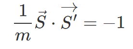
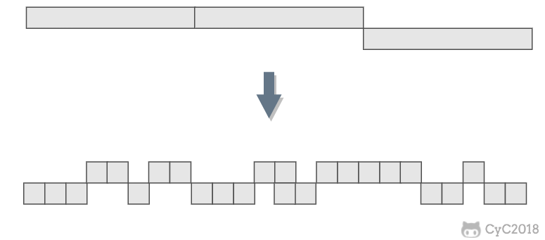
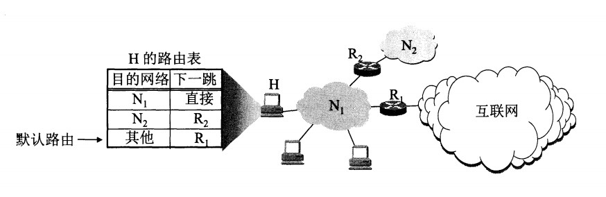
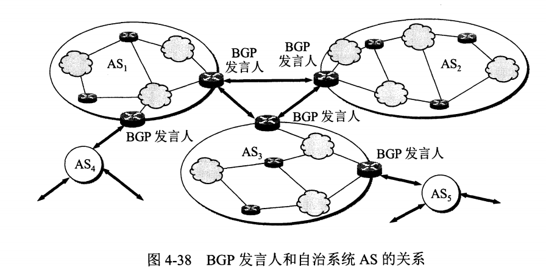
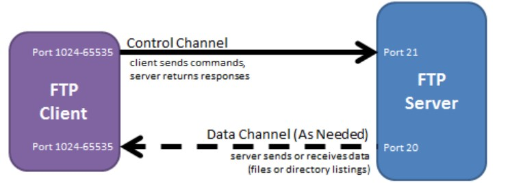
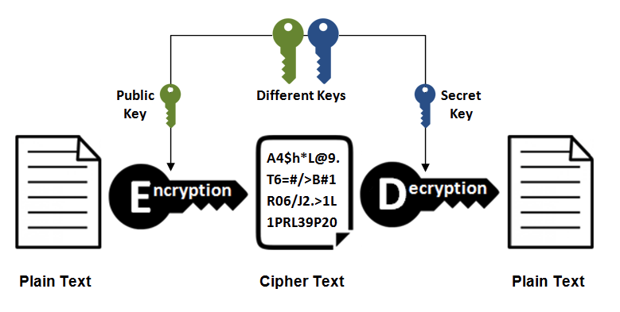
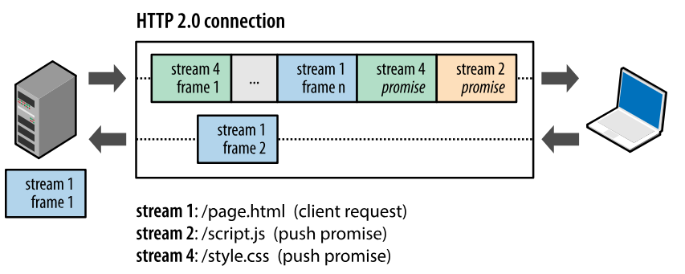
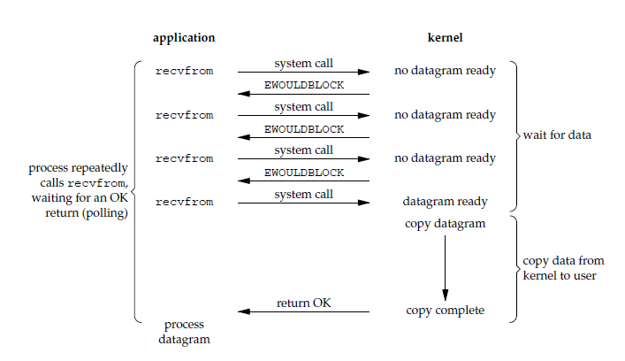
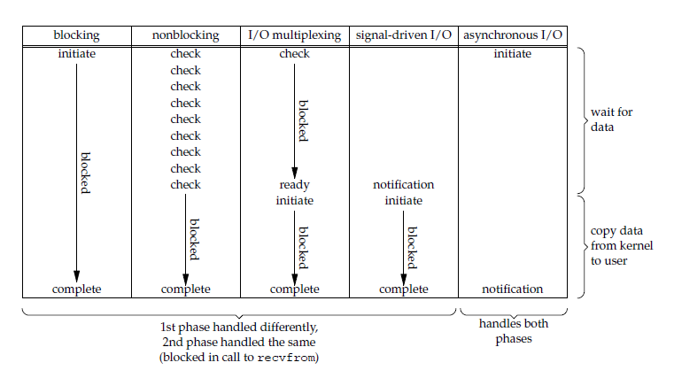

# 第 1 章 网络


## 第 1.1 节 计算机网络


### 概述


#### 网络的网络

网络把主机连接起来，而互联网是把多种不同的网络连接起来，因此互联网是网络的网络。

<div align="center">  </div><br>

#### ISP

互联网服务提供商 ISP 可以从互联网管理机构获得许多 IP 地址，同时拥有通信线路以及路由器等联网设备，个人或机构向 ISP 缴纳一定的费用就可以接入互联网。

<div align="center">  </div><br>

目前的互联网是一种多层次 ISP 结构，ISP 根据覆盖面积的大小分为第一层 ISP、区域 ISP 和接入 ISP。互联网交换点 IXP 允许两个 ISP 直接相连而不用经过第三个 ISP。

<div align="center">  </div><br>

#### 主机之间的通信方式

- 客户-服务器（C/S）：客户是服务的请求方，服务器是服务的提供方。

<div align="center">  </div><br>

- 对等（P2P）：不区分客户和服务器。

<div align="center">  </div><br>

#### 电路交换与分组交换

##### 1. 电路交换

电路交换用于电话通信系统，两个用户要通信之前需要建立一条专用的物理链路，并且在整个通信过程中始终占用该链路。由于通信的过程中不可能一直在使用传输线路，因此电路交换对线路的利用率很低，往往不到 10%。

##### 2. 分组交换

每个分组都有首部和尾部，包含了源地址和目的地址等控制信息，在同一个传输线路上同时传输多个分组互相不会影响，因此在同一条传输线路上允许同时传输多个分组，也就是说分组交换不需要占用传输线路。

在一个邮局通信系统中，邮局收到一份邮件之后，先存储下来，然后把相同目的地的邮件一起转发到下一个目的地，这个过程就是存储转发过程，分组交换也使用了存储转发过程。

#### 时延

总时延 = 排队时延 + 处理时延 + 传输时延 + 传播时延

<div align="center">  </div><br>

##### 1. 排队时延

分组在路由器的输入队列和输出队列中排队等待的时间，取决于网络当前的通信量。

##### 2. 处理时延

主机或路由器收到分组时进行处理所需要的时间，例如分析首部、从分组中提取数据、进行差错检验或查找适当的路由等。

##### 3. 传输时延

主机或路由器传输数据帧所需要的时间。

<div align="center">  </div><br>


其中 l 表示数据帧的长度，v 表示传输速率。

##### 4. 传播时延

电磁波在信道中传播所需要花费的时间，电磁波传播的速度接近光速。

<div align="center">  </div><br>

其中 l 表示信道长度，v 表示电磁波在信道上的传播速度。

#### 计算机网络体系结构

<div align="center">  </div><br>

##### 1. 五层协议

-  **应用层** ：为特定应用程序提供数据传输服务，例如 HTTP、DNS 等协议。数据单位为报文。

-  **传输层** ：为进程提供通用数据传输服务。由于应用层协议很多，定义通用的传输层协议就可以支持不断增多的应用层协议。运输层包括两种协议：传输控制协议 TCP，提供面向连接、可靠的数据传输服务，数据单位为报文段；用户数据报协议 UDP，提供无连接、尽最大努力的数据传输服务，数据单位为用户数据报。TCP 主要提供完整性服务，UDP 主要提供及时性服务。

-  **网络层** ：为主机提供数据传输服务。而传输层协议是为主机中的进程提供数据传输服务。网络层把传输层传递下来的报文段或者用户数据报封装成分组。

-  **数据链路层** ：网络层针对的还是主机之间的数据传输服务，而主机之间可以有很多链路，链路层协议就是为同一链路的主机提供数据传输服务。数据链路层把网络层传下来的分组封装成帧。

-  **物理层** ：考虑的是怎样在传输媒体上传输数据比特流，而不是指具体的传输媒体。物理层的作用是尽可能屏蔽传输媒体和通信手段的差异，使数据链路层感觉不到这些差异。

##### 2. OSI

其中表示层和会话层用途如下：

-  **表示层** ：数据压缩、加密以及数据描述，这使得应用程序不必关心在各台主机中数据内部格式不同的问题。

-  **会话层** ：建立及管理会话。

五层协议没有表示层和会话层，而是将这些功能留给应用程序开发者处理。

##### 3. TCP/IP

它只有四层，相当于五层协议中数据链路层和物理层合并为网络接口层。

TCP/IP 体系结构不严格遵循 OSI 分层概念，应用层可能会直接使用 IP 层或者网络接口层。

<div align="center">  </div><br>

##### 4. 数据在各层之间的传递过程

在向下的过程中，需要添加下层协议所需要的首部或者尾部，而在向上的过程中不断拆开首部和尾部。

路由器只有下面三层协议，因为路由器位于网络核心中，不需要为进程或者应用程序提供服务，因此也就不需要传输层和应用层。


### 物理层


#### 通信方式

根据信息在传输线上的传送方向，分为以下三种通信方式：

- 单工通信：单向传输
- 半双工通信：双向交替传输
- 全双工通信：双向同时传输

#### 带通调制

模拟信号是连续的信号，数字信号是离散的信号。带通调制把数字信号转换为模拟信号。

<div align="center">  </div><br>


### 链路层


#### 基本问题

##### 1. 封装成帧

将网络层传下来的分组添加首部和尾部，用于标记帧的开始和结束。

<div align="center">  </div><br>

##### 2. 透明传输

透明表示一个实际存在的事物看起来好像不存在一样。

帧使用首部和尾部进行定界，如果帧的数据部分含有和首部尾部相同的内容，那么帧的开始和结束位置就会被错误的判定。需要在数据部分出现首部尾部相同的内容前面插入转义字符。如果数据部分出现转义字符，那么就在转义字符前面再加个转义字符。在接收端进行处理之后可以还原出原始数据。这个过程透明传输的内容是转义字符，用户察觉不到转义字符的存在。

<div align="center">  </div><br>

##### 3. 差错检测

目前数据链路层广泛使用了循环冗余检验（CRC）来检查比特差错。

#### 信道分类

##### 1. 广播信道

一对多通信，一个节点发送的数据能够被广播信道上所有的节点接收到。

所有的节点都在同一个广播信道上发送数据，因此需要有专门的控制方法进行协调，避免发生冲突（冲突也叫碰撞）。

主要有两种控制方法进行协调，一个是使用信道复用技术，一是使用 CSMA/CD 协议。

##### 2. 点对点信道

一对一通信。

因为不会发生碰撞，因此也比较简单，使用 PPP 协议进行控制。

#### 信道复用技术

##### 1. 频分复用

频分复用的所有主机在相同的时间占用不同的频率带宽资源。

<div align="center">  </div><br>

##### 2. 时分复用

时分复用的所有主机在不同的时间占用相同的频率带宽资源。

<div align="center">  </div><br>

使用频分复用和时分复用进行通信，在通信的过程中主机会一直占用一部分信道资源。但是由于计算机数据的突发性质，通信过程没必要一直占用信道资源而不让出给其它用户使用，因此这两种方式对信道的利用率都不高。

##### 3. 统计时分复用

是对时分复用的一种改进，不固定每个用户在时分复用帧中的位置，只要有数据就集中起来组成统计时分复用帧然后发送。

<div align="center">  </div><br>

##### 4. 波分复用

光的频分复用。由于光的频率很高，因此习惯上用波长而不是频率来表示所使用的光载波。

##### 5. 码分复用

为每个用户分配 m bit 的码片，并且所有的码片正交，对于任意两个码片  和  有

<!-- <div align="center"></div> <br> -->

<div align="center">  </div><br>

为了讨论方便，取 m=8，设码片  为 00011011。在拥有该码片的用户发送比特 1 时就发送该码片，发送比特 0 时就发送该码片的反码 11100100。

在计算时将 00011011 记作 (-1 -1 -1 +1 +1 -1 +1 +1)，可以得到

<!-- <div align="center"></div> <br> -->

<!-- <div align="center"></div> <br> -->

<div align="center">  </div><br>

<div align="center">  </div><br>

其中  为  的反码。

利用上面的式子我们知道，当接收端使用码片  对接收到的数据进行内积运算时，结果为 0 的是其它用户发送的数据，结果为 1 的是用户发送的比特 1，结果为 -1 的是用户发送的比特 0。

码分复用需要发送的数据量为原先的 m 倍。

<div align="center">  </div><br>


#### CSMA/CD 协议

CSMA/CD 表示载波监听多点接入 / 碰撞检测。

-  **多点接入** ：说明这是总线型网络，许多主机以多点的方式连接到总线上。
-  **载波监听** ：每个主机都必须不停地监听信道。在发送前，如果监听到信道正在使用，就必须等待。
-  **碰撞检测** ：在发送中，如果监听到信道已有其它主机正在发送数据，就表示发生了碰撞。虽然每个主机在发送数据之前都已经监听到信道为空闲，但是由于电磁波的传播时延的存在，还是有可能会发生碰撞。

记端到端的传播时延为 τ，最先发送的站点最多经过 2τ 就可以知道是否发生了碰撞，称 2τ 为  **争用期** 。只有经过争用期之后还没有检测到碰撞，才能肯定这次发送不会发生碰撞。

当发生碰撞时，站点要停止发送，等待一段时间再发送。这个时间采用  **截断二进制指数退避算法**  来确定。从离散的整数集合 {0, 1, .., (2<sup>k</sup>-1)} 中随机取出一个数，记作 r，然后取 r 倍的争用期作为重传等待时间。

<div align="center">  </div><br>

#### PPP 协议

互联网用户通常需要连接到某个 ISP 之后才能接入到互联网，PPP 协议是用户计算机和 ISP 进行通信时所使用的数据链路层协议。

<div align="center">  </div><br>

PPP 的帧格式：

- F 字段为帧的定界符
- A 和 C 字段暂时没有意义
- FCS 字段是使用 CRC 的检验序列
- 信息部分的长度不超过 1500

<div align="center">  </div><br>

#### MAC 地址

MAC 地址是链路层地址，长度为 6 字节（48 位），用于唯一标识网络适配器（网卡）。

一台主机拥有多少个网络适配器就有多少个 MAC 地址。例如笔记本电脑普遍存在无线网络适配器和有线网络适配器，因此就有两个 MAC 地址。

#### 局域网

局域网是一种典型的广播信道，主要特点是网络为一个单位所拥有，且地理范围和站点数目均有限。

主要有以太网、令牌环网、FDDI 和 ATM 等局域网技术，目前以太网占领着有线局域网市场。

可以按照网络拓扑结构对局域网进行分类：

<div align="center">  </div><br>

#### 以太网

以太网是一种星型拓扑结构局域网。

早期使用集线器进行连接，集线器是一种物理层设备， 作用于比特而不是帧，当一个比特到达接口时，集线器重新生成这个比特，并将其能量强度放大，从而扩大网络的传输距离，之后再将这个比特发送到其它所有接口。如果集线器同时收到两个不同接口的帧，那么就发生了碰撞。

目前以太网使用交换机替代了集线器，交换机是一种链路层设备，它不会发生碰撞，能根据 MAC 地址进行存储转发。

以太网帧格式：

-  **类型** ：标记上层使用的协议；
-  **数据** ：长度在 46-1500 之间，如果太小则需要填充；
-  **FCS** ：帧检验序列，使用的是 CRC 检验方法；

<div align="center">  </div><br>

#### 交换机

交换机具有自学习能力，学习的是交换表的内容，交换表中存储着 MAC 地址到接口的映射。

正是由于这种自学习能力，因此交换机是一种即插即用设备，不需要网络管理员手动配置交换表内容。

下图中，交换机有 4 个接口，主机 A 向主机 B 发送数据帧时，交换机把主机 A 到接口 1 的映射写入交换表中。为了发送数据帧到 B，先查交换表，此时没有主机 B 的表项，那么主机 A 就发送广播帧，主机 C 和主机 D 会丢弃该帧，主机 B 回应该帧向主机 A 发送数据包时，交换机查找交换表得到主机 A 映射的接口为 1，就发送数据帧到接口 1，同时交换机添加主机 B 到接口 2 的映射。

<div align="center">  </div><br>

#### 虚拟局域网

虚拟局域网可以建立与物理位置无关的逻辑组，只有在同一个虚拟局域网中的成员才会收到链路层广播信息。

例如下图中 (A1, A2, A3, A4) 属于一个虚拟局域网，A1 发送的广播会被 A2、A3、A4 收到，而其它站点收不到。

使用 VLAN 干线连接来建立虚拟局域网，每台交换机上的一个特殊接口被设置为干线接口，以互连 VLAN 交换机。IEEE 定义了一种扩展的以太网帧格式 802.1Q，它在标准以太网帧上加进了 4 字节首部 VLAN 标签，用于表示该帧属于哪一个虚拟局域网。

<div align="center">  </div><br>


### 网络层


#### 概述

因为网络层是整个互联网的核心，因此应当让网络层尽可能简单。网络层向上只提供简单灵活的、无连接的、尽最大努力交互的数据报服务。

使用 IP 协议，可以把异构的物理网络连接起来，使得在网络层看起来好像是一个统一的网络。

<div align="center">  </div><br>

与 IP 协议配套使用的还有三个协议：

- 地址解析协议 ARP（Address Resolution Protocol）
- 网际控制报文协议 ICMP（Internet Control Message Protocol）
- 网际组管理协议 IGMP（Internet Group Management Protocol）

#### IP 数据报格式

<div align="center">  </div><br>

-  **版本**  : 有 4（IPv4）和 6（IPv6）两个值；

-  **首部长度**  : 占 4 位，因此最大值为 15。值为 1 表示的是 1 个 32 位字的长度，也就是 4 字节。因为固定部分长度为 20 字节，因此该值最小为 5。如果可选字段的长度不是 4 字节的整数倍，就用尾部的填充部分来填充。

-  **区分服务**  : 用来获得更好的服务，一般情况下不使用。

-  **总长度**  : 包括首部长度和数据部分长度。

-  **生存时间**  ：TTL，它的存在是为了防止无法交付的数据报在互联网中不断兜圈子。以路由器跳数为单位，当 TTL 为 0 时就丢弃数据报。

-  **协议** ：指出携带的数据应该上交给哪个协议进行处理，例如 ICMP、TCP、UDP 等。

-  **首部检验和** ：因为数据报每经过一个路由器，都要重新计算检验和，因此检验和不包含数据部分可以减少计算的工作量。

-  **标识**  : 在数据报长度过长从而发生分片的情况下，相同数据报的不同分片具有相同的标识符。

-  **片偏移**  : 和标识符一起，用于发生分片的情况。片偏移的单位为 8 字节。

<div align="center">  </div><br>

#### IP 地址编址方式

IP 地址的编址方式经历了三个历史阶段：

- 分类
- 子网划分
- 无分类

##### 1. 分类

由两部分组成，网络号和主机号，其中不同分类具有不同的网络号长度，并且是固定的。

IP 地址 ::= {< 网络号 >, < 主机号 >}

<div align="center">  </div><br>

##### 2. 子网划分

通过在主机号字段中拿一部分作为子网号，把两级 IP 地址划分为三级 IP 地址。

IP 地址 ::= {< 网络号 >, < 子网号 >, < 主机号 >}

要使用子网，必须配置子网掩码。一个 B 类地址的默认子网掩码为 255.255.0.0，如果 B 类地址的子网占两个比特，那么子网掩码为 11111111 11111111 11000000 00000000，也就是 255.255.192.0。

注意，外部网络看不到子网的存在。

##### 3. 无分类

无分类编址 CIDR 消除了传统 A 类、B 类和 C 类地址以及划分子网的概念，使用网络前缀和主机号来对 IP 地址进行编码，网络前缀的长度可以根据需要变化。

IP 地址 ::= {< 网络前缀号 >, < 主机号 >}

CIDR 的记法上采用在 IP 地址后面加上网络前缀长度的方法，例如 128.14.35.7/20 表示前 20 位为网络前缀。

CIDR 的地址掩码可以继续称为子网掩码，子网掩码首 1 长度为网络前缀的长度。

一个 CIDR 地址块中有很多地址，一个 CIDR 表示的网络就可以表示原来的很多个网络，并且在路由表中只需要一个路由就可以代替原来的多个路由，减少了路由表项的数量。把这种通过使用网络前缀来减少路由表项的方式称为路由聚合，也称为  **构成超网** 。

在路由表中的项目由“网络前缀”和“下一跳地址”组成，在查找时可能会得到不止一个匹配结果，应当采用最长前缀匹配来确定应该匹配哪一个。

#### 地址解析协议 ARP

网络层实现主机之间的通信，而链路层实现具体每段链路之间的通信。因此在通信过程中，IP 数据报的源地址和目的地址始终不变，而 MAC 地址随着链路的改变而改变。

<div align="center">  </div><br>

ARP 实现由 IP 地址得到 MAC 地址。

<div align="center">  </div><br>

每个主机都有一个 ARP 高速缓存，里面有本局域网上的各主机和路由器的 IP 地址到 MAC 地址的映射表。

如果主机 A 知道主机 B 的 IP 地址，但是 ARP 高速缓存中没有该 IP 地址到 MAC 地址的映射，此时主机 A 通过广播的方式发送 ARP 请求分组，主机 B 收到该请求后会发送 ARP 响应分组给主机 A 告知其 MAC 地址，随后主机 A 向其高速缓存中写入主机 B 的 IP 地址到 MAC 地址的映射。

<div align="center">  </div><br>

#### 网际控制报文协议 ICMP

ICMP 是为了更有效地转发 IP 数据报和提高交付成功的机会。它封装在 IP 数据报中，但是不属于高层协议。

<div align="center">  </div><br>

ICMP 报文分为差错报告报文和询问报文。

<div align="center">  </div><br>

##### 1. Ping

Ping 是 ICMP 的一个重要应用，主要用来测试两台主机之间的连通性。

Ping 的原理是通过向目的主机发送 ICMP Echo 请求报文，目的主机收到之后会发送 Echo 回答报文。Ping 会根据时间和成功响应的次数估算出数据包往返时间以及丢包率。

##### 2. Traceroute

Traceroute 是 ICMP 的另一个应用，用来跟踪一个分组从源点到终点的路径。

Traceroute 发送的 IP 数据报封装的是无法交付的 UDP 用户数据报，并由目的主机发送终点不可达差错报告报文。

- 源主机向目的主机发送一连串的 IP 数据报。第一个数据报 P1 的生存时间 TTL 设置为 1，当 P1 到达路径上的第一个路由器 R1 时，R1 收下它并把 TTL 减 1，此时 TTL 等于 0，R1 就把 P1 丢弃，并向源主机发送一个 ICMP 时间超过差错报告报文；
- 源主机接着发送第二个数据报 P2，并把 TTL 设置为 2。P2 先到达 R1，R1 收下后把 TTL 减 1 再转发给 R2，R2 收下后也把 TTL 减 1，由于此时 TTL 等于 0，R2 就丢弃 P2，并向源主机发送一个 ICMP 时间超过差错报文。
- 不断执行这样的步骤，直到最后一个数据报刚刚到达目的主机，主机不转发数据报，也不把 TTL 值减 1。但是因为数据报封装的是无法交付的 UDP，因此目的主机要向源主机发送 ICMP 终点不可达差错报告报文。
- 之后源主机知道了到达目的主机所经过的路由器 IP 地址以及到达每个路由器的往返时间。

#### 虚拟专用网 VPN

由于 IP 地址的紧缺，一个机构能申请到的 IP 地址数往往远小于本机构所拥有的主机数。并且一个机构并不需要把所有的主机接入到外部的互联网中，机构内的计算机可以使用仅在本机构有效的 IP 地址（专用地址）。

有三个专用地址块：

- 10.0.0.0 \~ 10.255.255.255
- 172.16.0.0 \~ 172.31.255.255
- 192.168.0.0 \~ 192.168.255.255

VPN 使用公用的互联网作为本机构各专用网之间的通信载体。专用指机构内的主机只与本机构内的其它主机通信；虚拟指好像是，而实际上并不是，它有经过公用的互联网。

下图中，场所 A 和 B 的通信经过互联网，如果场所 A 的主机 X 要和另一个场所 B 的主机 Y 通信，IP 数据报的源地址是 10.1.0.1，目的地址是 10.2.0.3。数据报先发送到与互联网相连的路由器 R1，R1 对内部数据进行加密，然后重新加上数据报的首部，源地址是路由器 R1 的全球地址 125.1.2.3，目的地址是路由器 R2 的全球地址 194.4.5.6。路由器 R2 收到数据报后将数据部分进行解密，恢复原来的数据报，此时目的地址为 10.2.0.3，就交付给 Y。

<div align="center">  </div><br>

#### 网络地址转换 NAT

专用网内部的主机使用本地 IP 地址又想和互联网上的主机通信时，可以使用 NAT 来将本地 IP 转换为全球 IP。

在以前，NAT 将本地 IP 和全球 IP 一一对应，这种方式下拥有 n 个全球 IP 地址的专用网内最多只可以同时有 n 台主机接入互联网。为了更有效地利用全球 IP 地址，现在常用的 NAT 转换表把传输层的端口号也用上了，使得多个专用网内部的主机共用一个全球 IP 地址。使用端口号的 NAT 也叫做网络地址与端口转换 NAPT。

<div align="center">  </div><br>

#### 路由器的结构

路由器从功能上可以划分为：路由选择和分组转发。

分组转发结构由三个部分组成：交换结构、一组输入端口和一组输出端口。

<div align="center">  </div><br>

#### 路由器分组转发流程

- 从数据报的首部提取目的主机的 IP 地址 D，得到目的网络地址 N。
- 若 N 就是与此路由器直接相连的某个网络地址，则进行直接交付；
- 若路由表中有目的地址为 D 的特定主机路由，则把数据报传送给表中所指明的下一跳路由器；
- 若路由表中有到达网络 N 的路由，则把数据报传送给路由表中所指明的下一跳路由器；
- 若路由表中有一个默认路由，则把数据报传送给路由表中所指明的默认路由器；
- 报告转发分组出错。

<div align="center">  </div><br>

#### 路由选择协议

路由选择协议都是自适应的，能随着网络通信量和拓扑结构的变化而自适应地进行调整。

互联网可以划分为许多较小的自治系统 AS，一个 AS 可以使用一种和别的 AS 不同的路由选择协议。

可以把路由选择协议划分为两大类：

- 自治系统内部的路由选择：RIP 和 OSPF
- 自治系统间的路由选择：BGP

##### 1. 内部网关协议 RIP

RIP 是一种基于距离向量的路由选择协议。距离是指跳数，直接相连的路由器跳数为 1。跳数最多为 15，超过 15 表示不可达。

RIP 按固定的时间间隔仅和相邻路由器交换自己的路由表，经过若干次交换之后，所有路由器最终会知道到达本自治系统中任何一个网络的最短距离和下一跳路由器地址。

距离向量算法：

- 对地址为 X 的相邻路由器发来的 RIP 报文，先修改报文中的所有项目，把下一跳字段中的地址改为 X，并把所有的距离字段加 1；
- 对修改后的 RIP 报文中的每一个项目，进行以下步骤：
 - 若原来的路由表中没有目的网络 N，则把该项目添加到路由表中；
 - 否则：若下一跳路由器地址是 X，则把收到的项目替换原来路由表中的项目；否则：若收到的项目中的距离 d 小于路由表中的距离，则进行更新（例如原始路由表项为 Net2, 5, P，新表项为 Net2, 4, X，则更新）；否则什么也不做。
- 若 3 分钟还没有收到相邻路由器的更新路由表，则把该相邻路由器标为不可达，即把距离置为 16。

RIP 协议实现简单，开销小。但是 RIP 能使用的最大距离为 15，限制了网络的规模。并且当网络出现故障时，要经过比较长的时间才能将此消息传送到所有路由器。

##### 2. 内部网关协议 OSPF

开放最短路径优先 OSPF，是为了克服 RIP 的缺点而开发出来的。

开放表示 OSPF 不受某一家厂商控制，而是公开发表的；最短路径优先表示使用了 Dijkstra 提出的最短路径算法 SPF。

OSPF 具有以下特点：

- 向本自治系统中的所有路由器发送信息，这种方法是洪泛法。
- 发送的信息就是与相邻路由器的链路状态，链路状态包括与哪些路由器相连以及链路的度量，度量用费用、距离、时延、带宽等来表示。
- 只有当链路状态发生变化时，路由器才会发送信息。

所有路由器都具有全网的拓扑结构图，并且是一致的。相比于 RIP，OSPF 的更新过程收敛的很快。

##### 3. 外部网关协议 BGP

BGP（Border Gateway Protocol，边界网关协议）

AS 之间的路由选择很困难，主要是由于：

- 互联网规模很大；
- 各个 AS 内部使用不同的路由选择协议，无法准确定义路径的度量；
- AS 之间的路由选择必须考虑有关的策略，比如有些 AS 不愿意让其它 AS 经过。

BGP 只能寻找一条比较好的路由，而不是最佳路由。

每个 AS 都必须配置 BGP 发言人，通过在两个相邻 BGP 发言人之间建立 TCP 连接来交换路由信息。

<div align="center">  </div><br>


### 传输层


网络层只把分组发送到目的主机，但是真正通信的并不是主机而是主机中的进程。传输层提供了进程间的逻辑通信，传输层向高层用户屏蔽了下面网络层的核心细节，使应用程序看起来像是在两个传输层实体之间有一条端到端的逻辑通信信道。

#### UDP 和 TCP 的特点

- 用户数据报协议 UDP（User Datagram Protocol）是无连接的，尽最大可能交付，没有拥塞控制，面向报文（对于应用程序传下来的报文不合并也不拆分，只是添加 UDP 首部），支持一对一、一对多、多对一和多对多的交互通信。

- 传输控制协议 TCP（Transmission Control Protocol）是面向连接的，提供可靠交付，有流量控制，拥塞控制，提供全双工通信，面向字节流（把应用层传下来的报文看成字节流，把字节流组织成大小不等的数据块），每一条 TCP 连接只能是点对点的（一对一）。

#### UDP 首部格式

<div align="center">  </div><br>

首部字段只有 8 个字节，包括源端口、目的端口、长度、检验和。12 字节的伪首部是为了计算检验和临时添加的。

#### TCP 首部格式

<div align="center">  </div><br>

-  **序号**  ：用于对字节流进行编号，例如序号为 301，表示第一个字节的编号为 301，如果携带的数据长度为 100 字节，那么下一个报文段的序号应为 401。

-  **确认号**  ：期望收到的下一个报文段的序号。例如 B 正确收到 A 发送来的一个报文段，序号为 501，携带的数据长度为 200 字节，因此 B 期望下一个报文段的序号为 701，B 发送给 A 的确认报文段中确认号就为 701。

-  **数据偏移**  ：指的是数据部分距离报文段起始处的偏移量，实际上指的是首部的长度。

-  **确认 ACK**  ：当 ACK=1 时确认号字段有效，否则无效。TCP 规定，在连接建立后所有传送的报文段都必须把 ACK 置 1。

-  **同步 SYN**  ：在连接建立时用来同步序号。当 SYN=1，ACK=0 时表示这是一个连接请求报文段。若对方同意建立连接，则响应报文中 SYN=1，ACK=1。

-  **终止 FIN**  ：用来释放一个连接，当 FIN=1 时，表示此报文段的发送方的数据已发送完毕，并要求释放连接。

-  **窗口**  ：窗口值作为接收方让发送方设置其发送窗口的依据。之所以要有这个限制，是因为接收方的数据缓存空间是有限的。

#### TCP 的三次握手

<div align="center">  </div><br>

假设 A 为客户端，B 为服务器端。

- 首先 B 处于 LISTEN（监听）状态，等待客户的连接请求。

- A 向 B 发送连接请求报文，SYN=1，ACK=0，选择一个初始的序号 x。

- B 收到连接请求报文，如果同意建立连接，则向 A 发送连接确认报文，SYN=1，ACK=1，确认号为 x+1，同时也选择一个初始的序号 y。

- A 收到 B 的连接确认报文后，还要向 B 发出确认，确认号为 y+1，序号为 x+1。

- B 收到 A 的确认后，连接建立。

**三次握手的原因** 

第三次握手是为了防止失效的连接请求到达服务器，让服务器错误打开连接。

客户端发送的连接请求如果在网络中滞留，那么就会隔很长一段时间才能收到服务器端发回的连接确认。客户端等待一个超时重传时间之后，就会重新请求连接。但是这个滞留的连接请求最后还是会到达服务器，如果不进行三次握手，那么服务器就会打开两个连接。如果有第三次握手，客户端会忽略服务器之后发送的对滞留连接请求的连接确认，不进行第三次握手，因此就不会再次打开连接。

#### TCP 的四次挥手

<div align="center">  </div><br>

以下描述不讨论序号和确认号，因为序号和确认号的规则比较简单。并且不讨论 ACK，因为 ACK 在连接建立之后都为 1。

- A 发送连接释放报文，FIN=1。

- B 收到之后发出确认，此时 TCP 属于半关闭状态，B 能向 A 发送数据但是 A 不能向 B 发送数据。

- 当 B 不再需要连接时，发送连接释放报文，FIN=1。

- A 收到后发出确认，进入 TIME-WAIT 状态，等待 2 MSL（最大报文存活时间）后释放连接。

- B 收到 A 的确认后释放连接。

**四次挥手的原因** 

客户端发送了 FIN 连接释放报文之后，服务器收到了这个报文，就进入了 CLOSE-WAIT 状态。这个状态是为了让服务器端发送还未传送完毕的数据，传送完毕之后，服务器会发送 FIN 连接释放报文。

**TIME_WAIT** 

客户端接收到服务器端的 FIN 报文后进入此状态，此时并不是直接进入 CLOSED 状态，还需要等待一个时间计时器设置的时间 2MSL。这么做有两个理由：

- 确保最后一个确认报文能够到达。如果 B 没收到 A 发送来的确认报文，那么就会重新发送连接释放请求报文，A 等待一段时间就是为了处理这种情况的发生。

- 等待一段时间是为了让本连接持续时间内所产生的所有报文都从网络中消失，使得下一个新的连接不会出现旧的连接请求报文。

#### TCP 可靠传输

TCP 使用超时重传来实现可靠传输：如果一个已经发送的报文段在超时时间内没有收到确认，那么就重传这个报文段。

一个报文段从发送再到接收到确认所经过的时间称为往返时间 RTT，加权平均往返时间 RTTs 计算如下：

<div align="center"></div> <br>

其中，0 ≤ a ＜ 1，RTTs 随着 a 的增加更容易受到 RTT 的影响。

超时时间 RTO 应该略大于 RTTs，TCP 使用的超时时间计算如下：

<div align="center"></div> <br>

其中 RTT<sub>d</sub> 为偏差的加权平均值。

#### TCP 滑动窗口

窗口是缓存的一部分，用来暂时存放字节流。发送方和接收方各有一个窗口，接收方通过 TCP 报文段中的窗口字段告诉发送方自己的窗口大小，发送方根据这个值和其它信息设置自己的窗口大小。

发送窗口内的字节都允许被发送，接收窗口内的字节都允许被接收。如果发送窗口左部的字节已经发送并且收到了确认，那么就将发送窗口向右滑动一定距离，直到左部第一个字节不是已发送并且已确认的状态；接收窗口的滑动类似，接收窗口左部字节已经发送确认并交付主机，就向右滑动接收窗口。

接收窗口只会对窗口内最后一个按序到达的字节进行确认，例如接收窗口已经收到的字节为 {31, 34, 35}，其中 {31} 按序到达，而 {34, 35} 就不是，因此只对字节 31 进行确认。发送方得到一个字节的确认之后，就知道这个字节之前的所有字节都已经被接收。

<div align="center">  </div><br>

#### TCP 流量控制

流量控制是为了控制发送方发送速率，保证接收方来得及接收。

接收方发送的确认报文中的窗口字段可以用来控制发送方窗口大小，从而影响发送方的发送速率。将窗口字段设置为 0，则发送方不能发送数据。

#### TCP 拥塞控制

如果网络出现拥塞，分组将会丢失，此时发送方会继续重传，从而导致网络拥塞程度更高。因此当出现拥塞时，应当控制发送方的速率。这一点和流量控制很像，但是出发点不同。流量控制是为了让接收方能来得及接收，而拥塞控制是为了降低整个网络的拥塞程度。

<div align="center">  </div><br>

TCP 主要通过四个算法来进行拥塞控制：慢开始、拥塞避免、快重传、快恢复。

发送方需要维护一个叫做拥塞窗口（cwnd）的状态变量，注意拥塞窗口与发送方窗口的区别：拥塞窗口只是一个状态变量，实际决定发送方能发送多少数据的是发送方窗口。

为了便于讨论，做如下假设：

- 接收方有足够大的接收缓存，因此不会发生流量控制；
- 虽然 TCP 的窗口基于字节，但是这里设窗口的大小单位为报文段。

<div align="center">  </div><br>

##### 1. 慢开始与拥塞避免

发送的最初执行慢开始，令 cwnd = 1，发送方只能发送 1 个报文段；当收到确认后，将 cwnd 加倍，因此之后发送方能够发送的报文段数量为：2、4、8 ...

注意到慢开始每个轮次都将 cwnd 加倍，这样会让 cwnd 增长速度非常快，从而使得发送方发送的速度增长速度过快，网络拥塞的可能性也就更高。设置一个慢开始门限 ssthresh，当 cwnd >= ssthresh 时，进入拥塞避免，每个轮次只将 cwnd 加 1。

如果出现了超时，则令 ssthresh = cwnd / 2，然后重新执行慢开始。

##### 2. 快重传与快恢复

在接收方，要求每次接收到报文段都应该对最后一个已收到的有序报文段进行确认。例如已经接收到 M<sub>1</sub> 和 M<sub>2</sub>，此时收到 M<sub>4</sub>，应当发送对 M<sub>2</sub> 的确认。

在发送方，如果收到三个重复确认，那么可以知道下一个报文段丢失，此时执行快重传，立即重传下一个报文段。例如收到三个 M<sub>2</sub>，则 M<sub>3</sub> 丢失，立即重传 M<sub>3</sub>。

在这种情况下，只是丢失个别报文段，而不是网络拥塞。因此执行快恢复，令 ssthresh = cwnd / 2 ，cwnd = ssthresh，注意到此时直接进入拥塞避免。

慢开始和快恢复的快慢指的是 cwnd 的设定值，而不是 cwnd 的增长速率。慢开始 cwnd 设定为 1，而快恢复 cwnd 设定为 ssthresh。

<div align="center">  </div><br>


### 应用层


#### 域名系统

DNS 是一个分布式数据库，提供了主机名和 IP 地址之间相互转换的服务。这里的分布式数据库是指，每个站点只保留它自己的那部分数据。

域名具有层次结构，从上到下依次为：根域名、顶级域名、二级域名。

<div align="center">  </div><br>

DNS 可以使用 UDP 或者 TCP 进行传输，使用的端口号都为 53。大多数情况下 DNS 使用 UDP 进行传输，这就要求域名解析器和域名服务器都必须自己处理超时和重传从而保证可靠性。在两种情况下会使用 TCP 进行传输：

- 如果返回的响应超过的 512 字节（UDP 最大只支持 512 字节的数据）。
- 区域传送（区域传送是主域名服务器向辅助域名服务器传送变化的那部分数据）。

#### 文件传送协议

FTP 使用 TCP 进行连接，它需要两个连接来传送一个文件：

- 控制连接：服务器打开端口号 21 等待客户端的连接，客户端主动建立连接后，使用这个连接将客户端的命令传送给服务器，并传回服务器的应答。
- 数据连接：用来传送一个文件数据。

根据数据连接是否是服务器端主动建立，FTP 有主动和被动两种模式：

- 主动模式：服务器端主动建立数据连接，其中服务器端的端口号为 20，客户端的端口号随机，但是必须大于 1024，因为 0\~1023 是熟知端口号。

<div align="center">  </div><br>

- 被动模式：客户端主动建立数据连接，其中客户端的端口号由客户端自己指定，服务器端的端口号随机。

<div align="center">  </div><br>

主动模式要求客户端开放端口号给服务器端，需要去配置客户端的防火墙。被动模式只需要服务器端开放端口号即可，无需客户端配置防火墙。但是被动模式会导致服务器端的安全性减弱，因为开放了过多的端口号。

#### 动态主机配置协议

DHCP (Dynamic Host Configuration Protocol) 提供了即插即用的连网方式，用户不再需要手动配置 IP 地址等信息。

DHCP 配置的内容不仅是 IP 地址，还包括子网掩码、网关 IP 地址。

DHCP 工作过程如下：

1. 客户端发送 Discover 报文，该报文的目的地址为 255.255.255.255:67，源地址为 0.0.0.0:68，被放入 UDP 中，该报文被广播到同一个子网的所有主机上。如果客户端和 DHCP 服务器不在同一个子网，就需要使用中继代理。
2. DHCP 服务器收到 Discover 报文之后，发送 Offer 报文给客户端，该报文包含了客户端所需要的信息。因为客户端可能收到多个 DHCP 服务器提供的信息，因此客户端需要进行选择。
3. 如果客户端选择了某个 DHCP 服务器提供的信息，那么就发送 Request 报文给该 DHCP 服务器。
4. DHCP 服务器发送 Ack 报文，表示客户端此时可以使用提供给它的信息。

<div align="center">  </div><br>

#### 远程登录协议

TELNET 用于登录到远程主机上，并且远程主机上的输出也会返回。

TELNET 可以适应许多计算机和操作系统的差异，例如不同操作系统系统的换行符定义。

#### 电子邮件协议

一个电子邮件系统由三部分组成：用户代理、邮件服务器以及邮件协议。

邮件协议包含发送协议和读取协议，发送协议常用 SMTP，读取协议常用 POP3 和 IMAP。

<div align="center">  </div><br>

##### 1. SMTP

SMTP 只能发送 ASCII 码，而互联网邮件扩充 MIME 可以发送二进制文件。MIME 并没有改动或者取代 SMTP，而是增加邮件主体的结构，定义了非 ASCII 码的编码规则。

<div align="center">  </div><br>

##### 2. POP3

POP3 的特点是只要用户从服务器上读取了邮件，就把该邮件删除。

##### 3. IMAP

IMAP 协议中客户端和服务器上的邮件保持同步，如果不手动删除邮件，那么服务器上的邮件也不会被删除。IMAP 这种做法可以让用户随时随地去访问服务器上的邮件。

#### 常用端口

|       应用       | 应用层协议 | 端口号  | 传输层协议 |            备注             |
| :--------------: | :--------: | :-----: | :--------: | :-------------------------: |
|     域名解析     |    DNS     |   53    |  UDP/TCP   | 长度超过 512 字节时使用 TCP |
| 动态主机配置协议 |    DHCP    |  67/68  |    UDP     |                             |
| 简单网络管理协议 |    SNMP    | 161/162 |    UDP     |                             |
|   文件传送协议   |    FTP     |  20/21  |    TCP     |  控制连接 21，数据连接 20   |
|   远程终端协议   |   TELNET   |   23    |    TCP     |                             |
|  超文本传送协议  |    HTTP    |   80    |    TCP     |                             |
| 简单邮件传送协议 |    SMTP    |   25    |    TCP     |                             |
|   邮件读取协议   |    POP3    |   110   |    TCP     |                             |
| 网际报文存取协议 |    IMAP    |   143   |    TCP     |                             |

#### Web 页面请求过程

##### 1. DHCP 配置主机信息

- 假设主机最开始没有 IP 地址以及其它信息，那么就需要先使用 DHCP 来获取。

- 主机生成一个 DHCP 请求报文，并将这个报文放入具有目的端口 67 和源端口 68 的 UDP 报文段中。

- 该报文段则被放入在一个具有广播 IP 目的地址(255.255.255.255) 和源 IP 地址（0.0.0.0）的 IP 数据报中。

- 该数据报则被放置在 MAC 帧中，该帧具有目的地址 FF:<zero-width space>FF:<zero-width space>FF:<zero-width space>FF:<zero-width space>FF:FF，将广播到与交换机连接的所有设备。

- 连接在交换机的 DHCP 服务器收到广播帧之后，不断地向上分解得到 IP 数据报、UDP 报文段、DHCP 请求报文，之后生成 DHCP ACK 报文，该报文包含以下信息：IP 地址、DNS 服务器的 IP 地址、默认网关路由器的 IP 地址和子网掩码。该报文被放入 UDP 报文段中，UDP 报文段有被放入 IP 数据报中，最后放入 MAC 帧中。

- 该帧的目的地址是请求主机的 MAC 地址，因为交换机具有自学习能力，之前主机发送了广播帧之后就记录了 MAC 地址到其转发接口的交换表项，因此现在交换机就可以直接知道应该向哪个接口发送该帧。

- 主机收到该帧后，不断分解得到 DHCP 报文。之后就配置它的 IP 地址、子网掩码和 DNS 服务器的 IP 地址，并在其 IP 转发表中安装默认网关。

##### 2. ARP 解析 MAC 地址

- 主机通过浏览器生成一个 TCP 套接字，套接字向 HTTP 服务器发送 HTTP 请求。为了生成该套接字，主机需要知道网站的域名对应的 IP 地址。

- 主机生成一个 DNS 查询报文，该报文具有 53 号端口，因为 DNS 服务器的端口号是 53。

- 该 DNS 查询报文被放入目的地址为 DNS 服务器 IP 地址的 IP 数据报中。

- 该 IP 数据报被放入一个以太网帧中，该帧将发送到网关路由器。

- DHCP 过程只知道网关路由器的 IP 地址，为了获取网关路由器的 MAC 地址，需要使用 ARP 协议。

- 主机生成一个包含目的地址为网关路由器 IP 地址的 ARP 查询报文，将该 ARP 查询报文放入一个具有广播目的地址（FF:<zero-width space>FF:<zero-width space>FF:<zero-width space>FF:<zero-width space>FF:FF）的以太网帧中，并向交换机发送该以太网帧，交换机将该帧转发给所有的连接设备，包括网关路由器。

- 网关路由器接收到该帧后，不断向上分解得到 ARP 报文，发现其中的 IP 地址与其接口的 IP 地址匹配，因此就发送一个 ARP 回答报文，包含了它的 MAC 地址，发回给主机。

##### 3. DNS 解析域名

- 知道了网关路由器的 MAC 地址之后，就可以继续 DNS 的解析过程了。

- 网关路由器接收到包含 DNS 查询报文的以太网帧后，抽取出 IP 数据报，并根据转发表决定该 IP 数据报应该转发的路由器。

- 因为路由器具有内部网关协议（RIP、OSPF）和外部网关协议（BGP）这两种路由选择协议，因此路由表中已经配置了网关路由器到达 DNS 服务器的路由表项。

- 到达 DNS 服务器之后，DNS 服务器抽取出 DNS 查询报文，并在 DNS 数据库中查找待解析的域名。

- 找到 DNS 记录之后，发送 DNS 回答报文，将该回答报文放入 UDP 报文段中，然后放入 IP 数据报中，通过路由器反向转发回网关路由器，并经过以太网交换机到达主机。

##### 4. HTTP 请求页面

- 有了 HTTP 服务器的 IP 地址之后，主机就能够生成 TCP 套接字，该套接字将用于向 Web 服务器发送 HTTP GET 报文。

- 在生成 TCP 套接字之前，必须先与 HTTP 服务器进行三次握手来建立连接。生成一个具有目的端口 80 的 TCP SYN 报文段，并向 HTTP 服务器发送该报文段。

- HTTP 服务器收到该报文段之后，生成 TCP SYN ACK 报文段，发回给主机。

- 连接建立之后，浏览器生成 HTTP GET 报文，并交付给 HTTP 服务器。

- HTTP 服务器从 TCP 套接字读取 HTTP GET 报文，生成一个 HTTP 响应报文，将 Web 页面内容放入报文主体中，发回给主机。

- 浏览器收到 HTTP 响应报文后，抽取出 Web 页面内容，之后进行渲染，显示 Web 页面。


### 参考链接

- 计算机网络, 谢希仁
- JamesF.Kurose, KeithW.Ross, 库罗斯, 等. 计算机网络: 自顶向下方法 [M]. 机械工业出版社, 2014.
- W.RichardStevens. TCP/IP 详解. 卷 1, 协议 [M]. 机械工业出版社, 2006.
- [Active vs Passive FTP Mode: Which One is More Secure?](https://securitywing.com/active-vs-passive-ftp-mode/)
- [Active and Passive FTP Transfers Defined - KB Article #1138](http://www.serv-u.com/kb/1138/active-and-passive-ftp-transfers-defined)
- [Traceroute](https://zh.wikipedia.org/wiki/Traceroute)
- [ping](https://zh.wikipedia.org/wiki/Ping)
- [How DHCP works and DHCP Interview Questions and Answers](http://webcache.googleusercontent.com/search?q=cache:http://anandgiria.blogspot.com/2013/09/windows-dhcp-interview-questions-and.html)
- [What is process of DORA in DHCP?](https://www.quora.com/What-is-process-of-DORA-in-DHCP)
- [What is DHCP Server ?](https://tecadmin.net/what-is-dhcp-server/)
- [Tackling emissions targets in Tokyo](http://www.climatechangenews.com/2011/html/university-tokyo.html)
- [What does my ISP know when I use Tor?](http://www.climatechangenews.com/2011/html/university-tokyo.html)
- [Technology-Computer Networking[1]-Computer Networks and the Internet](http://www.linyibin.cn/2017/02/12/technology-ComputerNetworking-Internet/)
- [P2P 网络概述.](http://slidesplayer.com/slide/11616167/)
- [Circuit Switching (a) Circuit switching. (b) Packet switching.](http://slideplayer.com/slide/5115386/)
## 第 1.2 节 HTTP


#### 一 、基础概念

##### URI

URI 包含 URL 和 URN。

<div align="center">  </div><br>

##### 请求和响应报文

###### 1. 请求报文

<div align="center">  </div><br>

###### 2. 响应报文

<div align="center">  </div><br>

#### 二、HTTP 方法

客户端发送的  **请求报文**  第一行为请求行，包含了方法字段。

##### GET

> 获取资源

当前网络请求中，绝大部分使用的是 GET 方法。

##### HEAD

> 获取报文首部

和 GET 方法类似，但是不返回报文实体主体部分。

主要用于确认 URL 的有效性以及资源更新的日期时间等。

##### POST

> 传输实体主体

POST 主要用来传输数据，而 GET 主要用来获取资源。

更多 POST 与 GET 的比较请见第九章。

##### PUT

> 上传文件

由于自身不带验证机制，任何人都可以上传文件，因此存在安全性问题，一般不使用该方法。

```html
PUT /new.html HTTP/1.1
Host: example.com
Content-type: text/html
Content-length: 16

<p>New File</p>
```

##### PATCH

> 对资源进行部分修改

PUT 也可以用于修改资源，但是只能完全替代原始资源，PATCH 允许部分修改。

```html
PATCH /file.txt HTTP/1.1
Host: www.example.com
Content-Type: application/example
If-Match: "e0023aa4e"
Content-Length: 100

[description of changes]
```

##### DELETE

> 删除文件

与 PUT 功能相反，并且同样不带验证机制。

```html
DELETE /file.html HTTP/1.1
```

##### OPTIONS

> 查询支持的方法

查询指定的 URL 能够支持的方法。

会返回 `Allow: GET, POST, HEAD, OPTIONS` 这样的内容。

##### CONNECT

> 要求在与代理服务器通信时建立隧道

使用 SSL（Secure Sockets Layer，安全套接层）和 TLS（Transport Layer Security，传输层安全）协议把通信内容加密后经网络隧道传输。

```html
CONNECT www.example.com:443 HTTP/1.1
```

<div align="center">  </div><br>

##### TRACE

> 追踪路径

服务器会将通信路径返回给客户端。

发送请求时，在 Max-Forwards 首部字段中填入数值，每经过一个服务器就会减 1，当数值为 0 时就停止传输。

通常不会使用 TRACE，并且它容易受到 XST 攻击（Cross-Site Tracing，跨站追踪）。

#### 三、HTTP 状态码

服务器返回的  **响应报文**  中第一行为状态行，包含了状态码以及原因短语，用来告知客户端请求的结果。

| 状态码 |               类别               |            含义            |
| :----: | :------------------------------: | :------------------------: |
|  1XX   |  Informational（信息性状态码）   |     接收的请求正在处理     |
|  2XX   |      Success（成功状态码）       |      请求正常处理完毕      |
|  3XX   |   Redirection（重定向状态码）    | 需要进行附加操作以完成请求 |
|  4XX   | Client Error（客户端错误状态码） |     服务器无法处理请求     |
|  5XX   | Server Error（服务器错误状态码） |     服务器处理请求出错     |

##### 1XX 信息

-  **100 Continue** ：表明到目前为止都很正常，客户端可以继续发送请求或者忽略这个响应。

##### 2XX 成功

-  **200 OK** 

-  **204 No Content** ：请求已经成功处理，但是返回的响应报文不包含实体的主体部分。一般在只需要从客户端往服务器发送信息，而不需要返回数据时使用。

-  **206 Partial Content** ：表示客户端进行了范围请求，响应报文包含由 Content-Range 指定范围的实体内容。

##### 3XX 重定向

-  **301 Moved Permanently** ：永久性重定向

-  **302 Found** ：临时性重定向

-  **303 See Other** ：和 302 有着相同的功能，但是 303 明确要求客户端应该采用 GET 方法获取资源。

- 注：虽然 HTTP 协议规定 301、302 状态下重定向时不允许把 POST 方法改成 GET 方法，但是大多数浏览器都会在 301、302 和 303 状态下的重定向把 POST 方法改成 GET 方法。

-  **304 Not Modified** ：如果请求报文首部包含一些条件，例如：If-Match，If-Modified-Since，If-None-Match，If-Range，If-Unmodified-Since，如果不满足条件，则服务器会返回 304 状态码。

-  **307 Temporary Redirect** ：临时重定向，与 302 的含义类似，但是 307 要求浏览器不会把重定向请求的 POST 方法改成 GET 方法。

##### 4XX 客户端错误

-  **400 Bad Request** ：请求报文中存在语法错误。

-  **401 Unauthorized** ：该状态码表示发送的请求需要有认证信息（BASIC 认证、DIGEST 认证）。如果之前已进行过一次请求，则表示用户认证失败。

-  **403 Forbidden** ：请求被拒绝。

-  **404 Not Found** 

##### 5XX 服务器错误

-  **500 Internal Server Error** ：服务器正在执行请求时发生错误。

-  **503 Service Unavailable** ：服务器暂时处于超负载或正在进行停机维护，现在无法处理请求。

#### 四、HTTP 首部

有 4 种类型的首部字段：通用首部字段、请求首部字段、响应首部字段和实体首部字段。

各种首部字段及其含义如下（不需要全记，仅供查阅）：

##### 通用首部字段

|    首部字段名     |                    说明                    |
| :---------------: | :----------------------------------------: |
|   Cache-Control   |               控制缓存的行为               |
|    Connection     | 控制不再转发给代理的首部字段、管理持久连接 |
|       Date        |             创建报文的日期时间             |
|      Pragma       |                  报文指令                  |
|      Trailer      |             报文末端的首部一览             |
| Transfer-Encoding |         指定报文主体的传输编码方式         |
|      Upgrade      |               升级为其他协议               |
|        Via        |            代理服务器的相关信息            |
|      Warning      |                  错误通知                  |

##### 请求首部字段

|     首部字段名      |                      说明                       |
| :-----------------: | :---------------------------------------------: |
|       Accept        |            用户代理可处理的媒体类型             |
|   Accept-Charset    |                  优先的字符集                   |
|   Accept-Encoding   |                 优先的内容编码                  |
|   Accept-Language   |             优先的语言（自然语言）              |
|    Authorization    |                  Web 认证信息                   |
|       Expect        |              期待服务器的特定行为               |
|        From         |               用户的电子邮箱地址                |
|        Host         |               请求资源所在服务器                |
|      If-Match       |              比较实体标记（ETag）               |
|  If-Modified-Since  |               比较资源的更新时间                |
|    If-None-Match    |        比较实体标记（与 If-Match 相反）         |
|      If-Range       |      资源未更新时发送实体 Byte 的范围请求       |
| If-Unmodified-Since | 比较资源的更新时间（与 If-Modified-Since 相反） |
|    Max-Forwards     |                 最大传输逐跳数                  |
| Proxy-Authorization |         代理服务器要求客户端的认证信息          |
|        Range        |               实体的字节范围请求                |
|       Referer       |            对请求中 URI 的原始获取方            |
|         TE          |                传输编码的优先级                 |
|     User-Agent      |              HTTP 客户端程序的信息              |

##### 响应首部字段

|     首部字段名     |             说明             |
| :----------------: | :--------------------------: |
|   Accept-Ranges    |     是否接受字节范围请求     |
|        Age         |     推算资源创建经过时间     |
|        ETag        |        资源的匹配信息        |
|      Location      |   令客户端重定向至指定 URI   |
| Proxy-Authenticate | 代理服务器对客户端的认证信息 |
|    Retry-After     |   对再次发起请求的时机要求   |
|       Server       |    HTTP 服务器的安装信息     |
|        Vary        |   代理服务器缓存的管理信息   |
|  WWW-Authenticate  |   服务器对客户端的认证信息   |

##### 实体首部字段

|    首部字段名    |          说明          |
| :--------------: | :--------------------: |
|      Allow       | 资源可支持的 HTTP 方法 |
| Content-Encoding | 实体主体适用的编码方式 |
| Content-Language |   实体主体的自然语言   |
|  Content-Length  |     实体主体的大小     |
| Content-Location |   替代对应资源的 URI   |
|   Content-MD5    |   实体主体的报文摘要   |
|  Content-Range   |   实体主体的位置范围   |
|   Content-Type   |   实体主体的媒体类型   |
|     Expires      | 实体主体过期的日期时间 |
|  Last-Modified   | 资源的最后修改日期时间 |

#### 五、具体应用

##### 连接管理

<div align="center">  </div><br>

###### 1. 短连接与长连接

当浏览器访问一个包含多张图片的 HTML 页面时，除了请求访问的 HTML 页面资源，还会请求图片资源。如果每进行一次 HTTP 通信就要新建一个 TCP 连接，那么开销会很大。

长连接只需要建立一次 TCP 连接就能进行多次 HTTP 通信。

- 从 HTTP/1.1 开始默认是长连接的，如果要断开连接，需要由客户端或者服务器端提出断开，使用 `Connection : close`；
- 在 HTTP/1.1 之前默认是短连接的，如果需要使用长连接，则使用 `Connection : Keep-Alive`。

###### 2. 流水线

默认情况下，HTTP 请求是按顺序发出的，下一个请求只有在当前请求收到响应之后才会被发出。由于受到网络延迟和带宽的限制，在下一个请求被发送到服务器之前，可能需要等待很长时间。

流水线是在同一条长连接上连续发出请求，而不用等待响应返回，这样可以减少延迟。

##### Cookie

HTTP 协议是无状态的，主要是为了让 HTTP 协议尽可能简单，使得它能够处理大量事务。HTTP/1.1 引入 Cookie 来保存状态信息。

Cookie 是服务器发送到用户浏览器并保存在本地的一小块数据，它会在浏览器之后向同一服务器再次发起请求时被携带上，用于告知服务端两个请求是否来自同一浏览器。由于之后每次请求都会需要携带 Cookie 数据，因此会带来额外的性能开销（尤其是在移动环境下）。

Cookie 曾一度用于客户端数据的存储，因为当时并没有其它合适的存储办法而作为唯一的存储手段，但现在随着现代浏览器开始支持各种各样的存储方式，Cookie 渐渐被淘汰。新的浏览器 API 已经允许开发者直接将数据存储到本地，如使用 Web storage API（本地存储和会话存储）或 IndexedDB。

###### 1. 用途

- 会话状态管理（如用户登录状态、购物车、游戏分数或其它需要记录的信息）
- 个性化设置（如用户自定义设置、主题等）
- 浏览器行为跟踪（如跟踪分析用户行为等）

###### 2. 创建过程

服务器发送的响应报文包含 Set-Cookie 首部字段，客户端得到响应报文后把 Cookie 内容保存到浏览器中。

```html
HTTP/1.0 200 OK
Content-type: text/html
Set-Cookie: yummy_cookie=choco
Set-Cookie: tasty_cookie=strawberry

[page content]
```

客户端之后对同一个服务器发送请求时，会从浏览器中取出 Cookie 信息并通过 Cookie 请求首部字段发送给服务器。

```html
GET /sample_page.html HTTP/1.1
Host: www.example.org
Cookie: yummy_cookie=choco; tasty_cookie=strawberry
```

###### 3. 分类

- 会话期 Cookie：浏览器关闭之后它会被自动删除，也就是说它仅在会话期内有效。
- 持久性 Cookie：指定过期时间（Expires）或有效期（max-age）之后就成为了持久性的 Cookie。

```html
Set-Cookie: id=a3fWa; Expires=Wed, 21 Oct 2015 07:28:00 GMT;
```

###### 4. 作用域

Domain 标识指定了哪些主机可以接受 Cookie。如果不指定，默认为当前文档的主机（不包含子域名）。如果指定了 Domain，则一般包含子域名。例如，如果设置 Domain=mozilla.org，则 Cookie 也包含在子域名中（如 developer.mozilla.org）。

Path 标识指定了主机下的哪些路径可以接受 Cookie（该 URL 路径必须存在于请求 URL 中）。以字符 %x2F ("/") 作为路径分隔符，子路径也会被匹配。例如，设置 Path=/docs，则以下地址都会匹配：

- /docs
- /docs/Web/
- /docs/Web/HTTP

###### 5. JavaScript

浏览器通过 `document.cookie` 属性可创建新的 Cookie，也可通过该属性访问非 HttpOnly 标记的 Cookie。

```html
document.cookie = "yummy_cookie=choco";
document.cookie = "tasty_cookie=strawberry";
console.log(document.cookie);
```

###### 6. HttpOnly

标记为 HttpOnly 的 Cookie 不能被 JavaScript 脚本调用。跨站脚本攻击 (XSS) 常常使用 JavaScript 的 `document.cookie` API 窃取用户的 Cookie 信息，因此使用 HttpOnly 标记可以在一定程度上避免 XSS 攻击。

```html
Set-Cookie: id=a3fWa; Expires=Wed, 21 Oct 2015 07:28:00 GMT; Secure; HttpOnly
```

###### 7. Secure

标记为 Secure 的 Cookie 只能通过被 HTTPS 协议加密过的请求发送给服务端。但即便设置了 Secure 标记，敏感信息也不应该通过 Cookie 传输，因为 Cookie 有其固有的不安全性，Secure 标记也无法提供确实的安全保障。

###### 8. Session

除了可以将用户信息通过 Cookie 存储在用户浏览器中，也可以利用 Session 存储在服务器端，存储在服务器端的信息更加安全。

Session 可以存储在服务器上的文件、数据库或者内存中。也可以将 Session 存储在 Redis 这种内存型数据库中，效率会更高。

使用 Session 维护用户登录状态的过程如下：

- 用户进行登录时，用户提交包含用户名和密码的表单，放入 HTTP 请求报文中；
- 服务器验证该用户名和密码，如果正确则把用户信息存储到 Redis 中，它在 Redis 中的 Key 称为 Session ID；
- 服务器返回的响应报文的 Set-Cookie 首部字段包含了这个 Session ID，客户端收到响应报文之后将该 Cookie 值存入浏览器中；
- 客户端之后对同一个服务器进行请求时会包含该 Cookie 值，服务器收到之后提取出 Session ID，从 Redis 中取出用户信息，继续之前的业务操作。

应该注意 Session ID 的安全性问题，不能让它被恶意攻击者轻易获取，那么就不能产生一个容易被猜到的 Session ID 值。此外，还需要经常重新生成 Session ID。在对安全性要求极高的场景下，例如转账等操作，除了使用 Session 管理用户状态之外，还需要对用户进行重新验证，比如重新输入密码，或者使用短信验证码等方式。

###### 9. 浏览器禁用 Cookie

此时无法使用 Cookie 来保存用户信息，只能使用 Session。除此之外，不能再将 Session ID 存放到 Cookie 中，而是使用 URL 重写技术，将 Session ID 作为 URL 的参数进行传递。

###### 10. Cookie 与 Session 选择

- Cookie 只能存储 ASCII 码字符串，而 Session 则可以存储任何类型的数据，因此在考虑数据复杂性时首选 Session；
- Cookie 存储在浏览器中，容易被恶意查看。如果非要将一些隐私数据存在 Cookie 中，可以将 Cookie 值进行加密，然后在服务器进行解密；
- 对于大型网站，如果用户所有的信息都存储在 Session 中，那么开销是非常大的，因此不建议将所有的用户信息都存储到 Session 中。

##### 缓存

###### 1. 优点

- 缓解服务器压力；
- 降低客户端获取资源的延迟：缓存通常位于内存中，读取缓存的速度更快。并且缓存服务器在地理位置上也有可能比源服务器来得近，例如浏览器缓存。

###### 2. 实现方法

- 让代理服务器进行缓存；
- 让客户端浏览器进行缓存。

###### 3. Cache-Control

HTTP/1.1 通过 Cache-Control 首部字段来控制缓存。

**3.1 禁止进行缓存** 

no-store 指令规定不能对请求或响应的任何一部分进行缓存。

```html
Cache-Control: no-store
```

**3.2 强制确认缓存** 

no-cache 指令规定缓存服务器需要先向源服务器验证缓存资源的有效性，只有当缓存资源有效时才能使用该缓存对客户端的请求进行响应。

```html
Cache-Control: no-cache
```

**3.3 私有缓存和公共缓存** 

private 指令规定了将资源作为私有缓存，只能被单独用户使用，一般存储在用户浏览器中。

```html
Cache-Control: private
```

public 指令规定了将资源作为公共缓存，可以被多个用户使用，一般存储在代理服务器中。

```html
Cache-Control: public
```

**3.4 缓存过期机制** 

max-age 指令出现在请求报文，并且缓存资源的缓存时间小于该指令指定的时间，那么就能接受该缓存。

max-age 指令出现在响应报文，表示缓存资源在缓存服务器中保存的时间。

```html
Cache-Control: max-age=31536000
```

Expires 首部字段也可以用于告知缓存服务器该资源什么时候会过期。

```html
Expires: Wed, 04 Jul 2012 08:26:05 GMT
```

- 在 HTTP/1.1 中，会优先处理 max-age 指令；
- 在 HTTP/1.0 中，max-age 指令会被忽略掉。

###### 4. 缓存验证

需要先了解 ETag 首部字段的含义，它是资源的唯一标识。URL 不能唯一表示资源，例如 `http://www.google.com/` 有中文和英文两个资源，只有 ETag 才能对这两个资源进行唯一标识。

```html
ETag: "82e22293907ce725faf67773957acd12"
```

可以将缓存资源的 ETag 值放入 If-None-Match 首部，服务器收到该请求后，判断缓存资源的 ETag 值和资源的最新 ETag 值是否一致，如果一致则表示缓存资源有效，返回 304 Not Modified。

```html
If-None-Match: "82e22293907ce725faf67773957acd12"
```

Last-Modified 首部字段也可以用于缓存验证，它包含在源服务器发送的响应报文中，指示源服务器对资源的最后修改时间。但是它是一种弱校验器，因为只能精确到一秒，所以它通常作为 ETag 的备用方案。如果响应首部字段里含有这个信息，客户端可以在后续的请求中带上 If-Modified-Since 来验证缓存。服务器只在所请求的资源在给定的日期时间之后对内容进行过修改的情况下才会将资源返回，状态码为 200 OK。如果请求的资源从那时起未经修改，那么返回一个不带有实体主体的 304 Not Modified 响应报文。

```html
Last-Modified: Wed, 21 Oct 2015 07:28:00 GMT
```

```html
If-Modified-Since: Wed, 21 Oct 2015 07:28:00 GMT
```

##### 内容协商

通过内容协商返回最合适的内容，例如根据浏览器的默认语言选择返回中文界面还是英文界面。

###### 1. 类型

**1.1 服务端驱动型** 

客户端设置特定的 HTTP 首部字段，例如 Accept、Accept-Charset、Accept-Encoding、Accept-Language，服务器根据这些字段返回特定的资源。

它存在以下问题：

- 服务器很难知道客户端浏览器的全部信息；
- 客户端提供的信息相当冗长（HTTP/2 协议的首部压缩机制缓解了这个问题），并且存在隐私风险（HTTP 指纹识别技术）；
- 给定的资源需要返回不同的展现形式，共享缓存的效率会降低，而服务器端的实现会越来越复杂。

**1.2 代理驱动型** 

服务器返回 300 Multiple Choices 或者 406 Not Acceptable，客户端从中选出最合适的那个资源。

###### 2. Vary

```html
Vary: Accept-Language
```

在使用内容协商的情况下，只有当缓存服务器中的缓存满足内容协商条件时，才能使用该缓存，否则应该向源服务器请求该资源。

例如，一个客户端发送了一个包含 Accept-Language 首部字段的请求之后，源服务器返回的响应包含 `Vary: Accept-Language` 内容，缓存服务器对这个响应进行缓存之后，在客户端下一次访问同一个 URL 资源，并且 Accept-Language 与缓存中的对应的值相同时才会返回该缓存。

##### 内容编码

内容编码将实体主体进行压缩，从而减少传输的数据量。

常用的内容编码有：gzip、compress、deflate、identity。

浏览器发送 Accept-Encoding 首部，其中包含有它所支持的压缩算法，以及各自的优先级。服务器则从中选择一种，使用该算法对响应的消息主体进行压缩，并且发送 Content-Encoding 首部来告知浏览器它选择了哪一种算法。由于该内容协商过程是基于编码类型来选择资源的展现形式的，响应报文的 Vary 首部字段至少要包含 Content-Encoding。

##### 范围请求

如果网络出现中断，服务器只发送了一部分数据，范围请求可以使得客户端只请求服务器未发送的那部分数据，从而避免服务器重新发送所有数据。

###### 1. Range

在请求报文中添加 Range 首部字段指定请求的范围。

```html
GET /z4d4kWk.jpg HTTP/1.1
Host: i.imgur.com
Range: bytes=0-1023
```

请求成功的话服务器返回的响应包含 206 Partial Content 状态码。

```html
HTTP/1.1 206 Partial Content
Content-Range: bytes 0-1023/146515
Content-Length: 1024
...
(binary content)
```

###### 2. Accept-Ranges

响应首部字段 Accept-Ranges 用于告知客户端是否能处理范围请求，可以处理使用 bytes，否则使用 none。

```html
Accept-Ranges: bytes
```

###### 3. 响应状态码

- 在请求成功的情况下，服务器会返回 206 Partial Content 状态码。
- 在请求的范围越界的情况下，服务器会返回 416 Requested Range Not Satisfiable 状态码。
- 在不支持范围请求的情况下，服务器会返回 200 OK 状态码。

##### 分块传输编码

Chunked Transfer Encoding，可以把数据分割成多块，让浏览器逐步显示页面。

##### 多部分对象集合

一份报文主体内可含有多种类型的实体同时发送，每个部分之间用 boundary 字段定义的分隔符进行分隔，每个部分都可以有首部字段。

例如，上传多个表单时可以使用如下方式：

```html
Content-Type: multipart/form-data; boundary=AaB03x

--AaB03x
Content-Disposition: form-data; name="submit-name"

Larry
--AaB03x
Content-Disposition: form-data; name="files"; filename="file1.txt"
Content-Type: text/plain

... contents of file1.txt ...
--AaB03x--
```

##### 虚拟主机

HTTP/1.1 使用虚拟主机技术，使得一台服务器拥有多个域名，并且在逻辑上可以看成多个服务器。

##### 通信数据转发

###### 1. 代理

代理服务器接受客户端的请求，并且转发给其它服务器。

使用代理的主要目的是：

- 缓存
- 负载均衡
- 网络访问控制
- 访问日志记录

代理服务器分为正向代理和反向代理两种：

- 用户察觉得到正向代理的存在。

<div align="center">  </div><br>

- 而反向代理一般位于内部网络中，用户察觉不到。

<div align="center">  </div><br>

###### 2. 网关

与代理服务器不同的是，网关服务器会将 HTTP 转化为其它协议进行通信，从而请求其它非 HTTP 服务器的服务。

###### 3. 隧道

使用 SSL 等加密手段，在客户端和服务器之间建立一条安全的通信线路。

#### 六、HTTPS

HTTP 有以下安全性问题：

- 使用明文进行通信，内容可能会被窃听；
- 不验证通信方的身份，通信方的身份有可能遭遇伪装；
- 无法证明报文的完整性，报文有可能遭篡改。

HTTPS 并不是新协议，而是让 HTTP 先和 SSL（Secure Sockets Layer）通信，再由 SSL 和 TCP 通信，也就是说 HTTPS 使用了隧道进行通信。

通过使用 SSL，HTTPS 具有了加密（防窃听）、认证（防伪装）和完整性保护（防篡改）。

<div align="center">  </div><br>

##### 加密

###### 1. 对称密钥加密

对称密钥加密（Symmetric-Key Encryption），加密和解密使用同一密钥。

- 优点：运算速度快；
- 缺点：无法安全地将密钥传输给通信方。

<div align="center">  </div><br>

###### 2.非对称密钥加密

非对称密钥加密，又称公开密钥加密（Public-Key Encryption），加密和解密使用不同的密钥。

公开密钥所有人都可以获得，通信发送方获得接收方的公开密钥之后，就可以使用公开密钥进行加密，接收方收到通信内容后使用私有密钥解密。

非对称密钥除了用来加密，还可以用来进行签名。因为私有密钥无法被其他人获取，因此通信发送方使用其私有密钥进行签名，通信接收方使用发送方的公开密钥对签名进行解密，就能判断这个签名是否正确。

- 优点：可以更安全地将公开密钥传输给通信发送方；
- 缺点：运算速度慢。

<div align="center">  </div><br>

###### 3. HTTPS 采用的加密方式

HTTPS 采用混合的加密机制，使用非对称密钥加密用于传输对称密钥来保证传输过程的安全性，之后使用对称密钥加密进行通信来保证通信过程的效率。（下图中的 Session Key 就是对称密钥）

<div align="center">  </div><br>

##### 认证

通过使用  **证书**  来对通信方进行认证。

数字证书认证机构（CA，Certificate Authority）是客户端与服务器双方都可信赖的第三方机构。

服务器的运营人员向 CA 提出公开密钥的申请，CA 在判明提出申请者的身份之后，会对已申请的公开密钥做数字签名，然后分配这个已签名的公开密钥，并将该公开密钥放入公开密钥证书后绑定在一起。

进行 HTTPS 通信时，服务器会把证书发送给客户端。客户端取得其中的公开密钥之后，先使用数字签名进行验证，如果验证通过，就可以开始通信了。

<div align="center">  </div><br>

##### 完整性保护

SSL 提供报文摘要功能来进行完整性保护。

HTTP 也提供了 MD5 报文摘要功能，但不是安全的。例如报文内容被篡改之后，同时重新计算 MD5 的值，通信接收方是无法意识到发生了篡改。

HTTPS 的报文摘要功能之所以安全，是因为它结合了加密和认证这两个操作。试想一下，加密之后的报文，遭到篡改之后，也很难重新计算报文摘要，因为无法轻易获取明文。

##### HTTPS 的缺点

- 因为需要进行加密解密等过程，因此速度会更慢；
- 需要支付证书授权的高额费用。

#### 七、HTTP/2.0

##### HTTP/1.x 缺陷

HTTP/1.x 实现简单是以牺牲性能为代价的：

- 客户端需要使用多个连接才能实现并发和缩短延迟；
- 不会压缩请求和响应首部，从而导致不必要的网络流量；
- 不支持有效的资源优先级，致使底层 TCP 连接的利用率低下。

##### 二进制分帧层

HTTP/2.0 将报文分成 HEADERS 帧和 DATA 帧，它们都是二进制格式的。

<div align="center">  </div><br>

在通信过程中，只会有一个 TCP 连接存在，它承载了任意数量的双向数据流（Stream）。

- 一个数据流（Stream）都有一个唯一标识符和可选的优先级信息，用于承载双向信息。
- 消息（Message）是与逻辑请求或响应对应的完整的一系列帧。
- 帧（Frame）是最小的通信单位，来自不同数据流的帧可以交错发送，然后再根据每个帧头的数据流标识符重新组装。

<div align="center">  </div><br>

##### 服务端推送

HTTP/2.0 在客户端请求一个资源时，会把相关的资源一起发送给客户端，客户端就不需要再次发起请求了。例如客户端请求 page.html 页面，服务端就把 script.js 和 style.css 等与之相关的资源一起发给客户端。

<div align="center">  </div><br>

##### 首部压缩

HTTP/1.1 的首部带有大量信息，而且每次都要重复发送。

HTTP/2.0 要求客户端和服务器同时维护和更新一个包含之前见过的首部字段表，从而避免了重复传输。

不仅如此，HTTP/2.0 也使用 Huffman 编码对首部字段进行压缩。

<div align="center">  </div><br>

#### 八、HTTP/1.1 新特性

详细内容请见上文

- 默认是长连接
- 支持流水线
- 支持同时打开多个 TCP 连接
- 支持虚拟主机
- 新增状态码 100
- 支持分块传输编码
- 新增缓存处理指令 max-age

#### 九、GET 和 POST 比较

##### 作用

GET 用于获取资源，而 POST 用于传输实体主体。

##### 参数

GET 和 POST 的请求都能使用额外的参数，但是 GET 的参数是以查询字符串出现在 URL 中，而 POST 的参数存储在实体主体中。不能因为 POST 参数存储在实体主体中就认为它的安全性更高，因为照样可以通过一些抓包工具（Fiddler）查看。

因为 URL 只支持 ASCII 码，因此 GET 的参数中如果存在中文等字符就需要先进行编码。例如 `中文` 会转换为 `%E4%B8%AD%E6%96%87`，而空格会转换为 `%20`。POST 参数支持标准字符集。

```
GET /test/demo_form.asp?name1=value1&name2=value2 HTTP/1.1
```

```
POST /test/demo_form.asp HTTP/1.1
Host: w3schools.com
name1=value1&name2=value2
```

##### 安全

安全的 HTTP 方法不会改变服务器状态，也就是说它只是可读的。

GET 方法是安全的，而 POST 却不是，因为 POST 的目的是传送实体主体内容，这个内容可能是用户上传的表单数据，上传成功之后，服务器可能把这个数据存储到数据库中，因此状态也就发生了改变。

安全的方法除了 GET 之外还有：HEAD、OPTIONS。

不安全的方法除了 POST 之外还有 PUT、DELETE。

##### 幂等性

幂等的 HTTP 方法，同样的请求被执行一次与连续执行多次的效果是一样的，服务器的状态也是一样的。换句话说就是，幂等方法不应该具有副作用（统计用途除外）。

所有的安全方法也都是幂等的。

在正确实现的条件下，GET，HEAD，PUT 和 DELETE 等方法都是幂等的，而 POST 方法不是。

GET /pageX HTTP/1.1 是幂等的，连续调用多次，客户端接收到的结果都是一样的：

```
GET /pageX HTTP/1.1
GET /pageX HTTP/1.1
GET /pageX HTTP/1.1
GET /pageX HTTP/1.1
```

POST /add_row HTTP/1.1 不是幂等的，如果调用多次，就会增加多行记录：

```
POST /add_row HTTP/1.1   -> Adds a 1nd row
POST /add_row HTTP/1.1   -> Adds a 2nd row
POST /add_row HTTP/1.1   -> Adds a 3rd row
```

DELETE /idX/delete HTTP/1.1 是幂等的，即使不同的请求接收到的状态码不一样：

```
DELETE /idX/delete HTTP/1.1   -> Returns 200 if idX exists
DELETE /idX/delete HTTP/1.1   -> Returns 404 as it just got deleted
DELETE /idX/delete HTTP/1.1   -> Returns 404
```

##### 可缓存

如果要对响应进行缓存，需要满足以下条件：

- 请求报文的 HTTP 方法本身是可缓存的，包括 GET 和 HEAD，但是 PUT 和 DELETE 不可缓存，POST 在多数情况下不可缓存的。
- 响应报文的状态码是可缓存的，包括：200, 203, 204, 206, 300, 301, 404, 405, 410, 414, and 501。
- 响应报文的 Cache-Control 首部字段没有指定不进行缓存。

##### XMLHttpRequest

为了阐述 POST 和 GET 的另一个区别，需要先了解 XMLHttpRequest：

> XMLHttpRequest 是一个 API，它为客户端提供了在客户端和服务器之间传输数据的功能。它提供了一个通过 URL 来获取数据的简单方式，并且不会使整个页面刷新。这使得网页只更新一部分页面而不会打扰到用户。XMLHttpRequest 在 AJAX 中被大量使用。

- 在使用 XMLHttpRequest 的 POST 方法时，浏览器会先发送 Header 再发送 Data。但并不是所有浏览器会这么做，例如火狐就不会。
- 而 GET 方法 Header 和 Data 会一起发送。

#### 参考资料

- 上野宣. 图解 HTTP[M]. 人民邮电出版社, 2014.
- [MDN : HTTP](https://developer.mozilla.org/en-US/docs/Web/HTTP)
- [HTTP/2 简介](https://developers.google.com/web/fundamentals/performance/http2/?hl=zh-cn)
- [htmlspecialchars](http://php.net/manual/zh/function.htmlspecialchars.php)
- [Difference between file URI and URL in java](http://java2db.com/java-io/how-to-get-and-the-difference-between-file-uri-and-url-in-java)
- [How to Fix SQL Injection Using Java PreparedStatement & CallableStatement](https://software-security.sans.org/developer-how-to/fix-sql-injection-in-java-using-prepared-callable-statement)
- [浅谈 HTTP 中 Get 与 Post 的区别](https://www.cnblogs.com/hyddd/archive/2009/03/31/1426026.html)
- [Are http:// and www really necessary?](https://www.webdancers.com/are-http-and-www-necesary/)
- [HTTP (HyperText Transfer Protocol)](https://www.ntu.edu.sg/home/ehchua/programming/webprogramming/HTTP_Basics.html)
- [Web-VPN: Secure Proxies with SPDY & Chrome](https://www.igvita.com/2011/12/01/web-vpn-secure-proxies-with-spdy-chrome/)
- [File:HTTP persistent connection.svg](http://en.wikipedia.org/wiki/File:HTTP_persistent_connection.svg)
- [Proxy server](https://en.wikipedia.org/wiki/Proxy_server)
- [What Is This HTTPS/SSL Thing And Why Should You Care?](https://www.x-cart.com/blog/what-is-https-and-ssl.html)
- [What is SSL Offloading?](https://securebox.comodo.com/ssl-sniffing/ssl-offloading/)
- [Sun Directory Server Enterprise Edition 7.0 Reference - Key Encryption](https://docs.oracle.com/cd/E19424-01/820-4811/6ng8i26bn/index.html)
- [An Introduction to Mutual SSL Authentication](https://www.codeproject.com/Articles/326574/An-Introduction-to-Mutual-SSL-Authentication)
- [The Difference Between URLs and URIs](https://danielmiessler.com/study/url-uri/)
- [Cookie 与 Session 的区别](https://juejin.im/entry/5766c29d6be3ff006a31b84e#comment)
- [COOKIE 和 SESSION 有什么区别](https://www.zhihu.com/question/19786827)
- [Cookie/Session 的机制与安全](https://harttle.land/2015/08/10/cookie-session.html)
- [HTTPS 证书原理](https://shijianan.com/2017/06/11/https/)
- [What is the difference between a URI, a URL and a URN?](https://stackoverflow.com/questions/176264/what-is-the-difference-between-a-uri-a-url-and-a-urn)
- [XMLHttpRequest](https://developer.mozilla.org/zh-CN/docs/Web/API/XMLHttpRequest)
- [XMLHttpRequest (XHR) Uses Multiple Packets for HTTP POST?](https://blog.josephscott.org/2009/08/27/xmlhttprequest-xhr-uses-multiple-packets-for-http-post/)
- [Symmetric vs. Asymmetric Encryption – What are differences?](https://www.ssl2buy.com/wiki/symmetric-vs-asymmetric-encryption-what-are-differences)
- [Web 性能优化与 HTTP/2](https://www.kancloud.cn/digest/web-performance-http2)
- [HTTP/2 简介](https://developers.google.com/web/fundamentals/performance/http2/?hl=zh-cn)


## 第 1.3 节 Socket


#### 一、I/O 模型

一个输入操作通常包括两个阶段：

- 等待数据准备好
- 从内核向进程复制数据

对于一个套接字上的输入操作，第一步通常涉及等待数据从网络中到达。当所等待数据到达时，它被复制到内核中的某个缓冲区。第二步就是把数据从内核缓冲区复制到应用进程缓冲区。

Unix 有五种 I/O 模型：

- 阻塞式 I/O
- 非阻塞式 I/O
- I/O 复用（select 和 poll）
- 信号驱动式 I/O（SIGIO）
- 异步 I/O（AIO）

##### 阻塞式 I/O

应用进程被阻塞，直到数据从内核缓冲区复制到应用进程缓冲区中才返回。

应该注意到，在阻塞的过程中，其它应用进程还可以执行，因此阻塞不意味着整个操作系统都被阻塞。因为其它应用进程还可以执行，所以不消耗 CPU 时间，这种模型的 CPU 利用率效率会比较高。

下图中，recvfrom() 用于接收 Socket 传来的数据，并复制到应用进程的缓冲区 buf 中。这里把 recvfrom() 当成系统调用。

```c
ssize_t recvfrom(int sockfd, void *buf, size_t len, int flags, struct sockaddr *src_addr, socklen_t *addrlen);
```

<div align="center">  </div><br>

##### 非阻塞式 I/O

应用进程执行系统调用之后，内核返回一个错误码。应用进程可以继续执行，但是需要不断的执行系统调用来获知 I/O 是否完成，这种方式称为轮询（polling）。

由于 CPU 要处理更多的系统调用，因此这种模型的 CPU 利用率比较低。

<div align="center">  </div><br>

##### I/O 复用

使用 select 或者 poll 等待数据，并且可以等待多个套接字中的任何一个变为可读。这一过程会被阻塞，当某一个套接字可读时返回，之后再使用 recvfrom 把数据从内核复制到进程中。

它可以让单个进程具有处理多个 I/O 事件的能力。又被称为 Event Driven I/O，即事件驱动 I/O。

如果一个 Web 服务器没有 I/O 复用，那么每一个 Socket 连接都需要创建一个线程去处理。如果同时有几万个连接，那么就需要创建相同数量的线程。相比于多进程和多线程技术，I/O 复用不需要进程线程创建和切换的开销，系统开销更小。

<div align="center">  </div><br>

##### 信号驱动 I/O

应用进程使用 sigaction 系统调用，内核立即返回，应用进程可以继续执行，也就是说等待数据阶段应用进程是非阻塞的。内核在数据到达时向应用进程发送 SIGIO 信号，应用进程收到之后在信号处理程序中调用 recvfrom 将数据从内核复制到应用进程中。

相比于非阻塞式 I/O 的轮询方式，信号驱动 I/O 的 CPU 利用率更高。

<div align="center">  </div><br>

##### 异步 I/O

应用进程执行 aio_read 系统调用会立即返回，应用进程可以继续执行，不会被阻塞，内核会在所有操作完成之后向应用进程发送信号。

异步 I/O 与信号驱动 I/O 的区别在于，异步 I/O 的信号是通知应用进程 I/O 完成，而信号驱动 I/O 的信号是通知应用进程可以开始 I/O。

<div align="center">  </div><br>

##### 五大 I/O 模型比较

- 同步 I/O：将数据从内核缓冲区复制到应用进程缓冲区的阶段，应用进程会阻塞。
- 异步 I/O：不会阻塞。

阻塞式 I/O、非阻塞式 I/O、I/O 复用和信号驱动 I/O 都是同步 I/O，它们的主要区别在第一个阶段。

非阻塞式 I/O 、信号驱动 I/O 和异步 I/O 在第一阶段不会阻塞。

<div align="center">  </div><br>

#### 二、I/O 复用

select/poll/epoll 都是 I/O 多路复用的具体实现，select 出现的最早，之后是 poll，再是 epoll。

##### select

```c
int select(int n, fd_set *readfds, fd_set *writefds, fd_set *exceptfds, struct timeval *timeout);
```

有三种类型的描述符类型：readset、writeset、exceptset，分别对应读、写、异常条件的描述符集合。fd_set 使用数组实现，数组大小使用 FD_SETSIZE 定义。

timeout 为超时参数，调用 select 会一直阻塞直到有描述符的事件到达或者等待的时间超过 timeout。

成功调用返回结果大于 0，出错返回结果为 -1，超时返回结果为 0。

```c
fd_set fd_in, fd_out;
struct timeval tv;

// Reset the sets
FD_ZERO( &fd_in );
FD_ZERO( &fd_out );

// Monitor sock1 for input events
FD_SET( sock1, &fd_in );

// Monitor sock2 for output events
FD_SET( sock2, &fd_out );

// Find out which socket has the largest numeric value as select requires it
int largest_sock = sock1 > sock2 ? sock1 : sock2;

// Wait up to 10 seconds
tv.tv_sec = 10;
tv.tv_usec = 0;

// Call the select
int ret = select( largest_sock + 1, &fd_in, &fd_out, NULL, &tv );

// Check if select actually succeed
if ( ret == -1 )
    // report error and abort
else if ( ret == 0 )
    // timeout; no event detected
else
{
    if ( FD_ISSET( sock1, &fd_in ) )
        // input event on sock1

    if ( FD_ISSET( sock2, &fd_out ) )
        // output event on sock2
}
```

##### poll

```c
int poll(struct pollfd *fds, unsigned int nfds, int timeout);
```

pollfd 使用链表实现。

```c
// The structure for two events
struct pollfd fds[2];

// Monitor sock1 for input
fds[0].fd = sock1;
fds[0].events = POLLIN;

// Monitor sock2 for output
fds[1].fd = sock2;
fds[1].events = POLLOUT;

// Wait 10 seconds
int ret = poll( &fds, 2, 10000 );
// Check if poll actually succeed
if ( ret == -1 )
    // report error and abort
else if ( ret == 0 )
    // timeout; no event detected
else
{
    // If we detect the event, zero it out so we can reuse the structure
    if ( fds[0].revents & POLLIN )
        fds[0].revents = 0;
        // input event on sock1

    if ( fds[1].revents & POLLOUT )
        fds[1].revents = 0;
        // output event on sock2
}
```

##### 比较

###### 1. 功能

select 和 poll 的功能基本相同，不过在一些实现细节上有所不同。

- select 会修改描述符，而 poll 不会；
- select 的描述符类型使用数组实现，FD_SETSIZE 大小默认为 1024，因此默认只能监听 1024 个描述符。如果要监听更多描述符的话，需要修改 FD_SETSIZE 之后重新编译；而 poll 的描述符类型使用链表实现，没有描述符数量的限制；
- poll 提供了更多的事件类型，并且对描述符的重复利用上比 select 高。
- 如果一个线程对某个描述符调用了 select 或者 poll，另一个线程关闭了该描述符，会导致调用结果不确定。

###### 2. 速度

select 和 poll 速度都比较慢。

- select 和 poll 每次调用都需要将全部描述符从应用进程缓冲区复制到内核缓冲区。
- select 和 poll 的返回结果中没有声明哪些描述符已经准备好，所以如果返回值大于 0 时，应用进程都需要使用轮询的方式来找到 I/O 完成的描述符。

###### 3. 可移植性

几乎所有的系统都支持 select，但是只有比较新的系统支持 poll。

##### epoll

```c
int epoll_create(int size);
int epoll_ctl(int epfd, int op, int fd, struct epoll_event *event)；
int epoll_wait(int epfd, struct epoll_event * events, int maxevents, int timeout);
```

epoll_ctl() 用于向内核注册新的描述符或者是改变某个文件描述符的状态。已注册的描述符在内核中会被维护在一棵红黑树上，通过回调函数内核会将 I/O 准备好的描述符加入到一个链表中管理，进程调用 epoll_wait() 便可以得到事件完成的描述符。

从上面的描述可以看出，epoll 只需要将描述符从进程缓冲区向内核缓冲区拷贝一次，并且进程不需要通过轮询来获得事件完成的描述符。

epoll 仅适用于 Linux OS。

epoll 比 select 和 poll 更加灵活而且没有描述符数量限制。

epoll 对多线程编程更有友好，一个线程调用了 epoll_wait() 另一个线程关闭了同一个描述符也不会产生像 select 和 poll 的不确定情况。

```c
// Create the epoll descriptor. Only one is needed per app, and is used to monitor all sockets.
// The function argument is ignored (it was not before, but now it is), so put your favorite number here
int pollingfd = epoll_create( 0xCAFE );

if ( pollingfd < 0 )
 // report error

// Initialize the epoll structure in case more members are added in future
struct epoll_event ev = { 0 };

// Associate the connection class instance with the event. You can associate anything
// you want, epoll does not use this information. We store a connection class pointer, pConnection1
ev.data.ptr = pConnection1;

// Monitor for input, and do not automatically rearm the descriptor after the event
ev.events = EPOLLIN | EPOLLONESHOT;
// Add the descriptor into the monitoring list. We can do it even if another thread is
// waiting in epoll_wait - the descriptor will be properly added
if ( epoll_ctl( epollfd, EPOLL_CTL_ADD, pConnection1->getSocket(), &ev ) != 0 )
    // report error

// Wait for up to 20 events (assuming we have added maybe 200 sockets before that it may happen)
struct epoll_event pevents[ 20 ];

// Wait for 10 seconds, and retrieve less than 20 epoll_event and store them into epoll_event array
int ready = epoll_wait( pollingfd, pevents, 20, 10000 );
// Check if epoll actually succeed
if ( ret == -1 )
    // report error and abort
else if ( ret == 0 )
    // timeout; no event detected
else
{
    // Check if any events detected
    for ( int i = 0; i < ret; i++ )
    {
        if ( pevents[i].events & EPOLLIN )
        {
            // Get back our connection pointer
            Connection * c = (Connection*) pevents[i].data.ptr;
            c->handleReadEvent();
         }
    }
}
```


##### 工作模式

epoll 的描述符事件有两种触发模式：LT（level trigger）和 ET（edge trigger）。

###### 1. LT 模式

当 epoll_wait() 检测到描述符事件到达时，将此事件通知进程，进程可以不立即处理该事件，下次调用 epoll_wait() 会再次通知进程。是默认的一种模式，并且同时支持 Blocking 和 No-Blocking。

###### 2. ET 模式

和 LT 模式不同的是，通知之后进程必须立即处理事件，下次再调用 epoll_wait() 时不会再得到事件到达的通知。

很大程度上减少了 epoll 事件被重复触发的次数，因此效率要比 LT 模式高。只支持 No-Blocking，以避免由于一个文件句柄的阻塞读/阻塞写操作把处理多个文件描述符的任务饿死。

##### 应用场景

很容易产生一种错觉认为只要用 epoll 就可以了，select 和 poll 都已经过时了，其实它们都有各自的使用场景。

###### 1. select 应用场景

select 的 timeout 参数精度为 1ns，而 poll 和 epoll 为 1ms，因此 select 更加适用于实时性要求比较高的场景，比如核反应堆的控制。

select 可移植性更好，几乎被所有主流平台所支持。

###### 2. poll 应用场景

poll 没有最大描述符数量的限制，如果平台支持并且对实时性要求不高，应该使用 poll 而不是 select。

###### 3. epoll 应用场景

只需要运行在 Linux 平台上，有大量的描述符需要同时轮询，并且这些连接最好是长连接。

需要同时监控小于 1000 个描述符，就没有必要使用 epoll，因为这个应用场景下并不能体现 epoll 的优势。

需要监控的描述符状态变化多，而且都是非常短暂的，也没有必要使用 epoll。因为 epoll 中的所有描述符都存储在内核中，造成每次需要对描述符的状态改变都需要通过 epoll_ctl() 进行系统调用，频繁系统调用降低效率。并且 epoll 的描述符存储在内核，不容易调试。

#### 参考资料

- Stevens W R, Fenner B, Rudoff A M. UNIX network programming[M]. Addison-Wesley Professional, 2004.
- [Boost application performance using asynchronous I/O](https://www.ibm.com/developerworks/linux/library/l-async/)
- [Synchronous and Asynchronous I/O](https://msdn.microsoft.com/en-us/library/windows/desktop/aa365683(v=vs.85).aspx)
- [Linux IO 模式及 select、poll、epoll 详解](https://segmentfault.com/a/1190000003063859)
- [poll vs select vs event-based](https://daniel.haxx.se/docs/poll-vs-select.html)
- [select / poll / epoll: practical difference for system architects](http://www.ulduzsoft.com/2014/01/select-poll-epoll-practical-difference-for-system-architects/)
- [Browse the source code of userspace/glibc/sysdeps/unix/sysv/linux/ online](https://code.woboq.org/userspace/glibc/sysdeps/unix/sysv/linux/)