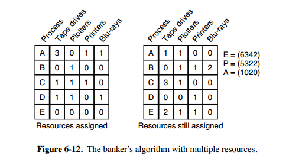
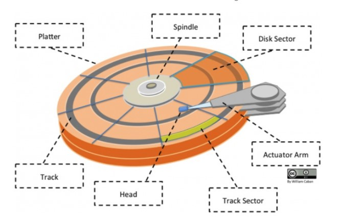
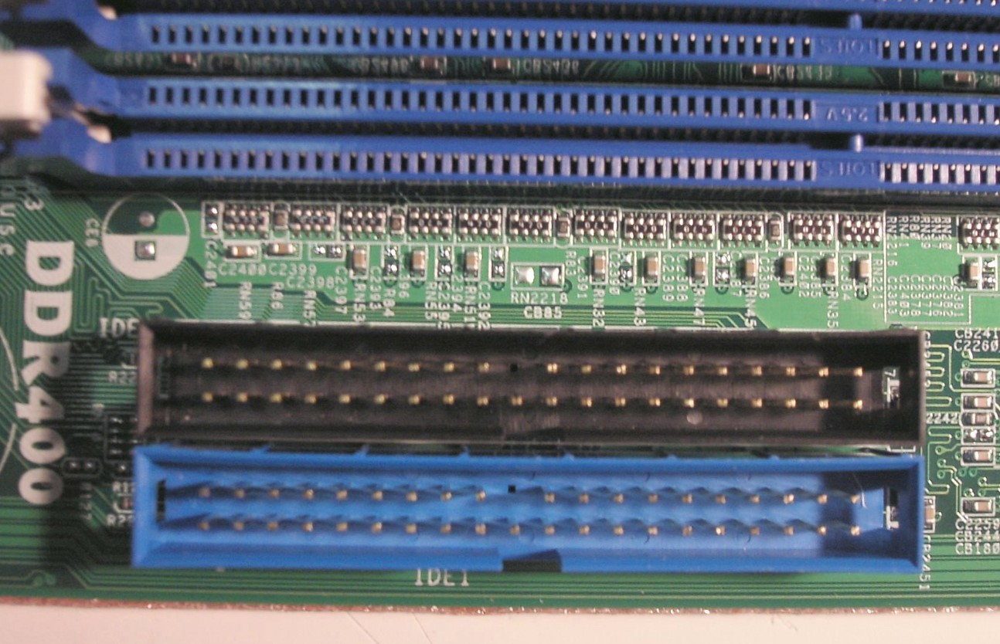
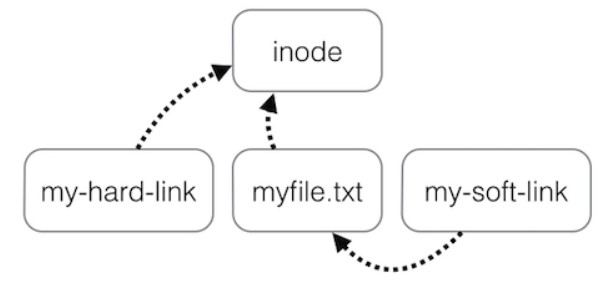

# 第 2 章 操作系统


## 第 2.1 节 计算机操作系统


### 概述


#### 基本特征

##### 1. 并发

并发是指宏观上在一段时间内能同时运行多个程序，而并行则指同一时刻能运行多个指令。

并行需要硬件支持，如多流水线、多核处理器或者分布式计算系统。

操作系统通过引入进程和线程，使得程序能够并发运行。

##### 2. 共享

共享是指系统中的资源可以被多个并发进程共同使用。

有两种共享方式：互斥共享和同时共享。

互斥共享的资源称为临界资源，例如打印机等，在同一时间只允许一个进程访问，需要用同步机制来实现对临界资源的访问。

##### 3. 虚拟

虚拟技术把一个物理实体转换为多个逻辑实体。

主要有两种虚拟技术：时分复用技术和空分复用技术。

多个进程能在同一个处理器上并发执行使用了时分复用技术，让每个进程轮流占有处理器，每次只执行一小个时间片并快速切换。

虚拟内存使用了空分复用技术，它将物理内存抽象为地址空间，每个进程都有各自的地址空间。地址空间的页被映射到物理内存，地址空间的页并不需要全部在物理内存中，当使用到一个没有在物理内存的页时，执行页面置换算法，将该页置换到内存中。

##### 4. 异步

异步指进程不是一次性执行完毕，而是走走停停，以不可知的速度向前推进。

#### 基本功能

##### 1. 进程管理

进程控制、进程同步、进程通信、死锁处理、处理机调度等。

##### 2. 内存管理

内存分配、地址映射、内存保护与共享、虚拟内存等。

##### 3. 文件管理

文件存储空间的管理、目录管理、文件读写管理和保护等。

##### 4. 设备管理

完成用户的 I/O 请求，方便用户使用各种设备，并提高设备的利用率。

主要包括缓冲管理、设备分配、设备处理、虛拟设备等。

#### 系统调用

如果一个进程在用户态需要使用内核态的功能，就进行系统调用从而陷入内核，由操作系统代为完成。

<div align="center">  </div><br>

Linux 的系统调用主要有以下这些：

|   Task   | Commands                    |
| :------: | --------------------------- |
| 进程控制 | fork(); exit(); wait();     |
| 进程通信 | pipe(); shmget(); mmap();   |
| 文件操作 | open(); read(); write();    |
| 设备操作 | ioctl(); read(); write();   |
| 信息维护 | getpid(); alarm(); sleep(); |
|   安全   | chmod(); umask(); chown();  |

#### 大内核和微内核

##### 1. 大内核

大内核是将操作系统功能作为一个紧密结合的整体放到内核。

由于各模块共享信息，因此有很高的性能。

##### 2. 微内核

由于操作系统不断复杂，因此将一部分操作系统功能移出内核，从而降低内核的复杂性。移出的部分根据分层的原则划分成若干服务，相互独立。

在微内核结构下，操作系统被划分成小的、定义良好的模块，只有微内核这一个模块运行在内核态，其余模块运行在用户态。

因为需要频繁地在用户态和核心态之间进行切换，所以会有一定的性能损失。

<div align="center">  </div><br>

#### 中断分类

##### 1. 外中断

由 CPU 执行指令以外的事件引起，如 I/O 完成中断，表示设备输入/输出处理已经完成，处理器能够发送下一个输入/输出请求。此外还有时钟中断、控制台中断等。

##### 2. 异常

由 CPU 执行指令的内部事件引起，如非法操作码、地址越界、算术溢出等。

##### 3. 陷入

在用户程序中使用系统调用。


### 进程管理


#### 进程与线程

##### 1. 进程

进程是资源分配的基本单位。

进程控制块 (Process Control Block, PCB) 描述进程的基本信息和运行状态，所谓的创建进程和撤销进程，都是指对 PCB 的操作。

下图显示了 4 个程序创建了 4 个进程，这 4 个进程可以并发地执行。

<div align="center">  </div><br>

##### 2. 线程

线程是独立调度的基本单位。

一个进程中可以有多个线程，它们共享进程资源。

QQ 和浏览器是两个进程，浏览器进程里面有很多线程，例如 HTTP 请求线程、事件响应线程、渲染线程等等，线程的并发执行使得在浏览器中点击一个新链接从而发起 HTTP 请求时，浏览器还可以响应用户的其它事件。

<div align="center">  </div><br>

##### 3. 区别

Ⅰ 拥有资源

进程是资源分配的基本单位，但是线程不拥有资源，线程可以访问隶属进程的资源。

Ⅱ 调度

线程是独立调度的基本单位，在同一进程中，线程的切换不会引起进程切换，从一个进程中的线程切换到另一个进程中的线程时，会引起进程切换。

Ⅲ 系统开销

由于创建或撤销进程时，系统都要为之分配或回收资源，如内存空间、I/O 设备等，所付出的开销远大于创建或撤销线程时的开销。类似地，在进行进程切换时，涉及当前执行进程 CPU 环境的保存及新调度进程 CPU 环境的设置，而线程切换时只需保存和设置少量寄存器内容，开销很小。

Ⅳ 通信方面

线程间可以通过直接读写同一进程中的数据进行通信，但是进程通信需要借助 IPC。

#### 进程状态的切换

<div align="center">  </div><br>

- 就绪状态（ready）：等待被调度
- 运行状态（running）
- 阻塞状态（waiting）：等待资源

应该注意以下内容：

- 只有就绪态和运行态可以相互转换，其它的都是单向转换。就绪状态的进程通过调度算法从而获得 CPU 时间，转为运行状态；而运行状态的进程，在分配给它的 CPU 时间片用完之后就会转为就绪状态，等待下一次调度。
- 阻塞状态是缺少需要的资源从而由运行状态转换而来，但是该资源不包括 CPU 时间，缺少 CPU 时间会从运行态转换为就绪态。

#### 进程调度算法

不同环境的调度算法目标不同，因此需要针对不同环境来讨论调度算法。

##### 1. 批处理系统

批处理系统没有太多的用户操作，在该系统中，调度算法目标是保证吞吐量和周转时间（从提交到终止的时间）。

**1.1 先来先服务 first-come first-serverd（FCFS）** 

按照请求的顺序进行调度。

有利于长作业，但不利于短作业，因为短作业必须一直等待前面的长作业执行完毕才能执行，而长作业又需要执行很长时间，造成了短作业等待时间过长。

**1.2 短作业优先 shortest job first（SJF）** 

按估计运行时间最短的顺序进行调度。

长作业有可能会饿死，处于一直等待短作业执行完毕的状态。因为如果一直有短作业到来，那么长作业永远得不到调度。

**1.3 最短剩余时间优先 shortest remaining time next（SRTN）** 

按估计剩余时间最短的顺序进行调度。

##### 2. 交互式系统

交互式系统有大量的用户交互操作，在该系统中调度算法的目标是快速地进行响应。

**2.1 时间片轮转** 

将所有就绪进程按 FCFS 的原则排成一个队列，每次调度时，把 CPU 时间分配给队首进程，该进程可以执行一个时间片。当时间片用完时，由计时器发出时钟中断，调度程序便停止该进程的执行，并将它送往就绪队列的末尾，同时继续把 CPU 时间分配给队首的进程。

时间片轮转算法的效率和时间片的大小有很大关系：

- 因为进程切换都要保存进程的信息并且载入新进程的信息，如果时间片太小，会导致进程切换得太频繁，在进程切换上就会花过多时间。
- 而如果时间片过长，那么实时性就不能得到保证。

<div align="center">  </div><br>

**2.2 优先级调度** 

为每个进程分配一个优先级，按优先级进行调度。

为了防止低优先级的进程永远等不到调度，可以随着时间的推移增加等待进程的优先级。

**2.3 多级反馈队列** 

一个进程需要执行 100 个时间片，如果采用时间片轮转调度算法，那么需要交换 100 次。

多级队列是为这种需要连续执行多个时间片的进程考虑，它设置了多个队列，每个队列时间片大小都不同，例如 1,2,4,8,..。进程在第一个队列没执行完，就会被移到下一个队列。这种方式下，之前的进程只需要交换 7 次。

每个队列优先权也不同，最上面的优先权最高。因此只有上一个队列没有进程在排队，才能调度当前队列上的进程。

可以将这种调度算法看成是时间片轮转调度算法和优先级调度算法的结合。

<div align="center">  </div><br>

##### 3. 实时系统

实时系统要求一个请求在一个确定时间内得到响应。

分为硬实时和软实时，前者必须满足绝对的截止时间，后者可以容忍一定的超时。

#### 进程同步

##### 1. 临界区

对临界资源进行访问的那段代码称为临界区。

为了互斥访问临界资源，每个进程在进入临界区之前，需要先进行检查。

```html
// entry section
// critical section;
// exit section
```

##### 2. 同步与互斥

- 同步：多个进程按一定顺序执行；
- 互斥：多个进程在同一时刻只有一个进程能进入临界区。

##### 3. 信号量

信号量（Semaphore）是一个整型变量，可以对其执行 down 和 up 操作，也就是常见的 P 和 V 操作。

-  **down**  : 如果信号量大于 0 ，执行 -1 操作；如果信号量等于 0，进程睡眠，等待信号量大于 0；
-  **up** ：对信号量执行 +1 操作，唤醒睡眠的进程让其完成 down 操作。

down 和 up 操作需要被设计成原语，不可分割，通常的做法是在执行这些操作的时候屏蔽中断。

如果信号量的取值只能为 0 或者 1，那么就成为了  **互斥量（Mutex）** ，0 表示临界区已经加锁，1 表示临界区解锁。

```c
typedef int semaphore;
semaphore mutex = 1;
void P1() {
    down(&mutex);
    // 临界区
    up(&mutex);
}

void P2() {
    down(&mutex);
    // 临界区
    up(&mutex);
}
```

<font size=3>  **使用信号量实现生产者-消费者问题**  </font> </br>

问题描述：使用一个缓冲区来保存物品，只有缓冲区没有满，生产者才可以放入物品；只有缓冲区不为空，消费者才可以拿走物品。

因为缓冲区属于临界资源，因此需要使用一个互斥量 mutex 来控制对缓冲区的互斥访问。

为了同步生产者和消费者的行为，需要记录缓冲区中物品的数量。数量可以使用信号量来进行统计，这里需要使用两个信号量：empty 记录空缓冲区的数量，full 记录满缓冲区的数量。其中，empty 信号量是在生产者进程中使用，当 empty 不为 0 时，生产者才可以放入物品；full 信号量是在消费者进程中使用，当 full 信号量不为 0 时，消费者才可以取走物品。

注意，不能先对缓冲区进行加锁，再测试信号量。也就是说，不能先执行 down(mutex) 再执行 down(empty)。如果这么做了，那么可能会出现这种情况：生产者对缓冲区加锁后，执行 down(empty) 操作，发现 empty = 0，此时生产者睡眠。消费者不能进入临界区，因为生产者对缓冲区加锁了，消费者就无法执行 up(empty) 操作，empty 永远都为 0，导致生产者永远等待下，不会释放锁，消费者因此也会永远等待下去。

```c
#define N 100
typedef int semaphore;
semaphore mutex = 1;
semaphore empty = N;
semaphore full = 0;

void producer() {
    while(TRUE) {
        int item = produce_item();
        down(&empty);
        down(&mutex);
        insert_item(item);
        up(&mutex);
        up(&full);
    }
}

void consumer() {
    while(TRUE) {
        down(&full);
        down(&mutex);
        int item = remove_item();
        consume_item(item);
        up(&mutex);
        up(&empty);
    }
}
```

##### 4. 管程

使用信号量机制实现的生产者消费者问题需要客户端代码做很多控制，而管程把控制的代码独立出来，不仅不容易出错，也使得客户端代码调用更容易。

c 语言不支持管程，下面的示例代码使用了类 Pascal 语言来描述管程。示例代码的管程提供了 insert() 和 remove() 方法，客户端代码通过调用这两个方法来解决生产者-消费者问题。

```pascal
monitor ProducerConsumer
    integer i;
    condition c;

    procedure insert();
    begin
        // ...
    end;

    procedure remove();
    begin
        // ...
    end;
end monitor;
```

管程有一个重要特性：在一个时刻只能有一个进程使用管程。进程在无法继续执行的时候不能一直占用管程，否则其它进程永远不能使用管程。

管程引入了  **条件变量**  以及相关的操作：**wait()** 和 **signal()** 来实现同步操作。对条件变量执行 wait() 操作会导致调用进程阻塞，把管程让出来给另一个进程持有。signal() 操作用于唤醒被阻塞的进程。

<font size=3> **使用管程实现生产者-消费者问题** </font><br>

```pascal
// 管程
monitor ProducerConsumer
    condition full, empty;
    integer count := 0;
    condition c;

    procedure insert(item: integer);
    begin
        if count = N then wait(full);
        insert_item(item);
        count := count + 1;
        if count = 1 then signal(empty);
    end;

    function remove: integer;
    begin
        if count = 0 then wait(empty);
        remove = remove_item;
        count := count - 1;
        if count = N -1 then signal(full);
    end;
end monitor;

// 生产者客户端
procedure producer
begin
    while true do
    begin
        item = produce_item;
        ProducerConsumer.insert(item);
    end
end;

// 消费者客户端
procedure consumer
begin
    while true do
    begin
        item = ProducerConsumer.remove;
        consume_item(item);
    end
end;
```

#### 经典同步问题

生产者和消费者问题前面已经讨论过了。

##### 1. 读者-写者问题

允许多个进程同时对数据进行读操作，但是不允许读和写以及写和写操作同时发生。

一个整型变量 count 记录在对数据进行读操作的进程数量，一个互斥量 count_mutex 用于对 count 加锁，一个互斥量 data_mutex 用于对读写的数据加锁。

```c
typedef int semaphore;
semaphore count_mutex = 1;
semaphore data_mutex = 1;
int count = 0;

void reader() {
    while(TRUE) {
        down(&count_mutex);
        count++;
        if(count == 1) down(&data_mutex); // 第一个读者需要对数据进行加锁，防止写进程访问
        up(&count_mutex);
        read();
        down(&count_mutex);
        count--;
        if(count == 0) up(&data_mutex);
        up(&count_mutex);
    }
}

void writer() {
    while(TRUE) {
        down(&data_mutex);
        write();
        up(&data_mutex);
    }
}
```

以下内容由 [@Bandi Yugandhar](https://github.com/yugandharbandi) 提供。

The first case may result Writer to starve. This case favous Writers i.e no writer, once added to the queue, shall be kept waiting longer than absolutely necessary(only when there are readers that entered the queue before the writer).

```source-c
int readcount, writecount;                   //(initial value = 0)
semaphore rmutex, wmutex, readLock, resource; //(initial value = 1)

//READER
void reader() {
<ENTRY Section>
 down(&readLock);                 //  reader is trying to enter
 down(&rmutex);                  //   lock to increase readcount
  readcount++;                 
  if (readcount == 1)          
   down(&resource);              //if you are the first reader then lock  the resource
 up(&rmutex);                  //release  for other readers
 up(&readLock);                 //Done with trying to access the resource

<CRITICAL Section>
//reading is performed

<EXIT Section>
 down(&rmutex);                  //reserve exit section - avoids race condition with readers
 readcount--;                       //indicate you're leaving
  if (readcount == 0)          //checks if you are last reader leaving
   up(&resource);              //if last, you must release the locked resource
 up(&rmutex);                  //release exit section for other readers
}

//WRITER
void writer() {
  <ENTRY Section>
  down(&wmutex);                  //reserve entry section for writers - avoids race conditions
  writecount++;                //report yourself as a writer entering
  if (writecount == 1)         //checks if you're first writer
   down(&readLock);               //if you're first, then you must lock the readers out. Prevent them from trying to enter CS
  up(&wmutex);                  //release entry section

<CRITICAL Section>
 down(&resource);                //reserve the resource for yourself - prevents other writers from simultaneously editing the shared resource
  //writing is performed
 up(&resource);                //release file

<EXIT Section>
  down(&wmutex);                  //reserve exit section
  writecount--;                //indicate you're leaving
  if (writecount == 0)         //checks if you're the last writer
   up(&readLock);               //if you're last writer, you must unlock the readers. Allows them to try enter CS for reading
  up(&wmutex);                  //release exit section
}
```

We can observe that every reader is forced to acquire ReadLock. On the otherhand, writers doesn’t need to lock individually. Once the first writer locks the ReadLock, it will be released only when there is no writer left in the queue.

From the both cases we observed that either reader or writer has to starve. Below solutionadds the constraint that no thread shall be allowed to starve; that is, the operation of obtaining a lock on the shared data will always terminate in a bounded amount of time.

```source-c
int readCount;                  // init to 0; number of readers currently accessing resource

// all semaphores initialised to 1
Semaphore resourceAccess;       // controls access (read/write) to the resource
Semaphore readCountAccess;      // for syncing changes to shared variable readCount
Semaphore serviceQueue;         // FAIRNESS: preserves ordering of requests (signaling must be FIFO)

void writer()
{ 
    down(&serviceQueue);           // wait in line to be servicexs
    // <ENTER>
    down(&resourceAccess);         // request exclusive access to resource
    // </ENTER>
    up(&serviceQueue);           // let next in line be serviced

    // <WRITE>
    writeResource();            // writing is performed
    // </WRITE>

    // <EXIT>
    up(&resourceAccess);         // release resource access for next reader/writer
    // </EXIT>
}

void reader()
{ 
    down(&serviceQueue);           // wait in line to be serviced
    down(&readCountAccess);        // request exclusive access to readCount
    // <ENTER>
    if (readCount == 0)         // if there are no readers already reading:
        down(&resourceAccess);     // request resource access for readers (writers blocked)
    readCount++;                // update count of active readers
    // </ENTER>
    up(&serviceQueue);           // let next in line be serviced
    up(&readCountAccess);        // release access to readCount

    // <READ>
    readResource();             // reading is performed
    // </READ>

    down(&readCountAccess);        // request exclusive access to readCount
    // <EXIT>
    readCount--;                // update count of active readers
    if (readCount == 0)         // if there are no readers left:
        up(&resourceAccess);     // release resource access for all
    // </EXIT>
    up(&readCountAccess);        // release access to readCount
}

```


##### 2. 哲学家进餐问题

<div align="center">  </div><br>

五个哲学家围着一张圆桌，每个哲学家面前放着食物。哲学家的生活有两种交替活动：吃饭以及思考。当一个哲学家吃饭时，需要先拿起自己左右两边的两根筷子，并且一次只能拿起一根筷子。

下面是一种错误的解法，考虑到如果所有哲学家同时拿起左手边的筷子，那么就无法拿起右手边的筷子，造成死锁。

```c
#define N 5

void philosopher(int i) {
    while(TRUE) {
        think();
        take(i);       // 拿起左边的筷子
        take((i+1)%N); // 拿起右边的筷子
        eat();
        put(i);
        put((i+1)%N);
    }
}
```

为了防止死锁的发生，可以设置两个条件：

- 必须同时拿起左右两根筷子；
- 只有在两个邻居都没有进餐的情况下才允许进餐。

```c
#define N 5
#define LEFT (i + N - 1) % N // 左邻居
#define RIGHT (i + 1) % N    // 右邻居
#define THINKING 0
#define HUNGRY   1
#define EATING   2
typedef int semaphore;
int state[N];                // 跟踪每个哲学家的状态
semaphore mutex = 1;         // 临界区的互斥
semaphore s[N];              // 每个哲学家一个信号量

void philosopher(int i) {
    while(TRUE) {
        think();
        take_two(i);
        eat();
        put_two(i);
    }
}

void take_two(int i) {
    down(&mutex);
    state[i] = HUNGRY;
    test(i);
    up(&mutex);
    down(&s[i]);
}

void put_two(i) {
    down(&mutex);
    state[i] = THINKING;
    test(LEFT);
    test(RIGHT);
    up(&mutex);
}

void test(i) {         // 尝试拿起两把筷子
    if(state[i] == HUNGRY && state[LEFT] != EATING && state[RIGHT] !=EATING) {
        state[i] = EATING;
        up(&s[i]);
    }
}
```

#### 进程通信

进程同步与进程通信很容易混淆，它们的区别在于：

- 进程同步：控制多个进程按一定顺序执行；
- 进程通信：进程间传输信息。

进程通信是一种手段，而进程同步是一种目的。也可以说，为了能够达到进程同步的目的，需要让进程进行通信，传输一些进程同步所需要的信息。

##### 1. 管道

管道是通过调用 pipe 函数创建的，fd[0] 用于读，fd[1] 用于写。

```c
#include <unistd.h>
int pipe(int fd[2]);
```

它具有以下限制：

- 只支持半双工通信（单向交替传输）；
- 只能在父子进程中使用。

<div align="center">  </div><br>

##### 2. FIFO

也称为命名管道，去除了管道只能在父子进程中使用的限制。

```c
#include <sys/stat.h>
int mkfifo(const char *path, mode_t mode);
int mkfifoat(int fd, const char *path, mode_t mode);
```

FIFO 常用于客户-服务器应用程序中，FIFO 用作汇聚点，在客户进程和服务器进程之间传递数据。

<div align="center">  </div><br>

##### 3. 消息队列

相比于 FIFO，消息队列具有以下优点：

- 消息队列可以独立于读写进程存在，从而避免了 FIFO 中同步管道的打开和关闭时可能产生的困难；
- 避免了 FIFO 的同步阻塞问题，不需要进程自己提供同步方法；
- 读进程可以根据消息类型有选择地接收消息，而不像 FIFO 那样只能默认地接收。

##### 4. 信号量

它是一个计数器，用于为多个进程提供对共享数据对象的访问。

##### 5. 共享存储

允许多个进程共享一个给定的存储区。因为数据不需要在进程之间复制，所以这是最快的一种 IPC。

需要使用信号量用来同步对共享存储的访问。

多个进程可以将同一个文件映射到它们的地址空间从而实现共享内存。另外 XSI 共享内存不是使用文件，而是使用内存的匿名段。

##### 6. 套接字

与其它通信机制不同的是，它可用于不同机器间的进程通信。


### 死锁


#### 必要条件

<div align="center">  </div><br>

- 互斥：每个资源要么已经分配给了一个进程，要么就是可用的。
- 占有和等待：已经得到了某个资源的进程可以再请求新的资源。
- 不可抢占：已经分配给一个进程的资源不能强制性地被抢占，它只能被占有它的进程显式地释放。
- 环路等待：有两个或者两个以上的进程组成一条环路，该环路中的每个进程都在等待下一个进程所占有的资源。

#### 处理方法

主要有以下四种方法：

- 鸵鸟策略
- 死锁检测与死锁恢复
- 死锁预防
- 死锁避免

#### 鸵鸟策略

把头埋在沙子里，假装根本没发生问题。

因为解决死锁问题的代价很高，因此鸵鸟策略这种不采取任务措施的方案会获得更高的性能。

当发生死锁时不会对用户造成多大影响，或发生死锁的概率很低，可以采用鸵鸟策略。

大多数操作系统，包括 Unix，Linux 和 Windows，处理死锁问题的办法仅仅是忽略它。

#### 死锁检测与死锁恢复

不试图阻止死锁，而是当检测到死锁发生时，采取措施进行恢复。

##### 1. 每种类型一个资源的死锁检测

<div align="center">  </div><br>

上图为资源分配图，其中方框表示资源，圆圈表示进程。资源指向进程表示该资源已经分配给该进程，进程指向资源表示进程请求获取该资源。

图 a 可以抽取出环，如图 b，它满足了环路等待条件，因此会发生死锁。

每种类型一个资源的死锁检测算法是通过检测有向图是否存在环来实现，从一个节点出发进行深度优先搜索，对访问过的节点进行标记，如果访问了已经标记的节点，就表示有向图存在环，也就是检测到死锁的发生。

##### 2. 每种类型多个资源的死锁检测

<div align="center">  </div><br>

上图中，有三个进程四个资源，每个数据代表的含义如下：

- E 向量：资源总量
- A 向量：资源剩余量
- C 矩阵：每个进程所拥有的资源数量，每一行都代表一个进程拥有资源的数量
- R 矩阵：每个进程请求的资源数量

进程 P<sub>1</sub> 和 P<sub>2</sub> 所请求的资源都得不到满足，只有进程 P<sub>3</sub> 可以，让 P<sub>3</sub> 执行，之后释放 P<sub>3</sub> 拥有的资源，此时 A = (2 2 2 0)。P<sub>2</sub> 可以执行，执行后释放 P<sub>2</sub> 拥有的资源，A = (4 2 2 1) 。P<sub>1</sub> 也可以执行。所有进程都可以顺利执行，没有死锁。

算法总结如下：

每个进程最开始时都不被标记，执行过程有可能被标记。当算法结束时，任何没有被标记的进程都是死锁进程。

1. 寻找一个没有标记的进程 P<sub>i</sub>，它所请求的资源小于等于 A。
2. 如果找到了这样一个进程，那么将 C 矩阵的第 i 行向量加到 A 中，标记该进程，并转回 1。
3. 如果没有这样一个进程，算法终止。

##### 3. 死锁恢复

- 利用抢占恢复
- 利用回滚恢复
- 通过杀死进程恢复

#### 死锁预防

在程序运行之前预防发生死锁。

##### 1. 破坏互斥条件

例如假脱机打印机技术允许若干个进程同时输出，唯一真正请求物理打印机的进程是打印机守护进程。

##### 2. 破坏占有和等待条件

一种实现方式是规定所有进程在开始执行前请求所需要的全部资源。

##### 3. 破坏不可抢占条件

##### 4. 破坏环路等待

给资源统一编号，进程只能按编号顺序来请求资源。

#### 死锁避免

在程序运行时避免发生死锁。

##### 1. 安全状态

<div align="center">  </div><br>

图 a 的第二列 Has 表示已拥有的资源数，第三列 Max 表示总共需要的资源数，Free 表示还有可以使用的资源数。从图 a 开始出发，先让 B 拥有所需的所有资源（图 b），运行结束后释放 B，此时 Free 变为 5（图 c）；接着以同样的方式运行 C 和 A，使得所有进程都能成功运行，因此可以称图 a 所示的状态时安全的。

定义：如果没有死锁发生，并且即使所有进程突然请求对资源的最大需求，也仍然存在某种调度次序能够使得每一个进程运行完毕，则称该状态是安全的。

安全状态的检测与死锁的检测类似，因为安全状态必须要求不能发生死锁。下面的银行家算法与死锁检测算法非常类似，可以结合着做参考对比。

##### 2. 单个资源的银行家算法

一个小城镇的银行家，他向一群客户分别承诺了一定的贷款额度，算法要做的是判断对请求的满足是否会进入不安全状态，如果是，就拒绝请求；否则予以分配。

<div align="center">  </div><br>

上图 c 为不安全状态，因此算法会拒绝之前的请求，从而避免进入图 c 中的状态。

##### 3. 多个资源的银行家算法

<div align="center">  </div><br>

上图中有五个进程，四个资源。左边的图表示已经分配的资源，右边的图表示还需要分配的资源。最右边的 E、P 以及 A 分别表示：总资源、已分配资源以及可用资源，注意这三个为向量，而不是具体数值，例如 A=(1020)，表示 4 个资源分别还剩下 1/0/2/0。

检查一个状态是否安全的算法如下：

- 查找右边的矩阵是否存在一行小于等于向量 A。如果不存在这样的行，那么系统将会发生死锁，状态是不安全的。
- 假若找到这样一行，将该进程标记为终止，并将其已分配资源加到 A 中。
- 重复以上两步，直到所有进程都标记为终止，则状态时安全的。

如果一个状态不是安全的，需要拒绝进入这个状态。


### 内存管理


#### 虚拟内存

虚拟内存的目的是为了让物理内存扩充成更大的逻辑内存，从而让程序获得更多的可用内存。

为了更好的管理内存，操作系统将内存抽象成地址空间。每个程序拥有自己的地址空间，这个地址空间被分割成多个块，每一块称为一页。这些页被映射到物理内存，但不需要映射到连续的物理内存，也不需要所有页都必须在物理内存中。当程序引用到不在物理内存中的页时，由硬件执行必要的映射，将缺失的部分装入物理内存并重新执行失败的指令。

从上面的描述中可以看出，虚拟内存允许程序不用将地址空间中的每一页都映射到物理内存，也就是说一个程序不需要全部调入内存就可以运行，这使得有限的内存运行大程序成为可能。例如有一台计算机可以产生 16 位地址，那么一个程序的地址空间范围是 0\~64K。该计算机只有 32KB 的物理内存，虚拟内存技术允许该计算机运行一个 64K 大小的程序。

<div align="center">  </div><br>

#### 分页系统地址映射

内存管理单元（MMU）管理着地址空间和物理内存的转换，其中的页表（Page table）存储着页（程序地址空间）和页框（物理内存空间）的映射表。

一个虚拟地址分成两个部分，一部分存储页面号，一部分存储偏移量。

下图的页表存放着 16 个页，这 16 个页需要用 4 个比特位来进行索引定位。例如对于虚拟地址（0010 000000000100），前 4 位是存储页面号 2，读取表项内容为（110 1），页表项最后一位表示是否存在于内存中，1 表示存在。后 12 位存储偏移量。这个页对应的页框的地址为 （110 000000000100）。

<div align="center">  </div><br>

#### 页面置换算法

在程序运行过程中，如果要访问的页面不在内存中，就发生缺页中断从而将该页调入内存中。此时如果内存已无空闲空间，系统必须从内存中调出一个页面到磁盘对换区中来腾出空间。

页面置换算法和缓存淘汰策略类似，可以将内存看成磁盘的缓存。在缓存系统中，缓存的大小有限，当有新的缓存到达时，需要淘汰一部分已经存在的缓存，这样才有空间存放新的缓存数据。

页面置换算法的主要目标是使页面置换频率最低（也可以说缺页率最低）。

##### 1. 最佳

> OPT, Optimal replacement algorithm

所选择的被换出的页面将是最长时间内不再被访问，通常可以保证获得最低的缺页率。

是一种理论上的算法，因为无法知道一个页面多长时间不再被访问。

举例：一个系统为某进程分配了三个物理块，并有如下页面引用序列：

```html
7，0，1，2，0，3，0，4，2，3，0，3，2，1，2，0，1，7，0，1
```

开始运行时，先将 7, 0, 1 三个页面装入内存。当进程要访问页面 2 时，产生缺页中断，会将页面 7 换出，因为页面 7 再次被访问的时间最长。

##### 2. 最近最久未使用

> LRU, Least Recently Used

虽然无法知道将来要使用的页面情况，但是可以知道过去使用页面的情况。LRU 将最近最久未使用的页面换出。

为了实现 LRU，需要在内存中维护一个所有页面的链表。当一个页面被访问时，将这个页面移到链表表头。这样就能保证链表表尾的页面是最近最久未访问的。

因为每次访问都需要更新链表，因此这种方式实现的 LRU 代价很高。

```html
4，7，0，7，1，0，1，2，1，2，6
```

<div align="center">  </div><br>

##### 3. 最近未使用

> NRU, Not Recently Used

每个页面都有两个状态位：R 与 M，当页面被访问时设置页面的 R=1，当页面被修改时设置 M=1。其中 R 位会定时被清零。可以将页面分成以下四类：

- R=0，M=0
- R=0，M=1
- R=1，M=0
- R=1，M=1

当发生缺页中断时，NRU 算法随机地从类编号最小的非空类中挑选一个页面将它换出。

NRU 优先换出已经被修改的脏页面（R=0，M=1），而不是被频繁使用的干净页面（R=1，M=0）。

##### 4. 先进先出

> FIFO, First In First Out

选择换出的页面是最先进入的页面。

该算法会将那些经常被访问的页面也被换出，从而使缺页率升高。

##### 5. 第二次机会算法

FIFO 算法可能会把经常使用的页面置换出去，为了避免这一问题，对该算法做一个简单的修改：

当页面被访问 (读或写) 时设置该页面的 R 位为 1。需要替换的时候，检查最老页面的 R 位。如果 R 位是 0，那么这个页面既老又没有被使用，可以立刻置换掉；如果是 1，就将 R 位清 0，并把该页面放到链表的尾端，修改它的装入时间使它就像刚装入的一样，然后继续从链表的头部开始搜索。

<div align="center">  </div><br>

##### 6. 时钟

> Clock

第二次机会算法需要在链表中移动页面，降低了效率。时钟算法使用环形链表将页面连接起来，再使用一个指针指向最老的页面。

<div align="center">  </div><br>

#### 分段

虚拟内存采用的是分页技术，也就是将地址空间划分成固定大小的页，每一页再与内存进行映射。

下图为一个编译器在编译过程中建立的多个表，有 4 个表是动态增长的，如果使用分页系统的一维地址空间，动态增长的特点会导致覆盖问题的出现。

<div align="center">  </div><br>

分段的做法是把每个表分成段，一个段构成一个独立的地址空间。每个段的长度可以不同，并且可以动态增长。

<div align="center">  </div><br>

#### 段页式

程序的地址空间划分成多个拥有独立地址空间的段，每个段上的地址空间划分成大小相同的页。这样既拥有分段系统的共享和保护，又拥有分页系统的虚拟内存功能。

#### 分页与分段的比较

- 对程序员的透明性：分页透明，但是分段需要程序员显式划分每个段。

- 地址空间的维度：分页是一维地址空间，分段是二维的。

- 大小是否可以改变：页的大小不可变，段的大小可以动态改变。

- 出现的原因：分页主要用于实现虚拟内存，从而获得更大的地址空间；分段主要是为了使程序和数据可以被划分为逻辑上独立的地址空间并且有助于共享和保护。


### 设备管理


#### 磁盘结构

- 盘面（Platter）：一个磁盘有多个盘面；
- 磁道（Track）：盘面上的圆形带状区域，一个盘面可以有多个磁道；
- 扇区（Track Sector）：磁道上的一个弧段，一个磁道可以有多个扇区，它是最小的物理储存单位，目前主要有 512 bytes 与 4 K 两种大小；
- 磁头（Head）：与盘面非常接近，能够将盘面上的磁场转换为电信号（读），或者将电信号转换为盘面的磁场（写）；
- 制动手臂（Actuator arm）：用于在磁道之间移动磁头；
- 主轴（Spindle）：使整个盘面转动。

<div align="center">  </div><br>

#### 磁盘调度算法

读写一个磁盘块的时间的影响因素有：

- 旋转时间（主轴转动盘面，使得磁头移动到适当的扇区上）
- 寻道时间（制动手臂移动，使得磁头移动到适当的磁道上）
- 实际的数据传输时间

其中，寻道时间最长，因此磁盘调度的主要目标是使磁盘的平均寻道时间最短。

##### 1. 先来先服务

> FCFS, First Come First Served

按照磁盘请求的顺序进行调度。

优点是公平和简单。缺点也很明显，因为未对寻道做任何优化，使平均寻道时间可能较长。

##### 2. 最短寻道时间优先

> SSTF, Shortest Seek Time First

优先调度与当前磁头所在磁道距离最近的磁道。

虽然平均寻道时间比较低，但是不够公平。如果新到达的磁道请求总是比一个在等待的磁道请求近，那么在等待的磁道请求会一直等待下去，也就是出现饥饿现象。具体来说，两端的磁道请求更容易出现饥饿现象。

<div align="center">  </div><br>

##### 3. 电梯算法

> SCAN

电梯总是保持一个方向运行，直到该方向没有请求为止，然后改变运行方向。

电梯算法（扫描算法）和电梯的运行过程类似，总是按一个方向来进行磁盘调度，直到该方向上没有未完成的磁盘请求，然后改变方向。

因为考虑了移动方向，因此所有的磁盘请求都会被满足，解决了 SSTF 的饥饿问题。

<div align="center">  </div><br>


### 链接


#### 编译系统


以下是一个 hello.c 程序：

```c
#include <stdio.h>

int main()
{
    printf("hello, world\n");
    return 0;
}
```

在 Unix 系统上，由编译器把源文件转换为目标文件。

```bash
gcc -o hello hello.c
```

这个过程大致如下：

<div align="center">  </div><br>

- 预处理阶段：处理以 # 开头的预处理命令；
- 编译阶段：翻译成汇编文件；
- 汇编阶段：将汇编文件翻译成可重定位目标文件；
- 链接阶段：将可重定位目标文件和 printf.o 等单独预编译好的目标文件进行合并，得到最终的可执行目标文件。

#### 静态链接

静态链接器以一组可重定位目标文件为输入，生成一个完全链接的可执行目标文件作为输出。链接器主要完成以下两个任务：

- 符号解析：每个符号对应于一个函数、一个全局变量或一个静态变量，符号解析的目的是将每个符号引用与一个符号定义关联起来。
- 重定位：链接器通过把每个符号定义与一个内存位置关联起来，然后修改所有对这些符号的引用，使得它们指向这个内存位置。

<div align="center">  </div><br>

#### 目标文件

- 可执行目标文件：可以直接在内存中执行；
- 可重定位目标文件：可与其它可重定位目标文件在链接阶段合并，创建一个可执行目标文件；
- 共享目标文件：这是一种特殊的可重定位目标文件，可以在运行时被动态加载进内存并链接；

#### 动态链接

静态库有以下两个问题：

- 当静态库更新时那么整个程序都要重新进行链接；
- 对于 printf 这种标准函数库，如果每个程序都要有代码，这会极大浪费资源。

共享库是为了解决静态库的这两个问题而设计的，在 Linux 系统中通常用 .so 后缀来表示，Windows 系统上它们被称为 DLL。它具有以下特点：

- 在给定的文件系统中一个库只有一个文件，所有引用该库的可执行目标文件都共享这个文件，它不会被复制到引用它的可执行文件中；
- 在内存中，一个共享库的 .text 节（已编译程序的机器代码）的一个副本可以被不同的正在运行的进程共享。

<div align="center">  </div><br>


### 参考资料

- Tanenbaum A S, Bos H. Modern operating systems[M]. Prentice Hall Press, 2014.
- 汤子瀛, 哲凤屏, 汤小丹. 计算机操作系统[M]. 西安电子科技大学出版社, 2001.
- Bryant, R. E., & O’Hallaron, D. R. (2004). 深入理解计算机系统.
- 史蒂文斯. UNIX 环境高级编程 [M]. 人民邮电出版社, 2014.
- [Operating System Notes](https://applied-programming.github.io/Operating-Systems-Notes/)
- [Operating-System Structures](https://www.cs.uic.edu/\~jbell/CourseNotes/OperatingSystems/2_Structures.html)
- [Processes](http://cse.csusb.edu/tongyu/courses/cs460/notes/process.php)
- [Inter Process Communication Presentation[1]](https://www.slideshare.net/rkolahalam/inter-process-communication-presentation1)
- [Decoding UCS Invicta – Part 1](https://blogs.cisco.com/datacenter/decoding-ucs-invicta-part-1)
## 第 2.2 节 Linux


### 一、常用操作以及概念

#### 快捷键

- Tab：命令和文件名补全；
- Ctrl+C：中断正在运行的程序；
- Ctrl+D：结束键盘输入（End Of File，EOF）

#### 求助

##### 1. --help

指令的基本用法与选项介绍。

##### 2. man

man 是 manual 的缩写，将指令的具体信息显示出来。

当执行 `man date` 时，有 DATE(1) 出现，其中的数字代表指令的类型，常用的数字及其类型如下：

| 代号 | 类型                                            |
| :--: | ----------------------------------------------- |
|  1   | 用户在 shell 环境中可以操作的指令或者可执行文件 |
|  5   | 配置文件                                        |
|  8   | 系统管理员可以使用的管理指令                    |

##### 3. info

info 与 man 类似，但是 info 将文档分成一个个页面，每个页面可以进行跳转。

##### 4. doc

/usr/share/doc 存放着软件的一整套说明文件。

#### 关机

##### 1. who

在关机前需要先使用 who 命令查看有没有其它用户在线。

##### 2. sync

为了加快对磁盘文件的读写速度，位于内存中的文件数据不会立即同步到磁盘上，因此关机之前需要先进行 sync 同步操作。

##### 3. shutdown

```html
# shutdown [-krhc] 时间 [信息]
-k ： 不会关机，只是发送警告信息，通知所有在线的用户
-r ： 将系统的服务停掉后就重新启动
-h ： 将系统的服务停掉后就立即关机
-c ： 取消已经在进行的 shutdown 指令内容
```

#### PATH

可以在环境变量 PATH 中声明可执行文件的路径，路径之间用 : 分隔。

```html
/usr/local/bin:/usr/bin:/usr/local/sbin:/usr/sbin:/home/dmtsai/.local/bin:/home/dmtsai/bin
```

#### sudo

sudo 允许一般用户使用 root 可执行的命令，不过只有在 /etc/sudoers 配置文件中添加的用户才能使用该指令。

#### 包管理工具

RPM 和 DPKG 为最常见的两类软件包管理工具：

- RPM 全称为 Redhat Package Manager，最早由 Red Hat 公司制定实施，随后被 GNU 开源操作系统接受并成为很多 Linux 系统 (RHEL) 的既定软件标准。
- 与 RPM 竞争的是基于 Debian 操作系统 (Ubuntu) 的 DEB 软件包管理工具 DPKG，全称为 Debian Package，功能方面与 RPM 相似。

YUM 基于 RPM，具有依赖管理和软件升级功能。

#### 发行版

Linux 发行版是 Linux 内核及各种应用软件的集成版本。

| 基于的包管理工具 | 商业发行版 |   社区发行版    |
| :--------------: | :--------: | :-------------: |
|       RPM        |  Red Hat   | Fedora / CentOS |
|       DPKG       |   Ubuntu   |     Debian      |

#### VIM 三个模式

- 一般指令模式（Command mode）：VIM 的默认模式，可以用于移动游标查看内容；
- 编辑模式（Insert mode）：按下 "i" 等按键之后进入，可以对文本进行编辑；
- 指令列模式（Bottom-line mode）：按下 ":" 按键之后进入，用于保存退出等操作。

<div align="center">  </div><br>

在指令列模式下，有以下命令用于离开或者保存文件。

| 命令 |                             作用                             |
| :--: | :----------------------------------------------------------: |
|  :w  |                           写入磁盘                           |
| :w!  | 当文件为只读时，强制写入磁盘。到底能不能写入，与用户对该文件的权限有关 |
|  :q  |                             离开                             |
| :q!  |                        强制离开不保存                        |
| :wq  |                        写入磁盘后离开                        |
| :wq! |                      强制写入磁盘后离开                      |

#### GNU

GNU 计划，译为革奴计划，它的目标是创建一套完全自由的操作系统，称为 GNU，其内容软件完全以 GPL 方式发布。其中 GPL 全称为 GNU 通用公共许可协议，包含了以下内容：

- 以任何目的运行此程序的自由；
- 再复制的自由；
- 改进此程序，并公开发布改进的自由。

#### 开源协议

- [Choose an open source license](https://choosealicense.com/)
- [如何选择开源许可证？](http://www.ruanyifeng.com/blog/2011/05/how_to_choose_free_software_licenses.html)

### 二、磁盘

#### 磁盘接口

##### 1. IDE

IDE（ATA）全称 Advanced Technology Attachment，接口速度最大为 133MB/s，因为并口线的抗干扰性太差，且排线占用空间较大，不利电脑内部散热，已逐渐被 SATA 所取代。

<div align="center">  </div><br>

##### 2. SATA

SATA 全称 Serial ATA，也就是使用串口的 ATA 接口，抗干扰性强，且对数据线的长度要求比 ATA 低很多，支持热插拔等功能。SATA-II 的接口速度为 300MiB/s，而新的 SATA-III 标准可达到 600MiB/s 的传输速度。SATA 的数据线也比 ATA 的细得多，有利于机箱内的空气流通，整理线材也比较方便。

<div align="center">  </div><br>

##### 3. SCSI

SCSI 全称是 Small Computer System Interface（小型机系统接口），经历多代的发展，从早期的 SCSI-II 到目前的 Ultra320 SCSI 以及 Fiber-Channel（光纤通道），接口型式也多种多样。SCSI 硬盘广为工作站以及个人电脑以及服务器所使用，因此会使用较为先进的技术，如碟片转速 15000rpm 的高转速，且传输时 CPU 占用率较低，但是单价也比相同容量的 ATA 及 SATA 硬盘更加昂贵。

<div align="center">  </div><br>

##### 4. SAS

SAS（Serial Attached SCSI）是新一代的 SCSI 技术，和 SATA 硬盘相同，都是采取序列式技术以获得更高的传输速度，可达到 6Gb/s。此外也通过缩小连接线改善系统内部空间等。

<div align="center">  </div><br>

#### 磁盘的文件名

Linux 中每个硬件都被当做一个文件，包括磁盘。磁盘以磁盘接口类型进行命名，常见磁盘的文件名如下：

- IDE 磁盘：/dev/hd[a-d]
- SATA/SCSI/SAS 磁盘：/dev/sd[a-p]

其中文件名后面的序号的确定与系统检测到磁盘的顺序有关，而与磁盘所插入的插槽位置无关。

### 三、分区

#### 分区表

磁盘分区表主要有两种格式，一种是限制较多的 MBR 分区表，一种是较新且限制较少的 GPT 分区表。

##### 1. MBR

MBR 中，第一个扇区最重要，里面有主要开机记录（Master boot record, MBR）及分区表（partition table），其中主要开机记录占 446 bytes，分区表占 64 bytes。

分区表只有 64 bytes，最多只能存储 4 个分区，这 4 个分区为主分区（Primary）和扩展分区（Extended）。其中扩展分区只有一个，它使用其它扇区来记录额外的分区表，因此通过扩展分区可以分出更多分区，这些分区称为逻辑分区。

Linux 也把分区当成文件，分区文件的命名方式为：磁盘文件名 + 编号，例如 /dev/sda1。注意，逻辑分区的编号从 5 开始。

##### 2. GPT

不同的磁盘有不同的扇区大小，例如 512 bytes 和最新磁盘的 4 k。GPT 为了兼容所有磁盘，在定义扇区上使用逻辑区块地址（Logical Block Address, LBA），LBA 默认大小为 512 bytes。

GPT 第 1 个区块记录了主要开机记录（MBR），紧接着是 33 个区块记录分区信息，并把最后的 33 个区块用于对分区信息进行备份。这 33 个区块第一个为 GPT 表头纪录，这个部份纪录了分区表本身的位置与大小和备份分区的位置，同时放置了分区表的校验码 (CRC32)，操作系统可以根据这个校验码来判断 GPT 是否正确。若有错误，可以使用备份分区进行恢复。

GPT 没有扩展分区概念，都是主分区，每个 LBA 可以分 4 个分区，因此总共可以分 4 * 32 = 128 个分区。

MBR 不支持 2.2 TB 以上的硬盘，GPT 则最多支持到 2<sup>33</sup> TB = 8 ZB。

<div align="center">  </div><br>

#### 开机检测程序

##### 1. BIOS

BIOS（Basic Input/Output System，基本输入输出系统），它是一个固件（嵌入在硬件中的软件），BIOS 程序存放在断电后内容不会丢失的只读内存中。

<div align="center">  </div><br>

BIOS 是开机的时候计算机执行的第一个程序，这个程序知道可以开机的磁盘，并读取磁盘第一个扇区的主要开机记录（MBR），由主要开机记录（MBR）执行其中的开机管理程序，这个开机管理程序会加载操作系统的核心文件。

主要开机记录（MBR）中的开机管理程序提供以下功能：选单、载入核心文件以及转交其它开机管理程序。转交这个功能可以用来实现多重引导，只需要将另一个操作系统的开机管理程序安装在其它分区的启动扇区上，在启动开机管理程序时，就可以通过选单选择启动当前的操作系统或者转交给其它开机管理程序从而启动另一个操作系统。

下图中，第一扇区的主要开机记录（MBR）中的开机管理程序提供了两个选单：M1、M2，M1 指向了 Windows 操作系统，而 M2 指向其它分区的启动扇区，里面包含了另外一个开机管理程序，提供了一个指向 Linux 的选单。

<div align="center">  </div><br>

安装多重引导，最好先安装 Windows 再安装 Linux。因为安装 Windows 时会覆盖掉主要开机记录（MBR），而 Linux 可以选择将开机管理程序安装在主要开机记录（MBR）或者其它分区的启动扇区，并且可以设置开机管理程序的选单。

##### 2. UEFI

BIOS 不可以读取 GPT 分区表，而 UEFI 可以。

### 四、文件系统

#### 分区与文件系统

对分区进行格式化是为了在分区上建立文件系统。一个分区通常只能格式化为一个文件系统，但是磁盘阵列等技术可以将一个分区格式化为多个文件系统。

#### 组成

最主要的几个组成部分如下：

- inode：一个文件占用一个 inode，记录文件的属性，同时记录此文件的内容所在的 block 编号；
- block：记录文件的内容，文件太大时，会占用多个 block。

除此之外还包括：

- superblock：记录文件系统的整体信息，包括 inode 和 block 的总量、使用量、剩余量，以及文件系统的格式与相关信息等；
- block bitmap：记录 block 是否被使用的位域。

<div align="center">  </div><br>

#### 文件读取

对于 Ext2 文件系统，当要读取一个文件的内容时，先在 inode 中去查找文件内容所在的所有 block，然后把所有 block 的内容读出来。

<div align="center">  </div><br>

而对于 FAT 文件系统，它没有 inode，每个 block 中存储着下一个 block 的编号。

<div align="center">  </div><br>

#### 磁盘碎片

指一个文件内容所在的 block 过于分散，导致磁盘磁头移动距离过大，从而降低磁盘读写性能。

#### block

在 Ext2 文件系统中所支持的 block 大小有 1K，2K 及 4K 三种，不同的大小限制了单个文件和文件系统的最大大小。

|     大小     | 1KB  |  2KB  | 4KB  |
| :----------: | :--: | :---: | :--: |
| 最大单一文件 | 16GB | 256GB | 2TB  |
| 最大文件系统 | 2TB  |  8TB  | 16TB |

一个 block 只能被一个文件所使用，未使用的部分直接浪费了。因此如果需要存储大量的小文件，那么最好选用比较小的 block。

#### inode

inode 具体包含以下信息：

- 权限 (read/write/excute)；
- 拥有者与群组 (owner/group)；
- 容量；
- 建立或状态改变的时间 (ctime)；
- 最近一次的读取时间 (atime)；
- 最近修改的时间 (mtime)；
- 定义文件特性的旗标 (flag)，如 SetUID...；
- 该文件真正内容的指向 (pointer)。

inode 具有以下特点：

- 每个 inode 大小均固定为 128 bytes (新的 ext4 与 xfs 可设定到 256 bytes)；
- 每个文件都仅会占用一个 inode。

inode 中记录了文件内容所在的 block 编号，但是每个 block 非常小，一个大文件随便都需要几十万的 block。而一个 inode 大小有限，无法直接引用这么多 block 编号。因此引入了间接、双间接、三间接引用。间接引用是指，让 inode 记录的引用 block 块记录引用信息。

<div align="center">  </div><br>

#### 目录

建立一个目录时，会分配一个 inode 与至少一个 block。block 记录的内容是目录下所有文件的 inode 编号以及文件名。

可以看出文件的 inode 本身不记录文件名，文件名记录在目录中，因此新增文件、删除文件、更改文件名这些操作与目录的 w 权限有关。

#### 日志

如果突然断电，那么文件系统会发生错误，例如断电前只修改了 block bitmap，而还没有将数据真正写入 block 中。

ext3/ext4 文件系统引入了日志功能，可以利用日志来修复文件系统。

#### 挂载

挂载利用目录作为文件系统的进入点，也就是说，进入目录之后就可以读取文件系统的数据。

#### 目录配置

为了使不同 Linux 发行版本的目录结构保持一致性，Filesystem Hierarchy Standard (FHS) 规定了 Linux 的目录结构。最基础的三个目录如下：

- / (root, 根目录)
- /usr (unix software resource)：所有系统默认软件都会安装到这个目录；
- /var (variable)：存放系统或程序运行过程中的数据文件。

<div align="center">  </div><br>

### 五、文件

#### 文件属性

用户分为三种：文件拥有者、群组以及其它人，对不同的用户有不同的文件权限。

使用 ls 查看一个文件时，会显示一个文件的信息，例如 `drwxr-xr-x 3 root root 17 May 6 00:14 .config`，对这个信息的解释如下：

- drwxr-xr-x：文件类型以及权限，第 1 位为文件类型字段，后 9 位为文件权限字段
- 3：链接数
- root：文件拥有者
- root：所属群组
- 17：文件大小
- May 6 00:14：文件最后被修改的时间
- .config：文件名

常见的文件类型及其含义有：

- d：目录
- -：文件
- l：链接文件

9 位的文件权限字段中，每 3 个为一组，共 3 组，每一组分别代表对文件拥有者、所属群组以及其它人的文件权限。一组权限中的 3 位分别为 r、w、x 权限，表示可读、可写、可执行。

文件时间有以下三种：

- modification time (mtime)：文件的内容更新就会更新；
- status time (ctime)：文件的状态（权限、属性）更新就会更新；
- access time (atime)：读取文件时就会更新。

#### 文件与目录的基本操作

##### 1. ls

列出文件或者目录的信息，目录的信息就是其中包含的文件。

```html
# ls [-aAdfFhilnrRSt] file|dir
-a ：列出全部的文件
-d ：仅列出目录本身
-l ：以长数据串行列出，包含文件的属性与权限等等数据
```

##### 2. cd

更换当前目录。

```
cd [相对路径或绝对路径]
```

##### 3. mkdir

创建目录。

```
# mkdir [-mp] 目录名称
-m ：配置目录权限
-p ：递归创建目录
```

##### 4. rmdir

删除目录，目录必须为空。

```html
rmdir [-p] 目录名称
-p ：递归删除目录
```

##### 5. touch

更新文件时间或者建立新文件。

```html
# touch [-acdmt] filename
-a ： 更新 atime
-c ： 更新 ctime，若该文件不存在则不建立新文件
-m ： 更新 mtime
-d ： 后面可以接更新日期而不使用当前日期，也可以使用 --date="日期或时间"
-t ： 后面可以接更新时间而不使用当前时间，格式为[YYYYMMDDhhmm]
```

##### 6. cp

复制文件。

如果源文件有两个以上，则目的文件一定要是目录才行。

```html
cp [-adfilprsu] source destination
-a ：相当于 -dr --preserve=all 的意思，至于 dr 请参考下列说明
-d ：若来源文件为链接文件，则复制链接文件属性而非文件本身
-i ：若目标文件已经存在时，在覆盖前会先询问
-p ：连同文件的属性一起复制过去
-r ：递归持续复制
-u ：destination 比 source 旧才更新 destination，或 destination 不存在的情况下才复制
--preserve=all ：除了 -p 的权限相关参数外，还加入 SELinux 的属性, links, xattr 等也复制了
```

##### 7. rm

删除文件。

```html
# rm [-fir] 文件或目录
-r ：递归删除
```

##### 8. mv

移动文件。

```html
# mv [-fiu] source destination
# mv [options] source1 source2 source3 .... directory
-f ： force 强制的意思，如果目标文件已经存在，不会询问而直接覆盖
```

#### 修改权限

可以将一组权限用数字来表示，此时一组权限的 3 个位当做二进制数字的位，从左到右每个位的权值为 4、2、1，即每个权限对应的数字权值为 r : 4、w : 2、x : 1。

```html
# chmod [-R] xyz dirname/filename
```

示例：将 .bashrc 文件的权限修改为 -rwxr-xr--。

```html
# chmod 754 .bashrc
```

也可以使用符号来设定权限。

```html
# chmod [ugoa]  [+-=] [rwx] dirname/filename
- u：拥有者
- g：所属群组
- o：其他人
- a：所有人
- +：添加权限
- -：移除权限
- =：设定权限
```

示例：为 .bashrc 文件的所有用户添加写权限。

```html
# chmod a+w .bashrc
```

#### 文件默认权限

- 文件默认权限：文件默认没有可执行权限，因此为 666，也就是 -rw-rw-rw- 。
- 目录默认权限：目录必须要能够进入，也就是必须拥有可执行权限，因此为 777 ，也就是 drwxrwxrwx。

可以通过 umask 设置或者查看文件的默认权限，通常以掩码的形式来表示，例如 002 表示其它用户的权限去除了一个 2 的权限，也就是写权限，因此建立新文件时默认的权限为 -rw-rw-r--。

#### 目录的权限

文件名不是存储在一个文件的内容中，而是存储在一个文件所在的目录中。因此，拥有文件的 w 权限并不能对文件名进行修改。

目录存储文件列表，一个目录的权限也就是对其文件列表的权限。因此，目录的 r 权限表示可以读取文件列表；w 权限表示可以修改文件列表，具体来说，就是添加删除文件，对文件名进行修改；x 权限可以让该目录成为工作目录，x 权限是 r 和 w 权限的基础，如果不能使一个目录成为工作目录，也就没办法读取文件列表以及对文件列表进行修改了。

#### 链接

```html
# ln [-sf] source_filename dist_filename
-s ：默认是 hard link，加 -s 为 symbolic link
-f ：如果目标文件存在时，先删除目标文件
```

<div align="center">  </div><br>

##### 1. 实体链接

在目录下创建一个条目，记录着文件名与 inode 编号，这个 inode 就是源文件的 inode。

删除任意一个条目，文件还是存在，只要引用数量不为 0。

有以下限制：不能跨越文件系统、不能对目录进行链接。

```html
# ln /etc/crontab .
# ll -i /etc/crontab crontab
34474855 -rw-r--r--. 2 root root 451 Jun 10 2014 crontab
34474855 -rw-r--r--. 2 root root 451 Jun 10 2014 /etc/crontab
```

##### 2. 符号链接

符号链接文件保存着源文件所在的绝对路径，在读取时会定位到源文件上，可以理解为 Windows 的快捷方式。

当源文件被删除了，链接文件就打不开了。

可以为目录建立链接。

```html
# ll -i /etc/crontab /root/crontab2
34474855 -rw-r--r--. 2 root root 451 Jun 10 2014 /etc/crontab
53745909 lrwxrwxrwx. 1 root root 12 Jun 23 22:31 /root/crontab2 -> /etc/crontab
```

#### 获取文件内容

##### 1. cat

取得文件内容。

```html
# cat [-AbEnTv] filename
-n ：打印出行号，连同空白行也会有行号，-b 不会
```

##### 2. tac

是 cat 的反向操作，从最后一行开始打印。

##### 3. more

和 cat 不同的是它可以一页一页查看文件内容，比较适合大文件的查看。

##### 4. less

和 more 类似，但是多了一个向前翻页的功能。

##### 5. head

取得文件前几行。

```html
# head [-n number] filename
-n ：后面接数字，代表显示几行的意思
```

##### 6. tail

是 head 的反向操作，只是取得是后几行。

##### 7. od

以字符或者十六进制的形式显示二进制文件。

#### 指令与文件搜索

##### 1. which

指令搜索。

```html
# which [-a] command
-a ：将所有指令列出，而不是只列第一个
```

##### 2. whereis

文件搜索。速度比较快，因为它只搜索几个特定的目录。

```html
# whereis [-bmsu] dirname/filename
```

##### 3. locate

文件搜索。可以用关键字或者正则表达式进行搜索。

locate 使用 /var/lib/mlocate/ 这个数据库来进行搜索，它存储在内存中，并且每天更新一次，所以无法用 locate 搜索新建的文件。可以使用 updatedb 来立即更新数据库。

```html
# locate [-ir] keyword
-r：正则表达式
```

##### 4. find

文件搜索。可以使用文件的属性和权限进行搜索。

```html
# find [basedir] [option]
example: find . -name "shadow*"
```

**① 与时间有关的选项** 

```html
-mtime  n ：列出在 n 天前的那一天修改过内容的文件
-mtime +n ：列出在 n 天之前 (不含 n 天本身) 修改过内容的文件
-mtime -n ：列出在 n 天之内 (含 n 天本身) 修改过内容的文件
-newer file ： 列出比 file 更新的文件
```

+4、4 和 -4 的指示的时间范围如下：

<div align="center">  </div><br>

**② 与文件拥有者和所属群组有关的选项** 

```html
-uid n
-gid n
-user name
-group name
-nouser ：搜索拥有者不存在 /etc/passwd 的文件
-nogroup：搜索所属群组不存在于 /etc/group 的文件
```

**③ 与文件权限和名称有关的选项** 

```html
-name filename
-size [+-]SIZE：搜寻比 SIZE 还要大 (+) 或小 (-) 的文件。这个 SIZE 的规格有：c: 代表 byte，k: 代表 1024bytes。所以，要找比 50KB 还要大的文件，就是 -size +50k
-type TYPE
-perm mode  ：搜索权限等于 mode 的文件
-perm -mode ：搜索权限包含 mode 的文件
-perm /mode ：搜索权限包含任一 mode 的文件
```

### 六、压缩与打包

#### 压缩文件名

Linux 底下有很多压缩文件名，常见的如下：

| 扩展名     | 压缩程序                              |
| ---------- | ------------------------------------- |
| \*.Z       | compress                              |
| \*.zip     | zip                                   |
| \*.gz      | gzip                                  |
| \*.bz2     | bzip2                                 |
| \*.xz      | xz                                    |
| \*.tar     | tar 程序打包的数据，没有经过压缩      |
| \*.tar.gz  | tar 程序打包的文件，经过 gzip 的压缩  |
| \*.tar.bz2 | tar 程序打包的文件，经过 bzip2 的压缩 |
| \*.tar.xz  | tar 程序打包的文件，经过 xz 的压缩    |

#### 压缩指令

##### 1. gzip

gzip 是 Linux 使用最广的压缩指令，可以解开 compress、zip 与 gzip 所压缩的文件。

经过 gzip 压缩过，源文件就不存在了。

有 9 个不同的压缩等级可以使用。

可以使用 zcat、zmore、zless 来读取压缩文件的内容。

```html
$ gzip [-cdtv#] filename
-c ：将压缩的数据输出到屏幕上
-d ：解压缩
-t ：检验压缩文件是否出错
-v ：显示压缩比等信息
-# ： # 为数字的意思，代表压缩等级，数字越大压缩比越高，默认为 6
```

##### 2. bzip2

提供比 gzip 更高的压缩比。

查看命令：bzcat、bzmore、bzless、bzgrep。

```html
$ bzip2 [-cdkzv#] filename
-k ：保留源文件
```

##### 3. xz

提供比 bzip2 更佳的压缩比。

可以看到，gzip、bzip2、xz 的压缩比不断优化。不过要注意的是，压缩比越高，压缩的时间也越长。

查看命令：xzcat、xzmore、xzless、xzgrep。

```html
$ xz [-dtlkc#] filename
```

#### 打包

压缩指令只能对一个文件进行压缩，而打包能够将多个文件打包成一个大文件。tar 不仅可以用于打包，也可以使用 gzip、bzip2、xz 将打包文件进行压缩。

```html
$ tar [-z|-j|-J] [cv] [-f 新建的 tar 文件] filename...  ==打包压缩
$ tar [-z|-j|-J] [tv] [-f 已有的 tar 文件]              ==查看
$ tar [-z|-j|-J] [xv] [-f 已有的 tar 文件] [-C 目录]    ==解压缩
-z ：使用 zip；
-j ：使用 bzip2；
-J ：使用 xz；
-c ：新建打包文件；
-t ：查看打包文件里面有哪些文件；
-x ：解打包或解压缩的功能；
-v ：在压缩/解压缩的过程中，显示正在处理的文件名；
-f : filename：要处理的文件；
-C 目录 ： 在特定目录解压缩。
```

| 使用方式 | 命令                                                  |
| :------: | ----------------------------------------------------- |
| 打包压缩 | tar -jcv -f filename.tar.bz2 要被压缩的文件或目录名称 |
|  查 看   | tar -jtv -f filename.tar.bz2                          |
|  解压缩  | tar -jxv -f filename.tar.bz2 -C 要解压缩的目录        |

### 七、Bash

可以通过 Shell 请求内核提供服务，Bash 正是 Shell 的一种。

#### 特性

- 命令历史：记录使用过的命令
- 命令与文件补全：快捷键：tab
- 命名别名：例如 lm 是 ls -al 的别名
- shell scripts
- 通配符：例如 ls -l /usr/bin/X\* 列出 /usr/bin 下面所有以 X 开头的文件

#### 变量操作

对一个变量赋值直接使用 =。

对变量取用需要在变量前加上 \$ ，也可以用 \${} 的形式；

输出变量使用 echo 命令。

```bash
$ x=abc
$ echo $x
$ echo ${x}
```

变量内容如果有空格，必须使用双引号或者单引号。

- 双引号内的特殊字符可以保留原本特性，例如 x="lang is \$LANG"，则 x 的值为 lang is zh_TW.UTF-8；
- 单引号内的特殊字符就是特殊字符本身，例如 x='lang is \$LANG'，则 x 的值为 lang is \$LANG。

可以使用 \`指令\` 或者 \$(指令) 的方式将指令的执行结果赋值给变量。例如 version=\$(uname -r)，则 version 的值为 4.15.0-22-generic。

可以使用 export 命令将自定义变量转成环境变量，环境变量可以在子程序中使用，所谓子程序就是由当前 Bash 而产生的子 Bash。

Bash 的变量可以声明为数组和整数数字。注意数字类型没有浮点数。如果不进行声明，默认是字符串类型。变量的声明使用 declare 命令：

```html
$ declare [-aixr] variable
-a ： 定义为数组类型
-i ： 定义为整数类型
-x ： 定义为环境变量
-r ： 定义为 readonly 类型
```

使用 [ ] 来对数组进行索引操作：

```bash
$ array[1]=a
$ array[2]=b
$ echo ${array[1]}
```

#### 指令搜索顺序

- 以绝对或相对路径来执行指令，例如 /bin/ls 或者 ./ls ；
- 由别名找到该指令来执行；
- 由 Bash 内置的指令来执行；
- 按 \$PATH 变量指定的搜索路径的顺序找到第一个指令来执行。

#### 数据流重定向

重定向指的是使用文件代替标准输入、标准输出和标准错误输出。

|           1           | 代码 |   运算符   |
| :-------------------: | :--: | :--------: |
|   标准输入 (stdin)    |  0   |  < 或 <<   |
|   标准输出 (stdout)   |  1   | &gt; 或 >> |
| 标准错误输出 (stderr) |  2   | 2> 或 2>>  |

其中，有一个箭头的表示以覆盖的方式重定向，而有两个箭头的表示以追加的方式重定向。

可以将不需要的标准输出以及标准错误输出重定向到 /dev/null，相当于扔进垃圾箱。

如果需要将标准输出以及标准错误输出同时重定向到一个文件，需要将某个输出转换为另一个输出，例如 2>&1 表示将标准错误输出转换为标准输出。

```bash
$ find /home -name .bashrc > list 2>&1
```

### 八、管道指令

管道是将一个命令的标准输出作为另一个命令的标准输入，在数据需要经过多个步骤的处理之后才能得到我们想要的内容时就可以使用管道。

在命令之间使用 | 分隔各个管道命令。

```bash
$ ls -al /etc | less
```

#### 提取指令

cut 对数据进行切分，取出想要的部分。

切分过程一行一行地进行。

```html
$ cut
-d ：分隔符
-f ：经过 -d 分隔后，使用 -f n 取出第 n 个区间
-c ：以字符为单位取出区间
```

示例 1：last 显示登入者的信息，取出用户名。

```html
$ last
root pts/1 192.168.201.101 Sat Feb 7 12:35 still logged in
root pts/1 192.168.201.101 Fri Feb 6 12:13 - 18:46 (06:33)
root pts/1 192.168.201.254 Thu Feb 5 22:37 - 23:53 (01:16)

$ last | cut -d ' ' -f 1
```

示例 2：将 export 输出的信息，取出第 12 字符以后的所有字符串。

```html
$ export
declare -x HISTCONTROL="ignoredups"
declare -x HISTSIZE="1000"
declare -x HOME="/home/dmtsai"
declare -x HOSTNAME="study.centos.vbird"
.....(其他省略).....

$ export | cut -c 12-
```

#### 排序指令

**sort**  用于排序。

```html
$ sort [-fbMnrtuk] [file or stdin]
-f ：忽略大小写
-b ：忽略最前面的空格
-M ：以月份的名字来排序，例如 JAN，DEC
-n ：使用数字
-r ：反向排序
-u ：相当于 unique，重复的内容只出现一次
-t ：分隔符，默认为 tab
-k ：指定排序的区间
```

示例：/etc/passwd 文件内容以 : 来分隔，要求以第三列进行排序。

```html
$ cat /etc/passwd | sort -t ':' -k 3
root:x:0:0:root:/root:/bin/bash
dmtsai:x:1000:1000:dmtsai:/home/dmtsai:/bin/bash
alex:x:1001:1002::/home/alex:/bin/bash
arod:x:1002:1003::/home/arod:/bin/bash
```

**uniq**  可以将重复的数据只取一个。

```html
$ uniq [-ic]
-i ：忽略大小写
-c ：进行计数
```

示例：取得每个人的登录总次数

```html
$ last | cut -d ' ' -f 1 | sort | uniq -c
1
6 (unknown
47 dmtsai
4 reboot
7 root
1 wtmp
```

#### 双向输出重定向

输出重定向会将输出内容重定向到文件中，而  **tee**  不仅能够完成这个功能，还能保留屏幕上的输出。也就是说，使用 tee 指令，一个输出会同时传送到文件和屏幕上。

```html
$ tee [-a] file
```

#### 字符转换指令

**tr**  用来删除一行中的字符，或者对字符进行替换。

```html
$ tr [-ds] SET1 ...
-d ： 删除行中 SET1 这个字符串
```

示例，将 last 输出的信息所有小写转换为大写。

```html
$ last | tr '[a-z]' '[A-Z]'
```

  **col**  将 tab 字符转为空格字符。

```html
$ col [-xb]
-x ： 将 tab 键转换成对等的空格键
```

**expand**  将 tab 转换一定数量的空格，默认是 8 个。

```html
$ expand [-t] file
-t ：tab 转为空格的数量
```

**join**  将有相同数据的那一行合并在一起。

```html
$ join [-ti12] file1 file2
-t ：分隔符，默认为空格
-i ：忽略大小写的差异
-1 ：第一个文件所用的比较字段
-2 ：第二个文件所用的比较字段
```

**paste**  直接将两行粘贴在一起。

```html
$ paste [-d] file1 file2
-d ：分隔符，默认为 tab
```

#### 分区指令

**split**  将一个文件划分成多个文件。

```html
$ split [-bl] file PREFIX
-b ：以大小来进行分区，可加单位，例如 b, k, m 等
-l ：以行数来进行分区。
- PREFIX ：分区文件的前导名称
```

### 九、正则表达式

#### grep

g/re/p（globally search a regular expression and print)，使用正则表示式进行全局查找并打印。

```html
$ grep [-acinv] [--color=auto] 搜寻字符串 filename
-c ： 统计个数
-i ： 忽略大小写
-n ： 输出行号
-v ： 反向选择，也就是显示出没有 搜寻字符串 内容的那一行
--color=auto ：找到的关键字加颜色显示
```

示例：把含有 the 字符串的行提取出来（注意默认会有 --color=auto 选项，因此以下内容在 Linux 中有颜色显示 the 字符串）

```html
$ grep -n 'the' regular_express.txt
8:I can't finish the test.
12:the symbol '*' is represented as start.
15:You are the best is mean you are the no. 1.
16:The world Happy is the same with "glad".
18:google is the best tools for search keyword
```

因为 { 和 } 在 shell 是有特殊意义的，因此必须要使用转义字符进行转义。

```html
$ grep -n 'go\{2,5\}g' regular_express.txt
```

#### printf

用于格式化输出。它不属于管道命令，在给 printf 传数据时需要使用 $( ) 形式。

```html
$ printf '%10s %5i %5i %5i %8.2f \n' $(cat printf.txt)
    DmTsai    80    60    92    77.33
     VBird    75    55    80    70.00
       Ken    60    90    70    73.33
```

#### awk

是由 Alfred Aho，Peter Weinberger, 和 Brian Kernighan 创造，awk 这个名字就是这三个创始人名字的首字母。

awk 每次处理一行，处理的最小单位是字段，每个字段的命名方式为：\$n，n 为字段号，从 1 开始，\$0 表示一整行。

示例：取出最近五个登录用户的用户名和 IP

```html
$ last -n 5
dmtsai pts/0 192.168.1.100 Tue Jul 14 17:32 still logged in
dmtsai pts/0 192.168.1.100 Thu Jul 9 23:36 - 02:58 (03:22)
dmtsai pts/0 192.168.1.100 Thu Jul 9 17:23 - 23:36 (06:12)
dmtsai pts/0 192.168.1.100 Thu Jul 9 08:02 - 08:17 (00:14)
dmtsai tty1 Fri May 29 11:55 - 12:11 (00:15)
```

```html
$ last -n 5 | awk '{print $1 "\t" $3}'
```

可以根据字段的某些条件进行匹配，例如匹配字段小于某个值的那一行数据。

```html
$ awk '条件类型 1 {动作 1} 条件类型 2 {动作 2} ...' filename
```

示例：/etc/passwd 文件第三个字段为 UID，对 UID 小于 10 的数据进行处理。

```text
$ cat /etc/passwd | awk 'BEGIN {FS=":"} $3 < 10 {print $1 "\t " $3}'
root 0
bin 1
daemon 2
```

awk 变量：

| 变量名称 | 代表意义                     |
| :------: | ---------------------------- |
|    NF    | 每一行拥有的字段总数         |
|    NR    | 目前所处理的是第几行数据     |
|    FS    | 目前的分隔字符，默认是空格键 |

示例：显示正在处理的行号以及每一行有多少字段

```html
$ last -n 5 | awk '{print $1 "\t lines: " NR "\t columns: " NF}'
dmtsai lines: 1 columns: 10
dmtsai lines: 2 columns: 10
dmtsai lines: 3 columns: 10
dmtsai lines: 4 columns: 10
dmtsai lines: 5 columns: 9
```

### 十、进程管理

#### 查看进程

##### 1. ps

查看某个时间点的进程信息

示例一：查看自己的进程

```sh
# ps -l
```

示例二：查看系统所有进程

```sh
# ps aux
```

示例三：查看特定的进程

```sh
# ps aux | grep threadx
```

##### 2. pstree

查看进程树

示例：查看所有进程树

```sh
# pstree -A
```

##### 3. top

实时显示进程信息

示例：两秒钟刷新一次

```sh
# top -d 2
```

##### 4. netstat

查看占用端口的进程

示例：查看特定端口的进程

```sh
# netstat -anp | grep port
```

#### 进程状态

| 状态 | 说明                                                         |
| :--: | ------------------------------------------------------------ |
|  R   | running or runnable (on run queue)                           |
|  D   | uninterruptible sleep (usually I/O)                          |
|  S   | interruptible sleep (waiting for an event to complete)       |
|  Z   | zombie (terminated but not reaped by its parent)             |
|  T   | stopped (either by a job control signal or because it is being traced) |
<br>
<div align="center">  </div><br>

#### SIGCHLD

当一个子进程改变了它的状态时（停止运行，继续运行或者退出），有两件事会发生在父进程中：

- 得到 SIGCHLD 信号；
- waitpid() 或者 wait() 调用会返回。

其中子进程发送的 SIGCHLD 信号包含了子进程的信息，比如进程 ID、进程状态、进程使用 CPU 的时间等。

在子进程退出时，它的进程描述符不会立即释放，这是为了让父进程得到子进程信息，父进程通过 wait() 和 waitpid() 来获得一个已经退出的子进程的信息。

<div align="center">  </div><br>

#### wait()

```c
pid_t wait(int *status)
```

父进程调用 wait() 会一直阻塞，直到收到一个子进程退出的 SIGCHLD 信号，之后 wait() 函数会销毁子进程并返回。

如果成功，返回被收集的子进程的进程 ID；如果调用进程没有子进程，调用就会失败，此时返回 -1，同时 errno 被置为 ECHILD。

参数 status 用来保存被收集的子进程退出时的一些状态，如果对这个子进程是如何死掉的毫不在意，只想把这个子进程消灭掉，可以设置这个参数为 NULL。

#### waitpid()

```c
pid_t waitpid(pid_t pid, int *status, int options)
```

作用和 wait() 完全相同，但是多了两个可由用户控制的参数 pid 和 options。

pid 参数指示一个子进程的 ID，表示只关心这个子进程退出的 SIGCHLD 信号。如果 pid=-1 时，那么和 wait() 作用相同，都是关心所有子进程退出的 SIGCHLD 信号。

options 参数主要有 WNOHANG 和 WUNTRACED 两个选项，WNOHANG 可以使 waitpid() 调用变成非阻塞的，也就是说它会立即返回，父进程可以继续执行其它任务。

#### 孤儿进程

一个父进程退出，而它的一个或多个子进程还在运行，那么这些子进程将成为孤儿进程。

孤儿进程将被 init 进程（进程号为 1）所收养，并由 init 进程对它们完成状态收集工作。

由于孤儿进程会被 init 进程收养，所以孤儿进程不会对系统造成危害。

#### 僵尸进程

一个子进程的进程描述符在子进程退出时不会释放，只有当父进程通过 wait() 或 waitpid() 获取了子进程信息后才会释放。如果子进程退出，而父进程并没有调用 wait() 或 waitpid()，那么子进程的进程描述符仍然保存在系统中，这种进程称之为僵尸进程。

僵尸进程通过 ps 命令显示出来的状态为 Z（zombie）。

系统所能使用的进程号是有限的，如果产生大量僵尸进程，将因为没有可用的进程号而导致系统不能产生新的进程。

要消灭系统中大量的僵尸进程，只需要将其父进程杀死，此时僵尸进程就会变成孤儿进程，从而被 init 进程所收养，这样 init 进程就会释放所有的僵尸进程所占有的资源，从而结束僵尸进程。

### 参考资料

- 鸟哥. 鸟 哥 的 Linux 私 房 菜 基 础 篇 第 三 版[J]. 2009.
- [Linux 平台上的软件包管理](https://www.ibm.com/developerworks/cn/linux/l-cn-rpmdpkg/index.html)
- [Linux 之守护进程、僵死进程与孤儿进程](http://liubigbin.github.io/2016/03/11/Linux-%E4%B9%8B%E5%AE%88%E6%8A%A4%E8%BF%9B%E7%A8%8B%E3%80%81%E5%83%B5%E6%AD%BB%E8%BF%9B%E7%A8%8B%E4%B8%8E%E5%AD%A4%E5%84%BF%E8%BF%9B%E7%A8%8B/)
- [What is the difference between a symbolic link and a hard link?](https://stackoverflow.com/questions/185899/what-is-the-difference-between-a-symbolic-link-and-a-hard-link)
- [Linux process states](https://idea.popcount.org/2012-12-11-linux-process-states/)
- [GUID Partition Table](https://en.wikipedia.org/wiki/GUID_Partition_Table)
- [详解 wait 和 waitpid 函数](https://blog.csdn.net/kevinhg/article/details/7001719)
- [IDE、SATA、SCSI、SAS、FC、SSD 硬盘类型介绍](https://blog.csdn.net/tianlesoftware/article/details/6009110)
- [Akai IB-301S SCSI Interface for S2800,S3000](http://www.mpchunter.com/s3000/akai-ib-301s-scsi-interface-for-s2800s3000/)
- [Parallel ATA](https://en.wikipedia.org/wiki/Parallel_ATA)
- [ADATA XPG SX900 256GB SATA 3 SSD Review – Expanded Capacity and SandForce Driven Speed](http://www.thessdreview.com/our-reviews/adata-xpg-sx900-256gb-sata-3-ssd-review-expanded-capacity-and-sandforce-driven-speed/4/)
- [Decoding UCS Invicta – Part 1](https://blogs.cisco.com/datacenter/decoding-ucs-invicta-part-1)
- [硬盘](https://zh.wikipedia.org/wiki/%E7%A1%AC%E7%9B%98)
- [Difference between SAS and SATA](http://www.differencebetween.info/difference-between-sas-and-sata)
- [BIOS](https://zh.wikipedia.org/wiki/BIOS)
- [File system design case studies](https://www.cs.rutgers.edu/\~pxk/416/notes/13-fs-studies.html)
- [Programming Project #4](https://classes.soe.ucsc.edu/cmps111/Fall08/proj4.shtml)
- [FILE SYSTEM DESIGN](http://web.cs.ucla.edu/classes/fall14/cs111/scribe/11a/index.html)