[TOC]


# 第 6 章 面向对象


## 第 5.1 节 设计模式


### 一、概述

设计模式是解决问题的方案，学习现有的设计模式可以做到经验复用。

拥有设计模式词汇，在沟通时就能用更少的词汇来讨论，并且不需要了解底层细节。

[源码以及 UML 图](https://github.com/CyC2018/Design-Pattern-Java)

### 二、创建型

#### 1. 单例（Singleton）

##### Intent

确保一个类只有一个实例，并提供该实例的全局访问点。

##### Class Diagram

使用一个私有构造函数、一个私有静态变量以及一个公有静态函数来实现。

私有构造函数保证了不能通过构造函数来创建对象实例，只能通过公有静态函数返回唯一的私有静态变量。

<div align="center">  </div><br>

##### Implementation

###### Ⅰ 懒汉式-线程不安全

以下实现中，私有静态变量 uniqueInstance 被延迟实例化，这样做的好处是，如果没有用到该类，那么就不会实例化 uniqueInstance，从而节约资源。

这个实现在多线程环境下是不安全的，如果多个线程能够同时进入 `if (uniqueInstance == null)` ，并且此时 uniqueInstance 为 null，那么会有多个线程执行 `uniqueInstance = new Singleton();` 语句，这将导致实例化多次 uniqueInstance。

```java
public class Singleton {

    private static Singleton uniqueInstance;

    private Singleton() {
    }

    public static Singleton getUniqueInstance() {
        if (uniqueInstance == null) {
            uniqueInstance = new Singleton();
        }
        return uniqueInstance;
    }
}
```

###### Ⅱ 饿汉式-线程安全

线程不安全问题主要是由于 uniqueInstance 被实例化多次，采取直接实例化 uniqueInstance 的方式就不会产生线程不安全问题。

但是直接实例化的方式也丢失了延迟实例化带来的节约资源的好处。

```java
private static Singleton uniqueInstance = new Singleton();
```

###### Ⅲ 懒汉式-线程安全

只需要对 getUniqueInstance() 方法加锁，那么在一个时间点只能有一个线程能够进入该方法，从而避免了实例化多次 uniqueInstance。

但是当一个线程进入该方法之后，其它试图进入该方法的线程都必须等待，即使 uniqueInstance 已经被实例化了。这会让线程阻塞时间过长，因此该方法有性能问题，不推荐使用。

```java
public static synchronized Singleton getUniqueInstance() {
    if (uniqueInstance == null) {
        uniqueInstance = new Singleton();
    }
    return uniqueInstance;
}
```

###### Ⅳ 双重校验锁-线程安全

uniqueInstance 只需要被实例化一次，之后就可以直接使用了。加锁操作只需要对实例化那部分的代码进行，只有当 uniqueInstance 没有被实例化时，才需要进行加锁。

双重校验锁先判断 uniqueInstance 是否已经被实例化，如果没有被实例化，那么才对实例化语句进行加锁。

```java
public class Singleton {

    private volatile static Singleton uniqueInstance;

    private Singleton() {
    }

    public static Singleton getUniqueInstance() {
        if (uniqueInstance == null) {
            synchronized (Singleton.class) {
                if (uniqueInstance == null) {
                    uniqueInstance = new Singleton();
                }
            }
        }
        return uniqueInstance;
    }
}
```

考虑下面的实现，也就是只使用了一个 if 语句。在 uniqueInstance == null 的情况下，如果两个线程都执行了 if 语句，那么两个线程都会进入 if 语句块内。虽然在 if 语句块内有加锁操作，但是两个线程都会执行 `uniqueInstance = new Singleton();` 这条语句，只是先后的问题，那么就会进行两次实例化。因此必须使用双重校验锁，也就是需要使用两个 if 语句。

```java
if (uniqueInstance == null) {
    synchronized (Singleton.class) {
        uniqueInstance = new Singleton();
    }
}
```

uniqueInstance 采用 volatile 关键字修饰也是很有必要的， `uniqueInstance = new Singleton();` 这段代码其实是分为三步执行：

1. 为 uniqueInstance 分配内存空间
2. 初始化 uniqueInstance
3. 将 uniqueInstance 指向分配的内存地址

但是由于 JVM 具有指令重排的特性，执行顺序有可能变成 1>3>2。指令重排在单线程环境下不会出现问题，但是在多线程环境下会导致一个线程获得还没有初始化的实例。例如，线程 T<sub>1</sub> 执行了 1 和 3，此时 T<sub>2</sub> 调用 getUniqueInstance() 后发现 uniqueInstance 不为空，因此返回 uniqueInstance，但此时 uniqueInstance 还未被初始化。

使用 volatile 可以禁止 JVM 的指令重排，保证在多线程环境下也能正常运行。

###### Ⅴ 静态内部类实现

当 Singleton 类加载时，静态内部类 SingletonHolder 没有被加载进内存。只有当调用 `getUniqueInstance()` 方法从而触发 `SingletonHolder.INSTANCE` 时 SingletonHolder 才会被加载，此时初始化 INSTANCE 实例，并且 JVM 能确保 INSTANCE 只被实例化一次。

这种方式不仅具有延迟初始化的好处，而且由 JVM 提供了对线程安全的支持。

```java
public class Singleton {

    private Singleton() {
    }

    private static class SingletonHolder {
        private static final Singleton INSTANCE = new Singleton();
    }

    public static Singleton getUniqueInstance() {
        return SingletonHolder.INSTANCE;
    }
}
```

###### Ⅵ 枚举实现

```java
public enum Singleton {

    INSTANCE;

    private String objName;


    public String getObjName() {
        return objName;
    }


    public void setObjName(String objName) {
        this.objName = objName;
    }


    public static void main(String[] args) {

        // 单例测试
        Singleton firstSingleton = Singleton.INSTANCE;
        firstSingleton.setObjName("firstName");
        System.out.println(firstSingleton.getObjName());
        Singleton secondSingleton = Singleton.INSTANCE;
        secondSingleton.setObjName("secondName");
        System.out.println(firstSingleton.getObjName());
        System.out.println(secondSingleton.getObjName());

        // 反射获取实例测试
        try {
            Singleton[] enumConstants = Singleton.class.getEnumConstants();
            for (Singleton enumConstant : enumConstants) {
                System.out.println(enumConstant.getObjName());
            }
        } catch (Exception e) {
            e.printStackTrace();
        }
    }
}
```

```html
firstName
secondName
secondName
secondName
```

该实现在多次序列化再进行反序列化之后，不会得到多个实例。而其它实现需要使用 transient 修饰所有字段，并且实现序列化和反序列化的方法。

该实现可以防止反射攻击。在其它实现中，通过 setAccessible() 方法可以将私有构造函数的访问级别设置为 public，然后调用构造函数从而实例化对象，如果要防止这种攻击，需要在构造函数中添加防止多次实例化的代码。该实现是由 JVM 保证只会实例化一次，因此不会出现上述的反射攻击。

##### Examples

- Logger Classes
- Configuration Classes
- Accesing resources in shared mode
- Factories implemented as Singletons

##### JDK

- [java.lang.Runtime#getRuntime()](http://docs.oracle.com/javase/8/docs/api/java/lang/Runtime.html#getRuntime%28%29)
- [java.awt.Desktop#getDesktop()](http://docs.oracle.com/javase/8/docs/api/java/awt/Desktop.html#getDesktop--)
- [java.lang.System#getSecurityManager()](http://docs.oracle.com/javase/8/docs/api/java/lang/System.html#getSecurityManager--)

#### 2. 简单工厂（Simple Factory）

##### Intent

在创建一个对象时不向客户暴露内部细节，并提供一个创建对象的通用接口。

##### Class Diagram

简单工厂把实例化的操作单独放到一个类中，这个类就成为简单工厂类，让简单工厂类来决定应该用哪个具体子类来实例化。

这样做能把客户类和具体子类的实现解耦，客户类不再需要知道有哪些子类以及应当实例化哪个子类。客户类往往有多个，如果不使用简单工厂，那么所有的客户类都要知道所有子类的细节。而且一旦子类发生改变，例如增加子类，那么所有的客户类都要进行修改。

<div align="center">  </div><br>

##### Implementation

```java
public interface Product {
}
```

```java
public class ConcreteProduct implements Product {
}
```

```java
public class ConcreteProduct1 implements Product {
}
```

```java
public class ConcreteProduct2 implements Product {
}
```

以下的 Client 类包含了实例化的代码，这是一种错误的实现。如果在客户类中存在这种实例化代码，就需要考虑将代码放到简单工厂中。

```java
public class Client {

    public static void main(String[] args) {
        int type = 1;
        Product product;
        if (type == 1) {
            product = new ConcreteProduct1();
        } else if (type == 2) {
            product = new ConcreteProduct2();
        } else {
            product = new ConcreteProduct();
        }
        // do something with the product
    }
}
```

以下的 SimpleFactory 是简单工厂实现，它被所有需要进行实例化的客户类调用。

```java
public class SimpleFactory {

    public Product createProduct(int type) {
        if (type == 1) {
            return new ConcreteProduct1();
        } else if (type == 2) {
            return new ConcreteProduct2();
        }
        return new ConcreteProduct();
    }
}
```

```java
public class Client {

    public static void main(String[] args) {
        SimpleFactory simpleFactory = new SimpleFactory();
        Product product = simpleFactory.createProduct(1);
        // do something with the product
    }
}
```

#### 3. 工厂方法（Factory Method）

##### Intent

定义了一个创建对象的接口，但由子类决定要实例化哪个类。工厂方法把实例化操作推迟到子类。

##### Class Diagram

在简单工厂中，创建对象的是另一个类，而在工厂方法中，是由子类来创建对象。

下图中，Factory 有一个 doSomething() 方法，这个方法需要用到一个产品对象，这个产品对象由 factoryMethod() 方法创建。该方法是抽象的，需要由子类去实现。

<div align="center">  </div><br>

##### Implementation

```java
public abstract class Factory {
    abstract public Product factoryMethod();
    public void doSomething() {
        Product product = factoryMethod();
        // do something with the product
    }
}
```

```java
public class ConcreteFactory extends Factory {
    public Product factoryMethod() {
        return new ConcreteProduct();
    }
}
```

```java
public class ConcreteFactory1 extends Factory {
    public Product factoryMethod() {
        return new ConcreteProduct1();
    }
}
```

```java
public class ConcreteFactory2 extends Factory {
    public Product factoryMethod() {
        return new ConcreteProduct2();
    }
}
```

##### JDK

- [java.util.Calendar](http://docs.oracle.com/javase/8/docs/api/java/util/Calendar.html#getInstance--)
- [java.util.ResourceBundle](http://docs.oracle.com/javase/8/docs/api/java/util/ResourceBundle.html#getBundle-java.lang.String-)
- [java.text.NumberFormat](http://docs.oracle.com/javase/8/docs/api/java/text/NumberFormat.html#getInstance--)
- [java.nio.charset.Charset](http://docs.oracle.com/javase/8/docs/api/java/nio/charset/Charset.html#forName-java.lang.String-)
- [java.net.URLStreamHandlerFactory](http://docs.oracle.com/javase/8/docs/api/java/net/URLStreamHandlerFactory.html#createURLStreamHandler-java.lang.String-)
- [java.util.EnumSet](https://docs.oracle.com/javase/8/docs/api/java/util/EnumSet.html#of-E-)
- [javax.xml.bind.JAXBContext](https://docs.oracle.com/javase/8/docs/api/javax/xml/bind/JAXBContext.html#createMarshaller--)

#### 4. 抽象工厂（Abstract Factory）

##### Intent

提供一个接口，用于创建  **相关的对象家族** 。

##### Class Diagram

抽象工厂模式创建的是对象家族，也就是很多对象而不是一个对象，并且这些对象是相关的，也就是说必须一起创建出来。而工厂方法模式只是用于创建一个对象，这和抽象工厂模式有很大不同。

抽象工厂模式用到了工厂方法模式来创建单一对象，AbstractFactory 中的 createProductA() 和 createProductB() 方法都是让子类来实现，这两个方法单独来看就是在创建一个对象，这符合工厂方法模式的定义。

至于创建对象的家族这一概念是在 Client 体现，Client 要通过 AbstractFactory 同时调用两个方法来创建出两个对象，在这里这两个对象就有很大的相关性，Client 需要同时创建出这两个对象。

从高层次来看，抽象工厂使用了组合，即 Cilent 组合了 AbstractFactory，而工厂方法模式使用了继承。

<div align="center">  </div><br>

##### Implementation

```java
public class AbstractProductA {
}
```

```java
public class AbstractProductB {
}
```

```java
public class ProductA1 extends AbstractProductA {
}
```

```java
public class ProductA2 extends AbstractProductA {
}
```

```java
public class ProductB1 extends AbstractProductB {
}
```

```java
public class ProductB2 extends AbstractProductB {
}
```

```java
public abstract class AbstractFactory {
    abstract AbstractProductA createProductA();
    abstract AbstractProductB createProductB();
}
```

```java
public class ConcreteFactory1 extends AbstractFactory {
    AbstractProductA createProductA() {
        return new ProductA1();
    }

    AbstractProductB createProductB() {
        return new ProductB1();
    }
}
```

```java
public class ConcreteFactory2 extends AbstractFactory {
    AbstractProductA createProductA() {
        return new ProductA2();
    }

    AbstractProductB createProductB() {
        return new ProductB2();
    }
}
```

```java
public class Client {
    public static void main(String[] args) {
        AbstractFactory abstractFactory = new ConcreteFactory1();
        AbstractProductA productA = abstractFactory.createProductA();
        AbstractProductB productB = abstractFactory.createProductB();
        // do something with productA and productB
    }
}
```

##### JDK

- [javax.xml.parsers.DocumentBuilderFactory](http://docs.oracle.com/javase/8/docs/api/javax/xml/parsers/DocumentBuilderFactory.html)
- [javax.xml.transform.TransformerFactory](http://docs.oracle.com/javase/8/docs/api/javax/xml/transform/TransformerFactory.html#newInstance--)
- [javax.xml.xpath.XPathFactory](http://docs.oracle.com/javase/8/docs/api/javax/xml/xpath/XPathFactory.html#newInstance--)

#### 5. 生成器（Builder）

##### Intent

封装一个对象的构造过程，并允许按步骤构造。

##### Class Diagram

<div align="center">  </div><br>

##### Implementation

以下是一个简易的 StringBuilder 实现，参考了 JDK 1.8 源码。

```java
public class AbstractStringBuilder {
    protected char[] value;

    protected int count;

    public AbstractStringBuilder(int capacity) {
        count = 0;
        value = new char[capacity];
    }

    public AbstractStringBuilder append(char c) {
        ensureCapacityInternal(count + 1);
        value[count++] = c;
        return this;
    }

    private void ensureCapacityInternal(int minimumCapacity) {
        // overflow-conscious code
        if (minimumCapacity - value.length > 0)
            expandCapacity(minimumCapacity);
    }

    void expandCapacity(int minimumCapacity) {
        int newCapacity = value.length * 2 + 2;
        if (newCapacity - minimumCapacity < 0)
            newCapacity = minimumCapacity;
        if (newCapacity < 0) {
            if (minimumCapacity < 0) // overflow
                throw new OutOfMemoryError();
            newCapacity = Integer.MAX_VALUE;
        }
        value = Arrays.copyOf(value, newCapacity);
    }
}
```

```java
public class StringBuilder extends AbstractStringBuilder {
    public StringBuilder() {
        super(16);
    }

    @Override
    public String toString() {
        // Create a copy, don't share the array
        return new String(value, 0, count);
    }
}
```

```java
public class Client {
    public static void main(String[] args) {
        StringBuilder sb = new StringBuilder();
        final int count = 26;
        for (int i = 0; i < count; i++) {
            sb.append((char) ('a' + i));
        }
        System.out.println(sb.toString());
    }
}
```

```html
abcdefghijklmnopqrstuvwxyz
```

##### JDK

- [java.lang.StringBuilder](http://docs.oracle.com/javase/8/docs/api/java/lang/StringBuilder.html)
- [java.nio.ByteBuffer](http://docs.oracle.com/javase/8/docs/api/java/nio/ByteBuffer.html#put-byte-)
- [java.lang.StringBuffer](http://docs.oracle.com/javase/8/docs/api/java/lang/StringBuffer.html#append-boolean-)
- [java.lang.Appendable](http://docs.oracle.com/javase/8/docs/api/java/lang/Appendable.html)
- [Apache Camel builders](https://github.com/apache/camel/tree/0e195428ee04531be27a0b659005e3aa8d159d23/camel-core/src/main/java/org/apache/camel/builder)

#### 6. 原型模式（Prototype）

##### Intent

使用原型实例指定要创建对象的类型，通过复制这个原型来创建新对象。

##### Class Diagram

<div align="center">  </div><br>

##### Implementation

```java
public abstract class Prototype {
    abstract Prototype myClone();
}
```

```java
public class ConcretePrototype extends Prototype {

    private String filed;

    public ConcretePrototype(String filed) {
        this.filed = filed;
    }

    @Override
    Prototype myClone() {
        return new ConcretePrototype(filed);
    }

    @Override
    public String toString() {
        return filed;
    }
}
```

```java
public class Client {
    public static void main(String[] args) {
        Prototype prototype = new ConcretePrototype("abc");
        Prototype clone = prototype.myClone();
        System.out.println(clone.toString());
    }
}
```

```html
abc
```

##### JDK

- [java.lang.Object#clone()](http://docs.oracle.com/javase/8/docs/api/java/lang/Object.html#clone%28%29)

### 三、行为型

#### 1. 责任链（Chain Of Responsibility）

##### Intent

使多个对象都有机会处理请求，从而避免请求的发送者和接收者之间的耦合关系。将这些对象连成一条链，并沿着这条链发送该请求，直到有一个对象处理它为止。

##### Class Diagram

- Handler：定义处理请求的接口，并且实现后继链（successor）

<div align="center">  </div><br>

##### Implementation

```java
public abstract class Handler {

    protected Handler successor;


    public Handler(Handler successor) {
        this.successor = successor;
    }


    protected abstract void handleRequest(Request request);
}
```

```java
public class ConcreteHandler1 extends Handler {

    public ConcreteHandler1(Handler successor) {
        super(successor);
    }


    @Override
    protected void handleRequest(Request request) {
        if (request.getType() == RequestType.TYPE1) {
            System.out.println(request.getName() + " is handle by ConcreteHandler1");
            return;
        }
        if (successor != null) {
            successor.handleRequest(request);
        }
    }
}
```

```java
public class ConcreteHandler2 extends Handler {

    public ConcreteHandler2(Handler successor) {
        super(successor);
    }


    @Override
    protected void handleRequest(Request request) {
        if (request.getType() == RequestType.TYPE2) {
            System.out.println(request.getName() + " is handle by ConcreteHandler2");
            return;
        }
        if (successor != null) {
            successor.handleRequest(request);
        }
    }
}
```

```java
public class Request {

    private RequestType type;
    private String name;


    public Request(RequestType type, String name) {
        this.type = type;
        this.name = name;
    }


    public RequestType getType() {
        return type;
    }


    public String getName() {
        return name;
    }
}

```

```java
public enum RequestType {
    TYPE1, TYPE2
}
```

```java
public class Client {

    public static void main(String[] args) {

        Handler handler1 = new ConcreteHandler1(null);
        Handler handler2 = new ConcreteHandler2(handler1);

        Request request1 = new Request(RequestType.TYPE1, "request1");
        handler2.handleRequest(request1);

        Request request2 = new Request(RequestType.TYPE2, "request2");
        handler2.handleRequest(request2);
    }
}
```

```html
request1 is handle by ConcreteHandler1
request2 is handle by ConcreteHandler2
```

##### JDK

- [java.util.logging.Logger#log()](http://docs.oracle.com/javase/8/docs/api/java/util/logging/Logger.html#log%28java.util.logging.Level,%20java.lang.String%29)
- [Apache Commons Chain](https://commons.apache.org/proper/commons-chain/index.html)
- [javax.servlet.Filter#doFilter()](http://docs.oracle.com/javaee/7/api/javax/servlet/Filter.html#doFilter-javax.servlet.ServletRequest-javax.servlet.ServletResponse-javax.servlet.FilterChain-)

#### 2. 命令（Command）

##### Intent

将命令封装成对象中，具有以下作用：

- 使用命令来参数化其它对象
- 将命令放入队列中进行排队
- 将命令的操作记录到日志中
- 支持可撤销的操作

##### Class Diagram

- Command：命令
- Receiver：命令接收者，也就是命令真正的执行者
- Invoker：通过它来调用命令
- Client：可以设置命令与命令的接收者

<div align="center">  </div><br>

##### Implementation

设计一个遥控器，可以控制电灯开关。

<div align="center">  </div><br>

```java
public interface Command {
    void execute();
}
```

```java
public class LightOnCommand implements Command {
    Light light;

    public LightOnCommand(Light light) {
        this.light = light;
    }

    @Override
    public void execute() {
        light.on();
    }
}
```

```java
public class LightOffCommand implements Command {
    Light light;

    public LightOffCommand(Light light) {
        this.light = light;
    }

    @Override
    public void execute() {
        light.off();
    }
}
```

```java
public class Light {

    public void on() {
        System.out.println("Light is on!");
    }

    public void off() {
        System.out.println("Light is off!");
    }
}
```

```java
/**
 * 遥控器
 */
public class Invoker {
    private Command[] onCommands;
    private Command[] offCommands;
    private final int slotNum = 7;

    public Invoker() {
        this.onCommands = new Command[slotNum];
        this.offCommands = new Command[slotNum];
    }

    public void setOnCommand(Command command, int slot) {
        onCommands[slot] = command;
    }

    public void setOffCommand(Command command, int slot) {
        offCommands[slot] = command;
    }

    public void onButtonWasPushed(int slot) {
        onCommands[slot].execute();
    }

    public void offButtonWasPushed(int slot) {
        offCommands[slot].execute();
    }
}
```

```java
public class Client {
    public static void main(String[] args) {
        Invoker invoker = new Invoker();
        Light light = new Light();
        Command lightOnCommand = new LightOnCommand(light);
        Command lightOffCommand = new LightOffCommand(light);
        invoker.setOnCommand(lightOnCommand, 0);
        invoker.setOffCommand(lightOffCommand, 0);
        invoker.onButtonWasPushed(0);
        invoker.offButtonWasPushed(0);
    }
}
```

##### JDK

- [java.lang.Runnable](http://docs.oracle.com/javase/8/docs/api/java/lang/Runnable.html)
- [Netflix Hystrix](https://github.com/Netflix/Hystrix/wiki)
- [javax.swing.Action](http://docs.oracle.com/javase/8/docs/api/javax/swing/Action.html)

#### 3. 解释器（Interpreter）

##### Intent

为语言创建解释器，通常由语言的语法和语法分析来定义。

##### Class Diagram

- TerminalExpression：终结符表达式，每个终结符都需要一个 TerminalExpression。
- Context：上下文，包含解释器之外的一些全局信息。

<div align="center">  </div><br>

##### Implementation

以下是一个规则检验器实现，具有 and 和 or 规则，通过规则可以构建一颗解析树，用来检验一个文本是否满足解析树定义的规则。

例如一颗解析树为 D And (A Or (B C))，文本 "D A" 满足该解析树定义的规则。

这里的 Context 指的是 String。

```java
public abstract class Expression {
    public abstract boolean interpret(String str);
}
```

```java
public class TerminalExpression extends Expression {

    private String literal = null;

    public TerminalExpression(String str) {
        literal = str;
    }

    public boolean interpret(String str) {
        StringTokenizer st = new StringTokenizer(str);
        while (st.hasMoreTokens()) {
            String test = st.nextToken();
            if (test.equals(literal)) {
                return true;
            }
        }
        return false;
    }
}
```

```java
public class AndExpression extends Expression {

    private Expression expression1 = null;
    private Expression expression2 = null;

    public AndExpression(Expression expression1, Expression expression2) {
        this.expression1 = expression1;
        this.expression2 = expression2;
    }

    public boolean interpret(String str) {
        return expression1.interpret(str) && expression2.interpret(str);
    }
}
```

```java
public class OrExpression extends Expression {
    private Expression expression1 = null;
    private Expression expression2 = null;

    public OrExpression(Expression expression1, Expression expression2) {
        this.expression1 = expression1;
        this.expression2 = expression2;
    }

    public boolean interpret(String str) {
        return expression1.interpret(str) || expression2.interpret(str);
    }
}
```

```java
public class Client {

    /**
     * 构建解析树
     */
    public static Expression buildInterpreterTree() {
        // Literal
        Expression terminal1 = new TerminalExpression("A");
        Expression terminal2 = new TerminalExpression("B");
        Expression terminal3 = new TerminalExpression("C");
        Expression terminal4 = new TerminalExpression("D");
        // B C
        Expression alternation1 = new OrExpression(terminal2, terminal3);
        // A Or (B C)
        Expression alternation2 = new OrExpression(terminal1, alternation1);
        // D And (A Or (B C))
        return new AndExpression(terminal4, alternation2);
    }

    public static void main(String[] args) {
        Expression define = buildInterpreterTree();
        String context1 = "D A";
        String context2 = "A B";
        System.out.println(define.interpret(context1));
        System.out.println(define.interpret(context2));
    }
}
```

```html
true
false
```

##### JDK

- [java.util.Pattern](http://docs.oracle.com/javase/8/docs/api/java/util/regex/Pattern.html)
- [java.text.Normalizer](http://docs.oracle.com/javase/8/docs/api/java/text/Normalizer.html)
- All subclasses of [java.text.Format](http://docs.oracle.com/javase/8/docs/api/java/text/Format.html)
- [javax.el.ELResolver](http://docs.oracle.com/javaee/7/api/javax/el/ELResolver.html)

#### 4. 迭代器（Iterator）

##### Intent

提供一种顺序访问聚合对象元素的方法，并且不暴露聚合对象的内部表示。

##### Class Diagram

- Aggregate 是聚合类，其中 createIterator() 方法可以产生一个 Iterator；
- Iterator 主要定义了 hasNext() 和 next() 方法。
- Client 组合了 Aggregate，为了迭代遍历 Aggregate，也需要组合 Iterator。

<div align="center">  </div><br>

##### Implementation

```java
public interface Aggregate {
    Iterator createIterator();
}
```

```java
public class ConcreteAggregate implements Aggregate {

    private Integer[] items;

    public ConcreteAggregate() {
        items = new Integer[10];
        for (int i = 0; i < items.length; i++) {
            items[i] = i;
        }
    }

    @Override
    public Iterator createIterator() {
        return new ConcreteIterator<Integer>(items);
    }
}
```

```java
public interface Iterator<Item> {

    Item next();

    boolean hasNext();
}
```

```java
public class ConcreteIterator<Item> implements Iterator {

    private Item[] items;
    private int position = 0;

    public ConcreteIterator(Item[] items) {
        this.items = items;
    }

    @Override
    public Object next() {
        return items[position++];
    }

    @Override
    public boolean hasNext() {
        return position < items.length;
    }
}
```

```java
public class Client {

    public static void main(String[] args) {
        Aggregate aggregate = new ConcreteAggregate();
        Iterator<Integer> iterator = aggregate.createIterator();
        while (iterator.hasNext()) {
            System.out.println(iterator.next());
        }
    }
}
```

##### JDK

- [java.util.Iterator](http://docs.oracle.com/javase/8/docs/api/java/util/Iterator.html)
- [java.util.Enumeration](http://docs.oracle.com/javase/8/docs/api/java/util/Enumeration.html)

#### 5. 中介者（Mediator）

##### Intent

集中相关对象之间复杂的沟通和控制方式。

##### Class Diagram

- Mediator：中介者，定义一个接口用于与各同事（Colleague）对象通信。
- Colleague：同事，相关对象

<div align="center">  </div><br>

##### Implementation

Alarm（闹钟）、CoffeePot（咖啡壶）、Calendar（日历）、Sprinkler（喷头）是一组相关的对象，在某个对象的事件产生时需要去操作其它对象，形成了下面这种依赖结构：

<div align="center">  </div><br>

使用中介者模式可以将复杂的依赖结构变成星形结构：

<div align="center">  </div><br>

```java
public abstract class Colleague {
    public abstract void onEvent(Mediator mediator);
}
```

```java
public class Alarm extends Colleague {

    @Override
    public void onEvent(Mediator mediator) {
        mediator.doEvent("alarm");
    }

    public void doAlarm() {
        System.out.println("doAlarm()");
    }
}
```

```java
public class CoffeePot extends Colleague {
    @Override
    public void onEvent(Mediator mediator) {
        mediator.doEvent("coffeePot");
    }

    public void doCoffeePot() {
        System.out.println("doCoffeePot()");
    }
}
```

```java
public class Calender extends Colleague {
    @Override
    public void onEvent(Mediator mediator) {
        mediator.doEvent("calender");
    }

    public void doCalender() {
        System.out.println("doCalender()");
    }
}
```

```java
public class Sprinkler extends Colleague {
    @Override
    public void onEvent(Mediator mediator) {
        mediator.doEvent("sprinkler");
    }

    public void doSprinkler() {
        System.out.println("doSprinkler()");
    }
}
```

```java
public abstract class Mediator {
    public abstract void doEvent(String eventType);
}
```

```java
public class ConcreteMediator extends Mediator {
    private Alarm alarm;
    private CoffeePot coffeePot;
    private Calender calender;
    private Sprinkler sprinkler;

    public ConcreteMediator(Alarm alarm, CoffeePot coffeePot, Calender calender, Sprinkler sprinkler) {
        this.alarm = alarm;
        this.coffeePot = coffeePot;
        this.calender = calender;
        this.sprinkler = sprinkler;
    }

    @Override
    public void doEvent(String eventType) {
        switch (eventType) {
            case "alarm":
                doAlarmEvent();
                break;
            case "coffeePot":
                doCoffeePotEvent();
                break;
            case "calender":
                doCalenderEvent();
                break;
            default:
                doSprinklerEvent();
        }
    }

    public void doAlarmEvent() {
        alarm.doAlarm();
        coffeePot.doCoffeePot();
        calender.doCalender();
        sprinkler.doSprinkler();
    }

    public void doCoffeePotEvent() {
        // ...
    }

    public void doCalenderEvent() {
        // ...
    }

    public void doSprinklerEvent() {
        // ...
    }
}
```

```java
public class Client {
    public static void main(String[] args) {
        Alarm alarm = new Alarm();
        CoffeePot coffeePot = new CoffeePot();
        Calender calender = new Calender();
        Sprinkler sprinkler = new Sprinkler();
        Mediator mediator = new ConcreteMediator(alarm, coffeePot, calender, sprinkler);
        // 闹钟事件到达，调用中介者就可以操作相关对象
        alarm.onEvent(mediator);
    }
}
```

```java
doAlarm()
doCoffeePot()
doCalender()
doSprinkler()
```

##### JDK

- All scheduleXXX() methods of [java.util.Timer](http://docs.oracle.com/javase/8/docs/api/java/util/Timer.html)
- [java.util.concurrent.Executor#execute()](http://docs.oracle.com/javase/8/docs/api/java/util/concurrent/Executor.html#execute-java.lang.Runnable-)
- submit() and invokeXXX() methods of [java.util.concurrent.ExecutorService](http://docs.oracle.com/javase/8/docs/api/java/util/concurrent/ExecutorService.html)
- scheduleXXX() methods of [java.util.concurrent.ScheduledExecutorService](http://docs.oracle.com/javase/8/docs/api/java/util/concurrent/ScheduledExecutorService.html)
- [java.lang.reflect.Method#invoke()](http://docs.oracle.com/javase/8/docs/api/java/lang/reflect/Method.html#invoke-java.lang.Object-java.lang.Object...-)

#### 6. 备忘录（Memento）

##### Intent

在不违反封装的情况下获得对象的内部状态，从而在需要时可以将对象恢复到最初状态。

##### Class Diagram

- Originator：原始对象
- Caretaker：负责保存好备忘录
- Menento：备忘录，存储原始对象的的状态。备忘录实际上有两个接口，一个是提供给 Caretaker 的窄接口：它只能将备忘录传递给其它对象；一个是提供给 Originator 的宽接口，允许它访问到先前状态所需的所有数据。理想情况是只允许 Originator 访问本备忘录的内部状态。

<div align="center">  </div><br>

##### Implementation

以下实现了一个简单计算器程序，可以输入两个值，然后计算这两个值的和。备忘录模式允许将这两个值存储起来，然后在某个时刻用存储的状态进行恢复。

实现参考：[Memento Pattern - Calculator Example - Java Sourcecode](https://www.oodesign.com/memento-pattern-calculator-example-java-sourcecode.html)

```java
/**
 * Originator Interface
 */
public interface Calculator {

    // Create Memento
    PreviousCalculationToCareTaker backupLastCalculation();

    // setMemento
    void restorePreviousCalculation(PreviousCalculationToCareTaker memento);

    int getCalculationResult();

    void setFirstNumber(int firstNumber);

    void setSecondNumber(int secondNumber);
}
```

```java
/**
 * Originator Implementation
 */
public class CalculatorImp implements Calculator {

    private int firstNumber;
    private int secondNumber;

    @Override
    public PreviousCalculationToCareTaker backupLastCalculation() {
        // create a memento object used for restoring two numbers
        return new PreviousCalculationImp(firstNumber, secondNumber);
    }

    @Override
    public void restorePreviousCalculation(PreviousCalculationToCareTaker memento) {
        this.firstNumber = ((PreviousCalculationToOriginator) memento).getFirstNumber();
        this.secondNumber = ((PreviousCalculationToOriginator) memento).getSecondNumber();
    }

    @Override
    public int getCalculationResult() {
        // result is adding two numbers
        return firstNumber + secondNumber;
    }

    @Override
    public void setFirstNumber(int firstNumber) {
        this.firstNumber = firstNumber;
    }

    @Override
    public void setSecondNumber(int secondNumber) {
        this.secondNumber = secondNumber;
    }
}
```

```java
/**
 * Memento Interface to Originator
 *
 * This interface allows the originator to restore its state
 */
public interface PreviousCalculationToOriginator {
    int getFirstNumber();
    int getSecondNumber();
}
```

```java
/**
 *  Memento interface to CalculatorOperator (Caretaker)
 */
public interface PreviousCalculationToCareTaker {
    // no operations permitted for the caretaker
}
```

```java
/**
 * Memento Object Implementation
 * <p>
 * Note that this object implements both interfaces to Originator and CareTaker
 */
public class PreviousCalculationImp implements PreviousCalculationToCareTaker,
        PreviousCalculationToOriginator {

    private int firstNumber;
    private int secondNumber;

    public PreviousCalculationImp(int firstNumber, int secondNumber) {
        this.firstNumber = firstNumber;
        this.secondNumber = secondNumber;
    }

    @Override
    public int getFirstNumber() {
        return firstNumber;
    }

    @Override
    public int getSecondNumber() {
        return secondNumber;
    }
}
```

```java
/**
 * CareTaker object
 */
public class Client {

    public static void main(String[] args) {
        // program starts
        Calculator calculator = new CalculatorImp();

        // assume user enters two numbers
        calculator.setFirstNumber(10);
        calculator.setSecondNumber(100);

        // find result
        System.out.println(calculator.getCalculationResult());

        // Store result of this calculation in case of error
        PreviousCalculationToCareTaker memento = calculator.backupLastCalculation();

        // user enters a number
        calculator.setFirstNumber(17);

        // user enters a wrong second number and calculates result
        calculator.setSecondNumber(-290);

        // calculate result
        System.out.println(calculator.getCalculationResult());

        // user hits CTRL + Z to undo last operation and see last result
        calculator.restorePreviousCalculation(memento);

        // result restored
        System.out.println(calculator.getCalculationResult());
    }
}
```

```html
110
-273
110
```

##### JDK

- java.io.Serializable

#### 7. 观察者（Observer）

##### Intent

定义对象之间的一对多依赖，当一个对象状态改变时，它的所有依赖都会收到通知并且自动更新状态。

主题（Subject）是被观察的对象，而其所有依赖者（Observer）称为观察者。

<div align="center">  </div><br>

##### Class Diagram

主题（Subject）具有注册和移除观察者、并通知所有观察者的功能，主题是通过维护一张观察者列表来实现这些操作的。

观察者（Observer）的注册功能需要调用主题的 registerObserver() 方法。

<div align="center">  </div><br>

##### Implementation

天气数据布告板会在天气信息发生改变时更新其内容，布告板有多个，并且在将来会继续增加。

<div align="center">  </div><br>

```java
public interface Subject {
    void registerObserver(Observer o);

    void removeObserver(Observer o);

    void notifyObserver();
}
```

```java
public class WeatherData implements Subject {
    private List<Observer> observers;
    private float temperature;
    private float humidity;
    private float pressure;

    public WeatherData() {
        observers = new ArrayList<>();
    }

    public void setMeasurements(float temperature, float humidity, float pressure) {
        this.temperature = temperature;
        this.humidity = humidity;
        this.pressure = pressure;
        notifyObserver();
    }

    @Override
    public void registerObserver(Observer o) {
        observers.add(o);
    }

    @Override
    public void removeObserver(Observer o) {
        int i = observers.indexOf(o);
        if (i >= 0) {
            observers.remove(i);
        }
    }

    @Override
    public void notifyObserver() {
        for (Observer o : observers) {
            o.update(temperature, humidity, pressure);
        }
    }
}
```

```java
public interface Observer {
    void update(float temp, float humidity, float pressure);
}
```

```java
public class StatisticsDisplay implements Observer {

    public StatisticsDisplay(Subject weatherData) {
        weatherData.reisterObserver(this);
    }

    @Override
    public void update(float temp, float humidity, float pressure) {
        System.out.println("StatisticsDisplay.update: " + temp + " " + humidity + " " + pressure);
    }
}
```

```java
public class CurrentConditionsDisplay implements Observer {

    public CurrentConditionsDisplay(Subject weatherData) {
        weatherData.registerObserver(this);
    }

    @Override
    public void update(float temp, float humidity, float pressure) {
        System.out.println("CurrentConditionsDisplay.update: " + temp + " " + humidity + " " + pressure);
    }
}
```

```java
public class WeatherStation {
    public static void main(String[] args) {
        WeatherData weatherData = new WeatherData();
        CurrentConditionsDisplay currentConditionsDisplay = new CurrentConditionsDisplay(weatherData);
        StatisticsDisplay statisticsDisplay = new StatisticsDisplay(weatherData);

        weatherData.setMeasurements(0, 0, 0);
        weatherData.setMeasurements(1, 1, 1);
    }
}
```

```html
CurrentConditionsDisplay.update: 0.0 0.0 0.0
StatisticsDisplay.update: 0.0 0.0 0.0
CurrentConditionsDisplay.update: 1.0 1.0 1.0
StatisticsDisplay.update: 1.0 1.0 1.0
```

##### JDK

- [java.util.Observer](http://docs.oracle.com/javase/8/docs/api/java/util/Observer.html)
- [java.util.EventListener](http://docs.oracle.com/javase/8/docs/api/java/util/EventListener.html)
- [javax.servlet.http.HttpSessionBindingListener](http://docs.oracle.com/javaee/7/api/javax/servlet/http/HttpSessionBindingListener.html)
- [RxJava](https://github.com/ReactiveX/RxJava)

#### 8. 状态（State）

##### Intent

允许对象在内部状态改变时改变它的行为，对象看起来好像修改了它所属的类。

##### Class Diagram

<div align="center">  </div><br>

##### Implementation

糖果销售机有多种状态，每种状态下销售机有不同的行为，状态可以发生转移，使得销售机的行为也发生改变。

<div align="center">  </div><br>

```java
public interface State {
    /**
     * 投入 25 分钱
     */
    void insertQuarter();

    /**
     * 退回 25 分钱
     */
    void ejectQuarter();

    /**
     * 转动曲柄
     */
    void turnCrank();

    /**
     * 发放糖果
     */
    void dispense();
}
```

```java
public class HasQuarterState implements State {

    private GumballMachine gumballMachine;

    public HasQuarterState(GumballMachine gumballMachine) {
        this.gumballMachine = gumballMachine;
    }

    @Override
    public void insertQuarter() {
        System.out.println("You can't insert another quarter");
    }

    @Override
    public void ejectQuarter() {
        System.out.println("Quarter returned");
        gumballMachine.setState(gumballMachine.getNoQuarterState());
    }

    @Override
    public void turnCrank() {
        System.out.println("You turned...");
        gumballMachine.setState(gumballMachine.getSoldState());
    }

    @Override
    public void dispense() {
        System.out.println("No gumball dispensed");
    }
}
```

```java
public class NoQuarterState implements State {

    GumballMachine gumballMachine;

    public NoQuarterState(GumballMachine gumballMachine) {
        this.gumballMachine = gumballMachine;
    }

    @Override
    public void insertQuarter() {
        System.out.println("You insert a quarter");
        gumballMachine.setState(gumballMachine.getHasQuarterState());
    }

    @Override
    public void ejectQuarter() {
        System.out.println("You haven't insert a quarter");
    }

    @Override
    public void turnCrank() {
        System.out.println("You turned, but there's no quarter");
    }

    @Override
    public void dispense() {
        System.out.println("You need to pay first");
    }
}
```

```java
public class SoldOutState implements State {

    GumballMachine gumballMachine;

    public SoldOutState(GumballMachine gumballMachine) {
        this.gumballMachine = gumballMachine;
    }

    @Override
    public void insertQuarter() {
        System.out.println("You can't insert a quarter, the machine is sold out");
    }

    @Override
    public void ejectQuarter() {
        System.out.println("You can't eject, you haven't inserted a quarter yet");
    }

    @Override
    public void turnCrank() {
        System.out.println("You turned, but there are no gumballs");
    }

    @Override
    public void dispense() {
        System.out.println("No gumball dispensed");
    }
}
```

```java
public class SoldState implements State {

    GumballMachine gumballMachine;

    public SoldState(GumballMachine gumballMachine) {
        this.gumballMachine = gumballMachine;
    }

    @Override
    public void insertQuarter() {
        System.out.println("Please wait, we're already giving you a gumball");
    }

    @Override
    public void ejectQuarter() {
        System.out.println("Sorry, you already turned the crank");
    }

    @Override
    public void turnCrank() {
        System.out.println("Turning twice doesn't get you another gumball!");
    }

    @Override
    public void dispense() {
        gumballMachine.releaseBall();
        if (gumballMachine.getCount() > 0) {
            gumballMachine.setState(gumballMachine.getNoQuarterState());
        } else {
            System.out.println("Oops, out of gumballs");
            gumballMachine.setState(gumballMachine.getSoldOutState());
        }
    }
}
```

```java
public class GumballMachine {

    private State soldOutState;
    private State noQuarterState;
    private State hasQuarterState;
    private State soldState;

    private State state;
    private int count = 0;

    public GumballMachine(int numberGumballs) {
        count = numberGumballs;
        soldOutState = new SoldOutState(this);
        noQuarterState = new NoQuarterState(this);
        hasQuarterState = new HasQuarterState(this);
        soldState = new SoldState(this);

        if (numberGumballs > 0) {
            state = noQuarterState;
        } else {
            state = soldOutState;
        }
    }

    public void insertQuarter() {
        state.insertQuarter();
    }

    public void ejectQuarter() {
        state.ejectQuarter();
    }

    public void turnCrank() {
        state.turnCrank();
        state.dispense();
    }

    public void setState(State state) {
        this.state = state;
    }

    public void releaseBall() {
        System.out.println("A gumball comes rolling out the slot...");
        if (count != 0) {
            count -= 1;
        }
    }

    public State getSoldOutState() {
        return soldOutState;
    }

    public State getNoQuarterState() {
        return noQuarterState;
    }

    public State getHasQuarterState() {
        return hasQuarterState;
    }

    public State getSoldState() {
        return soldState;
    }

    public int getCount() {
        return count;
    }
}
```

```java
public class Client {

    public static void main(String[] args) {
        GumballMachine gumballMachine = new GumballMachine(5);

        gumballMachine.insertQuarter();
        gumballMachine.turnCrank();

        gumballMachine.insertQuarter();
        gumballMachine.ejectQuarter();
        gumballMachine.turnCrank();

        gumballMachine.insertQuarter();
        gumballMachine.turnCrank();
        gumballMachine.insertQuarter();
        gumballMachine.turnCrank();
        gumballMachine.ejectQuarter();

        gumballMachine.insertQuarter();
        gumballMachine.insertQuarter();
        gumballMachine.turnCrank();
        gumballMachine.insertQuarter();
        gumballMachine.turnCrank();
        gumballMachine.insertQuarter();
        gumballMachine.turnCrank();
    }
}
```

```html
You insert a quarter
You turned...
A gumball comes rolling out the slot...
You insert a quarter
Quarter returned
You turned, but there's no quarter
You need to pay first
You insert a quarter
You turned...
A gumball comes rolling out the slot...
You insert a quarter
You turned...
A gumball comes rolling out the slot...
You haven't insert a quarter
You insert a quarter
You can't insert another quarter
You turned...
A gumball comes rolling out the slot...
You insert a quarter
You turned...
A gumball comes rolling out the slot...
Oops, out of gumballs
You can't insert a quarter, the machine is sold out
You turned, but there are no gumballs
No gumball dispensed
```

#### 9. 策略（Strategy）

##### Intent

定义一系列算法，封装每个算法，并使它们可以互换。

策略模式可以让算法独立于使用它的客户端。

##### Class Diagram

- Strategy 接口定义了一个算法族，它们都实现了  behavior() 方法。
- Context 是使用到该算法族的类，其中的 doSomething() 方法会调用 behavior()，setStrategy(Strategy) 方法可以动态地改变 strategy 对象，也就是说能动态地改变 Context 所使用的算法。

<div align="center">  </div><br>

##### 与状态模式的比较

状态模式的类图和策略模式类似，并且都是能够动态改变对象的行为。但是状态模式是通过状态转移来改变 Context 所组合的 State 对象，而策略模式是通过 Context 本身的决策来改变组合的 Strategy 对象。所谓的状态转移，是指 Context 在运行过程中由于一些条件发生改变而使得 State 对象发生改变，注意必须要是在运行过程中。

状态模式主要是用来解决状态转移的问题，当状态发生转移了，那么 Context 对象就会改变它的行为；而策略模式主要是用来封装一组可以互相替代的算法族，并且可以根据需要动态地去替换 Context 使用的算法。

##### Implementation

设计一个鸭子，它可以动态地改变叫声。这里的算法族是鸭子的叫声行为。

```java
public interface QuackBehavior {
    void quack();
}
```

```java
public class Quack implements QuackBehavior {
    @Override
    public void quack() {
        System.out.println("quack!");
    }
}
```

```java
public class Squeak implements QuackBehavior{
    @Override
    public void quack() {
        System.out.println("squeak!");
    }
}
```

```java
public class Duck {

    private QuackBehavior quackBehavior;

    public void performQuack() {
        if (quackBehavior != null) {
            quackBehavior.quack();
        }
    }

    public void setQuackBehavior(QuackBehavior quackBehavior) {
        this.quackBehavior = quackBehavior;
    }
}
```

```java
public class Client {

    public static void main(String[] args) {
        Duck duck = new Duck();
        duck.setQuackBehavior(new Squeak());
        duck.performQuack();
        duck.setQuackBehavior(new Quack());
        duck.performQuack();
    }
}
```

```html
squeak!
quack!
```

##### JDK

- java.util.Comparator#compare()
- javax.servlet.http.HttpServlet
- javax.servlet.Filter#doFilter()

#### 10. 模板方法（Template Method）

##### Intent

定义算法框架，并将一些步骤的实现延迟到子类。

通过模板方法，子类可以重新定义算法的某些步骤，而不用改变算法的结构。

##### Class Diagram

<div align="center">  </div><br>

##### Implementation

冲咖啡和冲茶都有类似的流程，但是某些步骤会有点不一样，要求复用那些相同步骤的代码。

<div align="center">  </div><br>

```java
public abstract class CaffeineBeverage {

    final void prepareRecipe() {
        boilWater();
        brew();
        pourInCup();
        addCondiments();
    }

    abstract void brew();

    abstract void addCondiments();

    void boilWater() {
        System.out.println("boilWater");
    }

    void pourInCup() {
        System.out.println("pourInCup");
    }
}
```

```java
public class Coffee extends CaffeineBeverage {
    @Override
    void brew() {
        System.out.println("Coffee.brew");
    }

    @Override
    void addCondiments() {
        System.out.println("Coffee.addCondiments");
    }
}
```

```java
public class Tea extends CaffeineBeverage {
    @Override
    void brew() {
        System.out.println("Tea.brew");
    }

    @Override
    void addCondiments() {
        System.out.println("Tea.addCondiments");
    }
}
```

```java
public class Client {
    public static void main(String[] args) {
        CaffeineBeverage caffeineBeverage = new Coffee();
        caffeineBeverage.prepareRecipe();
        System.out.println("-----------");
        caffeineBeverage = new Tea();
        caffeineBeverage.prepareRecipe();
    }
}
```

```html
boilWater
Coffee.brew
pourInCup
Coffee.addCondiments
-----------
boilWater
Tea.brew
pourInCup
Tea.addCondiments
```

##### JDK

- java.util.Collections#sort()
- java.io.InputStream#skip()
- java.io.InputStream#read()
- java.util.AbstractList#indexOf()

#### 11. 访问者（Visitor）

##### Intent

为一个对象结构（比如组合结构）增加新能力。

##### Class Diagram

- Visitor：访问者，为每一个 ConcreteElement 声明一个 visit 操作
- ConcreteVisitor：具体访问者，存储遍历过程中的累计结果
- ObjectStructure：对象结构，可以是组合结构，或者是一个集合。

<div align="center">  </div><br>

##### Implementation

```java
public interface Element {
    void accept(Visitor visitor);
}
```

```java
class CustomerGroup {

    private List<Customer> customers = new ArrayList<>();

    void accept(Visitor visitor) {
        for (Customer customer : customers) {
            customer.accept(visitor);
        }
    }

    void addCustomer(Customer customer) {
        customers.add(customer);
    }
}
```

```java
public class Customer implements Element {

    private String name;
    private List<Order> orders = new ArrayList<>();

    Customer(String name) {
        this.name = name;
    }

    String getName() {
        return name;
    }

    void addOrder(Order order) {
        orders.add(order);
    }

    public void accept(Visitor visitor) {
        visitor.visit(this);
        for (Order order : orders) {
            order.accept(visitor);
        }
    }
}
```

```java
public class Order implements Element {

    private String name;
    private List<Item> items = new ArrayList();

    Order(String name) {
        this.name = name;
    }

    Order(String name, String itemName) {
        this.name = name;
        this.addItem(new Item(itemName));
    }

    String getName() {
        return name;
    }

    void addItem(Item item) {
        items.add(item);
    }

    public void accept(Visitor visitor) {
        visitor.visit(this);

        for (Item item : items) {
            item.accept(visitor);
        }
    }
}
```

```java
public class Item implements Element {

    private String name;

    Item(String name) {
        this.name = name;
    }

    String getName() {
        return name;
    }

    public void accept(Visitor visitor) {
        visitor.visit(this);
    }
}
```

```java
public interface Visitor {
    void visit(Customer customer);

    void visit(Order order);

    void visit(Item item);
}
```

```java
public class GeneralReport implements Visitor {

    private int customersNo;
    private int ordersNo;
    private int itemsNo;

    public void visit(Customer customer) {
        System.out.println(customer.getName());
        customersNo++;
    }

    public void visit(Order order) {
        System.out.println(order.getName());
        ordersNo++;
    }

    public void visit(Item item) {
        System.out.println(item.getName());
        itemsNo++;
    }

    public void displayResults() {
        System.out.println("Number of customers: " + customersNo);
        System.out.println("Number of orders:    " + ordersNo);
        System.out.println("Number of items:     " + itemsNo);
    }
}
```

```java
public class Client {
    public static void main(String[] args) {
        Customer customer1 = new Customer("customer1");
        customer1.addOrder(new Order("order1", "item1"));
        customer1.addOrder(new Order("order2", "item1"));
        customer1.addOrder(new Order("order3", "item1"));

        Order order = new Order("order_a");
        order.addItem(new Item("item_a1"));
        order.addItem(new Item("item_a2"));
        order.addItem(new Item("item_a3"));
        Customer customer2 = new Customer("customer2");
        customer2.addOrder(order);

        CustomerGroup customers = new CustomerGroup();
        customers.addCustomer(customer1);
        customers.addCustomer(customer2);

        GeneralReport visitor = new GeneralReport();
        customers.accept(visitor);
        visitor.displayResults();
    }
}
```

```html
customer1
order1
item1
order2
item1
order3
item1
customer2
order_a
item_a1
item_a2
item_a3
Number of customers: 2
Number of orders:    4
Number of items:     6
```

##### JDK

- javax.lang.model.element.Element and javax.lang.model.element.ElementVisitor
- javax.lang.model.type.TypeMirror and javax.lang.model.type.TypeVisitor

#### 12. 空对象（Null）

##### Intent

使用什么都不做的空对象来代替 NULL。

一个方法返回 NULL，意味着方法的调用端需要去检查返回值是否是 NULL，这么做会导致非常多的冗余的检查代码。并且如果某一个调用端忘记了做这个检查返回值，而直接使用返回的对象，那么就有可能抛出空指针异常。

##### Class Diagram

<div align="center">  </div><br>

##### Implementation

```java
public abstract class AbstractOperation {
    abstract void request();
}
```

```java
public class RealOperation extends AbstractOperation {
    @Override
    void request() {
        System.out.println("do something");
    }
}
```

```java
public class NullOperation extends AbstractOperation{
    @Override
    void request() {
        // do nothing
    }
}
```

```java
public class Client {
    public static void main(String[] args) {
        AbstractOperation abstractOperation = func(-1);
        abstractOperation.request();
    }

    public static AbstractOperation func(int para) {
        if (para < 0) {
            return new NullOperation();
        }
        return new RealOperation();
    }
}
```

### 四、结构型

#### 1. 适配器（Adapter）

##### Intent

把一个类接口转换成另一个用户需要的接口。

<div align="center">  </div><br>

##### Class Diagram

<div align="center">  </div><br>

##### Implementation

鸭子（Duck）和火鸡（Turkey）拥有不同的叫声，Duck 的叫声调用 quack() 方法，而 Turkey 调用 gobble() 方法。

要求将 Turkey 的 gobble() 方法适配成 Duck 的 quack() 方法，从而让火鸡冒充鸭子！

```java
public interface Duck {
    void quack();
}
```

```java
public interface Turkey {
    void gobble();
}
```

```java
public class WildTurkey implements Turkey {
    @Override
    public void gobble() {
        System.out.println("gobble!");
    }
}
```

```java
public class TurkeyAdapter implements Duck {
    Turkey turkey;

    public TurkeyAdapter(Turkey turkey) {
        this.turkey = turkey;
    }

    @Override
    public void quack() {
        turkey.gobble();
    }
}
```

```java
public class Client {
    public static void main(String[] args) {
        Turkey turkey = new WildTurkey();
        Duck duck = new TurkeyAdapter(turkey);
        duck.quack();
    }
}
```

##### JDK

- [java.util.Arrays#asList()](http://docs.oracle.com/javase/8/docs/api/java/util/Arrays.html#asList%28T...%29)
- [java.util.Collections#list()](https://docs.oracle.com/javase/8/docs/api/java/util/Collections.html#list-java.util.Enumeration-)
- [java.util.Collections#enumeration()](https://docs.oracle.com/javase/8/docs/api/java/util/Collections.html#enumeration-java.util.Collection-)
- [javax.xml.bind.annotation.adapters.XMLAdapter](http://docs.oracle.com/javase/8/docs/api/javax/xml/bind/annotation/adapters/XmlAdapter.html#marshal-BoundType-)

#### 2. 桥接（Bridge）

##### Intent

将抽象与实现分离开来，使它们可以独立变化。

##### Class Diagram

- Abstraction：定义抽象类的接口
- Implementor：定义实现类接口

<div align="center">  </div><br>

##### Implementation

RemoteControl 表示遥控器，指代 Abstraction。

TV 表示电视，指代 Implementor。

桥接模式将遥控器和电视分离开来，从而可以独立改变遥控器或者电视的实现。

```java
public abstract class TV {
    public abstract void on();

    public abstract void off();

    public abstract void tuneChannel();
}
```

```java
public class Sony extends TV {
    @Override
    public void on() {
        System.out.println("Sony.on()");
    }

    @Override
    public void off() {
        System.out.println("Sony.off()");
    }

    @Override
    public void tuneChannel() {
        System.out.println("Sony.tuneChannel()");
    }
}
```

```java
public class RCA extends TV {
    @Override
    public void on() {
        System.out.println("RCA.on()");
    }

    @Override
    public void off() {
        System.out.println("RCA.off()");
    }

    @Override
    public void tuneChannel() {
        System.out.println("RCA.tuneChannel()");
    }
}
```

```java
public abstract class RemoteControl {
    protected TV tv;

    public RemoteControl(TV tv) {
        this.tv = tv;
    }

    public abstract void on();

    public abstract void off();

    public abstract void tuneChannel();
}
```

```java
public class ConcreteRemoteControl1 extends RemoteControl {
    public ConcreteRemoteControl1(TV tv) {
        super(tv);
    }

    @Override
    public void on() {
        System.out.println("ConcreteRemoteControl1.on()");
        tv.on();
    }

    @Override
    public void off() {
        System.out.println("ConcreteRemoteControl1.off()");
        tv.off();
    }

    @Override
    public void tuneChannel() {
        System.out.println("ConcreteRemoteControl1.tuneChannel()");
        tv.tuneChannel();
    }
}
```

```java
public class ConcreteRemoteControl2 extends RemoteControl {
    public ConcreteRemoteControl2(TV tv) {
        super(tv);
    }

    @Override
    public void on() {
        System.out.println("ConcreteRemoteControl2.on()");
        tv.on();
    }

    @Override
    public void off() {
        System.out.println("ConcreteRemoteControl2.off()");
        tv.off();
    }

    @Override
    public void tuneChannel() {
        System.out.println("ConcreteRemoteControl2.tuneChannel()");
        tv.tuneChannel();
    }
}
```

```java
public class Client {
    public static void main(String[] args) {
        RemoteControl remoteControl1 = new ConcreteRemoteControl1(new RCA());
        remoteControl1.on();
        remoteControl1.off();
        remoteControl1.tuneChannel();
        RemoteControl remoteControl2 = new ConcreteRemoteControl2(new Sony());
         remoteControl2.on();
         remoteControl2.off();
         remoteControl2.tuneChannel();
    }
}
```

##### JDK

- AWT (It provides an abstraction layer which maps onto the native OS the windowing support.)
- JDBC

#### 3. 组合（Composite）

##### Intent

将对象组合成树形结构来表示“整体/部分”层次关系，允许用户以相同的方式处理单独对象和组合对象。

##### Class Diagram

组件（Component）类是组合类（Composite）和叶子类（Leaf）的父类，可以把组合类看成是树的中间节点。

组合对象拥有一个或者多个组件对象，因此组合对象的操作可以委托给组件对象去处理，而组件对象可以是另一个组合对象或者叶子对象。

<div align="center">  </div><br>

##### Implementation

```java
public abstract class Component {
    protected String name;

    public Component(String name) {
        this.name = name;
    }

    public void print() {
        print(0);
    }

    abstract void print(int level);

    abstract public void add(Component component);

    abstract public void remove(Component component);
}
```

```java
public class Composite extends Component {

    private List<Component> child;

    public Composite(String name) {
        super(name);
        child = new ArrayList<>();
    }

    @Override
    void print(int level) {
        for (int i = 0; i < level; i++) {
            System.out.print("--");
        }
        System.out.println("Composite:" + name);
        for (Component component : child) {
            component.print(level + 1);
        }
    }

    @Override
    public void add(Component component) {
        child.add(component);
    }

    @Override
    public void remove(Component component) {
        child.remove(component);
    }
}
```

```java
public class Leaf extends Component {
    public Leaf(String name) {
        super(name);
    }

    @Override
    void print(int level) {
        for (int i = 0; i < level; i++) {
            System.out.print("--");
        }
        System.out.println("left:" + name);
    }

    @Override
    public void add(Component component) {
        throw new UnsupportedOperationException(); // 牺牲透明性换取单一职责原则，这样就不用考虑是叶子节点还是组合节点
    }

    @Override
    public void remove(Component component) {
        throw new UnsupportedOperationException();
    }
}
```

```java
public class Client {
    public static void main(String[] args) {
        Composite root = new Composite("root");
        Component node1 = new Leaf("1");
        Component node2 = new Composite("2");
        Component node3 = new Leaf("3");
        root.add(node1);
        root.add(node2);
        root.add(node3);
        Component node21 = new Leaf("21");
        Component node22 = new Composite("22");
        node2.add(node21);
        node2.add(node22);
        Component node221 = new Leaf("221");
        node22.add(node221);
        root.print();
    }
}
```

```html
Composite:root
--left:1
--Composite:2
----left:21
----Composite:22
------left:221
--left:3
```

##### JDK

- javax.swing.JComponent#add(Component)
- java.awt.Container#add(Component)
- java.util.Map#putAll(Map)
- java.util.List#addAll(Collection)
- java.util.Set#addAll(Collection)

#### 4. 装饰（Decorator）

##### Intent

为对象动态添加功能。

##### Class Diagram

装饰者（Decorator）和具体组件（ConcreteComponent）都继承自组件（Component），具体组件的方法实现不需要依赖于其它对象，而装饰者组合了一个组件，这样它可以装饰其它装饰者或者具体组件。所谓装饰，就是把这个装饰者套在被装饰者之上，从而动态扩展被装饰者的功能。装饰者的方法有一部分是自己的，这属于它的功能，然后调用被装饰者的方法实现，从而也保留了被装饰者的功能。可以看到，具体组件应当是装饰层次的最低层，因为只有具体组件的方法实现不需要依赖于其它对象。

<div align="center">  </div><br>

##### Implementation

设计不同种类的饮料，饮料可以添加配料，比如可以添加牛奶，并且支持动态添加新配料。每增加一种配料，该饮料的价格就会增加，要求计算一种饮料的价格。

下图表示在 DarkRoast 饮料上新增新添加 Mocha 配料，之后又添加了 Whip 配料。DarkRoast 被 Mocha 包裹，Mocha 又被 Whip 包裹。它们都继承自相同父类，都有 cost() 方法，外层类的 cost() 方法调用了内层类的 cost() 方法。

<div align="center">  </div><br>

```java
public interface Beverage {
    double cost();
}
```

```java
public class DarkRoast implements Beverage {
    @Override
    public double cost() {
        return 1;
    }
}
```

```java
public class HouseBlend implements Beverage {
    @Override
    public double cost() {
        return 1;
    }
}
```

```java
public abstract class CondimentDecorator implements Beverage {
    protected Beverage beverage;
}
```

```java
public class Milk extends CondimentDecorator {

    public Milk(Beverage beverage) {
        this.beverage = beverage;
    }

    @Override
    public double cost() {
        return 1 + beverage.cost();
    }
}
```

```java
public class Mocha extends CondimentDecorator {

    public Mocha(Beverage beverage) {
        this.beverage = beverage;
    }

    @Override
    public double cost() {
        return 1 + beverage.cost();
    }
}
```

```java
public class Client {

    public static void main(String[] args) {
        Beverage beverage = new HouseBlend();
        beverage = new Mocha(beverage);
        beverage = new Milk(beverage);
        System.out.println(beverage.cost());
    }
}
```

```html
3.0
```

##### 设计原则

类应该对扩展开放，对修改关闭：也就是添加新功能时不需要修改代码。饮料可以动态添加新的配料，而不需要去修改饮料的代码。

不可能把所有的类设计成都满足这一原则，应当把该原则应用于最有可能发生改变的地方。

##### JDK

- java.io.BufferedInputStream(InputStream)
- java.io.DataInputStream(InputStream)
- java.io.BufferedOutputStream(OutputStream)
- java.util.zip.ZipOutputStream(OutputStream)
- java.util.Collections#checked[List|Map|Set|SortedSet|SortedMap]()

#### 5. 外观（Facade）

##### Intent

提供了一个统一的接口，用来访问子系统中的一群接口，从而让子系统更容易使用。

##### Class Diagram

<div align="center">  </div><br>

##### Implementation

观看电影需要操作很多电器，使用外观模式实现一键看电影功能。

```java
public class SubSystem {
    public void turnOnTV() {
        System.out.println("turnOnTV()");
    }

    public void setCD(String cd) {
        System.out.println("setCD( " + cd + " )");
    }

    public void startWatching(){
        System.out.println("startWatching()");
    }
}
```

```java
public class Facade {
    private SubSystem subSystem = new SubSystem();

    public void watchMovie() {
        subSystem.turnOnTV();
        subSystem.setCD("a movie");
        subSystem.startWatching();
    }
}
```

```java
public class Client {
    public static void main(String[] args) {
        Facade facade = new Facade();
        facade.watchMovie();
    }
}
```

##### 设计原则

最少知识原则：只和你的密友谈话。也就是说客户对象所需要交互的对象应当尽可能少。

#### 6. 享元（Flyweight）

##### Intent

利用共享的方式来支持大量细粒度的对象，这些对象一部分内部状态是相同的。

##### Class Diagram

- Flyweight：享元对象
- IntrinsicState：内部状态，享元对象共享内部状态
- ExtrinsicState：外部状态，每个享元对象的外部状态不同

<div align="center">  </div><br>

##### Implementation

```java
public interface Flyweight {
    void doOperation(String extrinsicState);
}
```

```java
public class ConcreteFlyweight implements Flyweight {

    private String intrinsicState;

    public ConcreteFlyweight(String intrinsicState) {
        this.intrinsicState = intrinsicState;
    }

    @Override
    public void doOperation(String extrinsicState) {
        System.out.println("Object address: " + System.identityHashCode(this));
        System.out.println("IntrinsicState: " + intrinsicState);
        System.out.println("ExtrinsicState: " + extrinsicState);
    }
}
```

```java
public class FlyweightFactory {

    private HashMap<String, Flyweight> flyweights = new HashMap<>();

    Flyweight getFlyweight(String intrinsicState) {
        if (!flyweights.containsKey(intrinsicState)) {
            Flyweight flyweight = new ConcreteFlyweight(intrinsicState);
            flyweights.put(intrinsicState, flyweight);
        }
        return flyweights.get(intrinsicState);
    }
}
```

```java
public class Client {

    public static void main(String[] args) {
        FlyweightFactory factory = new FlyweightFactory();
        Flyweight flyweight1 = factory.getFlyweight("aa");
        Flyweight flyweight2 = factory.getFlyweight("aa");
        flyweight1.doOperation("x");
        flyweight2.doOperation("y");
    }
}
```

```html
Object address: 1163157884
IntrinsicState: aa
ExtrinsicState: x
Object address: 1163157884
IntrinsicState: aa
ExtrinsicState: y
```

##### JDK

Java 利用缓存来加速大量小对象的访问时间。

- java.lang.Integer#valueOf(int)
- java.lang.Boolean#valueOf(boolean)
- java.lang.Byte#valueOf(byte)
- java.lang.Character#valueOf(char)

#### 7. 代理（Proxy）

##### Intent

控制对其它对象的访问。

##### Class Diagram

代理有以下四类：

- 远程代理（Remote Proxy）：控制对远程对象（不同地址空间）的访问，它负责将请求及其参数进行编码，并向不同地址空间中的对象发送已经编码的请求。
- 虚拟代理（Virtual Proxy）：根据需要创建开销很大的对象，它可以缓存实体的附加信息，以便延迟对它的访问，例如在网站加载一个很大图片时，不能马上完成，可以用虚拟代理缓存图片的大小信息，然后生成一张临时图片代替原始图片。
- 保护代理（Protection Proxy）：按权限控制对象的访问，它负责检查调用者是否具有实现一个请求所必须的访问权限。
- 智能代理（Smart Reference）：取代了简单的指针，它在访问对象时执行一些附加操作：记录对象的引用次数；当第一次引用一个对象时，将它装入内存；在访问一个实际对象前，检查是否已经锁定了它，以确保其它对象不能改变它。

<div align="center">  </div><br>

##### Implementation

以下是一个虚拟代理的实现，模拟了图片延迟加载的情况下使用与图片大小相等的临时内容去替换原始图片，直到图片加载完成才将图片显示出来。

```java
public interface Image {
    void showImage();
}
```

```java
public class HighResolutionImage implements Image {

    private URL imageURL;
    private long startTime;
    private int height;
    private int width;

    public int getHeight() {
        return height;
    }

    public int getWidth() {
        return width;
    }

    public HighResolutionImage(URL imageURL) {
        this.imageURL = imageURL;
        this.startTime = System.currentTimeMillis();
        this.width = 600;
        this.height = 600;
    }

    public boolean isLoad() {
        // 模拟图片加载，延迟 3s 加载完成
        long endTime = System.currentTimeMillis();
        return endTime - startTime > 3000;
    }

    @Override
    public void showImage() {
        System.out.println("Real Image: " + imageURL);
    }
}
```

```java
public class ImageProxy implements Image {

    private HighResolutionImage highResolutionImage;

    public ImageProxy(HighResolutionImage highResolutionImage) {
        this.highResolutionImage = highResolutionImage;
    }

    @Override
    public void showImage() {
        while (!highResolutionImage.isLoad()) {
            try {
                System.out.println("Temp Image: " + highResolutionImage.getWidth() + " " + highResolutionImage.getHeight());
                Thread.sleep(100);
            } catch (InterruptedException e) {
                e.printStackTrace();
            }
        }
        highResolutionImage.showImage();
    }
}
```

```java
public class ImageViewer {

    public static void main(String[] args) throws Exception {
        String image = "http://image.jpg";
        URL url = new URL(image);
        HighResolutionImage highResolutionImage = new HighResolutionImage(url);
        ImageProxy imageProxy = new ImageProxy(highResolutionImage);
        imageProxy.showImage();
    }
}
```

##### JDK

- java.lang.reflect.Proxy
- RMI

### 参考资料

- 弗里曼. Head First 设计模式 [M]. 中国电力出版社, 2007.
- Gamma E. 设计模式: 可复用面向对象软件的基础 [M]. 机械工业出版社, 2007.
- Bloch J. Effective java[M]. Addison-Wesley Professional, 2017.
- [Design Patterns](http://www.oodesign.com/)
- [Design patterns implemented in Java](http://java-design-patterns.com/)
- [The breakdown of design patterns in JDK](http://www.programering.com/a/MTNxAzMwATY.html)


## 第 5.2 节 面向对象思想


### 一、三大特性

#### 封装

利用抽象数据类型将数据和基于数据的操作封装在一起，使其构成一个不可分割的独立实体。数据被保护在抽象数据类型的内部，尽可能地隐藏内部的细节，只保留一些对外接口使之与外部发生联系。用户无需知道对象内部的细节，但可以通过对象对外提供的接口来访问该对象。

优点：

- 减少耦合：可以独立地开发、测试、优化、使用、理解和修改
- 减轻维护的负担：可以更容易被程序员理解，并且在调试的时候可以不影响其他模块
- 有效地调节性能：可以通过剖析确定哪些模块影响了系统的性能
- 提高软件的可重用性
- 降低了构建大型系统的风险：即使整个系统不可用，但是这些独立的模块却有可能是可用的

以下 Person 类封装 name、gender、age 等属性，外界只能通过 get() 方法获取一个 Person 对象的 name 属性和 gender 属性，而无法获取 age 属性，但是 age 属性可以供 work() 方法使用。

注意到 gender 属性使用 int 数据类型进行存储，封装使得用户注意不到这种实现细节。并且在需要修改 gender 属性使用的数据类型时，也可以在不影响客户端代码的情况下进行。

```java
public class Person {

    private String name;
    private int gender;
    private int age;

    public String getName() {
        return name;
    }

    public String getGender() {
        return gender == 0 ? "man" : "woman";
    }

    public void work() {
        if (18 <= age && age <= 50) {
            System.out.println(name + " is working very hard!");
        } else {
            System.out.println(name + " can't work any more!");
        }
    }
}
```

#### 继承

继承实现了  **IS-A**  关系，例如 Cat 和 Animal 就是一种 IS-A 关系，因此 Cat 可以继承自 Animal，从而获得 Animal 非 private 的属性和方法。

继承应该遵循里氏替换原则，子类对象必须能够替换掉所有父类对象。

Cat 可以当做 Animal 来使用，也就是说可以使用 Animal 引用 Cat 对象。父类引用指向子类对象称为  **向上转型** 。

```java
Animal animal = new Cat();
```

#### 多态

多态分为编译时多态和运行时多态：

- 编译时多态主要指方法的重载
- 运行时多态指程序中定义的对象引用所指向的具体类型在运行期间才确定

运行时多态有三个条件：

- 继承
- 覆盖（重写）
- 向上转型

下面的代码中，乐器类（Instrument）有两个子类：Wind 和 Percussion，它们都覆盖了父类的 play() 方法，并且在 main() 方法中使用父类 Instrument 来引用 Wind 和 Percussion 对象。在 Instrument 引用调用 play() 方法时，会执行实际引用对象所在类的 play() 方法，而不是 Instrument 类的方法。

```java
public class Instrument {

    public void play() {
        System.out.println("Instument is playing...");
    }
}

public class Wind extends Instrument {

    public void play() {
        System.out.println("Wind is playing...");
    }
}

public class Percussion extends Instrument {

    public void play() {
        System.out.println("Percussion is playing...");
    }
}

public class Music {

    public static void main(String[] args) {
        List<Instrument> instruments = new ArrayList<>();
        instruments.add(new Wind());
        instruments.add(new Percussion());
        for(Instrument instrument : instruments) {
            instrument.play();
        }
    }
}
```

### 二、类图

以下类图使用 [PlantUML](https://www.planttext.com/) 绘制，更多语法及使用请参考：http://plantuml.com/ 。

#### 泛化关系 (Generalization)

用来描述继承关系，在 Java 中使用 extends 关键字。

<div align="center">  </div><br>

```text
@startuml

title Generalization

class Vihical
class Car
class Trunck

Vihical <|-- Car
Vihical <|-- Trunck

@enduml
```

#### 实现关系 (Realization)

用来实现一个接口，在 Java 中使用 implements 关键字。

<div align="center">  </div><br>

```text
@startuml

title Realization

interface MoveBehavior
class Fly
class Run

MoveBehavior <|.. Fly
MoveBehavior <|.. Run

@enduml
```

#### 聚合关系 (Aggregation)

表示整体由部分组成，但是整体和部分不是强依赖的，整体不存在了部分还是会存在。

<div align="center">  </div><br>

```text
@startuml

title Aggregation

class Computer
class Keyboard
class Mouse
class Screen

Computer o-- Keyboard
Computer o-- Mouse
Computer o-- Screen

@enduml
```

#### 组合关系 (Composition)

和聚合不同，组合中整体和部分是强依赖的，整体不存在了部分也不存在了。比如公司和部门，公司没了部门就不存在了。但是公司和员工就属于聚合关系了，因为公司没了员工还在。

<div align="center">  </div><br>

```text
@startuml

title Composition

class Company
class DepartmentA
class DepartmentB

Company *-- DepartmentA
Company *-- DepartmentB

@enduml
```

#### 关联关系 (Association)

表示不同类对象之间有关联，这是一种静态关系，与运行过程的状态无关，在最开始就可以确定。因此也可以用 1 对 1、多对 1、多对多这种关联关系来表示。比如学生和学校就是一种关联关系，一个学校可以有很多学生，但是一个学生只属于一个学校，因此这是一种多对一的关系，在运行开始之前就可以确定。

<div align="center">  </div><br>

```text
@startuml

title Association

class School
class Student

School "1" - "n" Student

@enduml
```

#### 依赖关系 (Dependency)

和关联关系不同的是，依赖关系是在运行过程中起作用的。A 类和 B 类是依赖关系主要有三种形式：

- A 类是 B 类方法的局部变量；
- A 类是 B 类方法当中的一个参数；
- A 类向 B 类发送消息，从而影响 B 类发生变化。

<div align="center"> 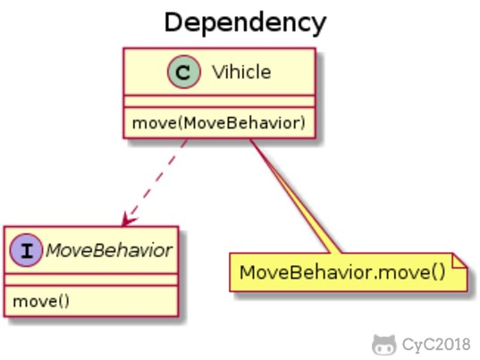 </div><br>

```text
@startuml

title Dependency

class Vihicle {
    move(MoveBehavior)
}

interface MoveBehavior {
    move()
}

note "MoveBehavior.move()" as N

Vihicle ..> MoveBehavior

Vihicle .. N

@enduml
```

### 三、设计原则

#### S.O.L.I.D

| 简写 | 全拼 | 中文翻译 |
| :--: | :--: | :--: |
| SRP | The Single Responsibility Principle    | 单一责任原则 |
| OCP | The Open Closed Principle              | 开放封闭原则 |
| LSP | The Liskov Substitution Principle      | 里氏替换原则 |
| ISP | The Interface Segregation Principle    | 接口分离原则 |
| DIP | The Dependency Inversion Principle     | 依赖倒置原则 |

##### 1. 单一责任原则

> 修改一个类的原因应该只有一个。

换句话说就是让一个类只负责一件事，当这个类需要做过多事情的时候，就需要分解这个类。

如果一个类承担的职责过多，就等于把这些职责耦合在了一起，一个职责的变化可能会削弱这个类完成其它职责的能力。

##### 2. 开放封闭原则

> 类应该对扩展开放，对修改关闭。

扩展就是添加新功能的意思，因此该原则要求在添加新功能时不需要修改代码。

符合开闭原则最典型的设计模式是装饰者模式，它可以动态地将责任附加到对象上，而不用去修改类的代码。

##### 3. 里氏替换原则

> 子类对象必须能够替换掉所有父类对象。

继承是一种 IS-A 关系，子类需要能够当成父类来使用，并且需要比父类更特殊。

如果不满足这个原则，那么各个子类的行为上就会有很大差异，增加继承体系的复杂度。

##### 4. 接口分离原则

> 不应该强迫客户依赖于它们不用的方法。

因此使用多个专门的接口比使用单一的总接口要好。

##### 5. 依赖倒置原则

> 高层模块不应该依赖于低层模块，二者都应该依赖于抽象；</br>抽象不应该依赖于细节，细节应该依赖于抽象。

高层模块包含一个应用程序中重要的策略选择和业务模块，如果高层模块依赖于低层模块，那么低层模块的改动就会直接影响到高层模块，从而迫使高层模块也需要改动。

依赖于抽象意味着：

- 任何变量都不应该持有一个指向具体类的指针或者引用；
- 任何类都不应该从具体类派生；
- 任何方法都不应该覆写它的任何基类中的已经实现的方法。

#### 其他常见原则

除了上述的经典原则，在实际开发中还有下面这些常见的设计原则。

| 简写    | 全拼    | 中文翻译 |
| :--: | :--: | :--: |
|LOD|    The Law of Demeter                   | 迪米特法则   |
|CRP|    The Composite Reuse Principle        | 合成复用原则 |
|CCP|    The Common Closure Principle         | 共同封闭原则 |
|SAP|    The Stable Abstractions Principle    | 稳定抽象原则 |
|SDP|    The Stable Dependencies Principle    | 稳定依赖原则 |

##### 1. 迪米特法则

迪米特法则又叫作最少知识原则（Least Knowledge Principle，简写 LKP），就是说一个对象应当对其他对象有尽可能少的了解，不和陌生人说话。

##### 2. 合成复用原则

尽量使用对象组合，而不是通过继承来达到复用的目的。

##### 3. 共同封闭原则

一起修改的类，应该组合在一起（同一个包里）。如果必须修改应用程序里的代码，我们希望所有的修改都发生在一个包里（修改关闭），而不是遍布在很多包里。

##### 4. 稳定抽象原则

最稳定的包应该是最抽象的包，不稳定的包应该是具体的包，即包的抽象程度跟它的稳定性成正比。

##### 5. 稳定依赖原则

包之间的依赖关系都应该是稳定方向依赖的，包要依赖的包要比自己更具有稳定性。

### 参考资料

- Java 编程思想
- 敏捷软件开发：原则、模式与实践
- [面向对象设计的 SOLID 原则](http://www.cnblogs.com/shanyou/archive/2009/09/21/1570716.html)
- [看懂 UML 类图和时序图](http://design-patterns.readthedocs.io/zh_CN/latest/read_uml.html#generalization)
- [UML 系列——时序图（顺序图）sequence diagram](http://www.cnblogs.com/wolf-sun/p/UML-Sequence-diagram.html)
- [面向对象编程三大特性 ------ 封装、继承、多态](http://blog.csdn.net/jianyuerensheng/article/details/51602015)


# 第 6 章 算法


## 第 6.1 节 剑指 Offer 题解


### 3. 数组中重复的数字

[NowCoder](https://www.nowcoder.com/practice/623a5ac0ea5b4e5f95552655361ae0a8?tpId=13&tqId=11203&tPage=1&rp=1&ru=/ta/coding-interviews&qru=/ta/coding-interviews/question-ranking)

#### 题目描述

在一个长度为 n 的数组里的所有数字都在 0 到 n-1 的范围内。数组中某些数字是重复的，但不知道有几个数字是重复的，也不知道每个数字重复几次。请找出数组中任意一个重复的数字。

```html
Input:
{2, 3, 1, 0, 2, 5}

Output:
2
```

#### 解题思路

要求时间复杂度 O(N)，空间复杂度 O(1)。因此不能使用排序的方法，也不能使用额外的标记数组。

对于这种数组元素在 [0, n-1] 范围内的问题，可以将值为 i 的元素调整到第 i 个位置上进行求解。

以 (2, 3, 1, 0, 2, 5) 为例，遍历到位置 4 时，该位置上的数为 2，但是第 2 个位置上已经有一个 2 的值了，因此可以知道 2 重复：

<div align="center">  </div><br>


```java
public boolean duplicate(int[] nums, int length, int[] duplication) {
    if (nums == null || length <= 0)
        return false;
    for (int i = 0; i < length; i++) {
        while (nums[i] != i) {
            if (nums[i] == nums[nums[i]]) {
                duplication[0] = nums[i];
                return true;
            }
            swap(nums, i, nums[i]);
        }
    }
    return false;
}

private void swap(int[] nums, int i, int j) {
    int t = nums[i];
    nums[i] = nums[j];
    nums[j] = t;
}
```

### 4. 二维数组中的查找

[NowCoder](https://www.nowcoder.com/practice/abc3fe2ce8e146608e868a70efebf62e?tpId=13&tqId=11154&tPage=1&rp=1&ru=/ta/coding-interviews&qru=/ta/coding-interviews/question-ranking)

#### 题目描述

给定一个二维数组，其每一行从左到右递增排序，从上到下也是递增排序。给定一个数，判断这个数是否在该二维数组中。

```html
Consider the following matrix:
[
  [1,   4,  7, 11, 15],
  [2,   5,  8, 12, 19],
  [3,   6,  9, 16, 22],
  [10, 13, 14, 17, 24],
  [18, 21, 23, 26, 30]
]

Given target = 5, return true.
Given target = 20, return false.
```

#### 解题思路

要求时间复杂度 O(M + N)，空间复杂度 O(1)。其中 M 为行数，N 为 列数。

该二维数组中的一个数，小于它的数一定在其左边，大于它的数一定在其下边。因此，从右上角开始查找，就可以根据 target 和当前元素的大小关系来缩小查找区间，当前元素的查找区间为左下角的所有元素。

<div align="center">  </div><br>

```java
public boolean Find(int target, int[][] matrix) {
    if (matrix == null || matrix.length == 0 || matrix[0].length == 0)
        return false;
    int rows = matrix.length, cols = matrix[0].length;
    int r = 0, c = cols - 1; // 从右上角开始
    while (r <= rows - 1 && c >= 0) {
        if (target == matrix[r][c])
            return true;
        else if (target > matrix[r][c])
            r++;
        else
            c--;
    }
    return false;
}
```

### 5. 替换空格

[NowCoder](https://www.nowcoder.com/practice/4060ac7e3e404ad1a894ef3e17650423?tpId=13&tqId=11155&tPage=1&rp=1&ru=/ta/coding-interviews&qru=/ta/coding-interviews/question-ranking)

#### 题目描述


将一个字符串中的空格替换成 "%20"。

```text
Input:
"A B"

Output:
"A%20B"
```

#### 解题思路

在字符串尾部填充任意字符，使得字符串的长度等于替换之后的长度。因为一个空格要替换成三个字符（%20），因此当遍历到一个空格时，需要在尾部填充两个任意字符。

令 P1 指向字符串原来的末尾位置，P2 指向字符串现在的末尾位置。P1 和 P2 从后向前遍历，当 P1 遍历到一个空格时，就需要令 P2 指向的位置依次填充 02%（注意是逆序的），否则就填充上 P1 指向字符的值。

从后向前遍是为了在改变 P2 所指向的内容时，不会影响到 P1 遍历原来字符串的内容。

<div align="center"> 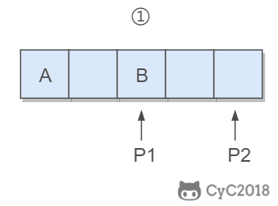 </div><br>

```java
public String replaceSpace(StringBuffer str) {
    int P1 = str.length() - 1;
    for (int i = 0; i <= P1; i++)
        if (str.charAt(i) == ' ')
            str.append("  ");

    int P2 = str.length() - 1;
    while (P1 >= 0 && P2 > P1) {
        char c = str.charAt(P1--);
        if (c == ' ') {
            str.setCharAt(P2--, '0');
            str.setCharAt(P2--, '2');
            str.setCharAt(P2--, '%');
        } else {
            str.setCharAt(P2--, c);
        }
    }
    return str.toString();
}
```

### 6. 从尾到头打印链表

[NowCoder](https://www.nowcoder.com/practice/d0267f7f55b3412ba93bd35cfa8e8035?tpId=13&tqId=11156&tPage=1&rp=1&ru=/ta/coding-interviews&qru=/ta/coding-interviews/question-ranking)

#### 题目描述

从尾到头反过来打印出每个结点的值。

<div align="center">  </div><br>

#### 解题思路

##### 使用递归

要逆序打印链表 1->2->3（3,2,1)，可以先逆序打印链表 2->3(3,2)，最后再打印第一个节点 1。而链表 2->3 可以看成一个新的链表，要逆序打印该链表可以继续使用求解函数，也就是在求解函数中调用自己，这就是递归函数。

```java
public ArrayList<Integer> printListFromTailToHead(ListNode listNode) {
    ArrayList<Integer> ret = new ArrayList<>();
    if (listNode != null) {
        ret.addAll(printListFromTailToHead(listNode.next));
        ret.add(listNode.val);
    }
    return ret;
}
```

##### 使用头插法

使用头插法可以得到一个逆序的链表。

头结点和第一个节点的区别：

- 头结点是在头插法中使用的一个额外节点，这个节点不存储值；
- 第一个节点就是链表的第一个真正存储值的节点。

<div align="center">  </div><br>

```java
public ArrayList<Integer> printListFromTailToHead(ListNode listNode) {
    // 头插法构建逆序链表
    ListNode head = new ListNode(-1);
    while (listNode != null) {
        ListNode memo = listNode.next;
        listNode.next = head.next;
        head.next = listNode;
        listNode = memo;
    }
    // 构建 ArrayList
    ArrayList<Integer> ret = new ArrayList<>();
    head = head.next;
    while (head != null) {
        ret.add(head.val);
        head = head.next;
    }
    return ret;
}
```

##### 使用栈

栈具有后进先出的特点，在遍历链表时将值按顺序放入栈中，最后出栈的顺序即为逆序。

<div align="center">  </div><br>

```java
public ArrayList<Integer> printListFromTailToHead(ListNode listNode) {
    Stack<Integer> stack = new Stack<>();
    while (listNode != null) {
        stack.add(listNode.val);
        listNode = listNode.next;
    }
    ArrayList<Integer> ret = new ArrayList<>();
    while (!stack.isEmpty())
        ret.add(stack.pop());
    return ret;
}
```

### 7. 重建二叉树

[NowCoder](https://www.nowcoder.com/practice/8a19cbe657394eeaac2f6ea9b0f6fcf6?tpId=13&tqId=11157&tPage=1&rp=1&ru=/ta/coding-interviews&qru=/ta/coding-interviews/question-ranking)

#### 题目描述

根据二叉树的前序遍历和中序遍历的结果，重建出该二叉树。假设输入的前序遍历和中序遍历的结果中都不含重复的数字。


<div align="center">  </div><br>

#### 解题思路

前序遍历的第一个值为根节点的值，使用这个值将中序遍历结果分成两部分，左部分为树的左子树中序遍历结果，右部分为树的右子树中序遍历的结果。

<div align="center">  </div><br>

```java
// 缓存中序遍历数组每个值对应的索引
private Map<Integer, Integer> indexForInOrders = new HashMap<>();

public TreeNode reConstructBinaryTree(int[] pre, int[] in) {
    for (int i = 0; i < in.length; i++)
        indexForInOrders.put(in[i], i);
    return reConstructBinaryTree(pre, 0, pre.length - 1, 0);
}

private TreeNode reConstructBinaryTree(int[] pre, int preL, int preR, int inL) {
    if (preL > preR)
        return null;
    TreeNode root = new TreeNode(pre[preL]);
    int inIndex = indexForInOrders.get(root.val);
    int leftTreeSize = inIndex - inL;
    root.left = reConstructBinaryTree(pre, preL + 1, preL + leftTreeSize, inL);
    root.right = reConstructBinaryTree(pre, preL + leftTreeSize + 1, preR, inL + leftTreeSize + 1);
    return root;
}
```

### 8. 二叉树的下一个结点

[NowCoder](https://www.nowcoder.com/practice/9023a0c988684a53960365b889ceaf5e?tpId=13&tqId=11210&tPage=1&rp=1&ru=/ta/coding-interviews&qru=/ta/coding-interviews/question-ranking)

#### 题目描述

给定一个二叉树和其中的一个结点，请找出中序遍历顺序的下一个结点并且返回。注意，树中的结点不仅包含左右子结点，同时包含指向父结点的指针。

```java
public class TreeLinkNode {

    int val;
    TreeLinkNode left = null;
    TreeLinkNode right = null;
    TreeLinkNode next = null;

    TreeLinkNode(int val) {
        this.val = val;
    }
}
```

#### 解题思路

① 如果一个节点的右子树不为空，那么该节点的下一个节点是右子树的最左节点；

<div align="center"> 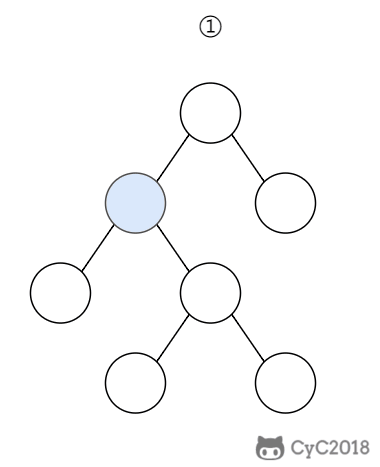 </div><br>

② 否则，向上找第一个左链接指向的树包含该节点的祖先节点。

<div align="center">  </div><br>

```java
public TreeLinkNode GetNext(TreeLinkNode pNode) {
    if (pNode.right != null) {
        TreeLinkNode node = pNode.right;
        while (node.left != null)
            node = node.left;
        return node;
    } else {
        while (pNode.next != null) {
            TreeLinkNode parent = pNode.next;
            if (parent.left == pNode)
                return parent;
            pNode = pNode.next;
        }
    }
    return null;
}
```

### 9. 用两个栈实现队列

[NowCoder](https://www.nowcoder.com/practice/54275ddae22f475981afa2244dd448c6?tpId=13&tqId=11158&tPage=1&rp=1&ru=/ta/coding-interviews&qru=/ta/coding-interviews/question-ranking)

#### 题目描述

用两个栈来实现一个队列，完成队列的 Push 和 Pop 操作。

#### 解题思路

in 栈用来处理入栈（push）操作，out 栈用来处理出栈（pop）操作。一个元素进入 in 栈之后，出栈的顺序被反转。当元素要出栈时，需要先进入 out 栈，此时元素出栈顺序再一次被反转，因此出栈顺序就和最开始入栈顺序是相同的，先进入的元素先退出，这就是队列的顺序。

<div align="center">  </div><br>

```java
Stack<Integer> in = new Stack<Integer>();
Stack<Integer> out = new Stack<Integer>();

public void push(int node) {
    in.push(node);
}

public int pop() throws Exception {
    if (out.isEmpty())
        while (!in.isEmpty())
            out.push(in.pop());

    if (out.isEmpty())
        throw new Exception("queue is empty");

    return out.pop();
}
```


### 10.1 斐波那契数列

[NowCoder](https://www.nowcoder.com/practice/c6c7742f5ba7442aada113136ddea0c3?tpId=13&tqId=11160&tPage=1&rp=1&ru=/ta/coding-interviews&qru=/ta/coding-interviews/question-ranking)

#### 题目描述

求斐波那契数列的第 n 项，n <= 39。

<!--<div align="center">1}\end{array}\right." class="mathjax-pic"/></div> <br> -->

<div align="center">  </div><br>

#### 解题思路

如果使用递归求解，会重复计算一些子问题。例如，计算 f(4) 需要计算 f(3) 和 f(2)，计算 f(3) 需要计算 f(2) 和 f(1)，可以看到 f(2) 被重复计算了。

<div align="center">  </div><br>

递归是将一个问题划分成多个子问题求解，动态规划也是如此，但是动态规划会把子问题的解缓存起来，从而避免重复求解子问题。

```java
public int Fibonacci(int n) {
    if (n <= 1)
        return n;
    int[] fib = new int[n + 1];
    fib[1] = 1;
    for (int i = 2; i <= n; i++)
        fib[i] = fib[i - 1] + fib[i - 2];
    return fib[n];
}
```

考虑到第 i 项只与第 i-1 和第 i-2 项有关，因此只需要存储前两项的值就能求解第 i 项，从而将空间复杂度由 O(N) 降低为 O(1)。

```java
public int Fibonacci(int n) {
    if (n <= 1)
        return n;
    int pre2 = 0, pre1 = 1;
    int fib = 0;
    for (int i = 2; i <= n; i++) {
        fib = pre2 + pre1;
        pre2 = pre1;
        pre1 = fib;
    }
    return fib;
}
```

由于待求解的 n 小于 40，因此可以将前 40 项的结果先进行计算，之后就能以 O(1) 时间复杂度得到第 n 项的值。

```java
public class Solution {

    private int[] fib = new int[40];

    public Solution() {
        fib[1] = 1;
        for (int i = 2; i < fib.length; i++)
            fib[i] = fib[i - 1] + fib[i - 2];
    }

    public int Fibonacci(int n) {
        return fib[n];
    }
}
```

### 10.2 矩形覆盖

[NowCoder](https://www.nowcoder.com/practice/72a5a919508a4251859fb2cfb987a0e6?tpId=13&tqId=11163&tPage=1&rp=1&ru=/ta/coding-interviews&qru=/ta/coding-interviews/question-ranking)

#### 题目描述

我们可以用 2\*1 的小矩形横着或者竖着去覆盖更大的矩形。请问用 n 个 2\*1 的小矩形无重叠地覆盖一个 2\*n 的大矩形，总共有多少种方法？

<div align="center"> 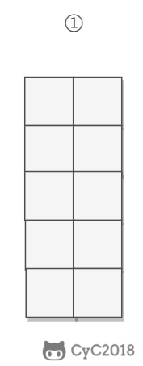 </div><br>

#### 解题思路

当 n 为 1 时，只有一种覆盖方法：

<div align="center"> 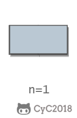 </div><br>

当 n 为 2 时，有两种覆盖方法：

<div align="center"> 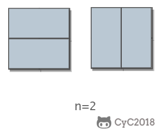 </div><br>

要覆盖 2\*n 的大矩形，可以先覆盖 2\*1 的矩形，再覆盖 2\*(n-1) 的矩形；或者先覆盖 2\*2 的矩形，再覆盖 2\*(n-2) 的矩形。而覆盖 2\*(n-1) 和 2\*(n-2) 的矩形可以看成子问题。该问题的递推公式如下：

<!-- <div align="center">1}\end{array}\right." class="mathjax-pic"/></div> <br> -->

<div align="center">  </div><br>

```java
public int RectCover(int n) {
    if (n <= 2)
        return n;
    int pre2 = 1, pre1 = 2;
    int result = 0;
    for (int i = 3; i <= n; i++) {
        result = pre2 + pre1;
        pre2 = pre1;
        pre1 = result;
    }
    return result;
}
```

### 10.3 跳台阶

[NowCoder](https://www.nowcoder.com/practice/8c82a5b80378478f9484d87d1c5f12a4?tpId=13&tqId=11161&tPage=1&rp=1&ru=/ta/coding-interviews&qru=/ta/coding-interviews/question-ranking)

#### 题目描述

一只青蛙一次可以跳上 1 级台阶，也可以跳上 2 级。求该青蛙跳上一个 n 级的台阶总共有多少种跳法。

<div align="center"> 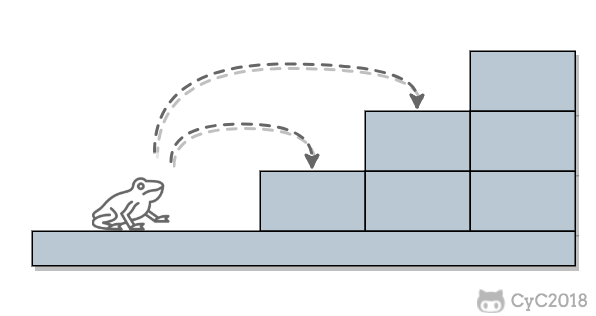 </div><br>

#### 解题思路

当 n = 1 时，只有一种跳法：

<div align="center">  </div><br>

当 n = 2 时，有两种跳法：

<div align="center">  </div><br>

跳 n 阶台阶，可以先跳 1 阶台阶，再跳 n-1 阶台阶；或者先跳 2 阶台阶，再跳 n-2 阶台阶。而 n-1 和 n-2 阶台阶的跳法可以看成子问题，该问题的递推公式为：

<div align="center">  </div><br>

```java
public int JumpFloor(int n) {
    if (n <= 2)
        return n;
    int pre2 = 1, pre1 = 2;
    int result = 1;
    for (int i = 2; i < n; i++) {
        result = pre2 + pre1;
        pre2 = pre1;
        pre1 = result;
    }
    return result;
}
```

### 10.4 变态跳台阶

[NowCoder](https://www.nowcoder.com/practice/22243d016f6b47f2a6928b4313c85387?tpId=13&tqId=11162&tPage=1&rp=1&ru=/ta/coding-interviews&qru=/ta/coding-interviews/question-ranking)

#### 题目描述

一只青蛙一次可以跳上 1 级台阶，也可以跳上 2 级... 它也可以跳上 n 级。求该青蛙跳上一个 n 级的台阶总共有多少种跳法。

<div align="center">  </div><br>

#### 解题思路

##### 动态规划

```java
public int JumpFloorII(int target) {
    int[] dp = new int[target];
    Arrays.fill(dp, 1);
    for (int i = 1; i < target; i++)
        for (int j = 0; j < i; j++)
            dp[i] += dp[j];
    return dp[target - 1];
}
```

##### 数学推导

跳上 n-1 级台阶，可以从 n-2 级跳 1 级上去，也可以从 n-3 级跳 2 级上去...，那么

```
f(n-1) = f(n-2) + f(n-3) + ... + f(0)
```

同样，跳上 n 级台阶，可以从 n-1 级跳 1 级上去，也可以从 n-2 级跳 2 级上去... ，那么

```
f(n) = f(n-1) + f(n-2) + ... + f(0)
```

综上可得

```
f(n) - f(n-1) = f(n-1)
```

即

```
f(n) = 2*f(n-1)
```

所以 f(n) 是一个等比数列

```source-java
public int JumpFloorII(int target) {
    return (int) Math.pow(2, target - 1);
}
```


### 11. 旋转数组的最小数字

[NowCoder](https://www.nowcoder.com/practice/9f3231a991af4f55b95579b44b7a01ba?tpId=13&tqId=11159&tPage=1&rp=1&ru=/ta/coding-interviews&qru=/ta/coding-interviews/question-ranking)

#### 题目描述

把一个数组最开始的若干个元素搬到数组的末尾，我们称之为数组的旋转。输入一个非递减排序的数组的一个旋转，输出旋转数组的最小元素。

<div align="center">  </div><br>

#### 解题思路

将旋转数组对半分可以得到一个包含最小元素的新旋转数组，以及一个非递减排序的数组。新的旋转数组的数组元素是原数组的一半，从而将问题规模减少了一半，这种折半性质的算法的时间复杂度为 O(logN)（为了方便，这里将 log<sub>2</sub>N 写为 logN）。

<div align="center">  </div><br>

此时问题的关键在于确定对半分得到的两个数组哪一个是旋转数组，哪一个是非递减数组。我们很容易知道非递减数组的第一个元素一定小于等于最后一个元素。

通过修改二分查找算法进行求解（l 代表 low，m 代表 mid，h 代表 high）：

- 当 nums[m] <= nums[h] 时，表示 [m, h] 区间内的数组是非递减数组，[l, m] 区间内的数组是旋转数组，此时令 h = m；
- 否则 [m + 1, h] 区间内的数组是旋转数组，令 l = m + 1。

```java
public int minNumberInRotateArray(int[] nums) {
    if (nums.length == 0)
        return 0;
    int l = 0, h = nums.length - 1;
    while (l < h) {
        int m = l + (h - l) / 2;
        if (nums[m] <= nums[h])
            h = m;
        else
            l = m + 1;
    }
    return nums[l];
}
```

如果数组元素允许重复，会出现一个特殊的情况：nums[l] == nums[m] == nums[h]，此时无法确定解在哪个区间，需要切换到顺序查找。例如对于数组 {1,1,1,0,1}，l、m 和 h 指向的数都为 1，此时无法知道最小数字 0 在哪个区间。

```java
public int minNumberInRotateArray(int[] nums) {
    if (nums.length == 0)
        return 0;
    int l = 0, h = nums.length - 1;
    while (l < h) {
        int m = l + (h - l) / 2;
        if (nums[l] == nums[m] && nums[m] == nums[h])
            return minNumber(nums, l, h);
        else if (nums[m] <= nums[h])
            h = m;
        else
            l = m + 1;
    }
    return nums[l];
}

private int minNumber(int[] nums, int l, int h) {
    for (int i = l; i < h; i++)
        if (nums[i] > nums[i + 1])
            return nums[i + 1];
    return nums[l];
}
```

### 12. 矩阵中的路径

[NowCoder](https://www.nowcoder.com/practice/c61c6999eecb4b8f88a98f66b273a3cc?tpId=13&tqId=11218&tPage=1&rp=1&ru=/ta/coding-interviews&qru=/ta/coding-interviews/question-ranking)

#### 题目描述

判断在一个矩阵中是否存在一条包含某字符串所有字符的路径。路径可以从矩阵中的任意一个格子开始，每一步可以在矩阵中向上下左右移动一个格子。如果一条路径经过了矩阵中的某一个格子，则该路径不能再进入该格子。

例如下面的矩阵包含了一条 bfce 路径。

<div align="center">  </div><br>

#### 解题思路

使用回溯法（backtracking）进行求解，它是一种暴力搜索方法，通过搜索所有可能的结果来求解问题。回溯法在一次搜索结束时需要进行回溯（回退），将这一次搜索过程中设置的状态进行清除，从而开始一次新的搜索过程。例如下图示例中，从 f 开始，下一步有 4 种搜索可能，如果先搜索 b，需要将 b 标记为已经使用，防止重复使用。在这一次搜索结束之后，需要将 b 的已经使用状态清除，并搜索 c。

<div align="center">  </div><br>

本题的输入是数组而不是矩阵（二维数组），因此需要先将数组转换成矩阵。

```java
private final static int[][] next = {{0, -1}, {0, 1}, {-1, 0}, {1, 0}};
private int rows;
private int cols;

public boolean hasPath(char[] array, int rows, int cols, char[] str) {
    if (rows == 0 || cols == 0) return false;
    this.rows = rows;
    this.cols = cols;
    boolean[][] marked = new boolean[rows][cols];
    char[][] matrix = buildMatrix(array);
    for (int i = 0; i < rows; i++)
        for (int j = 0; j < cols; j++)
            if (backtracking(matrix, str, marked, 0, i, j))
                return true;

    return false;
}

private boolean backtracking(char[][] matrix, char[] str,
                             boolean[][] marked, int pathLen, int r, int c) {

    if (pathLen == str.length) return true;
    if (r < 0 || r >= rows || c < 0 || c >= cols
            || matrix[r][c] != str[pathLen] || marked[r][c]) {

        return false;
    }
    marked[r][c] = true;
    for (int[] n : next)
        if (backtracking(matrix, str, marked, pathLen + 1, r + n[0], c + n[1]))
            return true;
    marked[r][c] = false;
    return false;
}

private char[][] buildMatrix(char[] array) {
    char[][] matrix = new char[rows][cols];
    for (int r = 0, idx = 0; r < rows; r++)
        for (int c = 0; c < cols; c++)
            matrix[r][c] = array[idx++];
    return matrix;
}
```

### 13. 机器人的运动范围

[NowCoder](https://www.nowcoder.com/practice/6e5207314b5241fb83f2329e89fdecc8?tpId=13&tqId=11219&tPage=1&rp=1&ru=/ta/coding-interviews&qru=/ta/coding-interviews/question-ranking)

#### 题目描述

地上有一个 m 行和 n 列的方格。一个机器人从坐标 (0, 0) 的格子开始移动，每一次只能向左右上下四个方向移动一格，但是不能进入行坐标和列坐标的数位之和大于 k 的格子。

例如，当 k 为 18 时，机器人能够进入方格 (35,37)，因为 3+5+3+7=18。但是，它不能进入方格 (35,38)，因为 3+5+3+8=19。请问该机器人能够达到多少个格子？

#### 解题思路

使用深度优先搜索（Depth First Search，DFS）方法进行求解。回溯是深度优先搜索的一种特例，它在一次搜索过程中需要设置一些本次搜索过程的局部状态，并在本次搜索结束之后清除状态。而普通的深度优先搜索并不需要使用这些局部状态，虽然还是有可能设置一些全局状态。

```java
private static final int[][] next = {{0, -1}, {0, 1}, {-1, 0}, {1, 0}};
private int cnt = 0;
private int rows;
private int cols;
private int threshold;
private int[][] digitSum;

public int movingCount(int threshold, int rows, int cols) {
    this.rows = rows;
    this.cols = cols;
    this.threshold = threshold;
    initDigitSum();
    boolean[][] marked = new boolean[rows][cols];
    dfs(marked, 0, 0);
    return cnt;
}

private void dfs(boolean[][] marked, int r, int c) {
    if (r < 0 || r >= rows || c < 0 || c >= cols || marked[r][c])
        return;
    marked[r][c] = true;
    if (this.digitSum[r][c] > this.threshold)
        return;
    cnt++;
    for (int[] n : next)
        dfs(marked, r + n[0], c + n[1]);
}

private void initDigitSum() {
    int[] digitSumOne = new int[Math.max(rows, cols)];
    for (int i = 0; i < digitSumOne.length; i++) {
        int n = i;
        while (n > 0) {
            digitSumOne[i] += n % 10;
            n /= 10;
        }
    }
    this.digitSum = new int[rows][cols];
    for (int i = 0; i < this.rows; i++)
        for (int j = 0; j < this.cols; j++)
            this.digitSum[i][j] = digitSumOne[i] + digitSumOne[j];
}
```

### 14. 剪绳子

[Leetcode](https://leetcode.com/problems/integer-break/description/)

#### 题目描述

把一根绳子剪成多段，并且使得每段的长度乘积最大。

```html
n = 2
return 1 (2 = 1 + 1)

n = 10
return 36 (10 = 3 + 3 + 4)
```

#### 解题思路

##### 贪心

尽可能多剪长度为 3 的绳子，并且不允许有长度为 1 的绳子出现。如果出现了，就从已经切好长度为 3 的绳子中拿出一段与长度为 1 的绳子重新组合，把它们切成两段长度为 2 的绳子。

证明：当 n >= 5 时，3(n - 3) - n = 2n - 9 > 0，且 2(n - 2) - n = n - 4 > 0。因此在 n >= 5 的情况下，将绳子剪成一段为 2 或者 3，得到的乘积会更大。又因为 3(n - 3) - 2(n - 2) = n - 5 >= 0，所以剪成一段长度为 3 比长度为 2 得到的乘积更大。

```java
public int integerBreak(int n) {
    if (n < 2)
        return 0;
    if (n == 2)
        return 1;
    if (n == 3)
        return 2;
    int timesOf3 = n / 3;
    if (n - timesOf3 * 3 == 1)
        timesOf3--;
    int timesOf2 = (n - timesOf3 * 3) / 2;
    return (int) (Math.pow(3, timesOf3)) * (int) (Math.pow(2, timesOf2));
}
```

##### 动态规划

```java
public int integerBreak(int n) {
    int[] dp = new int[n + 1];
    dp[1] = 1;
    for (int i = 2; i <= n; i++)
        for (int j = 1; j < i; j++)
            dp[i] = Math.max(dp[i], Math.max(j * (i - j), dp[j] * (i - j)));
    return dp[n];
}
```

### 15. 二进制中 1 的个数

[NowCoder](https://www.nowcoder.com/practice/8ee967e43c2c4ec193b040ea7fbb10b8?tpId=13&tqId=11164&tPage=1&rp=1&ru=/ta/coding-interviews&qru=/ta/coding-interviews/question-ranking)

#### 题目描述

输入一个整数，输出该数二进制表示中 1 的个数。

##### n&(n-1)

该位运算去除 n 的位级表示中最低的那一位。

```
n       : 10110100
n-1     : 10110011
n&(n-1) : 10110000
```

时间复杂度：O(M)，其中 M 表示 1 的个数。


```java
public int NumberOf1(int n) {
    int cnt = 0;
    while (n != 0) {
        cnt++;
        n &= (n - 1);
    }
    return cnt;
}
```


##### Integer.bitCount()

```java
public int NumberOf1(int n) {
    return Integer.bitCount(n);
}
```

### 16. 数值的整数次方

[NowCoder](https://www.nowcoder.com/practice/1a834e5e3e1a4b7ba251417554e07c00?tpId=13&tqId=11165&tPage=1&rp=1&ru=/ta/coding-interviews&qru=/ta/coding-interviews/question-ranking)

#### 题目描述

给定一个 double 类型的浮点数 base 和 int 类型的整数 exponent，求 base 的 exponent 次方。

#### 解题思路

下面的讨论中 x 代表 base，n 代表 exponent。

<!--<div align="center"></div> <br>-->

<div align="center">  </div><br>


因为 (x\*x)<sup>n/2</sup> 可以通过递归求解，并且每次递归 n 都减小一半，因此整个算法的时间复杂度为 O(logN)。

```java
public double Power(double base, int exponent) {
    if (exponent == 0)
        return 1;
    if (exponent == 1)
        return base;
    boolean isNegative = false;
    if (exponent < 0) {
        exponent = -exponent;
        isNegative = true;
    }
    double pow = Power(base * base, exponent / 2);
    if (exponent % 2 != 0)
        pow = pow * base;
    return isNegative ? 1 / pow : pow;
}
```

### 17. 打印从 1 到最大的 n 位数

#### 题目描述

输入数字 n，按顺序打印出从 1 到最大的 n 位十进制数。比如输入 3，则打印出 1、2、3 一直到最大的 3 位数即 999。

#### 解题思路

由于 n 可能会非常大，因此不能直接用 int 表示数字，而是用 char 数组进行存储。

使用回溯法得到所有的数。

```java
public void print1ToMaxOfNDigits(int n) {
    if (n <= 0)
        return;
    char[] number = new char[n];
    print1ToMaxOfNDigits(number, 0);
}

private void print1ToMaxOfNDigits(char[] number, int digit) {
    if (digit == number.length) {
        printNumber(number);
        return;
    }
    for (int i = 0; i < 10; i++) {
        number[digit] = (char) (i + '0');
        print1ToMaxOfNDigits(number, digit + 1);
    }
}

private void printNumber(char[] number) {
    int index = 0;
    while (index < number.length && number[index] == '0')
        index++;
    while (index < number.length)
        System.out.print(number[index++]);
    System.out.println();
}
```

### 18.1 在 O(1) 时间内删除链表节点

#### 解题思路

① 如果该节点不是尾节点，那么可以直接将下一个节点的值赋给该节点，然后令该节点指向下下个节点，再删除下一个节点，时间复杂度为 O(1)。

<div align="center">  </div><br>

② 否则，就需要先遍历链表，找到节点的前一个节点，然后让前一个节点指向 null，时间复杂度为 O(N)。

<div align="center">  </div><br>

综上，如果进行 N 次操作，那么大约需要操作节点的次数为 N-1+N=2N-1，其中 N-1 表示 N-1 个不是尾节点的每个节点以 O(1) 的时间复杂度操作节点的总次数，N 表示 1 个尾节点以 O(N) 的时间复杂度操作节点的总次数。(2N-1)/N \~ 2，因此该算法的平均时间复杂度为 O(1)。

```java
public ListNode deleteNode(ListNode head, ListNode tobeDelete) {
    if (head == null || tobeDelete == null)
        return null;
    if (tobeDelete.next != null) {
        // 要删除的节点不是尾节点
        ListNode next = tobeDelete.next;
        tobeDelete.val = next.val;
        tobeDelete.next = next.next;
    } else {
        if (head == tobeDelete)
             // 只有一个节点
            head = null;
        else {
            ListNode cur = head;
            while (cur.next != tobeDelete)
                cur = cur.next;
            cur.next = null;
        }
    }
    return head;
}
```

### 18.2 删除链表中重复的结点

[NowCoder](https://www.nowcoder.com/practice/fc533c45b73a41b0b44ccba763f866ef?tpId=13&tqId=11209&tPage=1&rp=1&ru=/ta/coding-interviews&qru=/ta/coding-interviews/question-ranking)

#### 题目描述

<div align="center">  </div><br>

#### 解题描述

```java
public ListNode deleteDuplication(ListNode pHead) {
    if (pHead == null || pHead.next == null)
        return pHead;
    ListNode next = pHead.next;
    if (pHead.val == next.val) {
        while (next != null && pHead.val == next.val)
            next = next.next;
        return deleteDuplication(next);
    } else {
        pHead.next = deleteDuplication(pHead.next);
        return pHead;
    }
}
```

### 19. 正则表达式匹配

[NowCoder](https://www.nowcoder.com/practice/45327ae22b7b413ea21df13ee7d6429c?tpId=13&tqId=11205&tPage=1&rp=1&ru=/ta/coding-interviews&qru=/ta/coding-interviews/question-ranking)

#### 题目描述

请实现一个函数用来匹配包括 '.' 和 '\*' 的正则表达式。模式中的字符 '.' 表示任意一个字符，而 '\*' 表示它前面的字符可以出现任意次（包含 0 次）。

在本题中，匹配是指字符串的所有字符匹配整个模式。例如，字符串 "aaa" 与模式 "a.a" 和 "ab\*ac\*a" 匹配，但是与 "aa.a" 和 "ab\*a" 均不匹配。

#### 解题思路

应该注意到，'.' 是用来当做一个任意字符，而 '\*' 是用来重复前面的字符。这两个的作用不同，不能把 '.' 的作用和 '\*' 进行类比，从而把它当成重复前面字符一次。

```java
public boolean match(char[] str, char[] pattern) {

    int m = str.length, n = pattern.length;
    boolean[][] dp = new boolean[m + 1][n + 1];

    dp[0][0] = true;
    for (int i = 1; i <= n; i++)
        if (pattern[i - 1] == '*')
            dp[0][i] = dp[0][i - 2];

    for (int i = 1; i <= m; i++)
        for (int j = 1; j <= n; j++)
            if (str[i - 1] == pattern[j - 1] || pattern[j - 1] == '.')
                dp[i][j] = dp[i - 1][j - 1];
            else if (pattern[j - 1] == '*')
                if (pattern[j - 2] == str[i - 1] || pattern[j - 2] == '.') {
                    dp[i][j] |= dp[i][j - 1]; // a* counts as single a
                    dp[i][j] |= dp[i - 1][j]; // a* counts as multiple a
                    dp[i][j] |= dp[i][j - 2]; // a* counts as empty
                } else
                    dp[i][j] = dp[i][j - 2];   // a* only counts as empty

    return dp[m][n];
}
```


### 20. 表示数值的字符串

[NowCoder](https://www.nowcoder.com/practice/6f8c901d091949a5837e24bb82a731f2?tpId=13&tqId=11206&tPage=1&rp=1&ru=/ta/coding-interviews&qru=/ta/coding-interviews/question-ranking)

#### 题目描述

```
true

"+100"
"5e2"
"-123"
"3.1416"
"-1E-16"
```

```
false

"12e"
"1a3.14"
"1.2.3"
"+-5"
"12e+4.3"
```


#### 解题思路

使用正则表达式进行匹配。

```html
[]  ： 字符集合
()  ： 分组
?   ： 重复 0 ~ 1 次
+   ： 重复 1 ~ n 次
*   ： 重复 0 ~ n 次
.   ： 任意字符
\\. ： 转义后的 .
\\d ： 数字
```

```java
public boolean isNumeric(char[] str) {
    if (str == null || str.length == 0)
        return false;
    return new String(str).matches("[+-]?\\d*(\\.\\d+)?([eE][+-]?\\d+)?");
}
```

### 21. 调整数组顺序使奇数位于偶数前面

[NowCoder](https://www.nowcoder.com/practice/beb5aa231adc45b2a5dcc5b62c93f593?tpId=13&tqId=11166&tPage=1&rp=1&ru=/ta/coding-interviews&qru=/ta/coding-interviews/question-ranking)

#### 题目描述

需要保证奇数和奇数，偶数和偶数之间的相对位置不变，这和书本不太一样。

<div align="center">  </div><br>

#### 解题思路

方法一：创建一个新数组，时间复杂度 O(N)，空间复杂度 O(N)。

```java
public void reOrderArray(int[] nums) {
    // 奇数个数
    int oddCnt = 0;
    for (int x : nums)
        if (!isEven(x))
            oddCnt++;
    int[] copy = nums.clone();
    int i = 0, j = oddCnt;
    for (int num : copy) {
        if (num % 2 == 1)
            nums[i++] = num;
        else
            nums[j++] = num;
    }
}

private boolean isEven(int x) {
    return x % 2 == 0;
}
```

方法二：使用冒泡思想，每次都当前偶数上浮到当前最右边。时间复杂度 O(N<sup>2</sup>)，空间复杂度 O(1)，时间换空间。

```java
public void reOrderArray(int[] nums) {
    int N = nums.length;
    for (int i = N - 1; i > 0; i--) {
        for (int j = 0; j < i; j++) {
            if (isEven(nums[j]) && !isEven(nums[j + 1])) {
                swap(nums, j, j + 1);
            }
        }
    }
}

private boolean isEven(int x) {
    return x % 2 == 0;
}

private void swap(int[] nums, int i, int j) {
    int t = nums[i];
    nums[i] = nums[j];
    nums[j] = t;
}
```

### 22. 链表中倒数第 K 个结点

[NowCoder](https://www.nowcoder.com/practice/529d3ae5a407492994ad2a246518148a?tpId=13&tqId=11167&tPage=1&rp=1&ru=/ta/coding-interviews&qru=/ta/coding-interviews/question-ranking)

#### 解题思路

设链表的长度为 N。设置两个指针 P1 和 P2，先让 P1 移动 K 个节点，则还有 N - K 个节点可以移动。此时让 P1 和 P2 同时移动，可以知道当 P1 移动到链表结尾时，P2 移动到第 N - K 个节点处，该位置就是倒数第 K 个节点。

<div align="center">  </div><br>

```java
public ListNode FindKthToTail(ListNode head, int k) {
    if (head == null)
        return null;
    ListNode P1 = head;
    while (P1 != null && k-- > 0)
        P1 = P1.next;
    if (k > 0)
        return null;
    ListNode P2 = head;
    while (P1 != null) {
        P1 = P1.next;
        P2 = P2.next;
    }
    return P2;
}
```

### 23. 链表中环的入口结点

[NowCoder](https://www.nowcoder.com/practice/253d2c59ec3e4bc68da16833f79a38e4?tpId=13&tqId=11208&tPage=1&rp=1&ru=/ta/coding-interviews&qru=/ta/coding-interviews/question-ranking)

#### 题目描述

一个链表中包含环，请找出该链表的环的入口结点。要求不能使用额外的空间。

#### 解题思路

使用双指针，一个指针 fast 每次移动两个节点，一个指针 slow 每次移动一个节点。因为存在环，所以两个指针必定相遇在环中的某个节点上。假设相遇点在下图的 z1 位置，此时 fast 移动的节点数为 x+2y+z，slow 为 x+y，由于 fast 速度比 slow 快一倍，因此 x+2y+z=2(x+y)，得到 x=z。

在相遇点，slow 要到环的入口点还需要移动 z 个节点，如果让 fast 重新从头开始移动，并且速度变为每次移动一个节点，那么它到环入口点还需要移动 x 个节点。在上面已经推导出 x=z，因此 fast 和 slow 将在环入口点相遇。

<div align="center"> 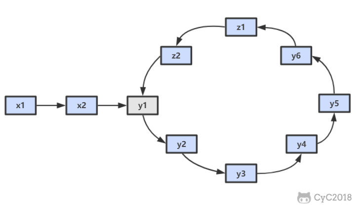 </div><br>

```java
public ListNode EntryNodeOfLoop(ListNode pHead) {
    if (pHead == null || pHead.next == null)
        return null;
    ListNode slow = pHead, fast = pHead;
    do {
        fast = fast.next.next;
        slow = slow.next;
    } while (slow != fast);
    fast = pHead;
    while (slow != fast) {
        slow = slow.next;
        fast = fast.next;
    }
    return slow;
}
```

### 24. 反转链表

[NowCoder](https://www.nowcoder.com/practice/75e878df47f24fdc9dc3e400ec6058ca?tpId=13&tqId=11168&tPage=1&rp=1&ru=/ta/coding-interviews&qru=/ta/coding-interviews/question-ranking)

#### 解题思路

##### 递归

```java
public ListNode ReverseList(ListNode head) {
    if (head == null || head.next == null)
        return head;
    ListNode next = head.next;
    head.next = null;
    ListNode newHead = ReverseList(next);
    next.next = head;
    return newHead;
}
```

##### 迭代

使用头插法。

```java
public ListNode ReverseList(ListNode head) {
    ListNode newList = new ListNode(-1);
    while (head != null) {
        ListNode next = head.next;
        head.next = newList.next;
        newList.next = head;
        head = next;
    }
    return newList.next;
}
```

### 25. 合并两个排序的链表

[NowCoder](https://www.nowcoder.com/practice/d8b6b4358f774294a89de2a6ac4d9337?tpId=13&tqId=11169&tPage=1&rp=1&ru=/ta/coding-interviews&qru=/ta/coding-interviews/question-ranking)

#### 题目描述

<div align="center"> 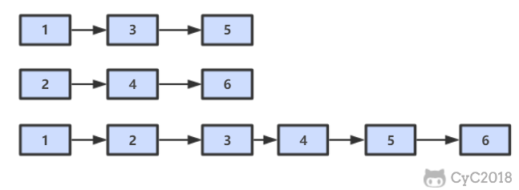 </div><br>

#### 解题思路

##### 递归

```java
public ListNode Merge(ListNode list1, ListNode list2) {
    if (list1 == null)
        return list2;
    if (list2 == null)
        return list1;
    if (list1.val <= list2.val) {
        list1.next = Merge(list1.next, list2);
        return list1;
    } else {
        list2.next = Merge(list1, list2.next);
        return list2;
    }
}
```

##### 迭代

```java
public ListNode Merge(ListNode list1, ListNode list2) {
    ListNode head = new ListNode(-1);
    ListNode cur = head;
    while (list1 != null && list2 != null) {
        if (list1.val <= list2.val) {
            cur.next = list1;
            list1 = list1.next;
        } else {
            cur.next = list2;
            list2 = list2.next;
        }
        cur = cur.next;
    }
    if (list1 != null)
        cur.next = list1;
    if (list2 != null)
        cur.next = list2;
    return head.next;
}
```

### 26. 树的子结构

[NowCoder](https://www.nowcoder.com/practice/6e196c44c7004d15b1610b9afca8bd88?tpId=13&tqId=11170&tPage=1&rp=1&ru=/ta/coding-interviews&qru=/ta/coding-interviews/question-ranking)

#### 题目描述

<div align="center">  </div><br>

#### 解题思路

```java
public boolean HasSubtree(TreeNode root1, TreeNode root2) {
    if (root1 == null || root2 == null)
        return false;
    return isSubtreeWithRoot(root1, root2) || HasSubtree(root1.left, root2) || HasSubtree(root1.right, root2);
}

private boolean isSubtreeWithRoot(TreeNode root1, TreeNode root2) {
    if (root2 == null)
        return true;
    if (root1 == null)
        return false;
    if (root1.val != root2.val)
        return false;
    return isSubtreeWithRoot(root1.left, root2.left) && isSubtreeWithRoot(root1.right, root2.right);
}
```

### 27. 二叉树的镜像

[NowCoder](https://www.nowcoder.com/practice/564f4c26aa584921bc75623e48ca3011?tpId=13&tqId=11171&tPage=1&rp=1&ru=/ta/coding-interviews&qru=/ta/coding-interviews/question-ranking)

#### 题目描述

<div align="center"> 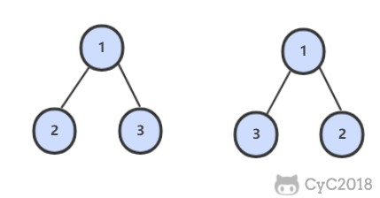 </div><br>

#### 解题思路

```java
public void Mirror(TreeNode root) {
    if (root == null)
        return;
    swap(root);
    Mirror(root.left);
    Mirror(root.right);
}

private void swap(TreeNode root) {
    TreeNode t = root.left;
    root.left = root.right;
    root.right = t;
}
```

### 28 对称的二叉树

[NowCoder](https://www.nowcoder.com/practice/ff05d44dfdb04e1d83bdbdab320efbcb?tpId=13&tqId=11211&tPage=1&rp=1&ru=/ta/coding-interviews&qru=/ta/coding-interviews/question-ranking)

#### 题目描述

<div align="center">  </div><br>

#### 解题思路

```java
boolean isSymmetrical(TreeNode pRoot) {
    if (pRoot == null)
        return true;
    return isSymmetrical(pRoot.left, pRoot.right);
}

boolean isSymmetrical(TreeNode t1, TreeNode t2) {
    if (t1 == null && t2 == null)
        return true;
    if (t1 == null || t2 == null)
        return false;
    if (t1.val != t2.val)
        return false;
    return isSymmetrical(t1.left, t2.right) && isSymmetrical(t1.right, t2.left);
}
```

### 29. 顺时针打印矩阵

[NowCoder](https://www.nowcoder.com/practice/9b4c81a02cd34f76be2659fa0d54342a?tpId=13&tqId=11172&tPage=1&rp=1&ru=/ta/coding-interviews&qru=/ta/coding-interviews/question-ranking)

#### 题目描述

下图的矩阵顺时针打印结果为：1, 2, 3, 4, 8, 12, 16, 15, 14, 13, 9, 5, 6, 7, 11, 10

<div align="center">  </div><br>

#### 解题思路

```java
public ArrayList<Integer> printMatrix(int[][] matrix) {
    ArrayList<Integer> ret = new ArrayList<>();
    int r1 = 0, r2 = matrix.length - 1, c1 = 0, c2 = matrix[0].length - 1;
    while (r1 <= r2 && c1 <= c2) {
        for (int i = c1; i <= c2; i++)
            ret.add(matrix[r1][i]);
        for (int i = r1 + 1; i <= r2; i++)
            ret.add(matrix[i][c2]);
        if (r1 != r2)
            for (int i = c2 - 1; i >= c1; i--)
                ret.add(matrix[r2][i]);
        if (c1 != c2)
            for (int i = r2 - 1; i > r1; i--)
                ret.add(matrix[i][c1]);
        r1++; r2--; c1++; c2--;
    }
    return ret;
}
```


### 30. 包含 min 函数的栈

[NowCoder](https://www.nowcoder.com/practice/4c776177d2c04c2494f2555c9fcc1e49?tpId=13&tqId=11173&tPage=1&rp=1&ru=/ta/coding-interviews&qru=/ta/coding-interviews/question-ranking)

#### 题目描述

定义栈的数据结构，请在该类型中实现一个能够得到栈最小元素的 min 函数。

#### 解题思路

```java
private Stack<Integer> dataStack = new Stack<>();
private Stack<Integer> minStack = new Stack<>();

public void push(int node) {
    dataStack.push(node);
    minStack.push(minStack.isEmpty() ? node : Math.min(minStack.peek(), node));
}

public void pop() {
    dataStack.pop();
    minStack.pop();
}

public int top() {
    return dataStack.peek();
}

public int min() {
    return minStack.peek();
}
```

### 31. 栈的压入、弹出序列

[NowCoder](https://www.nowcoder.com/practice/d77d11405cc7470d82554cb392585106?tpId=13&tqId=11174&tPage=1&rp=1&ru=/ta/coding-interviews&qru=/ta/coding-interviews/question-ranking)

#### 题目描述

输入两个整数序列，第一个序列表示栈的压入顺序，请判断第二个序列是否为该栈的弹出顺序。假设压入栈的所有数字均不相等。

例如序列 1,2,3,4,5 是某栈的压入顺序，序列 4,5,3,2,1 是该压栈序列对应的一个弹出序列，但 4,3,5,1,2 就不可能是该压栈序列的弹出序列。

#### 解题思路

使用一个栈来模拟压入弹出操作。

```java
public boolean IsPopOrder(int[] pushSequence, int[] popSequence) {
    int n = pushSequence.length;
    Stack<Integer> stack = new Stack<>();
    for (int pushIndex = 0, popIndex = 0; pushIndex < n; pushIndex++) {
        stack.push(pushSequence[pushIndex]);
        while (popIndex < n && !stack.isEmpty() 
                && stack.peek() == popSequence[popIndex]) {
            stack.pop();
            popIndex++;
        }
    }
    return stack.isEmpty();
}
```

### 32.1 从上往下打印二叉树

[NowCoder](https://www.nowcoder.com/practice/7fe2212963db4790b57431d9ed259701?tpId=13&tqId=11175&tPage=1&rp=1&ru=/ta/coding-interviews&qru=/ta/coding-interviews/question-ranking)

#### 题目描述

从上往下打印出二叉树的每个节点，同层节点从左至右打印。

例如，以下二叉树层次遍历的结果为：1,2,3,4,5,6,7

<div align="center"> 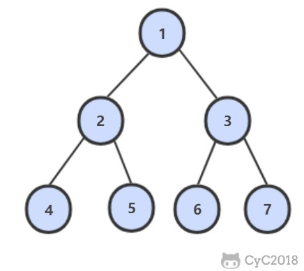 </div><br>

#### 解题思路

使用队列来进行层次遍历。

不需要使用两个队列分别存储当前层的节点和下一层的节点，因为在开始遍历一层的节点时，当前队列中的节点数就是当前层的节点数，只要控制遍历这么多节点数，就能保证这次遍历的都是当前层的节点。

```java
public ArrayList<Integer> PrintFromTopToBottom(TreeNode root) {
    Queue<TreeNode> queue = new LinkedList<>();
    ArrayList<Integer> ret = new ArrayList<>();
    queue.add(root);
    while (!queue.isEmpty()) {
        int cnt = queue.size();
        while (cnt-- > 0) {
            TreeNode t = queue.poll();
            if (t == null)
                continue;
            ret.add(t.val);
            queue.add(t.left);
            queue.add(t.right);
        }
    }
    return ret;
}
```

### 32.2 把二叉树打印成多行

[NowCoder](https://www.nowcoder.com/practice/445c44d982d04483b04a54f298796288?tpId=13&tqId=11213&tPage=1&rp=1&ru=/ta/coding-interviews&qru=/ta/coding-interviews/question-ranking)

#### 题目描述

和上题几乎一样。

#### 解题思路

```java
ArrayList<ArrayList<Integer>> Print(TreeNode pRoot) {
    ArrayList<ArrayList<Integer>> ret = new ArrayList<>();
    Queue<TreeNode> queue = new LinkedList<>();
    queue.add(pRoot);
    while (!queue.isEmpty()) {
        ArrayList<Integer> list = new ArrayList<>();
        int cnt = queue.size();
        while (cnt-- > 0) {
            TreeNode node = queue.poll();
            if (node == null)
                continue;
            list.add(node.val);
            queue.add(node.left);
            queue.add(node.right);
        }
        if (list.size() != 0)
            ret.add(list);
    }
    return ret;
}
```

### 32.3 按之字形顺序打印二叉树

[NowCoder](https://www.nowcoder.com/practice/91b69814117f4e8097390d107d2efbe0?tpId=13&tqId=11212&tPage=1&rp=1&ru=/ta/coding-interviews&qru=/ta/coding-interviews/question-ranking)

#### 题目描述

请实现一个函数按照之字形打印二叉树，即第一行按照从左到右的顺序打印，第二层按照从右至左的顺序打印，第三行按照从左到右的顺序打印，其他行以此类推。

#### 解题思路

```java
public ArrayList<ArrayList<Integer>> Print(TreeNode pRoot) {
    ArrayList<ArrayList<Integer>> ret = new ArrayList<>();
    Queue<TreeNode> queue = new LinkedList<>();
    queue.add(pRoot);
    boolean reverse = false;
    while (!queue.isEmpty()) {
        ArrayList<Integer> list = new ArrayList<>();
        int cnt = queue.size();
        while (cnt-- > 0) {
            TreeNode node = queue.poll();
            if (node == null)
                continue;
            list.add(node.val);
            queue.add(node.left);
            queue.add(node.right);
        }
        if (reverse)
            Collections.reverse(list);
        reverse = !reverse;
        if (list.size() != 0)
            ret.add(list);
    }
    return ret;
}
```

### 33. 二叉搜索树的后序遍历序列

[NowCoder](https://www.nowcoder.com/practice/a861533d45854474ac791d90e447bafd?tpId=13&tqId=11176&tPage=1&rp=1&ru=/ta/coding-interviews&qru=/ta/coding-interviews/question-ranking)

#### 题目描述

输入一个整数数组，判断该数组是不是某二叉搜索树的后序遍历的结果。假设输入的数组的任意两个数字都互不相同。

例如，下图是后序遍历序列 1,3,2 所对应的二叉搜索树。

<div align="center"> 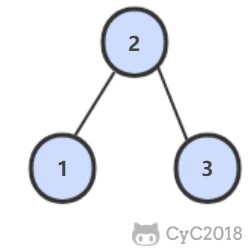 </div><br>

#### 解题思路

```java
public boolean VerifySquenceOfBST(int[] sequence) {
    if (sequence == null || sequence.length == 0)
        return false;
    return verify(sequence, 0, sequence.length - 1);
}

private boolean verify(int[] sequence, int first, int last) {
    if (last - first <= 1)
        return true;
    int rootVal = sequence[last];
    int cutIndex = first;
    while (cutIndex < last && sequence[cutIndex] <= rootVal)
        cutIndex++;
    for (int i = cutIndex; i < last; i++)
        if (sequence[i] < rootVal)
            return false;
    return verify(sequence, first, cutIndex - 1) && verify(sequence, cutIndex, last - 1);
}
```

### 34. 二叉树中和为某一值的路径

[NowCoder](https://www.nowcoder.com/practice/b736e784e3e34731af99065031301bca?tpId=13&tqId=11177&tPage=1&rp=1&ru=/ta/coding-interviews&qru=/ta/coding-interviews/question-ranking)

#### 题目描述

输入一颗二叉树和一个整数，打印出二叉树中结点值的和为输入整数的所有路径。路径定义为从树的根结点开始往下一直到叶结点所经过的结点形成一条路径。

下图的二叉树有两条和为 22 的路径：10, 5, 7 和 10, 12

<div align="center">  </div><br>

#### 解题思路

```java
private ArrayList<ArrayList<Integer>> ret = new ArrayList<>();

public ArrayList<ArrayList<Integer>> FindPath(TreeNode root, int target) {
    backtracking(root, target, new ArrayList<>());
    return ret;
}

private void backtracking(TreeNode node, int target, ArrayList<Integer> path) {
    if (node == null)
        return;
    path.add(node.val);
    target -= node.val;
    if (target == 0 && node.left == null && node.right == null) {
        ret.add(new ArrayList<>(path));
    } else {
        backtracking(node.left, target, path);
        backtracking(node.right, target, path);
    }
    path.remove(path.size() - 1);
}
```

### 35. 复杂链表的复制

[NowCoder](https://www.nowcoder.com/practice/f836b2c43afc4b35ad6adc41ec941dba?tpId=13&tqId=11178&tPage=1&rp=1&ru=/ta/coding-interviews&qru=/ta/coding-interviews/question-ranking)

#### 题目描述

输入一个复杂链表（每个节点中有节点值，以及两个指针，一个指向下一个节点，另一个特殊指针指向任意一个节点），返回结果为复制后复杂链表的 head。

```java
public class RandomListNode {
    int label;
    RandomListNode next = null;
    RandomListNode random = null;

    RandomListNode(int label) {
        this.label = label;
    }
}
```

<div align="center">  </div><br>

#### 解题思路

第一步，在每个节点的后面插入复制的节点。

<div align="center">  </div><br>

第二步，对复制节点的 random 链接进行赋值。

<div align="center"> 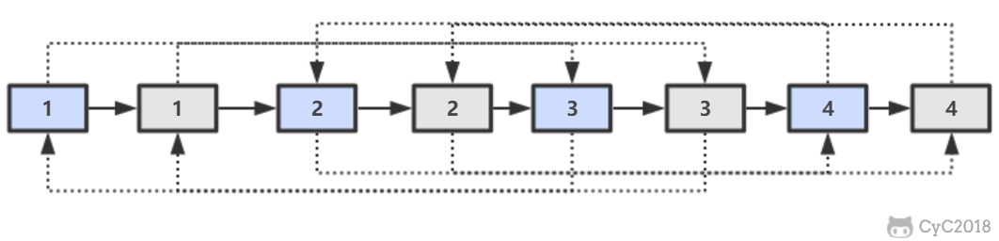 </div><br>

第三步，拆分。

<div align="center">  </div><br>

```java
public RandomListNode Clone(RandomListNode pHead) {
    if (pHead == null)
        return null;
    // 插入新节点
    RandomListNode cur = pHead;
    while (cur != null) {
        RandomListNode clone = new RandomListNode(cur.label);
        clone.next = cur.next;
        cur.next = clone;
        cur = clone.next;
    }
    // 建立 random 链接
    cur = pHead;
    while (cur != null) {
        RandomListNode clone = cur.next;
        if (cur.random != null)
            clone.random = cur.random.next;
        cur = clone.next;
    }
    // 拆分
    cur = pHead;
    RandomListNode pCloneHead = pHead.next;
    while (cur.next != null) {
        RandomListNode next = cur.next;
        cur.next = next.next;
        cur = next;
    }
    return pCloneHead;
}
```

### 36. 二叉搜索树与双向链表

[NowCoder](https://www.nowcoder.com/practice/947f6eb80d944a84850b0538bf0ec3a5?tpId=13&tqId=11179&tPage=1&rp=1&ru=/ta/coding-interviews&qru=/ta/coding-interviews/question-ranking)

#### 题目描述

输入一棵二叉搜索树，将该二叉搜索树转换成一个排序的双向链表。要求不能创建任何新的结点，只能调整树中结点指针的指向。

<div align="center"> 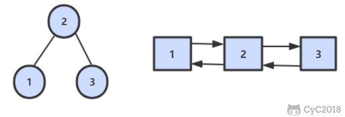 </div><br>

#### 解题思路

```java
private TreeNode pre = null;
private TreeNode head = null;

public TreeNode Convert(TreeNode root) {
    inOrder(root);
    return head;
}

private void inOrder(TreeNode node) {
    if (node == null)
        return;
    inOrder(node.left);
    node.left = pre;
    if (pre != null)
        pre.right = node;
    pre = node;
    if (head == null)
        head = node;
    inOrder(node.right);
}
```

### 37. 序列化二叉树

[NowCoder](https://www.nowcoder.com/practice/cf7e25aa97c04cc1a68c8f040e71fb84?tpId=13&tqId=11214&tPage=1&rp=1&ru=/ta/coding-interviews&qru=/ta/coding-interviews/question-ranking)

#### 题目描述

请实现两个函数，分别用来序列化和反序列化二叉树。

#### 解题思路

```java
private String deserializeStr;

public String Serialize(TreeNode root) {
    if (root == null)
        return "#";
    return root.val + " " + Serialize(root.left) + " " + Serialize(root.right);
}

public TreeNode Deserialize(String str) {
    deserializeStr = str;
    return Deserialize();
}

private TreeNode Deserialize() {
    if (deserializeStr.length() == 0)
        return null;
    int index = deserializeStr.indexOf(" ");
    String node = index == -1 ? deserializeStr : deserializeStr.substring(0, index);
    deserializeStr = index == -1 ? "" : deserializeStr.substring(index + 1);
    if (node.equals("#"))
        return null;
    int val = Integer.valueOf(node);
    TreeNode t = new TreeNode(val);
    t.left = Deserialize();
    t.right = Deserialize();
    return t;
}
```

### 38. 字符串的排列

[NowCoder](https://www.nowcoder.com/practice/fe6b651b66ae47d7acce78ffdd9a96c7?tpId=13&tqId=11180&tPage=1&rp=1&ru=/ta/coding-interviews&qru=/ta/coding-interviews/question-ranking)

#### 题目描述

输入一个字符串，按字典序打印出该字符串中字符的所有排列。例如输入字符串 abc，则打印出由字符 a, b, c 所能排列出来的所有字符串 abc, acb, bac, bca, cab 和 cba。

#### 解题思路

```java
private ArrayList<String> ret = new ArrayList<>();

public ArrayList<String> Permutation(String str) {
    if (str.length() == 0)
        return ret;
    char[] chars = str.toCharArray();
    Arrays.sort(chars);
    backtracking(chars, new boolean[chars.length], new StringBuilder());
    return ret;
}

private void backtracking(char[] chars, boolean[] hasUsed, StringBuilder s) {
    if (s.length() == chars.length) {
        ret.add(s.toString());
        return;
    }
    for (int i = 0; i < chars.length; i++) {
        if (hasUsed[i])
            continue;
        if (i != 0 && chars[i] == chars[i - 1] && !hasUsed[i - 1]) /* 保证不重复 */
            continue;
        hasUsed[i] = true;
        s.append(chars[i]);
        backtracking(chars, hasUsed, s);
        s.deleteCharAt(s.length() - 1);
        hasUsed[i] = false;
    }
}
```

### 39. 数组中出现次数超过一半的数字

[NowCoder](https://www.nowcoder.com/practice/e8a1b01a2df14cb2b228b30ee6a92163?tpId=13&tqId=11181&tPage=1&rp=1&ru=/ta/coding-interviews&qru=/ta/coding-interviews/question-ranking)

#### 解题思路

多数投票问题，可以利用 Boyer-Moore Majority Vote Algorithm 来解决这个问题，使得时间复杂度为 O(N)。

使用 cnt 来统计一个元素出现的次数，当遍历到的元素和统计元素相等时，令 cnt++，否则令 cnt--。如果前面查找了 i 个元素，且 cnt == 0，说明前 i 个元素没有 majority，或者有 majority，但是出现的次数少于 i / 2 ，因为如果多于 i / 2 的话 cnt 就一定不会为 0 。此时剩下的 n - i 个元素中，majority 的数目依然多于 (n - i) / 2，因此继续查找就能找出 majority。

```java
public int MoreThanHalfNum_Solution(int[] nums) {
    int majority = nums[0];
    for (int i = 1, cnt = 1; i < nums.length; i++) {
        cnt = nums[i] == majority ? cnt + 1 : cnt - 1;
        if (cnt == 0) {
            majority = nums[i];
            cnt = 1;
        }
    }
    int cnt = 0;
    for (int val : nums)
        if (val == majority)
            cnt++;
    return cnt > nums.length / 2 ? majority : 0;
}
```


### 40. 最小的 K 个数

[NowCoder](https://www.nowcoder.com/practice/6a296eb82cf844ca8539b57c23e6e9bf?tpId=13&tqId=11182&tPage=1&rp=1&ru=/ta/coding-interviews&qru=/ta/coding-interviews/question-ranking)

#### 解题思路

##### 快速选择

- 复杂度：O(N) + O(1)
- 只有当允许修改数组元素时才可以使用

快速排序的 partition() 方法，会返回一个整数 j 使得 a[l..j-1] 小于等于 a[j]，且 a[j+1..h] 大于等于 a[j]，此时 a[j] 就是数组的第 j 大元素。可以利用这个特性找出数组的第 K 个元素，这种找第 K 个元素的算法称为快速选择算法。

```java
public ArrayList<Integer> GetLeastNumbers_Solution(int[] nums, int k) {
    ArrayList<Integer> ret = new ArrayList<>();
    if (k > nums.length || k <= 0)
        return ret;
    findKthSmallest(nums, k - 1);
    /* findKthSmallest 会改变数组，使得前 k 个数都是最小的 k 个数 */
    for (int i = 0; i < k; i++)
        ret.add(nums[i]);
    return ret;
}

public void findKthSmallest(int[] nums, int k) {
    int l = 0, h = nums.length - 1;
    while (l < h) {
        int j = partition(nums, l, h);
        if (j == k)
            break;
        if (j > k)
            h = j - 1;
        else
            l = j + 1;
    }
}

private int partition(int[] nums, int l, int h) {
    int p = nums[l];     /* 切分元素 */
    int i = l, j = h + 1;
    while (true) {
        while (i != h && nums[++i] < p) ;
        while (j != l && nums[--j] > p) ;
        if (i >= j)
            break;
        swap(nums, i, j);
    }
    swap(nums, l, j);
    return j;
}

private void swap(int[] nums, int i, int j) {
    int t = nums[i];
    nums[i] = nums[j];
    nums[j] = t;
}
```

##### 大小为 K 的最小堆

- 复杂度：O(NlogK) + O(K)
- 特别适合处理海量数据

应该使用大顶堆来维护最小堆，而不能直接创建一个小顶堆并设置一个大小，企图让小顶堆中的元素都是最小元素。

维护一个大小为 K 的最小堆过程如下：在添加一个元素之后，如果大顶堆的大小大于 K，那么需要将大顶堆的堆顶元素去除。

```java
public ArrayList<Integer> GetLeastNumbers_Solution(int[] nums, int k) {
    if (k > nums.length || k <= 0)
        return new ArrayList<>();
    PriorityQueue<Integer> maxHeap = new PriorityQueue<>((o1, o2) -> o2 - o1);
    for (int num : nums) {
        maxHeap.add(num);
        if (maxHeap.size() > k)
            maxHeap.poll();
    }
    return new ArrayList<>(maxHeap);
}
```

### 41.1 数据流中的中位数

[NowCoder](https://www.nowcoder.com/practice/9be0172896bd43948f8a32fb954e1be1?tpId=13&tqId=11216&tPage=1&rp=1&ru=/ta/coding-interviews&qru=/ta/coding-interviews/question-ranking)

#### 题目描述

如何得到一个数据流中的中位数？如果从数据流中读出奇数个数值，那么中位数就是所有数值排序之后位于中间的数值。如果从数据流中读出偶数个数值，那么中位数就是所有数值排序之后中间两个数的平均值。

#### 解题思路

```java
/* 大顶堆，存储左半边元素 */
private PriorityQueue<Integer> left = new PriorityQueue<>((o1, o2) -> o2 - o1);
/* 小顶堆，存储右半边元素，并且右半边元素都大于左半边 */
private PriorityQueue<Integer> right = new PriorityQueue<>();
/* 当前数据流读入的元素个数 */
private int N = 0;

public void Insert(Integer val) {
    /* 插入要保证两个堆存于平衡状态 */
    if (N % 2 == 0) {
        /* N 为偶数的情况下插入到右半边。
         * 因为右半边元素都要大于左半边，但是新插入的元素不一定比左半边元素来的大，
         * 因此需要先将元素插入左半边，然后利用左半边为大顶堆的特点，取出堆顶元素即为最大元素，此时插入右半边 */
        left.add(val);
        right.add(left.poll());
    } else {
        right.add(val);
        left.add(right.poll());
    }
    N++;
}

public Double GetMedian() {
    if (N % 2 == 0)
        return (left.peek() + right.peek()) / 2.0;
    else
        return (double) right.peek();
}
```

### 41.2 字符流中第一个不重复的字符

[NowCoder](https://www.nowcoder.com/practice/00de97733b8e4f97a3fb5c680ee10720?tpId=13&tqId=11207&tPage=1&rp=1&ru=/ta/coding-interviews&qru=/ta/coding-interviews/question-ranking)

#### 题目描述

请实现一个函数用来找出字符流中第一个只出现一次的字符。例如，当从字符流中只读出前两个字符 "go" 时，第一个只出现一次的字符是 "g"。当从该字符流中读出前六个字符“google" 时，第一个只出现一次的字符是 "l"。

#### 解题思路

```java
private int[] cnts = new int[256];
private Queue<Character> queue = new LinkedList<>();

public void Insert(char ch) {
    cnts[ch]++;
    queue.add(ch);
    while (!queue.isEmpty() && cnts[queue.peek()] > 1)
        queue.poll();
}

public char FirstAppearingOnce() {
    return queue.isEmpty() ? '#' : queue.peek();
}
```

### 42. 连续子数组的最大和

[NowCoder](https://www.nowcoder.com/practice/459bd355da1549fa8a49e350bf3df484?tpId=13&tqId=11183&tPage=1&rp=1&ru=/ta/coding-interviews&qru=/ta/coding-interviews/question-ranking)

#### 题目描述

{6, -3, -2, 7, -15, 1, 2, 2}，连续子数组的最大和为 8（从第 0 个开始，到第 3 个为止）。

#### 解题思路

```java
public int FindGreatestSumOfSubArray(int[] nums) {
    if (nums == null || nums.length == 0)
        return 0;
    int greatestSum = Integer.MIN_VALUE;
    int sum = 0;
    for (int val : nums) {
        sum = sum <= 0 ? val : sum + val;
        greatestSum = Math.max(greatestSum, sum);
    }
    return greatestSum;
}
```

### 43. 从 1 到 n 整数中 1 出现的次数

[NowCoder](https://www.nowcoder.com/practice/bd7f978302044eee894445e244c7eee6?tpId=13&tqId=11184&tPage=1&rp=1&ru=/ta/coding-interviews&qru=/ta/coding-interviews/question-ranking)

#### 解题思路

```java
public int NumberOf1Between1AndN_Solution(int n) {
    int cnt = 0;
    for (int m = 1; m <= n; m *= 10) {
        int a = n / m, b = n % m;
        cnt += (a + 8) / 10 * m + (a % 10 == 1 ? b + 1 : 0);
    }
    return cnt;
}
```

> [Leetcode : 233. Number of Digit One](https://leetcode.com/problems/number-of-digit-one/discuss/64381/4+-lines-O(log-n)-C++JavaPython)

### 44. 数字序列中的某一位数字

#### 题目描述

数字以 0123456789101112131415... 的格式序列化到一个字符串中，求这个字符串的第 index 位。

#### 解题思路

```java
public int getDigitAtIndex(int index) {
    if (index < 0)
        return -1;
    int place = 1;  // 1 表示个位，2 表示 十位...
    while (true) {
        int amount = getAmountOfPlace(place);
        int totalAmount = amount * place;
        if (index < totalAmount)
            return getDigitAtIndex(index, place);
        index -= totalAmount;
        place++;
    }
}

/**
 * place 位数的数字组成的字符串长度
 * 10, 90, 900, ...
 */
private int getAmountOfPlace(int place) {
    if (place == 1)
        return 10;
    return (int) Math.pow(10, place - 1) * 9;
}

/**
 * place 位数的起始数字
 * 0, 10, 100, ...
 */
private int getBeginNumberOfPlace(int place) {
    if (place == 1)
        return 0;
    return (int) Math.pow(10, place - 1);
}

/**
 * 在 place 位数组成的字符串中，第 index 个数
 */
private int getDigitAtIndex(int index, int place) {
    int beginNumber = getBeginNumberOfPlace(place);
    int shiftNumber = index / place;
    String number = (beginNumber + shiftNumber) + "";
    int count = index % place;
    return number.charAt(count) - '0';
}
```

### 45. 把数组排成最小的数

[NowCoder](https://www.nowcoder.com/practice/8fecd3f8ba334add803bf2a06af1b993?tpId=13&tqId=11185&tPage=1&rp=1&ru=/ta/coding-interviews&qru=/ta/coding-interviews/question-ranking)

#### 题目描述

输入一个正整数数组，把数组里所有数字拼接起来排成一个数，打印能拼接出的所有数字中最小的一个。例如输入数组 {3，32，321}，则打印出这三个数字能排成的最小数字为 321323。

#### 解题思路

可以看成是一个排序问题，在比较两个字符串 S1 和 S2 的大小时，应该比较的是 S1+S2 和 S2+S1 的大小，如果 S1+S2 < S2+S1，那么应该把 S1 排在前面，否则应该把 S2 排在前面。

```java
public String PrintMinNumber(int[] numbers) {
    if (numbers == null || numbers.length == 0)
        return "";
    int n = numbers.length;
    String[] nums = new String[n];
    for (int i = 0; i < n; i++)
        nums[i] = numbers[i] + "";
    Arrays.sort(nums, (s1, s2) -> (s1 + s2).compareTo(s2 + s1));
    String ret = "";
    for (String str : nums)
        ret += str;
    return ret;
}
```

### 46. 把数字翻译成字符串

[Leetcode](https://leetcode.com/problems/decode-ways/description/)

#### 题目描述

给定一个数字，按照如下规则翻译成字符串：1 翻译成“a”，2 翻译成“b”... 26 翻译成“z”。一个数字有多种翻译可能，例如 12258 一共有 5 种，分别是 abbeh，lbeh，aveh，abyh，lyh。实现一个函数，用来计算一个数字有多少种不同的翻译方法。

#### 解题思路

```java
public int numDecodings(String s) {
    if (s == null || s.length() == 0)
        return 0;
    int n = s.length();
    int[] dp = new int[n + 1];
    dp[0] = 1;
    dp[1] = s.charAt(0) == '0' ? 0 : 1;
    for (int i = 2; i <= n; i++) {
        int one = Integer.valueOf(s.substring(i - 1, i));
        if (one != 0)
            dp[i] += dp[i - 1];
        if (s.charAt(i - 2) == '0')
            continue;
        int two = Integer.valueOf(s.substring(i - 2, i));
        if (two <= 26)
            dp[i] += dp[i - 2];
    }
    return dp[n];
}
```

### 47. 礼物的最大价值

[NowCoder](https://www.nowcoder.com/questionTerminal/72a99e28381a407991f2c96d8cb238ab)

#### 题目描述

在一个 m\*n 的棋盘的每一个格都放有一个礼物，每个礼物都有一定价值（大于 0）。从左上角开始拿礼物，每次向右或向下移动一格，直到右下角结束。给定一个棋盘，求拿到礼物的最大价值。例如，对于如下棋盘

```
1    10   3    8
12   2    9    6
5    7    4    11
3    7    16   5
```

礼物的最大价值为 1+12+5+7+7+16+5=53。

#### 解题思路

应该用动态规划求解，而不是深度优先搜索，深度优先搜索过于复杂，不是最优解。

```java
public int getMost(int[][] values) {
    if (values == null || values.length == 0 || values[0].length == 0)
        return 0;
    int n = values[0].length;
    int[] dp = new int[n];
    for (int[] value : values) {
        dp[0] += value[0];
        for (int i = 1; i < n; i++)
            dp[i] = Math.max(dp[i], dp[i - 1]) + value[i];
    }
    return dp[n - 1];
}
```

### 48. 最长不含重复字符的子字符串

#### 题目描述

输入一个字符串（只包含 a\~z 的字符），求其最长不含重复字符的子字符串的长度。例如对于 arabcacfr，最长不含重复字符的子字符串为 acfr，长度为 4。

#### 解题思路

```java
public int longestSubStringWithoutDuplication(String str) {
    int curLen = 0;
    int maxLen = 0;
    int[] preIndexs = new int[26];
    Arrays.fill(preIndexs, -1);
    for (int curI = 0; curI < str.length(); curI++) {
        int c = str.charAt(curI) - 'a';
        int preI = preIndexs[c];
        if (preI == -1 || curI - preI > curLen) {
            curLen++;
        } else {
            maxLen = Math.max(maxLen, curLen);
            curLen = curI - preI;
        }
        preIndexs[c] = curI;
    }
    maxLen = Math.max(maxLen, curLen);
    return maxLen;
}
```

### 49. 丑数

[NowCoder](https://www.nowcoder.com/practice/6aa9e04fc3794f68acf8778237ba065b?tpId=13&tqId=11186&tPage=1&rp=1&ru=/ta/coding-interviews&qru=/ta/coding-interviews/question-ranking)

#### 题目描述

把只包含因子 2、3 和 5 的数称作丑数（Ugly Number）。例如 6、8 都是丑数，但 14 不是，因为它包含因子 7。习惯上我们把 1 当做是第一个丑数。求按从小到大的顺序的第 N 个丑数。

#### 解题思路

```java
public int GetUglyNumber_Solution(int N) {
    if (N <= 6)
        return N;
    int i2 = 0, i3 = 0, i5 = 0;
    int[] dp = new int[N];
    dp[0] = 1;
    for (int i = 1; i < N; i++) {
        int next2 = dp[i2] * 2, next3 = dp[i3] * 3, next5 = dp[i5] * 5;
        dp[i] = Math.min(next2, Math.min(next3, next5));
        if (dp[i] == next2)
            i2++;
        if (dp[i] == next3)
            i3++;
        if (dp[i] == next5)
            i5++;
    }
    return dp[N - 1];
}
```


### 50. 第一个只出现一次的字符位置

[NowCoder](https://www.nowcoder.com/practice/1c82e8cf713b4bbeb2a5b31cf5b0417c?tpId=13&tqId=11187&tPage=1&rp=1&ru=/ta/coding-interviews&qru=/ta/coding-interviews/question-ranking)

#### 题目描述

在一个字符串中找到第一个只出现一次的字符，并返回它的位置。

```
Input: abacc
Output: b
```

#### 解题思路

最直观的解法是使用 HashMap 对出现次数进行统计，但是考虑到要统计的字符范围有限，因此可以使用整型数组代替 HashMap，从而将空间复杂度由 O(N) 降低为 O(1)。

```java
public int FirstNotRepeatingChar(String str) {
    int[] cnts = new int[256];
    for (int i = 0; i < str.length(); i++)
        cnts[str.charAt(i)]++;
    for (int i = 0; i < str.length(); i++)
        if (cnts[str.charAt(i)] == 1)
            return i;
    return -1;
}
```

以上实现的空间复杂度还不是最优的。考虑到只需要找到只出现一次的字符，那么需要统计的次数信息只有 0,1,更大，使用两个比特位就能存储这些信息。

```java
public int FirstNotRepeatingChar2(String str) {
    BitSet bs1 = new BitSet(256);
    BitSet bs2 = new BitSet(256);
    for (char c : str.toCharArray()) {
        if (!bs1.get(c) && !bs2.get(c))
            bs1.set(c);     // 0 0 -> 0 1
        else if (bs1.get(c) && !bs2.get(c))
            bs2.set(c);     // 0 1 -> 1 1
    }
    for (int i = 0; i < str.length(); i++) {
        char c = str.charAt(i);
        if (bs1.get(c) && !bs2.get(c))  // 0 1
            return i;
    }
    return -1;
}
```

### 51. 数组中的逆序对

[NowCoder](https://www.nowcoder.com/practice/96bd6684e04a44eb80e6a68efc0ec6c5?tpId=13&tqId=11188&tPage=1&rp=1&ru=/ta/coding-interviews&qru=/ta/coding-interviews/question-ranking)

#### 题目描述

在数组中的两个数字，如果前面一个数字大于后面的数字，则这两个数字组成一个逆序对。输入一个数组，求出这个数组中的逆序对的总数。

#### 解题思路

```java
private long cnt = 0;
private int[] tmp;  // 在这里声明辅助数组，而不是在 merge() 递归函数中声明

public int InversePairs(int[] nums) {
    tmp = new int[nums.length];
    mergeSort(nums, 0, nums.length - 1);
    return (int) (cnt % 1000000007);
}

private void mergeSort(int[] nums, int l, int h) {
    if (h - l < 1)
        return;
    int m = l + (h - l) / 2;
    mergeSort(nums, l, m);
    mergeSort(nums, m + 1, h);
    merge(nums, l, m, h);
}

private void merge(int[] nums, int l, int m, int h) {
    int i = l, j = m + 1, k = l;
    while (i <= m || j <= h) {
        if (i > m)
            tmp[k] = nums[j++];
        else if (j > h)
            tmp[k] = nums[i++];
        else if (nums[i] < nums[j])
            tmp[k] = nums[i++];
        else {
            tmp[k] = nums[j++];
            this.cnt += m - i + 1;  // nums[i] >= nums[j]，说明 nums[i...mid] 都大于 nums[j]
        }
        k++;
    }
    for (k = l; k <= h; k++)
        nums[k] = tmp[k];
}
```

### 52. 两个链表的第一个公共结点

[NowCoder](https://www.nowcoder.com/practice/6ab1d9a29e88450685099d45c9e31e46?tpId=13&tqId=11189&tPage=1&rp=1&ru=/ta/coding-interviews&qru=/ta/coding-interviews/question-ranking)

#### 题目描述

<div align="center">  </div><br>

#### 解题思路

设 A 的长度为 a + c，B 的长度为 b + c，其中 c 为尾部公共部分长度，可知 a + c + b = b + c + a。

当访问链表 A 的指针访问到链表尾部时，令它从链表 B 的头部重新开始访问链表 B；同样地，当访问链表 B 的指针访问到链表尾部时，令它从链表 A 的头部重新开始访问链表 A。这样就能控制访问 A 和 B 两个链表的指针能同时访问到交点。

```java
public ListNode FindFirstCommonNode(ListNode pHead1, ListNode pHead2) {
    ListNode l1 = pHead1, l2 = pHead2;
    while (l1 != l2) {
        l1 = (l1 == null) ? pHead2 : l1.next;
        l2 = (l2 == null) ? pHead1 : l2.next;
    }
    return l1;
}
```

### 53. 数字在排序数组中出现的次数

[NowCoder](https://www.nowcoder.com/practice/70610bf967994b22bb1c26f9ae901fa2?tpId=13&tqId=11190&tPage=1&rp=1&ru=/ta/coding-interviews&qru=/ta/coding-interviews/question-ranking)

#### 题目描述

```html
Input:
nums = 1, 2, 3, 3, 3, 3, 4, 6
K = 3

Output:
4
```

#### 解题思路

```java
public int GetNumberOfK(int[] nums, int K) {
    int first = binarySearch(nums, K);
    int last = binarySearch(nums, K + 1);
    return (first == nums.length || nums[first] != K) ? 0 : last - first;
}

private int binarySearch(int[] nums, int K) {
    int l = 0, h = nums.length;
    while (l < h) {
        int m = l + (h - l) / 2;
        if (nums[m] >= K)
            h = m;
        else
            l = m + 1;
    }
    return l;
}
```

### 54. 二叉查找树的第 K 个结点

[NowCoder](https://www.nowcoder.com/practice/ef068f602dde4d28aab2b210e859150a?tpId=13&tqId=11215&tPage=1&rp=1&ru=/ta/coding-interviews&qru=/ta/coding-interviews/question-ranking)

#### 解题思路

利用二叉查找树中序遍历有序的特点。

```java
private TreeNode ret;
private int cnt = 0;

public TreeNode KthNode(TreeNode pRoot, int k) {
    inOrder(pRoot, k);
    return ret;
}

private void inOrder(TreeNode root, int k) {
    if (root == null || cnt >= k)
        return;
    inOrder(root.left, k);
    cnt++;
    if (cnt == k)
        ret = root;
    inOrder(root.right, k);
}
```

### 55.1 二叉树的深度

[NowCoder](https://www.nowcoder.com/practice/435fb86331474282a3499955f0a41e8b?tpId=13&tqId=11191&tPage=1&rp=1&ru=/ta/coding-interviews&qru=/ta/coding-interviews/question-ranking)

#### 题目描述

从根结点到叶结点依次经过的结点（含根、叶结点）形成树的一条路径，最长路径的长度为树的深度。

<div align="center">  </div><br>

#### 解题思路

```java
public int TreeDepth(TreeNode root) {
    return root == null ? 0 : 1 + Math.max(TreeDepth(root.left), TreeDepth(root.right));
}
```

### 55.2 平衡二叉树

[NowCoder](https://www.nowcoder.com/practice/8b3b95850edb4115918ecebdf1b4d222?tpId=13&tqId=11192&tPage=1&rp=1&ru=/ta/coding-interviews&qru=/ta/coding-interviews/question-ranking)

#### 题目描述

平衡二叉树左右子树高度差不超过 1。

<div align="center"> 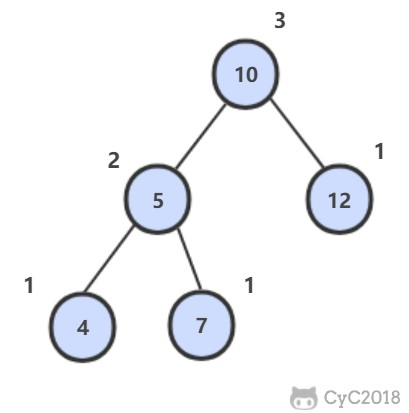 </div><br>

#### 解题思路

```java
private boolean isBalanced = true;

public boolean IsBalanced_Solution(TreeNode root) {
    height(root);
    return isBalanced;
}

private int height(TreeNode root) {
    if (root == null || !isBalanced)
        return 0;
    int left = height(root.left);
    int right = height(root.right);
    if (Math.abs(left - right) > 1)
        isBalanced = false;
    return 1 + Math.max(left, right);
}
```

### 56. 数组中只出现一次的数字

[NowCoder](https://www.nowcoder.com/practice/e02fdb54d7524710a7d664d082bb7811?tpId=13&tqId=11193&tPage=1&rp=1&ru=/ta/coding-interviews&qru=/ta/coding-interviews/question-ranking)

#### 题目描述

一个整型数组里除了两个数字之外，其他的数字都出现了两次，找出这两个数。

#### 解题思路

两个不相等的元素在位级表示上必定会有一位存在不同，将数组的所有元素异或得到的结果为不存在重复的两个元素异或的结果。

diff &= -diff 得到出 diff 最右侧不为 0 的位，也就是不存在重复的两个元素在位级表示上最右侧不同的那一位，利用这一位就可以将两个元素区分开来。

```java
public void FindNumsAppearOnce(int[] nums, int num1[], int num2[]) {
    int diff = 0;
    for (int num : nums)
        diff ^= num;
    diff &= -diff;
    for (int num : nums) {
        if ((num & diff) == 0)
            num1[0] ^= num;
        else
            num2[0] ^= num;
    }
}
```

### 57.1 和为 S 的两个数字

[NowCoder](https://www.nowcoder.com/practice/390da4f7a00f44bea7c2f3d19491311b?tpId=13&tqId=11195&tPage=1&rp=1&ru=/ta/coding-interviews&qru=/ta/coding-interviews/question-ranking)

#### 题目描述

输入一个递增排序的数组和一个数字 S，在数组中查找两个数，使得他们的和正好是 S。如果有多对数字的和等于 S，输出两个数的乘积最小的。

#### 解题思路

使用双指针，一个指针指向元素较小的值，一个指针指向元素较大的值。指向较小元素的指针从头向尾遍历，指向较大元素的指针从尾向头遍历。

- 如果两个指针指向元素的和 sum == target，那么得到要求的结果；
- 如果 sum > target，移动较大的元素，使 sum 变小一些；
- 如果 sum < target，移动较小的元素，使 sum 变大一些。

```java
public ArrayList<Integer> FindNumbersWithSum(int[] array, int sum) {
    int i = 0, j = array.length - 1;
    while (i < j) {
        int cur = array[i] + array[j];
        if (cur == sum)
            return new ArrayList<>(Arrays.asList(array[i], array[j]));
        if (cur < sum)
            i++;
        else
            j--;
    }
    return new ArrayList<>();
}
```

### 57.2 和为 S 的连续正数序列

[NowCoder](https://www.nowcoder.com/practice/c451a3fd84b64cb19485dad758a55ebe?tpId=13&tqId=11194&tPage=1&rp=1&ru=/ta/coding-interviews&qru=/ta/coding-interviews/question-ranking)

#### 题目描述

输出所有和为 S 的连续正数序列。

例如和为 100 的连续序列有：

```
[9, 10, 11, 12, 13, 14, 15, 16]
[18, 19, 20, 21, 22]。
```

#### 解题思路

```java
public ArrayList<ArrayList<Integer>> FindContinuousSequence(int sum) {
    ArrayList<ArrayList<Integer>> ret = new ArrayList<>();
    int start = 1, end = 2;
    int curSum = 3;
    while (end < sum) {
        if (curSum > sum) {
            curSum -= start;
            start++;
        } else if (curSum < sum) {
            end++;
            curSum += end;
        } else {
            ArrayList<Integer> list = new ArrayList<>();
            for (int i = start; i <= end; i++)
                list.add(i);
            ret.add(list);
            curSum -= start;
            start++;
            end++;
            curSum += end;
        }
    }
    return ret;
}
```

### 58.1 翻转单词顺序列

[NowCoder](https://www.nowcoder.com/practice/3194a4f4cf814f63919d0790578d51f3?tpId=13&tqId=11197&tPage=1&rp=1&ru=/ta/coding-interviews&qru=/ta/coding-interviews/question-ranking)

#### 题目描述

```html
Input:
"I am a student."

Output:
"student. a am I"
```

#### 解题思路

题目应该有一个隐含条件，就是不能用额外的空间。虽然 Java 的题目输入参数为 String 类型，需要先创建一个字符数组使得空间复杂度为 O(N)，但是正确的参数类型应该和原书一样，为字符数组，并且只能使用该字符数组的空间。任何使用了额外空间的解法在面试时都会大打折扣，包括递归解法。

正确的解法应该是和书上一样，先旋转每个单词，再旋转整个字符串。

```java
public String ReverseSentence(String str) {
    int n = str.length();
    char[] chars = str.toCharArray();
    int i = 0, j = 0;
    while (j <= n) {
        if (j == n || chars[j] == ' ') {
            reverse(chars, i, j - 1);
            i = j + 1;
        }
        j++;
    }
    reverse(chars, 0, n - 1);
    return new String(chars);
}

private void reverse(char[] c, int i, int j) {
    while (i < j)
        swap(c, i++, j--);
}

private void swap(char[] c, int i, int j) {
    char t = c[i];
    c[i] = c[j];
    c[j] = t;
}
```

### 58.2 左旋转字符串

[NowCoder](https://www.nowcoder.com/practice/12d959b108cb42b1ab72cef4d36af5ec?tpId=13&tqId=11196&tPage=1&rp=1&ru=/ta/coding-interviews&qru=/ta/coding-interviews/question-ranking)

#### 题目描述

```html
Input:
S="abcXYZdef"
K=3

Output:
"XYZdefabc"
```

#### 解题思路

先将 "abc" 和 "XYZdef" 分别翻转，得到 "cbafedZYX"，然后再把整个字符串翻转得到 "XYZdefabc"。

```java
public String LeftRotateString(String str, int n) {
    if (n >= str.length())
        return str;
    char[] chars = str.toCharArray();
    reverse(chars, 0, n - 1);
    reverse(chars, n, chars.length - 1);
    reverse(chars, 0, chars.length - 1);
    return new String(chars);
}

private void reverse(char[] chars, int i, int j) {
    while (i < j)
        swap(chars, i++, j--);
}

private void swap(char[] chars, int i, int j) {
    char t = chars[i];
    chars[i] = chars[j];
    chars[j] = t;
}
```

### 59. 滑动窗口的最大值

[NowCoder](https://www.nowcoder.com/practice/1624bc35a45c42c0bc17d17fa0cba788?tpId=13&tqId=11217&tPage=1&rp=1&ru=/ta/coding-interviews&qru=/ta/coding-interviews/question-ranking)

#### 题目描述

给定一个数组和滑动窗口的大小，找出所有滑动窗口里数值的最大值。

例如，如果输入数组 {2, 3, 4, 2, 6, 2, 5, 1} 及滑动窗口的大小 3，那么一共存在 6 个滑动窗口，他们的最大值分别为 {4, 4, 6, 6, 6, 5}。

#### 解题思路

```java
public ArrayList<Integer> maxInWindows(int[] num, int size) {
    ArrayList<Integer> ret = new ArrayList<>();
    if (size > num.length || size < 1)
        return ret;
    PriorityQueue<Integer> heap = new PriorityQueue<>((o1, o2) -> o2 - o1);  /* 大顶堆 */
    for (int i = 0; i < size; i++)
        heap.add(num[i]);
    ret.add(heap.peek());
    for (int i = 0, j = i + size; j < num.length; i++, j++) {            /* 维护一个大小为 size 的大顶堆 */
        heap.remove(num[i]);
        heap.add(num[j]);
        ret.add(heap.peek());
    }
    return ret;
}
```


### 60. n 个骰子的点数

[Lintcode](https://www.lintcode.com/en/problem/dices-sum/)

#### 题目描述

把 n 个骰子仍在地上，求点数和为 s 的概率。

<div align="center">  </div><br>

#### 解题思路

##### 动态规划

使用一个二维数组 dp 存储点数出现的次数，其中 dp[i][j] 表示前 i 个骰子产生点数 j 的次数。

空间复杂度：O(N<sup>2</sup>)

```java
public List<Map.Entry<Integer, Double>> dicesSum(int n) {
    final int face = 6;
    final int pointNum = face * n;
    long[][] dp = new long[n + 1][pointNum + 1];

    for (int i = 1; i <= face; i++)
        dp[1][i] = 1;

    for (int i = 2; i <= n; i++)
        for (int j = i; j <= pointNum; j++)     /* 使用 i 个骰子最小点数为 i */
            for (int k = 1; k <= face && k <= j; k++)
                dp[i][j] += dp[i - 1][j - k];

    final double totalNum = Math.pow(6, n);
    List<Map.Entry<Integer, Double>> ret = new ArrayList<>();
    for (int i = n; i <= pointNum; i++)
        ret.add(new AbstractMap.SimpleEntry<>(i, dp[n][i] / totalNum));

    return ret;
}
```

##### 动态规划 + 旋转数组

空间复杂度：O(N)

```java
public List<Map.Entry<Integer, Double>> dicesSum(int n) {
    final int face = 6;
    final int pointNum = face * n;
    long[][] dp = new long[2][pointNum + 1];

    for (int i = 1; i <= face; i++)
        dp[0][i] = 1;

    int flag = 1;                                     /* 旋转标记 */
    for (int i = 2; i <= n; i++, flag = 1 - flag) {
        for (int j = 0; j <= pointNum; j++)
            dp[flag][j] = 0;                          /* 旋转数组清零 */

        for (int j = i; j <= pointNum; j++)
            for (int k = 1; k <= face && k <= j; k++)
                dp[flag][j] += dp[1 - flag][j - k];
    }

    final double totalNum = Math.pow(6, n);
    List<Map.Entry<Integer, Double>> ret = new ArrayList<>();
    for (int i = n; i <= pointNum; i++)
        ret.add(new AbstractMap.SimpleEntry<>(i, dp[1 - flag][i] / totalNum));

    return ret;
}
```

### 61. 扑克牌顺子

[NowCoder](https://www.nowcoder.com/practice/762836f4d43d43ca9deb273b3de8e1f4?tpId=13&tqId=11198&tPage=1&rp=1&ru=/ta/coding-interviews&qru=/ta/coding-interviews/question-ranking)

#### 题目描述

五张牌，其中大小鬼为癞子，牌面为 0。判断这五张牌是否能组成顺子。

<div align="center">  </div><br>


#### 解题思路

```java
public boolean isContinuous(int[] nums) {

    if (nums.length < 5)
        return false;

    Arrays.sort(nums);

    // 统计癞子数量
    int cnt = 0;
    for (int num : nums)
        if (num == 0)
            cnt++;

    // 使用癞子去补全不连续的顺子
    for (int i = cnt; i < nums.length - 1; i++) {
        if (nums[i + 1] == nums[i])
            return false;
        cnt -= nums[i + 1] - nums[i] - 1;
    }

    return cnt >= 0;
}
```

### 62. 圆圈中最后剩下的数

[NowCoder](https://www.nowcoder.com/practice/f78a359491e64a50bce2d89cff857eb6?tpId=13&tqId=11199&tPage=1&rp=1&ru=/ta/coding-interviews&qru=/ta/coding-interviews/question-ranking)

#### 题目描述

让小朋友们围成一个大圈。然后，随机指定一个数 m，让编号为 0 的小朋友开始报数。每次喊到 m-1 的那个小朋友要出列唱首歌，然后可以在礼品箱中任意的挑选礼物，并且不再回到圈中，从他的下一个小朋友开始，继续 0...m-1 报数 .... 这样下去 .... 直到剩下最后一个小朋友，可以不用表演。

#### 解题思路

约瑟夫环，圆圈长度为 n 的解可以看成长度为 n-1 的解再加上报数的长度 m。因为是圆圈，所以最后需要对 n 取余。

```java
public int LastRemaining_Solution(int n, int m) {
    if (n == 0)     /* 特殊输入的处理 */
        return -1;
    if (n == 1)     /* 递归返回条件 */
        return 0;
    return (LastRemaining_Solution(n - 1, m) + m) % n;
}
```

### 63. 股票的最大利润

[Leetcode](https://leetcode.com/problems/best-time-to-buy-and-sell-stock/description/)

#### 题目描述

可以有一次买入和一次卖出，买入必须在前。求最大收益。

<div align="center"> 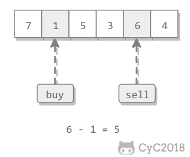 </div><br>

#### 解题思路

使用贪心策略，假设第 i 轮进行卖出操作，买入操作价格应该在 i 之前并且价格最低。

```java
public int maxProfit(int[] prices) {
    if (prices == null || prices.length == 0)
        return 0;
    int soFarMin = prices[0];
    int maxProfit = 0;
    for (int i = 1; i < prices.length; i++) {
        soFarMin = Math.min(soFarMin, prices[i]);
        maxProfit = Math.max(maxProfit, prices[i] - soFarMin);
    }
    return maxProfit;
}
```

### 64. 求 1+2+3+...+n

[NowCoder](https://www.nowcoder.com/practice/7a0da8fc483247ff8800059e12d7caf1?tpId=13&tqId=11200&tPage=1&rp=1&ru=/ta/coding-interviews&qru=/ta/coding-interviews/question-ranking)

#### 题目描述

要求不能使用乘除法、for、while、if、else、switch、case 等关键字及条件判断语句 A ? B : C。

#### 解题思路

使用递归解法最重要的是指定返回条件，但是本题无法直接使用 if 语句来指定返回条件。

条件与 && 具有短路原则，即在第一个条件语句为 false 的情况下不会去执行第二个条件语句。利用这一特性，将递归的返回条件取非然后作为 && 的第一个条件语句，递归的主体转换为第二个条件语句，那么当递归的返回条件为 true 的情况下就不会执行递归的主体部分，递归返回。

本题的递归返回条件为 n <= 0，取非后就是 n > 0；递归的主体部分为 sum += Sum_Solution(n - 1)，转换为条件语句后就是 (sum += Sum_Solution(n - 1)) > 0。

```java
public int Sum_Solution(int n) {
    int sum = n;
    boolean b = (n > 0) && ((sum += Sum_Solution(n - 1)) > 0);
    return sum;
}
```

### 65. 不用加减乘除做加法

[NowCoder](https://www.nowcoder.com/practice/59ac416b4b944300b617d4f7f111b215?tpId=13&tqId=11201&tPage=1&rp=1&ru=/ta/coding-interviews&qru=/ta/coding-interviews/question-ranking)

#### 题目描述

写一个函数，求两个整数之和，要求不得使用 +、-、\*、/ 四则运算符号。

#### 解题思路

a ^ b 表示没有考虑进位的情况下两数的和，(a & b) << 1 就是进位。

递归会终止的原因是 (a & b) << 1 最右边会多一个 0，那么继续递归，进位最右边的 0 会慢慢增多，最后进位会变为 0，递归终止。

```java
public int Add(int a, int b) {
    return b == 0 ? a : Add(a ^ b, (a & b) << 1);
}
```

### 66. 构建乘积数组

[NowCoder](https://www.nowcoder.com/practice/94a4d381a68b47b7a8bed86f2975db46?tpId=13&tqId=11204&tPage=1&rp=1&ru=/ta/coding-interviews&qru=/ta/coding-interviews/question-ranking)

#### 题目描述

给定一个数组 A[0, 1,..., n-1]，请构建一个数组 B[0, 1,..., n-1]，其中 B 中的元素 B[i]=A[0]\*A[1]\*...\*A[i-1]\*A[i+1]\*...\*A[n-1]。要求不能使用除法。

<div align="center">  </div><br>


#### 解题思路

```java
public int[] multiply(int[] A) {
    int n = A.length;
    int[] B = new int[n];
    for (int i = 0, product = 1; i < n; product *= A[i], i++)       /* 从左往右累乘 */
        B[i] = product;
    for (int i = n - 1, product = 1; i >= 0; product *= A[i], i--)  /* 从右往左累乘 */
        B[i] *= product;
    return B;
}
```

### 67. 把字符串转换成整数

[NowCoder](https://www.nowcoder.com/practice/1277c681251b4372bdef344468e4f26e?tpId=13&tqId=11202&tPage=1&rp=1&ru=/ta/coding-interviews&qru=/ta/coding-interviews/question-ranking)

#### 题目描述

将一个字符串转换成一个整数，字符串不是一个合法的数值则返回 0，要求不能使用字符串转换整数的库函数。

```html
Iuput:
+2147483647
1a33

Output:
2147483647
0
```

#### 解题思路

```java
public int StrToInt(String str) {
    if (str == null || str.length() == 0)
        return 0;
    boolean isNegative = str.charAt(0) == '-';
    int ret = 0;
    for (int i = 0; i < str.length(); i++) {
        char c = str.charAt(i);
        if (i == 0 && (c == '+' || c == '-'))  /* 符号判定 */
            continue;
        if (c < '0' || c > '9')                /* 非法输入 */
            return 0;
        ret = ret * 10 + (c - '0');
    }
    return isNegative ? -ret : ret;
}
```

### 68. 树中两个节点的最低公共祖先

#### 解题思路

##### 二叉查找树

[Leetcode : 235. Lowest Common Ancestor of a Binary Search Tree](https://leetcode.com/problems/lowest-common-ancestor-of-a-binary-search-tree/description/)

二叉查找树中，两个节点 p, q 的公共祖先 root 满足 root.val >= p.val && root.val <= q.val。

<div align="center">  </div><br>

```java
public TreeNode lowestCommonAncestor(TreeNode root, TreeNode p, TreeNode q) {
    if (root == null)
        return root;
    if (root.val > p.val && root.val > q.val)
        return lowestCommonAncestor(root.left, p, q);
    if (root.val < p.val && root.val < q.val)
        return lowestCommonAncestor(root.right, p, q);
    return root;
}
```

##### 普通二叉树

[Leetcode : 236. Lowest Common Ancestor of a Binary Tree](https://leetcode.com/problems/lowest-common-ancestor-of-a-binary-tree/description/)

在左右子树中查找是否存在 p 或者 q，如果 p 和 q 分别在两个子树中，那么就说明根节点就是最低公共祖先。

<div align="center">  </div><br>

```java
public TreeNode lowestCommonAncestor(TreeNode root, TreeNode p, TreeNode q) {
    if (root == null || root == p || root == q)
        return root;
    TreeNode left = lowestCommonAncestor(root.left, p, q);
    TreeNode right = lowestCommonAncestor(root.right, p, q);
    return left == null ? right : right == null ? left : root;
}
```


### 参考文献

何海涛. 剑指 Offer[M]. 电子工业出版社, 2012.
## 第 6.2 节 Leetcode 题解


### 双指针


双指针主要用于遍历数组，两个指针指向不同的元素，从而协同完成任务。

#### 有序数组的 Two Sum

[Leetcode ：167. Two Sum II - Input array is sorted (Easy)](https://leetcode.com/problems/two-sum-ii-input-array-is-sorted/description/)

```html
Input: numbers={2, 7, 11, 15}, target=9
Output: index1=1, index2=2
```

题目描述：在有序数组中找出两个数，使它们的和为 target。

使用双指针，一个指针指向值较小的元素，一个指针指向值较大的元素。指向较小元素的指针从头向尾遍历，指向较大元素的指针从尾向头遍历。

- 如果两个指针指向元素的和 sum == target，那么得到要求的结果；
- 如果 sum > target，移动较大的元素，使 sum 变小一些；
- 如果 sum < target，移动较小的元素，使 sum 变大一些。

```java
public int[] twoSum(int[] numbers, int target) {
    int i = 0, j = numbers.length - 1;
    while (i < j) {
        int sum = numbers[i] + numbers[j];
        if (sum == target) {
            return new int[]{i + 1, j + 1};
        } else if (sum < target) {
            i++;
        } else {
            j--;
        }
    }
    return null;
}
```

#### 两数平方和

[633. Sum of Square Numbers (Easy)](https://leetcode.com/problems/sum-of-square-numbers/description/)

```html
Input: 5
Output: True
Explanation: 1 * 1 + 2 * 2 = 5
```

题目描述：判断一个数是否为两个数的平方和。

```java
public boolean judgeSquareSum(int c) {
    int i = 0, j = (int) Math.sqrt(c);
    while (i <= j) {
        int powSum = i * i + j * j;
        if (powSum == c) {
            return true;
        } else if (powSum > c) {
            j--;
        } else {
            i++;
        }
    }
    return false;
}
```

#### 反转字符串中的元音字符

[345. Reverse Vowels of a String (Easy)](https://leetcode.com/problems/reverse-vowels-of-a-string/description/)

```html
Given s = "leetcode", return "leotcede".
```

使用双指针指向待反转的两个元音字符，一个指针从头向尾遍历，一个指针从尾到头遍历。

```java
private final static HashSet<Character> vowels = new HashSet<>(Arrays.asList('a', 'e', 'i', 'o', 'u', 'A', 'E', 'I', 'O', 'U'));

public String reverseVowels(String s) {
    int i = 0, j = s.length() - 1;
    char[] result = new char[s.length()];
    while (i <= j) {
        char ci = s.charAt(i);
        char cj = s.charAt(j);
        if (!vowels.contains(ci)) {
            result[i++] = ci;
        } else if (!vowels.contains(cj)) {
            result[j--] = cj;
        } else {
            result[i++] = cj;
            result[j--] = ci;
        }
    }
    return new String(result);
}
```

#### 回文字符串

[680. Valid Palindrome II (Easy)](https://leetcode.com/problems/valid-palindrome-ii/description/)

```html
Input: "abca"
Output: True
Explanation: You could delete the character 'c'.
```

题目描述：可以删除一个字符，判断是否能构成回文字符串。

```java
public boolean validPalindrome(String s) {
    int i = -1, j = s.length();
    while (++i < --j) {
        if (s.charAt(i) != s.charAt(j)) {
            return isPalindrome(s, i, j - 1) || isPalindrome(s, i + 1, j);
        }
    }
    return true;
}

private boolean isPalindrome(String s, int i, int j) {
    while (i < j) {
        if (s.charAt(i++) != s.charAt(j--)) {
            return false;
        }
    }
    return true;
}
```

#### 归并两个有序数组

[88. Merge Sorted Array (Easy)](https://leetcode.com/problems/merge-sorted-array/description/)

```html
Input:
nums1 = [1,2,3,0,0,0], m = 3
nums2 = [2,5,6],       n = 3

Output: [1,2,2,3,5,6]
```

题目描述：把归并结果存到第一个数组上。

需要从尾开始遍历，否则在 nums1 上归并得到的值会覆盖还未进行归并比较的值。

```java
public void merge(int[] nums1, int m, int[] nums2, int n) {
    int index1 = m - 1, index2 = n - 1;
    int indexMerge = m + n - 1;
    while (index1 >= 0 || index2 >= 0) {
        if (index1 < 0) {
            nums1[indexMerge--] = nums2[index2--];
        } else if (index2 < 0) {
            nums1[indexMerge--] = nums1[index1--];
        } else if (nums1[index1] > nums2[index2]) {
            nums1[indexMerge--] = nums1[index1--];
        } else {
            nums1[indexMerge--] = nums2[index2--];
        }
    }
}
```

#### 判断链表是否存在环

[141. Linked List Cycle (Easy)](https://leetcode.com/problems/linked-list-cycle/description/)

使用双指针，一个指针每次移动一个节点，一个指针每次移动两个节点，如果存在环，那么这两个指针一定会相遇。

```java
public boolean hasCycle(ListNode head) {
    if (head == null) {
        return false;
    }
    ListNode l1 = head, l2 = head.next;
    while (l1 != null && l2 != null && l2.next != null) {
        if (l1 == l2) {
            return true;
        }
        l1 = l1.next;
        l2 = l2.next.next;
    }
    return false;
}
```

#### 最长子序列

[524. Longest Word in Dictionary through Deleting (Medium)](https://leetcode.com/problems/longest-word-in-dictionary-through-deleting/description/)

```
Input:
s = "abpcplea", d = ["ale","apple","monkey","plea"]

Output:
"apple"
```

题目描述：删除 s 中的一些字符，使得它构成字符串列表 d 中的一个字符串，找出能构成的最长字符串。如果有多个相同长度的结果，返回字典序的最小字符串。

```java
public String findLongestWord(String s, List<String> d) {
    String longestWord = "";
    for (String target : d) {
        int l1 = longestWord.length(), l2 = target.length();
        if (l1 > l2 || (l1 == l2 && longestWord.compareTo(target) < 0)) {
            continue;
        }
        if (isValid(s, target)) {
            longestWord = target;
        }
    }
    return longestWord;
}

private boolean isValid(String s, String target) {
    int i = 0, j = 0;
    while (i < s.length() && j < target.length()) {
        if (s.charAt(i) == target.charAt(j)) {
            j++;
        }
        i++;
    }
    return j == target.length();
}
```


### 排序


#### 快速选择

用于求解  **Kth Element**  问题，使用快速排序的 partition() 进行实现。

需要先打乱数组，否则最坏情况下时间复杂度为 O(N<sup>2</sup>)。

#### 堆排序

用于求解  **TopK Elements**  问题，通过维护一个大小为 K 的堆，堆中的元素就是 TopK Elements。

堆排序也可以用于求解 Kth Element 问题，堆顶元素就是 Kth Element。

快速选择也可以求解 TopK Elements 问题，因为找到 Kth Element 之后，再遍历一次数组，所有小于等于 Kth Element 的元素都是 TopK Elements。

可以看到，快速选择和堆排序都可以求解 Kth Element 和 TopK Elements 问题。

##### Kth Element

[215. Kth Largest Element in an Array (Medium)](https://leetcode.com/problems/kth-largest-element-in-an-array/description/)

题目描述：找到第 k 大的元素。

**排序** ：时间复杂度 O(NlogN)，空间复杂度 O(1)

```java
public int findKthLargest(int[] nums, int k) {
    Arrays.sort(nums);
    return nums[nums.length - k];
}
```

**堆排序** ：时间复杂度 O(NlogK)，空间复杂度 O(K)。

```java
public int findKthLargest(int[] nums, int k) {
    PriorityQueue<Integer> pq = new PriorityQueue<>(); // 小顶堆
    for (int val : nums) {
        pq.add(val);
        if (pq.size() > k)  // 维护堆的大小为 K
            pq.poll();
    }
    return pq.peek();
}
```

**快速选择** ：时间复杂度 O(N)，空间复杂度 O(1)

```java
public int findKthLargest(int[] nums, int k) {
    k = nums.length - k;
    int l = 0, h = nums.length - 1;
    while (l < h) {
        int j = partition(nums, l, h);
        if (j == k) {
            break;
        } else if (j < k) {
            l = j + 1;
        } else {
            h = j - 1;
        }
    }
    return nums[k];
}

private int partition(int[] a, int l, int h) {
    int i = l, j = h + 1;
    while (true) {
        while (a[++i] < a[l] && i < h) ;
        while (a[--j] > a[l] && j > l) ;
        if (i >= j) {
            break;
        }
        swap(a, i, j);
    }
    swap(a, l, j);
    return j;
}

private void swap(int[] a, int i, int j) {
    int t = a[i];
    a[i] = a[j];
    a[j] = t;
}
```

#### 桶排序

##### 出现频率最多的 k 个数

[347. Top K Frequent Elements (Medium)](https://leetcode.com/problems/top-k-frequent-elements/description/)

```html
Given [1,1,1,2,2,3] and k = 2, return [1,2].
```

设置若干个桶，每个桶存储出现频率相同的数，并且桶的下标代表桶中数出现的频率，即第 i 个桶中存储的数出现的频率为 i。

把数都放到桶之后，从后向前遍历桶，最先得到的 k 个数就是出现频率最多的的 k 个数。

```java
public List<Integer> topKFrequent(int[] nums, int k) {
    Map<Integer, Integer> frequencyForNum = new HashMap<>();
    for (int num : nums) {
        frequencyForNum.put(num, frequencyForNum.getOrDefault(num, 0) + 1);
    }
    List<Integer>[] buckets = new ArrayList[nums.length + 1];
    for (int key : frequencyForNum.keySet()) {
        int frequency = frequencyForNum.get(key);
        if (buckets[frequency] == null) {
            buckets[frequency] = new ArrayList<>();
        }
        buckets[frequency].add(key);
    }
    List<Integer> topK = new ArrayList<>();
    for (int i = buckets.length - 1; i >= 0 && topK.size() < k; i--) {
        if (buckets[i] == null) {
            continue;
        }
        if (buckets[i].size() <= (k - topK.size())) {
            topK.addAll(buckets[i]);
        } else {
            topK.addAll(buckets[i].subList(0, k - topK.size()));
        }
    }
    return topK;
}
```

##### 按照字符出现次数对字符串排序

[451. Sort Characters By Frequency (Medium)](https://leetcode.com/problems/sort-characters-by-frequency/description/)

```html
Input:
"tree"

Output:
"eert"

Explanation:
'e' appears twice while 'r' and 't' both appear once.
So 'e' must appear before both 'r' and 't'. Therefore "eetr" is also a valid answer.
```

```java
public String frequencySort(String s) {
    Map<Character, Integer> frequencyForNum = new HashMap<>();
    for (char c : s.toCharArray())
        frequencyForNum.put(c, frequencyForNum.getOrDefault(c, 0) + 1);

    List<Character>[] frequencyBucket = new ArrayList[s.length() + 1];
    for (char c : frequencyForNum.keySet()) {
        int f = frequencyForNum.get(c);
        if (frequencyBucket[f] == null) {
            frequencyBucket[f] = new ArrayList<>();
        }
        frequencyBucket[f].add(c);
    }
    StringBuilder str = new StringBuilder();
    for (int i = frequencyBucket.length - 1; i >= 0; i--) {
        if (frequencyBucket[i] == null) {
            continue;
        }
        for (char c : frequencyBucket[i]) {
            for (int j = 0; j < i; j++) {
                str.append(c);
            }
        }
    }
    return str.toString();
}
```

#### 荷兰国旗问题

荷兰国旗包含三种颜色：红、白、蓝。

有三种颜色的球，算法的目标是将这三种球按颜色顺序正确地排列。

它其实是三向切分快速排序的一种变种，在三向切分快速排序中，每次切分都将数组分成三个区间：小于切分元素、等于切分元素、大于切分元素，而该算法是将数组分成三个区间：等于红色、等于白色、等于蓝色。

<div align="center">  </div><br>

##### 按颜色进行排序

[75. Sort Colors (Medium)](https://leetcode.com/problems/sort-colors/description/)

```html
Input: [2,0,2,1,1,0]
Output: [0,0,1,1,2,2]
```

题目描述：只有 0/1/2 三种颜色。

```java
public void sortColors(int[] nums) {
    int zero = -1, one = 0, two = nums.length;
    while (one < two) {
        if (nums[one] == 0) {
            swap(nums, ++zero, one++);
        } else if (nums[one] == 2) {
            swap(nums, --two, one);
        } else {
            ++one;
        }
    }
}

private void swap(int[] nums, int i, int j) {
    int t = nums[i];
    nums[i] = nums[j];
    nums[j] = t;
}
```


### 贪心思想


保证每次操作都是局部最优的，并且最后得到的结果是全局最优的。

#### 分配饼干

[455. Assign Cookies (Easy)](https://leetcode.com/problems/assign-cookies/description/)

```html
Input: [1,2], [1,2,3]
Output: 2

Explanation: You have 2 children and 3 cookies. The greed factors of 2 children are 1, 2.
You have 3 cookies and their sizes are big enough to gratify all of the children,
You need to output 2.
```

题目描述：每个孩子都有一个满足度，每个饼干都有一个大小，只有饼干的大小大于等于一个孩子的满足度，该孩子才会获得满足。求解最多可以获得满足的孩子数量。

给一个孩子的饼干应当尽量小又能满足该孩子，这样大饼干就能拿来给满足度比较大的孩子。因为最小的孩子最容易得到满足，所以先满足最小的孩子。

证明：假设在某次选择中，贪心策略选择给当前满足度最小的孩子分配第 m 个饼干，第 m 个饼干为可以满足该孩子的最小饼干。假设存在一种最优策略，给该孩子分配第 n 个饼干，并且 m < n。我们可以发现，经过这一轮分配，贪心策略分配后剩下的饼干一定有一个比最优策略来得大。因此在后续的分配中，贪心策略一定能满足更多的孩子。也就是说不存在比贪心策略更优的策略，即贪心策略就是最优策略。

```java
public int findContentChildren(int[] g, int[] s) {
    Arrays.sort(g);
    Arrays.sort(s);
    int gi = 0, si = 0;
    while (gi < g.length && si < s.length) {
        if (g[gi] <= s[si]) {
            gi++;
        }
        si++;
    }
    return gi;
}
```

#### 不重叠的区间个数

[435. Non-overlapping Intervals (Medium)](https://leetcode.com/problems/non-overlapping-intervals/description/)

```html
Input: [ [1,2], [1,2], [1,2] ]

Output: 2

Explanation: You need to remove two [1,2] to make the rest of intervals non-overlapping.
```

```html
Input: [ [1,2], [2,3] ]

Output: 0

Explanation: You don't need to remove any of the intervals since they're already non-overlapping.
```

题目描述：计算让一组区间不重叠所需要移除的区间个数。

先计算最多能组成的不重叠区间个数，然后用区间总个数减去不重叠区间的个数。

在每次选择中，区间的结尾最为重要，选择的区间结尾越小，留给后面的区间的空间越大，那么后面能够选择的区间个数也就越大。

按区间的结尾进行排序，每次选择结尾最小，并且和前一个区间不重叠的区间。

```java
public int eraseOverlapIntervals(Interval[] intervals) {
    if (intervals.length == 0) {
        return 0;
    }
    Arrays.sort(intervals, Comparator.comparingInt(o -> o.end));
    int cnt = 1;
    int end = intervals[0].end;
    for (int i = 1; i < intervals.length; i++) {
        if (intervals[i].start < end) {
            continue;
        }
        end = intervals[i].end;
        cnt++;
    }
    return intervals.length - cnt;
}
```

使用 lambda 表示式创建 Comparator 会导致算法运行时间过长，如果注重运行时间，可以修改为普通创建 Comparator 语句：

```java
Arrays.sort(intervals, new Comparator<Interval>() {
    @Override
    public int compare(Interval o1, Interval o2) {
        return o1.end - o2.end;
    }
});
```

#### 投飞镖刺破气球

[452. Minimum Number of Arrows to Burst Balloons (Medium)](https://leetcode.com/problems/minimum-number-of-arrows-to-burst-balloons/description/)

```
Input:
[[10,16], [2,8], [1,6], [7,12]]

Output:
2
```

题目描述：气球在一个水平数轴上摆放，可以重叠，飞镖垂直投向坐标轴，使得路径上的气球都会刺破。求解最小的投飞镖次数使所有气球都被刺破。

也是计算不重叠的区间个数，不过和 Non-overlapping Intervals 的区别在于，[1, 2] 和 [2, 3] 在本题中算是重叠区间。

```java
public int findMinArrowShots(int[][] points) {
    if (points.length == 0) {
        return 0;
    }
    Arrays.sort(points, Comparator.comparingInt(o -> o[1]));
    int cnt = 1, end = points[0][1];
    for (int i = 1; i < points.length; i++) {
        if (points[i][0] <= end) {
            continue;
        }
        cnt++;
        end = points[i][1];
    }
    return cnt;
}
```

#### 根据身高和序号重组队列

[406. Queue Reconstruction by Height(Medium)](https://leetcode.com/problems/queue-reconstruction-by-height/description/)

```html
Input:
[[7,0], [4,4], [7,1], [5,0], [6,1], [5,2]]

Output:
[[5,0], [7,0], [5,2], [6,1], [4,4], [7,1]]
```

题目描述：一个学生用两个分量 (h, k) 描述，h 表示身高，k 表示排在前面的有 k 个学生的身高比他高或者和他一样高。

为了使插入操作不影响后续的操作，身高较高的学生应该先做插入操作，否则身高较小的学生原先正确插入的第 k 个位置可能会变成第 k+1 个位置。

身高降序、k 值升序，然后按排好序的顺序插入队列的第 k 个位置中。

```java
public int[][] reconstructQueue(int[][] people) {
    if (people == null || people.length == 0 || people[0].length == 0) {
        return new int[0][0];
    }
    Arrays.sort(people, (a, b) -> (a[0] == b[0] ? a[1] - b[1] : b[0] - a[0]));
    List<int[]> queue = new ArrayList<>();
    for (int[] p : people) {
        queue.add(p[1], p);
    }
    return queue.toArray(new int[queue.size()][]);
}
```

#### 分隔字符串使同种字符出现在一起

[763. Partition Labels (Medium)](https://leetcode.com/problems/partition-labels/description/)

```html
Input: S = "ababcbacadefegdehijhklij"
Output: [9,7,8]
Explanation:
The partition is "ababcbaca", "defegde", "hijhklij".
This is a partition so that each letter appears in at most one part.
A partition like "ababcbacadefegde", "hijhklij" is incorrect, because it splits S into less parts.
```

```java
public List<Integer> partitionLabels(String S) {
    int[] lastIndexsOfChar = new int[26];
    for (int i = 0; i < S.length(); i++) {
        lastIndexsOfChar[char2Index(S.charAt(i))] = i;
    }
    List<Integer> partitions = new ArrayList<>();
    int firstIndex = 0;
    while (firstIndex < S.length()) {
        int lastIndex = firstIndex;
        for (int i = firstIndex; i < S.length() && i <= lastIndex; i++) {
            int index = lastIndexsOfChar[char2Index(S.charAt(i))];
            if (index > lastIndex) {
                lastIndex = index;
            }
        }
        partitions.add(lastIndex - firstIndex + 1);
        firstIndex = lastIndex + 1;
    }
    return partitions;
}

private int char2Index(char c) {
    return c - 'a';
}
```


#### 种植花朵

[605. Can Place Flowers (Easy)](https://leetcode.com/problems/can-place-flowers/description/)

```html
Input: flowerbed = [1,0,0,0,1], n = 1
Output: True
```

题目描述：花朵之间至少需要一个单位的间隔，求解是否能种下 n 朵花。

```java
public boolean canPlaceFlowers(int[] flowerbed, int n) {
    int len = flowerbed.length;
    int cnt = 0;
    for (int i = 0; i < len && cnt < n; i++) {
        if (flowerbed[i] == 1) {
            continue;
        }
        int pre = i == 0 ? 0 : flowerbed[i - 1];
        int next = i == len - 1 ? 0 : flowerbed[i + 1];
        if (pre == 0 && next == 0) {
            cnt++;
            flowerbed[i] = 1;
        }
    }
    return cnt >= n;
}
```

#### 判断是否为子序列

[392. Is Subsequence (Medium)](https://leetcode.com/problems/is-subsequence/description/)

```html
s = "abc", t = "ahbgdc"
Return true.
```

```java
public boolean isSubsequence(String s, String t) {
    int index = -1;
    for (char c : s.toCharArray()) {
        index = t.indexOf(c, index + 1);
        if (index == -1) {
            return false;
        }
    }
    return true;
}
```

#### 修改一个数成为非递减数组

[665. Non-decreasing Array (Easy)](https://leetcode.com/problems/non-decreasing-array/description/)

```html
Input: [4,2,3]
Output: True
Explanation: You could modify the first 4 to 1 to get a non-decreasing array.
```

题目描述：判断一个数组能不能只修改一个数就成为非递减数组。

在出现 nums[i] < nums[i - 1] 时，需要考虑的是应该修改数组的哪个数，使得本次修改能使 i 之前的数组成为非递减数组，并且  **不影响后续的操作** 。优先考虑令 nums[i - 1] = nums[i]，因为如果修改 nums[i] = nums[i - 1] 的话，那么 nums[i] 这个数会变大，就有可能比 nums[i + 1] 大，从而影响了后续操作。还有一个比较特别的情况就是 nums[i] < nums[i - 2]，只修改 nums[i - 1] = nums[i] 不能使数组成为非递减数组，只能修改 nums[i] = nums[i - 1]。

```java
public boolean checkPossibility(int[] nums) {
    int cnt = 0;
    for (int i = 1; i < nums.length && cnt < 2; i++) {
        if (nums[i] >= nums[i - 1]) {
            continue;
        }
        cnt++;
        if (i - 2 >= 0 && nums[i - 2] > nums[i]) {
            nums[i] = nums[i - 1];
        } else {
            nums[i - 1] = nums[i];
        }
    }
    return cnt <= 1;
}
```

#### 股票的最大收益

[122. Best Time to Buy and Sell Stock II (Easy)](https://leetcode.com/problems/best-time-to-buy-and-sell-stock-ii/description/)

题目描述：一次股票交易包含买入和卖出，多个交易之间不能交叉进行。

对于 [a, b, c, d]，如果有 a <= b <= c <= d ，那么最大收益为 d - a。而 d - a = (d - c) + (c - b) + (b - a) ，因此当访问到一个 prices[i] 且 prices[i] - prices[i-1] > 0，那么就把 prices[i] - prices[i-1] 添加到收益中，从而在局部最优的情况下也保证全局最优。

```java
public int maxProfit(int[] prices) {
    int profit = 0;
    for (int i = 1; i < prices.length; i++) {
        if (prices[i] > prices[i - 1]) {
            profit += (prices[i] - prices[i - 1]);
        }
    }
    return profit;
}
```

#### 子数组最大的和

[53. Maximum Subarray (Easy)](https://leetcode.com/problems/maximum-subarray/description/)

```html
For example, given the array [-2,1,-3,4,-1,2,1,-5,4],
the contiguous subarray [4,-1,2,1] has the largest sum = 6.
```

```java
public int maxSubArray(int[] nums) {
    if (nums == null || nums.length == 0) {
        return 0;
    }
    int preSum = nums[0];
    int maxSum = preSum;
    for (int i = 1; i < nums.length; i++) {
        preSum = preSum > 0 ? preSum + nums[i] : nums[i];
        maxSum = Math.max(maxSum, preSum);
    }
    return maxSum;
}
```

#### 买入和售出股票最大的收益

[121. Best Time to Buy and Sell Stock (Easy)](https://leetcode.com/problems/best-time-to-buy-and-sell-stock/description/)

题目描述：只进行一次交易。

只要记录前面的最小价格，将这个最小价格作为买入价格，然后将当前的价格作为售出价格，查看当前收益是不是最大收益。

```java
public int maxProfit(int[] prices) {
    int n = prices.length;
    if (n == 0) return 0;
    int soFarMin = prices[0];
    int max = 0;
    for (int i = 1; i < n; i++) {
        if (soFarMin > prices[i]) soFarMin = prices[i];
        else max = Math.max(max, prices[i] - soFarMin);
    }
    return max;
}
```


### 二分查找


#### 原理

##### 1. 正常实现

```java
public int binarySearch(int[] nums, int key) {
    int l = 0, h = nums.length - 1;
    while (l <= h) {
        int m = l + (h - l) / 2;
        if (nums[m] == key) {
            return m;
        } else if (nums[m] > key) {
            h = m - 1;
        } else {
            l = m + 1;
        }
    }
    return -1;
}
```

##### 2. 时间复杂度

二分查找也称为折半查找，每次都能将查找区间减半，这种折半特性的算法时间复杂度为 O(logN)。

##### 3. m 计算

有两种计算中值 m 的方式：

- m = (l + h) / 2
- m = l + (h - l) / 2

l + h 可能出现加法溢出，最好使用第二种方式。

##### 4. 返回值

循环退出时如果仍然没有查找到 key，那么表示查找失败。可以有两种返回值：

- -1：以一个错误码表示没有查找到 key
- l：将 key 插入到 nums 中的正确位置

##### 5. 变种

二分查找可以有很多变种，变种实现要注意边界值的判断。例如在一个有重复元素的数组中查找 key 的最左位置的实现如下：

```java
public int binarySearch(int[] nums, int key) {
    int l = 0, h = nums.length - 1;
    while (l < h) {
        int m = l + (h - l) / 2;
        if (nums[m] >= key) {
            h = m;
        } else {
            l = m + 1;
        }
    }
    return l;
}
```

该实现和正常实现有以下不同：

- 循环条件为 l < h
- h 的赋值表达式为 h = m
- 最后返回 l 而不是 -1

在 nums[m] >= key 的情况下，可以推导出最左 key 位于 [l, m] 区间中，这是一个闭区间。h 的赋值表达式为 h = m，因为 m 位置也可能是解。

在 h 的赋值表达式为 h = mid 的情况下，如果循环条件为 l <= h，那么会出现循环无法退出的情况，因此循环条件只能是 l < h。以下演示了循环条件为 l <= h 时循环无法退出的情况：

```text
nums = {0, 1, 2}, key = 1
l   m   h
0   1   2  nums[m] >= key
0   0   1  nums[m] < key
1   1   1  nums[m] >= key
1   1   1  nums[m] >= key
...
```

当循环体退出时，不表示没有查找到 key，因此最后返回的结果不应该为 -1。为了验证有没有查找到，需要在调用端判断一下返回位置上的值和 key 是否相等。

#### 例题

##### 1. 求开方

[69. Sqrt(x) (Easy)](https://leetcode.com/problems/sqrtx/description/)

```html
Input: 4
Output: 2

Input: 8
Output: 2
Explanation: The square root of 8 is 2.82842..., and since we want to return an integer, the decimal part will be truncated.
```

一个数 x 的开方 sqrt 一定在 0 \~ x 之间，并且满足 sqrt == x / sqrt。可以利用二分查找在 0 \~ x 之间查找 sqrt。

对于 x = 8，它的开方是 2.82842...，最后应该返回 2 而不是 3。在循环条件为 l <= h 并且循环退出时，h 总是比 l 小 1，也就是说 h = 2，l = 3，因此最后的返回值应该为 h 而不是 l。

```java
public int mySqrt(int x) {
    if (x <= 1) {
        return x;
    }
    int l = 1, h = x;
    while (l <= h) {
        int mid = l + (h - l) / 2;
        int sqrt = x / mid;
        if (sqrt == mid) {
            return mid;
        } else if (mid > sqrt) {
            h = mid - 1;
        } else {
            l = mid + 1;
        }
    }
    return h;
}
```

##### 2. 大于给定元素的最小元素

[744. Find Smallest Letter Greater Than Target (Easy)](https://leetcode.com/problems/find-smallest-letter-greater-than-target/description/)

```html
Input:
letters = ["c", "f", "j"]
target = "d"
Output: "f"

Input:
letters = ["c", "f", "j"]
target = "k"
Output: "c"
```

题目描述：给定一个有序的字符数组 letters 和一个字符 target，要求找出 letters 中大于 target 的最小字符，如果找不到就返回第 1 个字符。

```java
public char nextGreatestLetter(char[] letters, char target) {
    int n = letters.length;
    int l = 0, h = n - 1;
    while (l <= h) {
        int m = l + (h - l) / 2;
        if (letters[m] <= target) {
            l = m + 1;
        } else {
            h = m - 1;
        }
    }
    return l < n ? letters[l] : letters[0];
}
```

##### 3. 有序数组的 Single Element

[540. Single Element in a Sorted Array (Medium)](https://leetcode.com/problems/single-element-in-a-sorted-array/description/)

```html
Input: [1, 1, 2, 3, 3, 4, 4, 8, 8]
Output: 2
```

题目描述：一个有序数组只有一个数不出现两次，找出这个数。要求以 O(logN) 时间复杂度进行求解。

令 index 为 Single Element 在数组中的位置。如果 m 为偶数，并且 m + 1 < index，那么 nums[m] == nums[m + 1]；m + 1 >= index，那么 nums[m] != nums[m + 1]。

从上面的规律可以知道，如果 nums[m] == nums[m + 1]，那么 index 所在的数组位置为 [m + 2, h]，此时令 l = m + 2；如果 nums[m] != nums[m + 1]，那么 index 所在的数组位置为 [l, m]，此时令 h = m。

因为 h 的赋值表达式为 h = m，那么循环条件也就只能使用 l < h 这种形式。

```java
public int singleNonDuplicate(int[] nums) {
    int l = 0, h = nums.length - 1;
    while (l < h) {
        int m = l + (h - l) / 2;
        if (m % 2 == 1) {
            m--;   // 保证 l/h/m 都在偶数位，使得查找区间大小一直都是奇数
        }
        if (nums[m] == nums[m + 1]) {
            l = m + 2;
        } else {
            h = m;
        }
    }
    return nums[l];
}
```

##### 4. 第一个错误的版本

[278. First Bad Version (Easy)](https://leetcode.com/problems/first-bad-version/description/)

题目描述：给定一个元素 n 代表有 [1, 2, ..., n] 版本，可以调用 isBadVersion(int x) 知道某个版本是否错误，要求找到第一个错误的版本。

如果第 m 个版本出错，则表示第一个错误的版本在 [l, m] 之间，令 h = m；否则第一个错误的版本在 [m + 1, h] 之间，令 l = m + 1。

因为 h 的赋值表达式为 h = m，因此循环条件为 l < h。

```java
public int firstBadVersion(int n) {
    int l = 1, h = n;
    while (l < h) {
        int mid = l + (h - l) / 2;
        if (isBadVersion(mid)) {
            h = mid;
        } else {
            l = mid + 1;
        }
    }
    return l;
}
```

##### 5. 旋转数组的最小数字

[153. Find Minimum in Rotated Sorted Array (Medium)](https://leetcode.com/problems/find-minimum-in-rotated-sorted-array/description/)

```html
Input: [3,4,5,1,2],
Output: 1
```

```java
public int findMin(int[] nums) {
    int l = 0, h = nums.length - 1;
    while (l < h) {
        int m = l + (h - l) / 2;
        if (nums[m] <= nums[h]) {
            h = m;
        } else {
            l = m + 1;
        }
    }
    return nums[l];
}
```

##### 6. 查找区间

[34. Search for a Range (Medium)](https://leetcode.com/problems/search-for-a-range/description/)

```html
Input: nums = [5,7,7,8,8,10], target = 8
Output: [3,4]

Input: nums = [5,7,7,8,8,10], target = 6
Output: [-1,-1]
```

```java
public int[] searchRange(int[] nums, int target) {
    int first = binarySearch(nums, target);
    int last = binarySearch(nums, target + 1) - 1;
    if (first == nums.length || nums[first] != target) {
        return new int[]{-1, -1};
    } else {
        return new int[]{first, Math.max(first, last)};
    }
}

private int binarySearch(int[] nums, int target) {
    int l = 0, h = nums.length; // 注意 h 的初始值
    while (l < h) {
        int m = l + (h - l) / 2;
        if (nums[m] >= target) {
            h = m;
        } else {
            l = m + 1;
        }
    }
    return l;
}
```


### 分治


#### 1. 给表达式加括号

[241. Different Ways to Add Parentheses (Medium)](https://leetcode.com/problems/different-ways-to-add-parentheses/description/)

```html
Input: "2-1-1".

((2-1)-1) = 0
(2-(1-1)) = 2

Output : [0, 2]
```

```java
public List<Integer> diffWaysToCompute(String input) {
    List<Integer> ways = new ArrayList<>();
    for (int i = 0; i < input.length(); i++) {
        char c = input.charAt(i);
        if (c == '+' || c == '-' || c == '*') {
            List<Integer> left = diffWaysToCompute(input.substring(0, i));
            List<Integer> right = diffWaysToCompute(input.substring(i + 1));
            for (int l : left) {
                for (int r : right) {
                    switch (c) {
                        case '+':
                            ways.add(l + r);
                            break;
                        case '-':
                            ways.add(l - r);
                            break;
                        case '*':
                            ways.add(l * r);
                            break;
                    }
                }
            }
        }
    }
    if (ways.size() == 0) {
        ways.add(Integer.valueOf(input));
    }
    return ways;
}
```

#### 2. 不同的二叉搜索树

[95. Unique Binary Search Trees II (Medium)](https://leetcode.com/problems/unique-binary-search-trees-ii/description/)

给定一个数字 n，要求生成所有值为 1...n 的二叉搜索树。

```html
Input: 3
Output:
[
  [1,null,3,2],
  [3,2,null,1],
  [3,1,null,null,2],
  [2,1,3],
  [1,null,2,null,3]
]
Explanation:
The above output corresponds to the 5 unique BST's shown below:

   1         3     3      2      1
    \       /     /      / \      \
     3     2     1      1   3      2
    /     /       \                 \
   2     1         2                 3
```

```java
public List<TreeNode> generateTrees(int n) {
    return generateSubtrees(1, n);
}

private List<TreeNode> generateSubtrees(int s, int e) {
    List<TreeNode> res = new LinkedList<TreeNode>();
    if (s > e) {
        res.add(null);
        return res;
    }
    for (int i = s; i <= e; ++i) {
        List<TreeNode> leftSubtrees = generateSubtrees(s, i - 1);
        List<TreeNode> rightSubtrees = generateSubtrees(i + 1, e);
        for (TreeNode left : leftSubtrees) {
            for (TreeNode right : rightSubtrees) {
                TreeNode root = new TreeNode(i);
                root.left = left;
                root.right = right;
                res.add(root);
            }
        }
    }
    return res;
}
```


### 搜索


深度优先搜索和广度优先搜索广泛运用于树和图中，但是它们的应用远远不止如此。

#### BFS

<div align="center"> 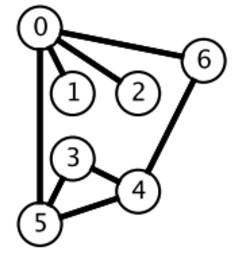 </div><br>

广度优先搜索一层一层地进行遍历，每层遍历都以上一层遍历的结果作为起点，遍历一个距离能访问到的所有节点。需要注意的是，遍历过的节点不能再次被遍历。

第一层：

- 0 -> {6,2,1,5}

第二层：

- 6 -> {4}
- 2 -> {}
- 1 -> {}
- 5 -> {3}

第三层：

- 4 -> {}
- 3 -> {}

每一层遍历的节点都与根节点距离相同。设 d<sub>i</sub> 表示第 i 个节点与根节点的距离，推导出一个结论：对于先遍历的节点 i 与后遍历的节点 j，有 d<sub>i</sub> <= d<sub>j</sub>。利用这个结论，可以求解最短路径等  **最优解**  问题：第一次遍历到目的节点，其所经过的路径为最短路径。应该注意的是，使用 BFS 只能求解无权图的最短路径。

在程序实现 BFS 时需要考虑以下问题：

- 队列：用来存储每一轮遍历得到的节点；
- 标记：对于遍历过的节点，应该将它标记，防止重复遍历。

##### 计算在网格中从原点到特定点的最短路径长度

```html
[[1,1,0,1],
 [1,0,1,0],
 [1,1,1,1],
 [1,0,1,1]]
```

1 表示可以经过某个位置，求解从 (0, 0) 位置到 (tr, tc) 位置的最短路径长度。

```java
public int minPathLength(int[][] grids, int tr, int tc) {
    final int[][] direction = {{1, 0}, {-1, 0}, {0, 1}, {0, -1}};
    final int m = grids.length, n = grids[0].length;
    Queue<Pair<Integer, Integer>> queue = new LinkedList<>();
    queue.add(new Pair<>(0, 0));
    int pathLength = 0;
    while (!queue.isEmpty()) {
        int size = queue.size();
        pathLength++;
        while (size-- > 0) {
            Pair<Integer, Integer> cur = queue.poll();
            int cr = cur.getKey(), cc = cur.getValue();
            grids[cr][cc] = 0; // 标记
            for (int[] d : direction) {
                int nr = cr + d[0], nc = cc + d[1];
                if (nr < 0 || nr >= m || nc < 0 || nc >= n || grids[nr][nc] == 0) {
                    continue;
                }
                if (nr == tr && nc == tc) {
                    return pathLength;
                }
                queue.add(new Pair<>(nr, nc));
            }
        }
    }
    return -1;
}
```

##### 组成整数的最小平方数数量

[279. Perfect Squares (Medium)](https://leetcode.com/problems/perfect-squares/description/)

```html
For example, given n = 12, return 3 because 12 = 4 + 4 + 4; given n = 13, return 2 because 13 = 4 + 9.
```

可以将每个整数看成图中的一个节点，如果两个整数之差为一个平方数，那么这两个整数所在的节点就有一条边。

要求解最小的平方数数量，就是求解从节点 n 到节点 0 的最短路径。

本题也可以用动态规划求解，在之后动态规划部分中会再次出现。

```java
public int numSquares(int n) {
    List<Integer> squares = generateSquares(n);
    Queue<Integer> queue = new LinkedList<>();
    boolean[] marked = new boolean[n + 1];
    queue.add(n);
    marked[n] = true;
    int level = 0;
    while (!queue.isEmpty()) {
        int size = queue.size();
        level++;
        while (size-- > 0) {
            int cur = queue.poll();
            for (int s : squares) {
                int next = cur - s;
                if (next < 0) {
                    break;
                }
                if (next == 0) {
                    return level;
                }
                if (marked[next]) {
                    continue;
                }
                marked[next] = true;
                queue.add(next);
            }
        }
    }
    return n;
}

/**
 * 生成小于 n 的平方数序列
 * @return 1,4,9,...
 */
private List<Integer> generateSquares(int n) {
    List<Integer> squares = new ArrayList<>();
    int square = 1;
    int diff = 3;
    while (square <= n) {
        squares.add(square);
        square += diff;
        diff += 2;
    }
    return squares;
}
```

##### 最短单词路径

[127. Word Ladder (Medium)](https://leetcode.com/problems/word-ladder/description/)

```html
Input:
beginWord = "hit",
endWord = "cog",
wordList = ["hot","dot","dog","lot","log","cog"]

Output: 5

Explanation: As one shortest transformation is "hit" -> "hot" -> "dot" -> "dog" -> "cog",
return its length 5.
```

```html
Input:
beginWord = "hit"
endWord = "cog"
wordList = ["hot","dot","dog","lot","log"]

Output: 0

Explanation: The endWord "cog" is not in wordList, therefore no possible transformation.
```

题目描述：找出一条从 beginWord 到 endWord 的最短路径，每次移动规定为改变一个字符，并且改变之后的字符串必须在 wordList 中。

```java
public int ladderLength(String beginWord, String endWord, List<String> wordList) {
    wordList.add(beginWord);
    int N = wordList.size();
    int start = N - 1;
    int end = 0;
    while (end < N && !wordList.get(end).equals(endWord)) {
        end++;
    }
    if (end == N) {
        return 0;
    }
    List<Integer>[] graphic = buildGraphic(wordList);
    return getShortestPath(graphic, start, end);
}

private List<Integer>[] buildGraphic(List<String> wordList) {
    int N = wordList.size();
    List<Integer>[] graphic = new List[N];
    for (int i = 0; i < N; i++) {
        graphic[i] = new ArrayList<>();
        for (int j = 0; j < N; j++) {
            if (isConnect(wordList.get(i), wordList.get(j))) {
                graphic[i].add(j);
            }
        }
    }
    return graphic;
}

private boolean isConnect(String s1, String s2) {
    int diffCnt = 0;
    for (int i = 0; i < s1.length() && diffCnt <= 1; i++) {
        if (s1.charAt(i) != s2.charAt(i)) {
            diffCnt++;
        }
    }
    return diffCnt == 1;
}

private int getShortestPath(List<Integer>[] graphic, int start, int end) {
    Queue<Integer> queue = new LinkedList<>();
    boolean[] marked = new boolean[graphic.length];
    queue.add(start);
    marked[start] = true;
    int path = 1;
    while (!queue.isEmpty()) {
        int size = queue.size();
        path++;
        while (size-- > 0) {
            int cur = queue.poll();
            for (int next : graphic[cur]) {
                if (next == end) {
                    return path;
                }
                if (marked[next]) {
                    continue;
                }
                marked[next] = true;
                queue.add(next);
            }
        }
    }
    return 0;
}
```

#### DFS

<div align="center">  </div><br>

广度优先搜索一层一层遍历，每一层得到的所有新节点，要用队列存储起来以备下一层遍历的时候再遍历。

而深度优先搜索在得到一个新节点时立即对新节点进行遍历：从节点 0 出发开始遍历，得到到新节点 6 时，立马对新节点 6 进行遍历，得到新节点 4；如此反复以这种方式遍历新节点，直到没有新节点了，此时返回。返回到根节点 0 的情况是，继续对根节点 0 进行遍历，得到新节点 2，然后继续以上步骤。

从一个节点出发，使用 DFS 对一个图进行遍历时，能够遍历到的节点都是从初始节点可达的，DFS 常用来求解这种  **可达性**  问题。

在程序实现 DFS 时需要考虑以下问题：

- 栈：用栈来保存当前节点信息，当遍历新节点返回时能够继续遍历当前节点。可以使用递归栈。
- 标记：和 BFS 一样同样需要对已经遍历过的节点进行标记。

##### 查找最大的连通面积

[695. Max Area of Island (Medium)](https://leetcode.com/problems/max-area-of-island/description/)

```html
[[0,0,1,0,0,0,0,1,0,0,0,0,0],
 [0,0,0,0,0,0,0,1,1,1,0,0,0],
 [0,1,1,0,1,0,0,0,0,0,0,0,0],
 [0,1,0,0,1,1,0,0,1,0,1,0,0],
 [0,1,0,0,1,1,0,0,1,1,1,0,0],
 [0,0,0,0,0,0,0,0,0,0,1,0,0],
 [0,0,0,0,0,0,0,1,1,1,0,0,0],
 [0,0,0,0,0,0,0,1,1,0,0,0,0]]
```

```java
private int m, n;
private int[][] direction = {{0, 1}, {0, -1}, {1, 0}, {-1, 0}};

public int maxAreaOfIsland(int[][] grid) {
    if (grid == null || grid.length == 0) {
        return 0;
    }
    m = grid.length;
    n = grid[0].length;
    int maxArea = 0;
    for (int i = 0; i < m; i++) {
        for (int j = 0; j < n; j++) {
            maxArea = Math.max(maxArea, dfs(grid, i, j));
        }
    }
    return maxArea;
}

private int dfs(int[][] grid, int r, int c) {
    if (r < 0 || r >= m || c < 0 || c >= n || grid[r][c] == 0) {
        return 0;
    }
    grid[r][c] = 0;
    int area = 1;
    for (int[] d : direction) {
        area += dfs(grid, r + d[0], c + d[1]);
    }
    return area;
}
```

##### 矩阵中的连通分量数目

[200. Number of Islands (Medium)](https://leetcode.com/problems/number-of-islands/description/)

```html
Input:
11000
11000
00100
00011

Output: 3
```

可以将矩阵表示看成一张有向图。

```java
private int m, n;
private int[][] direction = {{0, 1}, {0, -1}, {1, 0}, {-1, 0}};

public int numIslands(char[][] grid) {
    if (grid == null || grid.length == 0) {
        return 0;
    }
    m = grid.length;
    n = grid[0].length;
    int islandsNum = 0;
    for (int i = 0; i < m; i++) {
        for (int j = 0; j < n; j++) {
            if (grid[i][j] != '0') {
                dfs(grid, i, j);
                islandsNum++;
            }
        }
    }
    return islandsNum;
}

private void dfs(char[][] grid, int i, int j) {
    if (i < 0 || i >= m || j < 0 || j >= n || grid[i][j] == '0') {
        return;
    }
    grid[i][j] = '0';
    for (int[] d : direction) {
        dfs(grid, i + d[0], j + d[1]);
    }
}
```

##### 好友关系的连通分量数目

[547. Friend Circles (Medium)](https://leetcode.com/problems/friend-circles/description/)

```html
Input:
[[1,1,0],
 [1,1,0],
 [0,0,1]]

Output: 2

Explanation:The 0th and 1st students are direct friends, so they are in a friend circle.
The 2nd student himself is in a friend circle. So return 2.
```

题目描述：好友关系可以看成是一个无向图，例如第 0 个人与第 1 个人是好友，那么 M[0][1] 和 M[1][0] 的值都为 1。

```java
private int n;

public int findCircleNum(int[][] M) {
    n = M.length;
    int circleNum = 0;
    boolean[] hasVisited = new boolean[n];
    for (int i = 0; i < n; i++) {
        if (!hasVisited[i]) {
            dfs(M, i, hasVisited);
            circleNum++;
        }
    }
    return circleNum;
}

private void dfs(int[][] M, int i, boolean[] hasVisited) {
    hasVisited[i] = true;
    for (int k = 0; k < n; k++) {
        if (M[i][k] == 1 && !hasVisited[k]) {
            dfs(M, k, hasVisited);
        }
    }
}
```

##### 填充封闭区域

[130. Surrounded Regions (Medium)](https://leetcode.com/problems/surrounded-regions/description/)

```html
For example,
X X X X
X O O X
X X O X
X O X X

After running your function, the board should be:
X X X X
X X X X
X X X X
X O X X
```

题目描述：使被 'X' 包围的 'O' 转换为 'X'。

先填充最外侧，剩下的就是里侧了。

```java
private int[][] direction = {{0, 1}, {0, -1}, {1, 0}, {-1, 0}};
private int m, n;

public void solve(char[][] board) {
    if (board == null || board.length == 0) {
        return;
    }

    m = board.length;
    n = board[0].length;

    for (int i = 0; i < m; i++) {
        dfs(board, i, 0);
        dfs(board, i, n - 1);
    }
    for (int i = 0; i < n; i++) {
        dfs(board, 0, i);
        dfs(board, m - 1, i);
    }

    for (int i = 0; i < m; i++) {
        for (int j = 0; j < n; j++) {
            if (board[i][j] == 'T') {
                board[i][j] = 'O';
            } else if (board[i][j] == 'O') {
                board[i][j] = 'X';
            }
        }
    }
}

private void dfs(char[][] board, int r, int c) {
    if (r < 0 || r >= m || c < 0 || c >= n || board[r][c] != 'O') {
        return;
    }
    board[r][c] = 'T';
    for (int[] d : direction) {
        dfs(board, r + d[0], c + d[1]);
    }
}
```

##### 能到达的太平洋和大西洋的区域

[417. Pacific Atlantic Water Flow (Medium)](https://leetcode.com/problems/pacific-atlantic-water-flow/description/)

```html
Given the following 5x5 matrix:

  Pacific ~   ~   ~   ~   ~
       ~  1   2   2   3  (5) *
       ~  3   2   3  (4) (4) *
       ~  2   4  (5)  3   1  *
       ~ (6) (7)  1   4   5  *
       ~ (5)  1   1   2   4  *
          *   *   *   *   * Atlantic

Return:
[[0, 4], [1, 3], [1, 4], [2, 2], [3, 0], [3, 1], [4, 0]] (positions with parentheses in above matrix).
```

左边和上边是太平洋，右边和下边是大西洋，内部的数字代表海拔，海拔高的地方的水能够流到低的地方，求解水能够流到太平洋和大西洋的所有位置。

```java

private int m, n;
private int[][] matrix;
private int[][] direction = {{0, 1}, {0, -1}, {1, 0}, {-1, 0}};

public List<int[]> pacificAtlantic(int[][] matrix) {
    List<int[]> ret = new ArrayList<>();
    if (matrix == null || matrix.length == 0) {
        return ret;
    }

    m = matrix.length;
    n = matrix[0].length;
    this.matrix = matrix;
    boolean[][] canReachP = new boolean[m][n];
    boolean[][] canReachA = new boolean[m][n];

    for (int i = 0; i < m; i++) {
        dfs(i, 0, canReachP);
        dfs(i, n - 1, canReachA);
    }
    for (int i = 0; i < n; i++) {
        dfs(0, i, canReachP);
        dfs(m - 1, i, canReachA);
    }

    for (int i = 0; i < m; i++) {
        for (int j = 0; j < n; j++) {
            if (canReachP[i][j] && canReachA[i][j]) {
                ret.add(new int[]{i, j});
            }
        }
    }

    return ret;
}

private void dfs(int r, int c, boolean[][] canReach) {
    if (canReach[r][c]) {
        return;
    }
    canReach[r][c] = true;
    for (int[] d : direction) {
        int nextR = d[0] + r;
        int nextC = d[1] + c;
        if (nextR < 0 || nextR >= m || nextC < 0 || nextC >= n
                || matrix[r][c] > matrix[nextR][nextC]) {

            continue;
        }
        dfs(nextR, nextC, canReach);
    }
}
```

#### Backtracking

Backtracking（回溯）属于 DFS。

- 普通 DFS 主要用在  **可达性问题** ，这种问题只需要执行到特点的位置然后返回即可。
- 而 Backtracking 主要用于求解  **排列组合**  问题，例如有 { 'a','b','c' } 三个字符，求解所有由这三个字符排列得到的字符串，这种问题在执行到特定的位置返回之后还会继续执行求解过程。

因为 Backtracking 不是立即就返回，而要继续求解，因此在程序实现时，需要注意对元素的标记问题：

- 在访问一个新元素进入新的递归调用时，需要将新元素标记为已经访问，这样才能在继续递归调用时不用重复访问该元素；
- 但是在递归返回时，需要将元素标记为未访问，因为只需要保证在一个递归链中不同时访问一个元素，可以访问已经访问过但是不在当前递归链中的元素。

##### 数字键盘组合

[17. Letter Combinations of a Phone Number (Medium)](https://leetcode.com/problems/letter-combinations-of-a-phone-number/description/)

<div align="center">  </div><br>

```html
Input:Digit string "23"
Output: ["ad", "ae", "af", "bd", "be", "bf", "cd", "ce", "cf"].
```

```java
private static final String[] KEYS = {"", "", "abc", "def", "ghi", "jkl", "mno", "pqrs", "tuv", "wxyz"};

public List<String> letterCombinations(String digits) {
    List<String> combinations = new ArrayList<>();
    if (digits == null || digits.length() == 0) {
        return combinations;
    }
    doCombination(new StringBuilder(), combinations, digits);
    return combinations;
}

private void doCombination(StringBuilder prefix, List<String> combinations, final String digits) {
    if (prefix.length() == digits.length()) {
        combinations.add(prefix.toString());
        return;
    }
    int curDigits = digits.charAt(prefix.length()) - '0';
    String letters = KEYS[curDigits];
    for (char c : letters.toCharArray()) {
        prefix.append(c);                         // 添加
        doCombination(prefix, combinations, digits);
        prefix.deleteCharAt(prefix.length() - 1); // 删除
    }
}
```

##### IP 地址划分

[93. Restore IP Addresses(Medium)](https://leetcode.com/problems/restore-ip-addresses/description/)

```html
Given "25525511135",
return ["255.255.11.135", "255.255.111.35"].
```

```java
public List<String> restoreIpAddresses(String s) {
    List<String> addresses = new ArrayList<>();
    StringBuilder tempAddress = new StringBuilder();
    doRestore(0, tempAddress, addresses, s);
    return addresses;
}

private void doRestore(int k, StringBuilder tempAddress, List<String> addresses, String s) {
    if (k == 4 || s.length() == 0) {
        if (k == 4 && s.length() == 0) {
            addresses.add(tempAddress.toString());
        }
        return;
    }
    for (int i = 0; i < s.length() && i <= 2; i++) {
        if (i != 0 && s.charAt(0) == '0') {
            break;
        }
        String part = s.substring(0, i + 1);
        if (Integer.valueOf(part) <= 255) {
            if (tempAddress.length() != 0) {
                part = "." + part;
            }
            tempAddress.append(part);
            doRestore(k + 1, tempAddress, addresses, s.substring(i + 1));
            tempAddress.delete(tempAddress.length() - part.length(), tempAddress.length());
        }
    }
}
```

##### 在矩阵中寻找字符串

[79. Word Search (Medium)](https://leetcode.com/problems/word-search/description/)

```html
For example,
Given board =
[
  ['A','B','C','E'],
  ['S','F','C','S'],
  ['A','D','E','E']
]
word = "ABCCED", -> returns true,
word = "SEE", -> returns true,
word = "ABCB", -> returns false.
```

```java
private final static int[][] direction = {{1, 0}, {-1, 0}, {0, 1}, {0, -1}};
private int m;
private int n;

public boolean exist(char[][] board, String word) {
    if (word == null || word.length() == 0) {
        return true;
    }
    if (board == null || board.length == 0 || board[0].length == 0) {
        return false;
    }

    m = board.length;
    n = board[0].length;
    boolean[][] hasVisited = new boolean[m][n];

    for (int r = 0; r < m; r++) {
        for (int c = 0; c < n; c++) {
            if (backtracking(0, r, c, hasVisited, board, word)) {
                return true;
            }
        }
    }

    return false;
}

private boolean backtracking(int curLen, int r, int c, boolean[][] visited, final char[][] board, final String word) {
    if (curLen == word.length()) {
        return true;
    }
    if (r < 0 || r >= m || c < 0 || c >= n
            || board[r][c] != word.charAt(curLen) || visited[r][c]) {

        return false;
    }

    visited[r][c] = true;

    for (int[] d : direction) {
        if (backtracking(curLen + 1, r + d[0], c + d[1], visited, board, word)) {
            return true;
        }
    }

    visited[r][c] = false;

    return false;
}
```

##### 输出二叉树中所有从根到叶子的路径

[257. Binary Tree Paths (Easy)](https://leetcode.com/problems/binary-tree-paths/description/)

```html
  1
 /  \
2    3
 \
  5
```

```html
["1->2->5", "1->3"]
```

```java

public List<String> binaryTreePaths(TreeNode root) {
    List<String> paths = new ArrayList<>();
    if (root == null) {
        return paths;
    }
    List<Integer> values = new ArrayList<>();
    backtracking(root, values, paths);
    return paths;
}

private void backtracking(TreeNode node, List<Integer> values, List<String> paths) {
    if (node == null) {
        return;
    }
    values.add(node.val);
    if (isLeaf(node)) {
        paths.add(buildPath(values));
    } else {
        backtracking(node.left, values, paths);
        backtracking(node.right, values, paths);
    }
    values.remove(values.size() - 1);
}

private boolean isLeaf(TreeNode node) {
    return node.left == null && node.right == null;
}

private String buildPath(List<Integer> values) {
    StringBuilder str = new StringBuilder();
    for (int i = 0; i < values.size(); i++) {
        str.append(values.get(i));
        if (i != values.size() - 1) {
            str.append("->");
        }
    }
    return str.toString();
}
```

##### 排列

[46. Permutations (Medium)](https://leetcode.com/problems/permutations/description/)

```html
[1,2,3] have the following permutations:
[
  [1,2,3],
  [1,3,2],
  [2,1,3],
  [2,3,1],
  [3,1,2],
  [3,2,1]
]
```

```java
public List<List<Integer>> permute(int[] nums) {
    List<List<Integer>> permutes = new ArrayList<>();
    List<Integer> permuteList = new ArrayList<>();
    boolean[] hasVisited = new boolean[nums.length];
    backtracking(permuteList, permutes, hasVisited, nums);
    return permutes;
}

private void backtracking(List<Integer> permuteList, List<List<Integer>> permutes, boolean[] visited, final int[] nums) {
    if (permuteList.size() == nums.length) {
        permutes.add(new ArrayList<>(permuteList)); // 重新构造一个 List
        return;
    }
    for (int i = 0; i < visited.length; i++) {
        if (visited[i]) {
            continue;
        }
        visited[i] = true;
        permuteList.add(nums[i]);
        backtracking(permuteList, permutes, visited, nums);
        permuteList.remove(permuteList.size() - 1);
        visited[i] = false;
    }
}
```

##### 含有相同元素求排列

[47. Permutations II (Medium)](https://leetcode.com/problems/permutations-ii/description/)

```html
[1,1,2] have the following unique permutations:
[[1,1,2], [1,2,1], [2,1,1]]
```

数组元素可能含有相同的元素，进行排列时就有可能出现重复的排列，要求重复的排列只返回一个。

在实现上，和 Permutations 不同的是要先排序，然后在添加一个元素时，判断这个元素是否等于前一个元素，如果等于，并且前一个元素还未访问，那么就跳过这个元素。

```java
public List<List<Integer>> permuteUnique(int[] nums) {
    List<List<Integer>> permutes = new ArrayList<>();
    List<Integer> permuteList = new ArrayList<>();
    Arrays.sort(nums);  // 排序
    boolean[] hasVisited = new boolean[nums.length];
    backtracking(permuteList, permutes, hasVisited, nums);
    return permutes;
}

private void backtracking(List<Integer> permuteList, List<List<Integer>> permutes, boolean[] visited, final int[] nums) {
    if (permuteList.size() == nums.length) {
        permutes.add(new ArrayList<>(permuteList));
        return;
    }

    for (int i = 0; i < visited.length; i++) {
        if (i != 0 && nums[i] == nums[i - 1] && !visited[i - 1]) {
            continue;  // 防止重复
        }
        if (visited[i]){
            continue;
        }
        visited[i] = true;
        permuteList.add(nums[i]);
        backtracking(permuteList, permutes, visited, nums);
        permuteList.remove(permuteList.size() - 1);
        visited[i] = false;
    }
}
```

##### 组合

[77. Combinations (Medium)](https://leetcode.com/problems/combinations/description/)

```html
If n = 4 and k = 2, a solution is:
[
  [2,4],
  [3,4],
  [2,3],
  [1,2],
  [1,3],
  [1,4],
]
```

```java
public List<List<Integer>> combine(int n, int k) {
    List<List<Integer>> combinations = new ArrayList<>();
    List<Integer> combineList = new ArrayList<>();
    backtracking(combineList, combinations, 1, k, n);
    return combinations;
}

private void backtracking(List<Integer> combineList, List<List<Integer>> combinations, int start, int k, final int n) {
    if (k == 0) {
        combinations.add(new ArrayList<>(combineList));
        return;
    }
    for (int i = start; i <= n - k + 1; i++) {  // 剪枝
        combineList.add(i);
        backtracking(combineList, combinations, i + 1, k - 1, n);
        combineList.remove(combineList.size() - 1);
    }
}
```

##### 组合求和

[39. Combination Sum (Medium)](https://leetcode.com/problems/combination-sum/description/)

```html
given candidate set [2, 3, 6, 7] and target 7,
A solution set is:
[[7],[2, 2, 3]]
```

```java
public List<List<Integer>> combinationSum(int[] candidates, int target) {
    List<List<Integer>> combinations = new ArrayList<>();
    backtracking(new ArrayList<>(), combinations, 0, target, candidates);
    return combinations;
}

private void backtracking(List<Integer> tempCombination, List<List<Integer>> combinations,
                          int start, int target, final int[] candidates) {

    if (target == 0) {
        combinations.add(new ArrayList<>(tempCombination));
        return;
    }
    for (int i = start; i < candidates.length; i++) {
        if (candidates[i] <= target) {
            tempCombination.add(candidates[i]);
            backtracking(tempCombination, combinations, i, target - candidates[i], candidates);
            tempCombination.remove(tempCombination.size() - 1);
        }
    }
}
```

##### 含有相同元素的组合求和

[40. Combination Sum II (Medium)](https://leetcode.com/problems/combination-sum-ii/description/)

```html
For example, given candidate set [10, 1, 2, 7, 6, 1, 5] and target 8,
A solution set is:
[
  [1, 7],
  [1, 2, 5],
  [2, 6],
  [1, 1, 6]
]
```

```java
public List<List<Integer>> combinationSum2(int[] candidates, int target) {
    List<List<Integer>> combinations = new ArrayList<>();
    Arrays.sort(candidates);
    backtracking(new ArrayList<>(), combinations, new boolean[candidates.length], 0, target, candidates);
    return combinations;
}

private void backtracking(List<Integer> tempCombination, List<List<Integer>> combinations,
                          boolean[] hasVisited, int start, int target, final int[] candidates) {

    if (target == 0) {
        combinations.add(new ArrayList<>(tempCombination));
        return;
    }
    for (int i = start; i < candidates.length; i++) {
        if (i != 0 && candidates[i] == candidates[i - 1] && !hasVisited[i - 1]) {
            continue;
        }
        if (candidates[i] <= target) {
            tempCombination.add(candidates[i]);
            hasVisited[i] = true;
            backtracking(tempCombination, combinations, hasVisited, i + 1, target - candidates[i], candidates);
            hasVisited[i] = false;
            tempCombination.remove(tempCombination.size() - 1);
        }
    }
}
```

##### 1-9 数字的组合求和

[216. Combination Sum III (Medium)](https://leetcode.com/problems/combination-sum-iii/description/)

```html
Input: k = 3, n = 9

Output:

[[1,2,6], [1,3,5], [2,3,4]]
```

从 1-9 数字中选出 k 个数不重复的数，使得它们的和为 n。

```java
public List<List<Integer>> combinationSum3(int k, int n) {
    List<List<Integer>> combinations = new ArrayList<>();
    List<Integer> path = new ArrayList<>();
    backtracking(k, n, 1, path, combinations);
    return combinations;
}

private void backtracking(int k, int n, int start,
                          List<Integer> tempCombination, List<List<Integer>> combinations) {

    if (k == 0 && n == 0) {
        combinations.add(new ArrayList<>(tempCombination));
        return;
    }
    if (k == 0 || n == 0) {
        return;
    }
    for (int i = start; i <= 9; i++) {
        tempCombination.add(i);
        backtracking(k - 1, n - i, i + 1, tempCombination, combinations);
        tempCombination.remove(tempCombination.size() - 1);
    }
}
```

##### 子集

[78. Subsets (Medium)](https://leetcode.com/problems/subsets/description/)

找出集合的所有子集，子集不能重复，[1, 2] 和 [2, 1] 这种子集算重复

```java
public List<List<Integer>> subsets(int[] nums) {
    List<List<Integer>> subsets = new ArrayList<>();
    List<Integer> tempSubset = new ArrayList<>();
    for (int size = 0; size <= nums.length; size++) {
        backtracking(0, tempSubset, subsets, size, nums); // 不同的子集大小
    }
    return subsets;
}

private void backtracking(int start, List<Integer> tempSubset, List<List<Integer>> subsets,
                          final int size, final int[] nums) {

    if (tempSubset.size() == size) {
        subsets.add(new ArrayList<>(tempSubset));
        return;
    }
    for (int i = start; i < nums.length; i++) {
        tempSubset.add(nums[i]);
        backtracking(i + 1, tempSubset, subsets, size, nums);
        tempSubset.remove(tempSubset.size() - 1);
    }
}
```

##### 含有相同元素求子集

[90. Subsets II (Medium)](https://leetcode.com/problems/subsets-ii/description/)

```html
For example,
If nums = [1,2,2], a solution is:

[
  [2],
  [1],
  [1,2,2],
  [2,2],
  [1,2],
  []
]
```

```java
public List<List<Integer>> subsetsWithDup(int[] nums) {
    Arrays.sort(nums);
    List<List<Integer>> subsets = new ArrayList<>();
    List<Integer> tempSubset = new ArrayList<>();
    boolean[] hasVisited = new boolean[nums.length];
    for (int size = 0; size <= nums.length; size++) {
        backtracking(0, tempSubset, subsets, hasVisited, size, nums); // 不同的子集大小
    }
    return subsets;
}

private void backtracking(int start, List<Integer> tempSubset, List<List<Integer>> subsets, boolean[] hasVisited,
                          final int size, final int[] nums) {

    if (tempSubset.size() == size) {
        subsets.add(new ArrayList<>(tempSubset));
        return;
    }
    for (int i = start; i < nums.length; i++) {
        if (i != 0 && nums[i] == nums[i - 1] && !hasVisited[i - 1]) {
            continue;
        }
        tempSubset.add(nums[i]);
        hasVisited[i] = true;
        backtracking(i + 1, tempSubset, subsets, hasVisited, size, nums);
        hasVisited[i] = false;
        tempSubset.remove(tempSubset.size() - 1);
    }
}
```

##### 分割字符串使得每个部分都是回文数

[131. Palindrome Partitioning (Medium)](https://leetcode.com/problems/palindrome-partitioning/description/)

```html
For example, given s = "aab",
Return

[
  ["aa","b"],
  ["a","a","b"]
]
```

```java
public List<List<String>> partition(String s) {
    List<List<String>> partitions = new ArrayList<>();
    List<String> tempPartition = new ArrayList<>();
    doPartition(s, partitions, tempPartition);
    return partitions;
}

private void doPartition(String s, List<List<String>> partitions, List<String> tempPartition) {
    if (s.length() == 0) {
        partitions.add(new ArrayList<>(tempPartition));
        return;
    }
    for (int i = 0; i < s.length(); i++) {
        if (isPalindrome(s, 0, i)) {
            tempPartition.add(s.substring(0, i + 1));
            doPartition(s.substring(i + 1), partitions, tempPartition);
            tempPartition.remove(tempPartition.size() - 1);
        }
    }
}

private boolean isPalindrome(String s, int begin, int end) {
    while (begin < end) {
        if (s.charAt(begin++) != s.charAt(end--)) {
            return false;
        }
    }
    return true;
}
```

##### 数独

[37. Sudoku Solver (Hard)](https://leetcode.com/problems/sudoku-solver/description/)

<div align="center">  </div><br>

```java
private boolean[][] rowsUsed = new boolean[9][10];
private boolean[][] colsUsed = new boolean[9][10];
private boolean[][] cubesUsed = new boolean[9][10];
private char[][] board;

public void solveSudoku(char[][] board) {
    this.board = board;
    for (int i = 0; i < 9; i++)
        for (int j = 0; j < 9; j++) {
            if (board[i][j] == '.') {
                continue;
            }
            int num = board[i][j] - '0';
            rowsUsed[i][num] = true;
            colsUsed[j][num] = true;
            cubesUsed[cubeNum(i, j)][num] = true;
        }
        backtracking(0, 0);
}

private boolean backtracking(int row, int col) {
    while (row < 9 && board[row][col] != '.') {
        row = col == 8 ? row + 1 : row;
        col = col == 8 ? 0 : col + 1;
    }
    if (row == 9) {
        return true;
    }
    for (int num = 1; num <= 9; num++) {
        if (rowsUsed[row][num] || colsUsed[col][num] || cubesUsed[cubeNum(row, col)][num]) {
            continue;
        }
        rowsUsed[row][num] = colsUsed[col][num] = cubesUsed[cubeNum(row, col)][num] = true;
        board[row][col] = (char) (num + '0');
        if (backtracking(row, col)) {
            return true;
        }
        board[row][col] = '.';
        rowsUsed[row][num] = colsUsed[col][num] = cubesUsed[cubeNum(row, col)][num] = false;
    }
    return false;
}

private int cubeNum(int i, int j) {
    int r = i / 3;
    int c = j / 3;
    return r * 3 + c;
}
```

##### N 皇后

[51. N-Queens (Hard)](https://leetcode.com/problems/n-queens/description/)

<div align="center"> 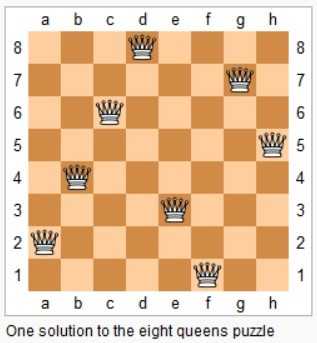 </div><br>

在 n\*n 的矩阵中摆放 n 个皇后，并且每个皇后不能在同一行，同一列，同一对角线上，求所有的 n 皇后的解。

一行一行地摆放，在确定一行中的那个皇后应该摆在哪一列时，需要用三个标记数组来确定某一列是否合法，这三个标记数组分别为：列标记数组、45 度对角线标记数组和 135 度对角线标记数组。

45 度对角线标记数组的长度为 2 \* n - 1，通过下图可以明确 (r, c) 的位置所在的数组下标为 r + c。

<div align="center"> 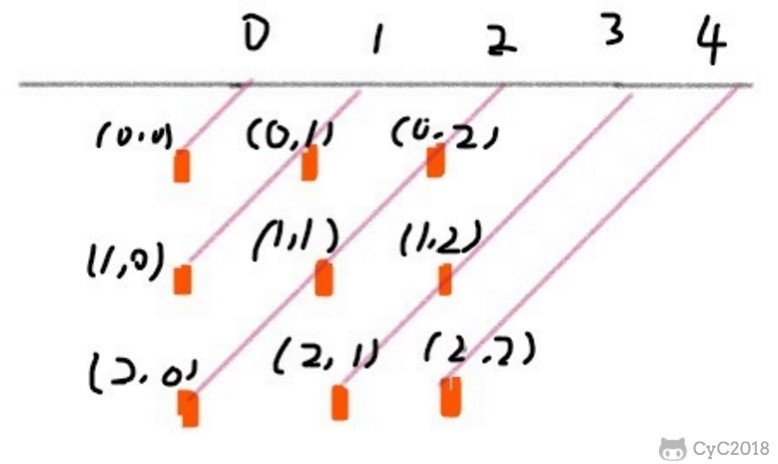 </div><br>


135 度对角线标记数组的长度也是 2 \* n - 1，(r, c) 的位置所在的数组下标为 n - 1 - (r - c)。

<div align="center"> 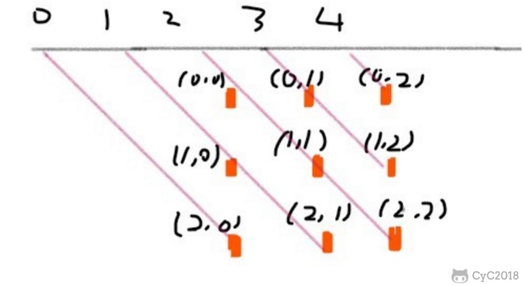 </div><br>

```java
private List<List<String>> solutions;
private char[][] nQueens;
private boolean[] colUsed;
private boolean[] diagonals45Used;
private boolean[] diagonals135Used;
private int n;

public List<List<String>> solveNQueens(int n) {
    solutions = new ArrayList<>();
    nQueens = new char[n][n];
    for (int i = 0; i < n; i++) {
        Arrays.fill(nQueens[i], '.');
    }
    colUsed = new boolean[n];
    diagonals45Used = new boolean[2 * n - 1];
    diagonals135Used = new boolean[2 * n - 1];
    this.n = n;
    backtracking(0);
    return solutions;
}

private void backtracking(int row) {
    if (row == n) {
        List<String> list = new ArrayList<>();
        for (char[] chars : nQueens) {
            list.add(new String(chars));
        }
        solutions.add(list);
        return;
    }

    for (int col = 0; col < n; col++) {
        int diagonals45Idx = row + col;
        int diagonals135Idx = n - 1 - (row - col);
        if (colUsed[col] || diagonals45Used[diagonals45Idx] || diagonals135Used[diagonals135Idx]) {
            continue;
        }
        nQueens[row][col] = 'Q';
        colUsed[col] = diagonals45Used[diagonals45Idx] = diagonals135Used[diagonals135Idx] = true;
        backtracking(row + 1);
        colUsed[col] = diagonals45Used[diagonals45Idx] = diagonals135Used[diagonals135Idx] = false;
        nQueens[row][col] = '.';
    }
}
```


### 动态规划


递归和动态规划都是将原问题拆成多个子问题然后求解，他们之间最本质的区别是，动态规划保存了子问题的解，避免重复计算。

#### 斐波那契数列

##### 爬楼梯

[70. Climbing Stairs (Easy)](https://leetcode.com/problems/climbing-stairs/description/)

题目描述：有 N 阶楼梯，每次可以上一阶或者两阶，求有多少种上楼梯的方法。

定义一个数组 dp 存储上楼梯的方法数（为了方便讨论，数组下标从 1 开始），dp[i] 表示走到第 i 个楼梯的方法数目。

第 i 个楼梯可以从第 i-1 和 i-2 个楼梯再走一步到达，走到第 i 个楼梯的方法数为走到第 i-1 和第 i-2 个楼梯的方法数之和。

<!--<div align="center"></div> <br>-->

<div align="center"> 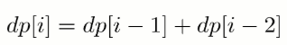 </div><br>


考虑到 dp[i] 只与 dp[i - 1] 和 dp[i - 2] 有关，因此可以只用两个变量来存储 dp[i - 1] 和 dp[i - 2]，使得原来的 O(N) 空间复杂度优化为 O(1) 复杂度。

```java
public int climbStairs(int n) {
    if (n <= 2) {
        return n;
    }
    int pre2 = 1, pre1 = 2;
    for (int i = 2; i < n; i++) {
        int cur = pre1 + pre2;
        pre2 = pre1;
        pre1 = cur;
    }
    return pre1;
}
```

##### 强盗抢劫

[198. House Robber (Easy)](https://leetcode.com/problems/house-robber/description/)

题目描述：抢劫一排住户，但是不能抢邻近的住户，求最大抢劫量。

定义 dp 数组用来存储最大的抢劫量，其中 dp[i] 表示抢到第 i 个住户时的最大抢劫量。

由于不能抢劫邻近住户，如果抢劫了第 i -1 个住户，那么就不能再抢劫第 i 个住户，所以

<!--<div align="center"></div> <br>-->

<div align="center">  </div><br>


```java
public int rob(int[] nums) {
    int pre2 = 0, pre1 = 0;
    for (int i = 0; i < nums.length; i++) {
        int cur = Math.max(pre2 + nums[i], pre1);
        pre2 = pre1;
        pre1 = cur;
    }
    return pre1;
}
```

##### 强盗在环形街区抢劫

[213. House Robber II (Medium)](https://leetcode.com/problems/house-robber-ii/description/)

```java
public int rob(int[] nums) {
    if (nums == null || nums.length == 0) {
        return 0;
    }
    int n = nums.length;
    if (n == 1) {
        return nums[0];
    }
    return Math.max(rob(nums, 0, n - 2), rob(nums, 1, n - 1));
}

private int rob(int[] nums, int first, int last) {
    int pre2 = 0, pre1 = 0;
    for (int i = first; i <= last; i++) {
        int cur = Math.max(pre1, pre2 + nums[i]);
        pre2 = pre1;
        pre1 = cur;
    }
    return pre1;
}
```

##### 信件错排

题目描述：有 N 个 信 和 信封，它们被打乱，求错误装信方式的数量。

定义一个数组 dp 存储错误方式数量，dp[i] 表示前 i 个信和信封的错误方式数量。假设第 i 个信装到第 j 个信封里面，而第 j 个信装到第 k 个信封里面。根据 i 和 k 是否相等，有两种情况：

- i==k，交换 i 和 k 的信后，它们的信和信封在正确的位置，但是其余 i-2 封信有 dp[i-2] 种错误装信的方式。由于 j 有 i-1 种取值，因此共有 (i-1)\*dp[i-2] 种错误装信方式。
- i != k，交换 i 和 j 的信后，第 i 个信和信封在正确的位置，其余 i-1 封信有 dp[i-1] 种错误装信方式。由于 j 有 i-1 种取值，因此共有 (i-1)\*dp[i-1] 种错误装信方式。

综上所述，错误装信数量方式数量为：

<!--<div align="center"></div> <br>-->

<div align="center">  </div><br>

##### 母牛生产

[程序员代码面试指南-P181](#)

题目描述：假设农场中成熟的母牛每年都会生 1 头小母牛，并且永远不会死。第一年有 1 只小母牛，从第二年开始，母牛开始生小母牛。每只小母牛 3 年之后成熟又可以生小母牛。给定整数 N，求 N 年后牛的数量。

第 i 年成熟的牛的数量为：

<!--<div align="center"></div> <br>-->

<div align="center">  </div><br>

#### 矩阵路径

##### 矩阵的最小路径和

[64. Minimum Path Sum (Medium)](https://leetcode.com/problems/minimum-path-sum/description/)

```html
[[1,3,1],
 [1,5,1],
 [4,2,1]]
Given the above grid map, return 7. Because the path 1→3→1→1→1 minimizes the sum.
```

题目描述：求从矩阵的左上角到右下角的最小路径和，每次只能向右和向下移动。

```java
public int minPathSum(int[][] grid) {
    if (grid.length == 0 || grid[0].length == 0) {
        return 0;
    }
    int m = grid.length, n = grid[0].length;
    int[] dp = new int[n];
    for (int i = 0; i < m; i++) {
        for (int j = 0; j < n; j++) {
            if (j == 0) {
                dp[j] = dp[j];        // 只能从上侧走到该位置
            } else if (i == 0) {
                dp[j] = dp[j - 1];    // 只能从左侧走到该位置
            } else {
                dp[j] = Math.min(dp[j - 1], dp[j]);
            }
            dp[j] += grid[i][j];
        }
    }
    return dp[n - 1];
}
```

##### 矩阵的总路径数

[62. Unique Paths (Medium)](https://leetcode.com/problems/unique-paths/description/)

题目描述：统计从矩阵左上角到右下角的路径总数，每次只能向右或者向下移动。

<div align="center">  </div><br>

```java
public int uniquePaths(int m, int n) {
    int[] dp = new int[n];
    Arrays.fill(dp, 1);
    for (int i = 1; i < m; i++) {
        for (int j = 1; j < n; j++) {
            dp[j] = dp[j] + dp[j - 1];
        }
    }
    return dp[n - 1];
}
```

也可以直接用数学公式求解，这是一个组合问题。机器人总共移动的次数 S=m+n-2，向下移动的次数 D=m-1，那么问题可以看成从 S 中取出 D 个位置的组合数量，这个问题的解为 C(S, D)。

```java
public int uniquePaths(int m, int n) {
    int S = m + n - 2;  // 总共的移动次数
    int D = m - 1;      // 向下的移动次数
    long ret = 1;
    for (int i = 1; i <= D; i++) {
        ret = ret * (S - D + i) / i;
    }
    return (int) ret;
}
```

#### 数组区间

##### 数组区间和

[303. Range Sum Query - Immutable (Easy)](https://leetcode.com/problems/range-sum-query-immutable/description/)

```html
Given nums = [-2, 0, 3, -5, 2, -1]

sumRange(0, 2) -> 1
sumRange(2, 5) -> -1
sumRange(0, 5) -> -3
```

求区间 i \~ j 的和，可以转换为 sum[j + 1] - sum[i]，其中 sum[i] 为 0 \~ i - 1 的和。

```java
class NumArray {

    private int[] sums;

    public NumArray(int[] nums) {
        sums = new int[nums.length + 1];
        for (int i = 1; i <= nums.length; i++) {
            sums[i] = sums[i - 1] + nums[i - 1];
        }
    }

    public int sumRange(int i, int j) {
        return sums[j + 1] - sums[i];
    }
}
```

##### 数组中等差递增子区间的个数

[413. Arithmetic Slices (Medium)](https://leetcode.com/problems/arithmetic-slices/description/)

```html
A = [1, 2, 3, 4]
return: 3, for 3 arithmetic slices in A: [1, 2, 3], [2, 3, 4] and [1, 2, 3, 4] itself.
```

dp[i] 表示以 A[i] 为结尾的等差递增子区间的个数。

在 A[i] - A[i - 1] == A[i - 1] - A[i - 2] 的条件下，{A[i - 2], A[i - 1], A[i]} 是一个等差递增子区间。如果 {A[i - 3], A[i - 2], A[i - 1]} 是一个等差递增子区间，那么 {A[i - 3], A[i - 2], A[i - 1], A[i]} 也是等差递增子区间，dp[i] = dp[i-1] + 1。

```java
public int numberOfArithmeticSlices(int[] A) {
    if (A == null || A.length == 0) {
        return 0;
    }
    int n = A.length;
    int[] dp = new int[n];
    for (int i = 2; i < n; i++) {
        if (A[i] - A[i - 1] == A[i - 1] - A[i - 2]) {
            dp[i] = dp[i - 1] + 1;
        }
    }
    int total = 0;
    for (int cnt : dp) {
        total += cnt;
    }
    return total;
}
```

#### 分割整数

##### 分割整数的最大乘积

[343. Integer Break (Medim)](https://leetcode.com/problems/integer-break/description/)

题目描述：For example, given n = 2, return 1 (2 = 1 + 1); given n = 10, return 36 (10 = 3 + 3 + 4).

```java
public int integerBreak(int n) {
    int[] dp = new int[n + 1];
    dp[1] = 1;
    for (int i = 2; i <= n; i++) {
        for (int j = 1; j <= i - 1; j++) {
            dp[i] = Math.max(dp[i], Math.max(j * dp[i - j], j * (i - j)));
        }
    }
    return dp[n];
}
```

##### 按平方数来分割整数

[279. Perfect Squares(Medium)](https://leetcode.com/problems/perfect-squares/description/)

题目描述：For example, given n = 12, return 3 because 12 = 4 + 4 + 4; given n = 13, return 2 because 13 = 4 + 9.

```java
public int numSquares(int n) {
    List<Integer> squareList = generateSquareList(n);
    int[] dp = new int[n + 1];
    for (int i = 1; i <= n; i++) {
        int min = Integer.MAX_VALUE;
        for (int square : squareList) {
            if (square > i) {
                break;
            }
            min = Math.min(min, dp[i - square] + 1);
        }
        dp[i] = min;
    }
    return dp[n];
}

private List<Integer> generateSquareList(int n) {
    List<Integer> squareList = new ArrayList<>();
    int diff = 3;
    int square = 1;
    while (square <= n) {
        squareList.add(square);
        square += diff;
        diff += 2;
    }
    return squareList;
}
```

##### 分割整数构成字母字符串

[91. Decode Ways (Medium)](https://leetcode.com/problems/decode-ways/description/)

题目描述：Given encoded message "12", it could be decoded as "AB" (1 2) or "L" (12).

```java
public int numDecodings(String s) {
    if (s == null || s.length() == 0) {
        return 0;
    }
    int n = s.length();
    int[] dp = new int[n + 1];
    dp[0] = 1;
    dp[1] = s.charAt(0) == '0' ? 0 : 1;
    for (int i = 2; i <= n; i++) {
        int one = Integer.valueOf(s.substring(i - 1, i));
        if (one != 0) {
            dp[i] += dp[i - 1];
        }
        if (s.charAt(i - 2) == '0') {
            continue;
        }
        int two = Integer.valueOf(s.substring(i - 2, i));
        if (two <= 26) {
            dp[i] += dp[i - 2];
        }
    }
    return dp[n];
}
```

#### 最长递增子序列

已知一个序列 {S<sub>1</sub>, S<sub>2</sub>,...,S<sub>n</sub>}，取出若干数组成新的序列 {S<sub>i1</sub>, S<sub>i2</sub>,..., S<sub>im</sub>}，其中 i1、i2 ... im 保持递增，即新序列中各个数仍然保持原数列中的先后顺序，称新序列为原序列的一个 **子序列** 。

如果在子序列中，当下标 ix > iy 时，S<sub>ix</sub> > S<sub>iy</sub>，称子序列为原序列的一个 **递增子序列** 。

定义一个数组 dp 存储最长递增子序列的长度，dp[n] 表示以 S<sub>n</sub> 结尾的序列的最长递增子序列长度。对于一个递增子序列 {S<sub>i1</sub>, S<sub>i2</sub>,...,S<sub>im</sub>}，如果 im < n 并且 S<sub>im</sub> < S<sub>n</sub>，此时 {S<sub>i1</sub>, S<sub>i2</sub>,..., S<sub>im</sub>, S<sub>n</sub>} 为一个递增子序列，递增子序列的长度增加 1。满足上述条件的递增子序列中，长度最长的那个递增子序列就是要找的，在长度最长的递增子序列上加上 S<sub>n</sub> 就构成了以 S<sub>n</sub> 为结尾的最长递增子序列。因此 dp[n] = max{ dp[i]+1 | S<sub>i</sub> < S<sub>n</sub> && i < n} 。

因为在求 dp[n] 时可能无法找到一个满足条件的递增子序列，此时 {S<sub>n</sub>} 就构成了递增子序列，需要对前面的求解方程做修改，令 dp[n] 最小为 1，即：

<!--<div align="center"></div> <br>-->

<div align="center">  </div><br>

对于一个长度为 N 的序列，最长递增子序列并不一定会以 S<sub>N</sub> 为结尾，因此 dp[N] 不是序列的最长递增子序列的长度，需要遍历 dp 数组找出最大值才是所要的结果，max{ dp[i] | 1 <= i <= N} 即为所求。

##### 最长递增子序列

[300. Longest Increasing Subsequence (Medium)](https://leetcode.com/problems/longest-increasing-subsequence/description/)

```java
public int lengthOfLIS(int[] nums) {
    int n = nums.length;
    int[] dp = new int[n];
    for (int i = 0; i < n; i++) {
        int max = 1;
        for (int j = 0; j < i; j++) {
            if (nums[i] > nums[j]) {
                max = Math.max(max, dp[j] + 1);
            }
        }
        dp[i] = max;
    }
    return Arrays.stream(dp).max().orElse(0);
}
```

使用 Stream 求最大值会导致运行时间过长，可以改成以下形式：

```java
int ret = 0;
for (int i = 0; i < n; i++) {
    ret = Math.max(ret, dp[i]);
}
return ret;
```

以上解法的时间复杂度为 O(N<sup>2</sup>)，可以使用二分查找将时间复杂度降低为 O(NlogN)。

定义一个 tails 数组，其中 tails[i] 存储长度为 i + 1 的最长递增子序列的最后一个元素。对于一个元素 x，

- 如果它大于 tails 数组所有的值，那么把它添加到 tails 后面，表示最长递增子序列长度加 1；
- 如果 tails[i-1] < x <= tails[i]，那么更新 tails[i] = x。

例如对于数组 [4,3,6,5]，有：

```html
tails      len      num
[]         0        4
[4]        1        3
[3]        1        6
[3,6]      2        5
[3,5]      2        null
```

可以看出 tails 数组保持有序，因此在查找 S<sub>i</sub> 位于 tails 数组的位置时就可以使用二分查找。

```java
public int lengthOfLIS(int[] nums) {
    int n = nums.length;
    int[] tails = new int[n];
    int len = 0;
    for (int num : nums) {
        int index = binarySearch(tails, len, num);
        tails[index] = num;
        if (index == len) {
            len++;
        }
    }
    return len;
}

private int binarySearch(int[] tails, int len, int key) {
    int l = 0, h = len;
    while (l < h) {
        int mid = l + (h - l) / 2;
        if (tails[mid] == key) {
            return mid;
        } else if (tails[mid] > key) {
            h = mid;
        } else {
            l = mid + 1;
        }
    }
    return l;
}
```

##### 一组整数对能够构成的最长链

[646. Maximum Length of Pair Chain (Medium)](https://leetcode.com/problems/maximum-length-of-pair-chain/description/)

```html
Input: [[1,2], [2,3], [3,4]]
Output: 2
Explanation: The longest chain is [1,2] -> [3,4]
```

题目描述：对于 (a, b) 和 (c, d) ，如果 b < c，则它们可以构成一条链。

```java
public int findLongestChain(int[][] pairs) {
    if (pairs == null || pairs.length == 0) {
        return 0;
    }
    Arrays.sort(pairs, (a, b) -> (a[0] - b[0]));
    int n = pairs.length;
    int[] dp = new int[n];
    Arrays.fill(dp, 1);
    for (int i = 1; i < n; i++) {
        for (int j = 0; j < i; j++) {
            if (pairs[j][1] < pairs[i][0]) {
                dp[i] = Math.max(dp[i], dp[j] + 1);
            }
        }
    }
    return Arrays.stream(dp).max().orElse(0);
}
```

##### 最长摆动子序列

[376. Wiggle Subsequence (Medium)](https://leetcode.com/problems/wiggle-subsequence/description/)

```html
Input: [1,7,4,9,2,5]
Output: 6
The entire sequence is a wiggle sequence.

Input: [1,17,5,10,13,15,10,5,16,8]
Output: 7
There are several subsequences that achieve this length. One is [1,17,10,13,10,16,8].

Input: [1,2,3,4,5,6,7,8,9]
Output: 2
```

要求：使用 O(N) 时间复杂度求解。

```java
public int wiggleMaxLength(int[] nums) {
    if (nums == null || nums.length == 0) {
        return 0;
    }
    int up = 1, down = 1;
    for (int i = 1; i < nums.length; i++) {
        if (nums[i] > nums[i - 1]) {
            up = down + 1;
        } else if (nums[i] < nums[i - 1]) {
            down = up + 1;
        }
    }
    return Math.max(up, down);
}
```

#### 最长公共子序列

对于两个子序列 S1 和 S2，找出它们最长的公共子序列。

定义一个二维数组 dp 用来存储最长公共子序列的长度，其中 dp[i][j] 表示 S1 的前 i 个字符与 S2 的前 j 个字符最长公共子序列的长度。考虑 S1<sub>i</sub> 与 S2<sub>j</sub> 值是否相等，分为两种情况：

- 当 S1<sub>i</sub>==S2<sub>j</sub> 时，那么就能在 S1 的前 i-1 个字符与 S2 的前 j-1 个字符最长公共子序列的基础上再加上 S1<sub>i</sub> 这个值，最长公共子序列长度加 1，即 dp[i][j] = dp[i-1][j-1] + 1。
- 当 S1<sub>i</sub> != S2<sub>j</sub> 时，此时最长公共子序列为 S1 的前 i-1 个字符和 S2 的前 j 个字符最长公共子序列，或者 S1 的前 i 个字符和 S2 的前 j-1 个字符最长公共子序列，取它们的最大者，即 dp[i][j] = max{ dp[i-1][j], dp[i][j-1] }。

综上，最长公共子序列的状态转移方程为：

<!--<div align="center">S2_j}\end{array}\right." class="mathjax-pic"/></div> <br>-->

<div align="center">  </div><br>

对于长度为 N 的序列 S<sub>1</sub> 和长度为 M 的序列 S<sub>2</sub>，dp[N][M] 就是序列 S<sub>1</sub> 和序列 S<sub>2</sub> 的最长公共子序列长度。

与最长递增子序列相比，最长公共子序列有以下不同点：

- 针对的是两个序列，求它们的最长公共子序列。
- 在最长递增子序列中，dp[i] 表示以 S<sub>i</sub> 为结尾的最长递增子序列长度，子序列必须包含 S<sub>i</sub> ；在最长公共子序列中，dp[i][j] 表示 S1 中前 i 个字符与 S2 中前 j 个字符的最长公共子序列长度，不一定包含 S1<sub>i</sub> 和 S2<sub>j</sub>。
- 在求最终解时，最长公共子序列中 dp[N][M] 就是最终解，而最长递增子序列中 dp[N] 不是最终解，因为以 S<sub>N</sub> 为结尾的最长递增子序列不一定是整个序列最长递增子序列，需要遍历一遍 dp 数组找到最大者。

```java
public int lengthOfLCS(int[] nums1, int[] nums2) {
    int n1 = nums1.length, n2 = nums2.length;
    int[][] dp = new int[n1 + 1][n2 + 1];
    for (int i = 1; i <= n1; i++) {
        for (int j = 1; j <= n2; j++) {
            if (nums1[i - 1] == nums2[j - 1]) {
                dp[i][j] = dp[i - 1][j - 1] + 1;
            } else {
                dp[i][j] = Math.max(dp[i - 1][j], dp[i][j - 1]);
            }
        }
    }
    return dp[n1][n2];
}
```

#### 0-1 背包

有一个容量为 N 的背包，要用这个背包装下物品的价值最大，这些物品有两个属性：体积 w 和价值 v。

定义一个二维数组 dp 存储最大价值，其中 dp[i][j] 表示前 i 件物品体积不超过 j 的情况下能达到的最大价值。设第 i 件物品体积为 w，价值为 v，根据第 i 件物品是否添加到背包中，可以分两种情况讨论：

- 第 i 件物品没添加到背包，总体积不超过 j 的前 i 件物品的最大价值就是总体积不超过 j 的前 i-1 件物品的最大价值，dp[i][j] = dp[i-1][j]。
- 第 i 件物品添加到背包中，dp[i][j] = dp[i-1][j-w] + v。

第 i 件物品可添加也可以不添加，取决于哪种情况下最大价值更大。因此，0-1 背包的状态转移方程为：

<!--<div align="center"></div> <br>-->

<div align="center"> 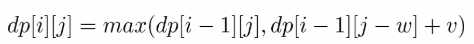 </div><br>

```java
public int knapsack(int W, int N, int[] weights, int[] values) {
    int[][] dp = new int[N + 1][W + 1];
    for (int i = 1; i <= N; i++) {
        int w = weights[i - 1], v = values[i - 1];
        for (int j = 1; j <= W; j++) {
            if (j >= w) {
                dp[i][j] = Math.max(dp[i - 1][j], dp[i - 1][j - w] + v);
            } else {
                dp[i][j] = dp[i - 1][j];
            }
        }
    }
    return dp[N][W];
}
```

##### 空间优化

在程序实现时可以对 0-1 背包做优化。观察状态转移方程可以知道，前 i 件物品的状态仅与前 i-1 件物品的状态有关，因此可以将 dp 定义为一维数组，其中 dp[j] 既可以表示 dp[i-1][j] 也可以表示 dp[i][j]。此时，

<!--<div align="center"></div> <br>-->

<div align="center">  </div><br>

因为 dp[j-w] 表示 dp[i-1][j-w]，因此不能先求 dp[i][j-w]，以防将 dp[i-1][j-w] 覆盖。也就是说要先计算 dp[i][j] 再计算 dp[i][j-w]，在程序实现时需要按倒序来循环求解。

```java
public int knapsack(int W, int N, int[] weights, int[] values) {
    int[] dp = new int[W + 1];
    for (int i = 1; i <= N; i++) {
        int w = weights[i - 1], v = values[i - 1];
        for (int j = W; j >= 1; j--) {
            if (j >= w) {
                dp[j] = Math.max(dp[j], dp[j - w] + v);
            }
        }
    }
    return dp[W];
}
```

##### 无法使用贪心算法的解释

0-1 背包问题无法使用贪心算法来求解，也就是说不能按照先添加性价比最高的物品来达到最优，这是因为这种方式可能造成背包空间的浪费，从而无法达到最优。考虑下面的物品和一个容量为 5 的背包，如果先添加物品 0 再添加物品 1，那么只能存放的价值为 16，浪费了大小为 2 的空间。最优的方式是存放物品 1 和物品 2，价值为 22.

| id | w | v | v/w |
| --- | --- | --- | --- |
| 0 | 1 | 6 | 6 |
| 1 | 2 | 10 | 5 |
| 2 | 3 | 12 | 4 |

##### 变种

- 完全背包：物品数量为无限个

- 多重背包：物品数量有限制

- 多维费用背包：物品不仅有重量，还有体积，同时考虑这两种限制

- 其它：物品之间相互约束或者依赖

##### 划分数组为和相等的两部分

[416. Partition Equal Subset Sum (Medium)](https://leetcode.com/problems/partition-equal-subset-sum/description/)

```html
Input: [1, 5, 11, 5]

Output: true

Explanation: The array can be partitioned as [1, 5, 5] and [11].
```

可以看成一个背包大小为 sum/2 的 0-1 背包问题。

```java
public boolean canPartition(int[] nums) {
    int sum = computeArraySum(nums);
    if (sum % 2 != 0) {
        return false;
    }
    int W = sum / 2;
    boolean[] dp = new boolean[W + 1];
    dp[0] = true;
    for (int num : nums) {                 // 0-1 背包一个物品只能用一次
        for (int i = W; i >= num; i--) {   // 从后往前，先计算 dp[i] 再计算 dp[i-num]
            dp[i] = dp[i] || dp[i - num];
        }
    }
    return dp[W];
}

private int computeArraySum(int[] nums) {
    int sum = 0;
    for (int num : nums) {
        sum += num;
    }
    return sum;
}
```

##### 改变一组数的正负号使得它们的和为一给定数

[494. Target Sum (Medium)](https://leetcode.com/problems/target-sum/description/)

```html
Input: nums is [1, 1, 1, 1, 1], S is 3.
Output: 5
Explanation:

-1+1+1+1+1 = 3
+1-1+1+1+1 = 3
+1+1-1+1+1 = 3
+1+1+1-1+1 = 3
+1+1+1+1-1 = 3

There are 5 ways to assign symbols to make the sum of nums be target 3.
```

该问题可以转换为 Subset Sum 问题，从而使用 0-1 背包的方法来求解。

可以将这组数看成两部分，P 和 N，其中 P 使用正号，N 使用负号，有以下推导：

```html
                  sum(P) - sum(N) = target
sum(P) + sum(N) + sum(P) - sum(N) = target + sum(P) + sum(N)
                       2 * sum(P) = target + sum(nums)
```

因此只要找到一个子集，令它们都取正号，并且和等于 (target + sum(nums))/2，就证明存在解。

```java
public int findTargetSumWays(int[] nums, int S) {
    int sum = computeArraySum(nums);
    if (sum < S || (sum + S) % 2 == 1) {
        return 0;
    }
    int W = (sum + S) / 2;
    int[] dp = new int[W + 1];
    dp[0] = 1;
    for (int num : nums) {
        for (int i = W; i >= num; i--) {
            dp[i] = dp[i] + dp[i - num];
        }
    }
    return dp[W];
}

private int computeArraySum(int[] nums) {
    int sum = 0;
    for (int num : nums) {
        sum += num;
    }
    return sum;
}
```

DFS 解法：

```java
public int findTargetSumWays(int[] nums, int S) {
    return findTargetSumWays(nums, 0, S);
}

private int findTargetSumWays(int[] nums, int start, int S) {
    if (start == nums.length) {
        return S == 0 ? 1 : 0;
    }
    return findTargetSumWays(nums, start + 1, S + nums[start])
            + findTargetSumWays(nums, start + 1, S - nums[start]);
}
```

##### 01 字符构成最多的字符串

[474. Ones and Zeroes (Medium)](https://leetcode.com/problems/ones-and-zeroes/description/)

```html
Input: Array = {"10", "0001", "111001", "1", "0"}, m = 5, n = 3
Output: 4

Explanation: There are totally 4 strings can be formed by the using of 5 0s and 3 1s, which are "10","0001","1","0"
```

这是一个多维费用的 0-1 背包问题，有两个背包大小，0 的数量和 1 的数量。

```java
public int findMaxForm(String[] strs, int m, int n) {
    if (strs == null || strs.length == 0) {
        return 0;
    }
    int[][] dp = new int[m + 1][n + 1];
    for (String s : strs) {    // 每个字符串只能用一次
        int ones = 0, zeros = 0;
        for (char c : s.toCharArray()) {
            if (c == '0') {
                zeros++;
            } else {
                ones++;
            }
        }
        for (int i = m; i >= zeros; i--) {
            for (int j = n; j >= ones; j--) {
                dp[i][j] = Math.max(dp[i][j], dp[i - zeros][j - ones] + 1);
            }
        }
    }
    return dp[m][n];
}
```

##### 找零钱的最少硬币数

[322. Coin Change (Medium)](https://leetcode.com/problems/coin-change/description/)

```html
Example 1:
coins = [1, 2, 5], amount = 11
return 3 (11 = 5 + 5 + 1)

Example 2:
coins = [2], amount = 3
return -1.
```

题目描述：给一些面额的硬币，要求用这些硬币来组成给定面额的钱数，并且使得硬币数量最少。硬币可以重复使用。

- 物品：硬币
- 物品大小：面额
- 物品价值：数量

因为硬币可以重复使用，因此这是一个完全背包问题。完全背包只需要将 0-1 背包中逆序遍历 dp 数组改为正序遍历即可。

```java
public int coinChange(int[] coins, int amount) {
    if (amount == 0 || coins == null || coins.length == 0) {
        return 0;
    }
    int[] dp = new int[amount + 1];
    for (int coin : coins) {
        for (int i = coin; i <= amount; i++) { //将逆序遍历改为正序遍历
            if (i == coin) {
                dp[i] = 1;
            } else if (dp[i] == 0 && dp[i - coin] != 0) {
                dp[i] = dp[i - coin] + 1;
            } else if (dp[i - coin] != 0) {
                dp[i] = Math.min(dp[i], dp[i - coin] + 1);
            }
        }
    }
    return dp[amount] == 0 ? -1 : dp[amount];
}
```

##### 找零钱的硬币数组合

[518\. Coin Change 2 (Medium)](https://leetcode.com/problems/coin-change-2/description/)

```text-html-basic
Input: amount = 5, coins = [1, 2, 5]
Output: 4
Explanation: there are four ways to make up the amount:
5=5
5=2+2+1
5=2+1+1+1
5=1+1+1+1+1
```

完全背包问题，使用 dp 记录可达成目标的组合数目。

```java
public int change(int amount, int[] coins) {
    if (amount == 0 || coins == null || coins.length == 0) {
        return 0;
    }
    int[] dp = new int[amount + 1];
    dp[0] = 1;
    for (int coin : coins) {
        for (int i = coin; i <= amount; i++) {
            dp[i] += dp[i - coin];
        }
    }
    return dp[amount];
}
```

##### 字符串按单词列表分割

[139. Word Break (Medium)](https://leetcode.com/problems/word-break/description/)

```html
s = "leetcode",
dict = ["leet", "code"].
Return true because "leetcode" can be segmented as "leet code".
```

dict 中的单词没有使用次数的限制，因此这是一个完全背包问题。该问题涉及到字典中单词的使用顺序，因此可理解为涉及顺序的完全背包问题。

求解顺序的完全背包问题时，对物品的迭代应该放在最里层。

```java
public boolean wordBreak(String s, List<String> wordDict) {
    int n = s.length();
    boolean[] dp = new boolean[n + 1];
    dp[0] = true;
    for (int i = 1; i <= n; i++) {
        for (String word : wordDict) {   // 对物品的迭代应该放在最里层
            int len = word.length();
            if (len <= i && word.equals(s.substring(i - len, i))) {
                dp[i] = dp[i] || dp[i - len];
            }
        }
    }
    return dp[n];
}
```

##### 组合总和

[377. Combination Sum IV (Medium)](https://leetcode.com/problems/combination-sum-iv/description/)

```html
nums = [1, 2, 3]
target = 4

The possible combination ways are:
(1, 1, 1, 1)
(1, 1, 2)
(1, 2, 1)
(1, 3)
(2, 1, 1)
(2, 2)
(3, 1)

Note that different sequences are counted as different combinations.

Therefore the output is 7.
```

涉及顺序的完全背包。

```java
public int combinationSum4(int[] nums, int target) {
    if (nums == null || nums.length == 0) {
        return 0;
    }
    int[] maximum = new int[target + 1];
    maximum[0] = 1;
    Arrays.sort(nums);
    for (int i = 1; i <= target; i++) {
        for (int j = 0; j < nums.length && nums[j] <= i; j++) {
            maximum[i] += maximum[i - nums[j]];
        }
    }
    return maximum[target];
}
```

#### 股票交易

##### 需要冷却期的股票交易

[309. Best Time to Buy and Sell Stock with Cooldown(Medium)](https://leetcode.com/problems/best-time-to-buy-and-sell-stock-with-cooldown/description/)

题目描述：交易之后需要有一天的冷却时间。

<div align="center">  </div><br>

```java
public int maxProfit(int[] prices) {
    if (prices == null || prices.length == 0) {
        return 0;
    }
    int N = prices.length;
    int[] buy = new int[N];
    int[] s1 = new int[N];
    int[] sell = new int[N];
    int[] s2 = new int[N];
    s1[0] = buy[0] = -prices[0];
    sell[0] = s2[0] = 0;
    for (int i = 1; i < N; i++) {
        buy[i] = s2[i - 1] - prices[i];
        s1[i] = Math.max(buy[i - 1], s1[i - 1]);
        sell[i] = Math.max(buy[i - 1], s1[i - 1]) + prices[i];
        s2[i] = Math.max(s2[i - 1], sell[i - 1]);
    }
    return Math.max(sell[N - 1], s2[N - 1]);
}
```

##### 需要交易费用的股票交易

[714. Best Time to Buy and Sell Stock with Transaction Fee (Medium)](https://leetcode.com/problems/best-time-to-buy-and-sell-stock-with-transaction-fee/description/)

```html
Input: prices = [1, 3, 2, 8, 4, 9], fee = 2
Output: 8
Explanation: The maximum profit can be achieved by:
Buying at prices[0] = 1
Selling at prices[3] = 8
Buying at prices[4] = 4
Selling at prices[5] = 9
The total profit is ((8 - 1) - 2) + ((9 - 4) - 2) = 8.
```

题目描述：每交易一次，都要支付一定的费用。

<div align="center">  </div><br>

```java
public int maxProfit(int[] prices, int fee) {
    int N = prices.length;
    int[] buy = new int[N];
    int[] s1 = new int[N];
    int[] sell = new int[N];
    int[] s2 = new int[N];
    s1[0] = buy[0] = -prices[0];
    sell[0] = s2[0] = 0;
    for (int i = 1; i < N; i++) {
        buy[i] = Math.max(sell[i - 1], s2[i - 1]) - prices[i];
        s1[i] = Math.max(buy[i - 1], s1[i - 1]);
        sell[i] = Math.max(buy[i - 1], s1[i - 1]) - fee + prices[i];
        s2[i] = Math.max(s2[i - 1], sell[i - 1]);
    }
    return Math.max(sell[N - 1], s2[N - 1]);
}
```


##### 只能进行两次的股票交易

[123. Best Time to Buy and Sell Stock III (Hard)](https://leetcode.com/problems/best-time-to-buy-and-sell-stock-iii/description/)

```java
public int maxProfit(int[] prices) {
    int firstBuy = Integer.MIN_VALUE, firstSell = 0;
    int secondBuy = Integer.MIN_VALUE, secondSell = 0;
    for (int curPrice : prices) {
        if (firstBuy < -curPrice) {
            firstBuy = -curPrice;
        }
        if (firstSell < firstBuy + curPrice) {
            firstSell = firstBuy + curPrice;
        }
        if (secondBuy < firstSell - curPrice) {
            secondBuy = firstSell - curPrice;
        }
        if (secondSell < secondBuy + curPrice) {
            secondSell = secondBuy + curPrice;
        }
    }
    return secondSell;
}
```

##### 只能进行 k 次的股票交易

[188. Best Time to Buy and Sell Stock IV (Hard)](https://leetcode.com/problems/best-time-to-buy-and-sell-stock-iv/description/)

```java
public int maxProfit(int k, int[] prices) {
    int n = prices.length;
    if (k >= n / 2) {   // 这种情况下该问题退化为普通的股票交易问题
        int maxProfit = 0;
        for (int i = 1; i < n; i++) {
            if (prices[i] > prices[i - 1]) {
                maxProfit += prices[i] - prices[i - 1];
            }
        }
        return maxProfit;
    }
    int[][] maxProfit = new int[k + 1][n];
    for (int i = 1; i <= k; i++) {
        int localMax = maxProfit[i - 1][0] - prices[0];
        for (int j = 1; j < n; j++) {
            maxProfit[i][j] = Math.max(maxProfit[i][j - 1], prices[j] + localMax);
            localMax = Math.max(localMax, maxProfit[i - 1][j] - prices[j]);
        }
    }
    return maxProfit[k][n - 1];
}
```

#### 字符串编辑

##### 删除两个字符串的字符使它们相等

[583. Delete Operation for Two Strings (Medium)](https://leetcode.com/problems/delete-operation-for-two-strings/description/)

```html
Input: "sea", "eat"
Output: 2
Explanation: You need one step to make "sea" to "ea" and another step to make "eat" to "ea".
```

可以转换为求两个字符串的最长公共子序列问题。

```java
public int minDistance(String word1, String word2) {
    int m = word1.length(), n = word2.length();
    int[][] dp = new int[m + 1][n + 1];
    for (int i = 1; i <= m; i++) {
        for (int j = 1; j <= n; j++) {
            if (word1.charAt(i - 1) == word2.charAt(j - 1)) {
                dp[i][j] = dp[i - 1][j - 1] + 1;
            } else {
                dp[i][j] = Math.max(dp[i][j - 1], dp[i - 1][j]);
            }
        }
    }
    return m + n - 2 * dp[m][n];
}
```

##### 编辑距离

[72. Edit Distance (Hard)](https://leetcode.com/problems/edit-distance/description/)

```html
Example 1:

Input: word1 = "horse", word2 = "ros"
Output: 3
Explanation:
horse -> rorse (replace 'h' with 'r')
rorse -> rose (remove 'r')
rose -> ros (remove 'e')
Example 2:

Input: word1 = "intention", word2 = "execution"
Output: 5
Explanation:
intention -> inention (remove 't')
inention -> enention (replace 'i' with 'e')
enention -> exention (replace 'n' with 'x')
exention -> exection (replace 'n' with 'c')
exection -> execution (insert 'u')
```

题目描述：修改一个字符串成为另一个字符串，使得修改次数最少。一次修改操作包括：插入一个字符、删除一个字符、替换一个字符。

```java
public int minDistance(String word1, String word2) {
    if (word1 == null || word2 == null) {
        return 0;
    }
    int m = word1.length(), n = word2.length();
    int[][] dp = new int[m + 1][n + 1];
    for (int i = 1; i <= m; i++) {
        dp[i][0] = i;
    }
    for (int i = 1; i <= n; i++) {
        dp[0][i] = i;
    }
    for (int i = 1; i <= m; i++) {
        for (int j = 1; j <= n; j++) {
            if (word1.charAt(i - 1) == word2.charAt(j - 1)) {
                dp[i][j] = dp[i - 1][j - 1];
            } else {
                dp[i][j] = Math.min(dp[i - 1][j - 1], Math.min(dp[i][j - 1], dp[i - 1][j])) + 1;
            }
        }
    }
    return dp[m][n];
}
```

##### 复制粘贴字符

[650. 2 Keys Keyboard (Medium)](https://leetcode.com/problems/2-keys-keyboard/description/)

题目描述：最开始只有一个字符 A，问需要多少次操作能够得到 n 个字符 A，每次操作可以复制当前所有的字符，或者粘贴。

```
Input: 3
Output: 3
Explanation:
Intitally, we have one character 'A'.
In step 1, we use Copy All operation.
In step 2, we use Paste operation to get 'AA'.
In step 3, we use Paste operation to get 'AAA'.
```

```java
public int minSteps(int n) {
    if (n == 1) return 0;
    for (int i = 2; i <= Math.sqrt(n); i++) {
        if (n % i == 0) return i + minSteps(n / i);
    }
    return n;
}
```

```java
public int minSteps(int n) {
    int[] dp = new int[n + 1];
    int h = (int) Math.sqrt(n);
    for (int i = 2; i <= n; i++) {
        dp[i] = i;
        for (int j = 2; j <= h; j++) {
            if (i % j == 0) {
                dp[i] = dp[j] + dp[i / j];
                break;
            }
        }
    }
    return dp[n];
}
```


### 数学


#### 素数分解

每一个数都可以分解成素数的乘积，例如 84 = 2<sup>2</sup> \* 3<sup>1</sup> \* 5<sup>0</sup> \* 7<sup>1</sup> \* 11<sup>0</sup> \* 13<sup>0</sup> \* 17<sup>0</sup> \* …

#### 整除

令 x = 2<sup>m0</sup> \* 3<sup>m1</sup> \* 5<sup>m2</sup> \* 7<sup>m3</sup> \* 11<sup>m4</sup> \* …

令 y = 2<sup>n0</sup> \* 3<sup>n1</sup> \* 5<sup>n2</sup> \* 7<sup>n3</sup> \* 11<sup>n4</sup> \* …

如果 x 整除 y（y mod x == 0），则对于所有 i，mi <= ni。

##### 最大公约数最小公倍数

x 和 y 的最大公约数为：gcd(x,y) =  2<sup>min(m0,n0)</sup> \* 3<sup>min(m1,n1)</sup> \* 5<sup>min(m2,n2)</sup> \* ...

x 和 y 的最小公倍数为：lcm(x,y) =  2<sup>max(m0,n0)</sup> \* 3<sup>max(m1,n1)</sup> \* 5<sup>max(m2,n2)</sup> \* ...

##### 生成素数序列

[204. Count Primes (Easy)](https://leetcode.com/problems/count-primes/description/)

埃拉托斯特尼筛法在每次找到一个素数时，将能被素数整除的数排除掉。

```java
public int countPrimes(int n) {
    boolean[] notPrimes = new boolean[n + 1];
    int count = 0;
    for (int i = 2; i < n; i++) {
        if (notPrimes[i]) {
            continue;
        }
        count++;
        // 从 i * i 开始，因为如果 k < i，那么 k * i 在之前就已经被去除过了
        for (long j = (long) (i) * i; j < n; j += i) {
            notPrimes[(int) j] = true;
        }
    }
    return count;
}
```

###### 最大公约数

```java
int gcd(int a, int b) {
    return b == 0 ? a : gcd(b, a % b);
}
```

最小公倍数为两数的乘积除以最大公约数。

```java
int lcm(int a, int b) {
    return a * b / gcd(a, b);
}
```

##### 使用位操作和减法求解最大公约数

[编程之美：2.7](#)

对于 a 和 b 的最大公约数 f(a, b)，有：

- 如果 a 和 b 均为偶数，f(a, b) = 2\*f(a/2, b/2);
- 如果 a 是偶数 b 是奇数，f(a, b) = f(a/2, b);
- 如果 b 是偶数 a 是奇数，f(a, b) = f(a, b/2);
- 如果 a 和 b 均为奇数，f(a, b) = f(b, a-b);

乘 2 和除 2 都可以转换为移位操作。

```java
public int gcd(int a, int b) {
    if (a < b) {
        return gcd(b, a);
    }
    if (b == 0) {
        return a;
    }
    boolean isAEven = isEven(a), isBEven = isEven(b);
    if (isAEven && isBEven) {
        return 2 * gcd(a >> 1, b >> 1);
    } else if (isAEven && !isBEven) {
        return gcd(a >> 1, b);
    } else if (!isAEven && isBEven) {
        return gcd(a, b >> 1);
    } else {
        return gcd(b, a - b);
    }
}
```

#### 进制转换

##### 7 进制

[504. Base 7 (Easy)](https://leetcode.com/problems/base-7/description/)

```java
public String convertToBase7(int num) {
    if (num == 0) {
        return "0";
    }
    StringBuilder sb = new StringBuilder();
    boolean isNegative = num < 0;
    if (isNegative) {
        num = -num;
    }
    while (num > 0) {
        sb.append(num % 7);
        num /= 7;
    }
    String ret = sb.reverse().toString();
    return isNegative ? "-" + ret : ret;
}
```

Java 中 static String toString(int num, int radix) 可以将一个整数转换为 radix 进制表示的字符串。

```java
public String convertToBase7(int num) {
    return Integer.toString(num, 7);
}
```

##### 16 进制

[405. Convert a Number to Hexadecimal (Easy)](https://leetcode.com/problems/convert-a-number-to-hexadecimal/description/)

```html
Input:
26

Output:
"1a"

Input:
-1

Output:
"ffffffff"
```

负数要用它的补码形式。

```java
public String toHex(int num) {
    char[] map = {'0', '1', '2', '3', '4', '5', '6', '7', '8', '9', 'a', 'b', 'c', 'd', 'e', 'f'};
    if (num == 0) return "0";
    StringBuilder sb = new StringBuilder();
    while (num != 0) {
        sb.append(map[num & 0b1111]);
        num >>>= 4; // 因为考虑的是补码形式，因此符号位就不能有特殊的意义，需要使用无符号右移，左边填 0
    }
    return sb.reverse().toString();
}
```

##### 26 进制

[168. Excel Sheet Column Title (Easy)](https://leetcode.com/problems/excel-sheet-column-title/description/)

```html
1 -> A
2 -> B
3 -> C
...
26 -> Z
27 -> AA
28 -> AB
```

因为是从 1 开始计算的，而不是从 0 开始，因此需要对 n 执行 -1 操作。

```java
public String convertToTitle(int n) {
    if (n == 0) {
        return "";
    }
    n--;
    return convertToTitle(n / 26) + (char) (n % 26 + 'A');
}
```

#### 阶乘

##### 统计阶乘尾部有多少个 0

[172. Factorial Trailing Zeroes (Easy)](https://leetcode.com/problems/factorial-trailing-zeroes/description/)

尾部的 0 由 2 * 5 得来，2 的数量明显多于 5 的数量，因此只要统计有多少个 5 即可。

对于一个数 N，它所包含 5 的个数为：N/5 + N/5<sup>2</sup> + N/5<sup>3</sup> + ...，其中 N/5 表示不大于 N 的数中 5 的倍数贡献一个 5，N/5<sup>2</sup> 表示不大于 N 的数中 5<sup>2</sup> 的倍数再贡献一个 5 ...。

```java
public int trailingZeroes(int n) {
    return n == 0 ? 0 : n / 5 + trailingZeroes(n / 5);
}
```

如果统计的是 N! 的二进制表示中最低位 1 的位置，只要统计有多少个 2 即可，该题目出自 [编程之美：2.2](#) 。和求解有多少个 5 一样，2 的个数为 N/2 + N/2<sup>2</sup> + N/2<sup>3</sup> + ...

#### 字符串加法减法

##### 二进制加法

[67. Add Binary (Easy)](https://leetcode.com/problems/add-binary/description/)

```html
a = "11"
b = "1"
Return "100".
```

```java
public String addBinary(String a, String b) {
    int i = a.length() - 1, j = b.length() - 1, carry = 0;
    StringBuilder str = new StringBuilder();
    while (carry == 1 || i >= 0 || j >= 0) {
        if (i >= 0 && a.charAt(i--) == '1') {
            carry++;
        }
        if (j >= 0 && b.charAt(j--) == '1') {
            carry++;
        }
        str.append(carry % 2);
        carry /= 2;
    }
    return str.reverse().toString();
}
```

##### 字符串加法

[415. Add Strings (Easy)](https://leetcode.com/problems/add-strings/description/)

字符串的值为非负整数。

```java
public String addStrings(String num1, String num2) {
    StringBuilder str = new StringBuilder();
    int carry = 0, i = num1.length() - 1, j = num2.length() - 1;
    while (carry == 1 || i >= 0 || j >= 0) {
        int x = i < 0 ? 0 : num1.charAt(i--) - '0';
        int y = j < 0 ? 0 : num2.charAt(j--) - '0';
        str.append((x + y + carry) % 10);
        carry = (x + y + carry) / 10;
    }
    return str.reverse().toString();
}
```

#### 相遇问题

##### 改变数组元素使所有的数组元素都相等

[462. Minimum Moves to Equal Array Elements II (Medium)](https://leetcode.com/problems/minimum-moves-to-equal-array-elements-ii/description/)

```html
Input:
[1,2,3]

Output:
2

Explanation:
Only two moves are needed (remember each move increments or decrements one element):

[1,2,3]  =>  [2,2,3]  =>  [2,2,2]
```

每次可以对一个数组元素加一或者减一，求最小的改变次数。

这是个典型的相遇问题，移动距离最小的方式是所有元素都移动到中位数。理由如下：

设 m 为中位数。a 和 b 是 m 两边的两个元素，且 b > a。要使 a 和 b 相等，它们总共移动的次数为 b - a，这个值等于 (b - m) + (m - a)，也就是把这两个数移动到中位数的移动次数。

设数组长度为 N，则可以找到 N/2 对 a 和 b 的组合，使它们都移动到 m 的位置。

##### 解法 1

先排序，时间复杂度：O(NlogN)

```java
public int minMoves2(int[] nums) {
    Arrays.sort(nums);
    int move = 0;
    int l = 0, h = nums.length - 1;
    while (l <= h) {
        move += nums[h] - nums[l];
        l++;
        h--;
    }
    return move;
}
```

##### 解法 2

使用快速选择找到中位数，时间复杂度 O(N)

```java
public int minMoves2(int[] nums) {
    int move = 0;
    int median = findKthSmallest(nums, nums.length / 2);
    for (int num : nums) {
        move += Math.abs(num - median);
    }
    return move;
}

private int findKthSmallest(int[] nums, int k) {
    int l = 0, h = nums.length - 1;
    while (l < h) {
        int j = partition(nums, l, h);
        if (j == k) {
            break;
        }
        if (j < k) {
            l = j + 1;
        } else {
            h = j - 1;
        }
    }
    return nums[k];
}

private int partition(int[] nums, int l, int h) {
    int i = l, j = h + 1;
    while (true) {
        while (nums[++i] < nums[l] && i < h) ;
        while (nums[--j] > nums[l] && j > l) ;
        if (i >= j) {
            break;
        }
        swap(nums, i, j);
    }
    swap(nums, l, j);
    return j;
}

private void swap(int[] nums, int i, int j) {
    int tmp = nums[i];
    nums[i] = nums[j];
    nums[j] = tmp;
}
```

#### 多数投票问题

##### 数组中出现次数多于 n / 2 的元素

[169. Majority Element (Easy)](https://leetcode.com/problems/majority-element/description/)

先对数组排序，最中间那个数出现次数一定多于 n / 2。

```java
public int majorityElement(int[] nums) {
    Arrays.sort(nums);
    return nums[nums.length / 2];
}
```

可以利用 Boyer-Moore Majority Vote Algorithm 来解决这个问题，使得时间复杂度为 O(N)。可以这么理解该算法：使用 cnt 来统计一个元素出现的次数，当遍历到的元素和统计元素不相等时，令 cnt--。如果前面查找了 i 个元素，且 cnt == 0，说明前 i 个元素没有 majority，或者有 majority，但是出现的次数少于 i / 2，因为如果多于 i / 2 的话 cnt 就一定不会为 0。此时剩下的 n - i 个元素中，majority 的数目依然多于 (n - i) / 2，因此继续查找就能找出 majority。

```java
public int majorityElement(int[] nums) {
    int cnt = 0, majority = nums[0];
    for (int num : nums) {
        majority = (cnt == 0) ? num : majority;
        cnt = (majority == num) ? cnt + 1 : cnt - 1;
    }
    return majority;
}
```

#### 其它

##### 平方数

[367. Valid Perfect Square (Easy)](https://leetcode.com/problems/valid-perfect-square/description/)

```html
Input: 16
Returns: True
```

平方序列：1,4,9,16,..

间隔：3,5,7,...

间隔为等差数列，使用这个特性可以得到从 1 开始的平方序列。

```java
public boolean isPerfectSquare(int num) {
    int subNum = 1;
    while (num > 0) {
        num -= subNum;
        subNum += 2;
    }
    return num == 0;
}
```

##### 3 的 n 次方

[326. Power of Three (Easy)](https://leetcode.com/problems/power-of-three/description/)

```java
public boolean isPowerOfThree(int n) {
    return n > 0 && (1162261467 % n == 0);
}
```

##### 乘积数组

[238. Product of Array Except Self (Medium)](https://leetcode.com/problems/product-of-array-except-self/description/)

```html
For example, given [1,2,3,4], return [24,12,8,6].
```

给定一个数组，创建一个新数组，新数组的每个元素为原始数组中除了该位置上的元素之外所有元素的乘积。

要求时间复杂度为 O(N)，并且不能使用除法。

```java
public int[] productExceptSelf(int[] nums) {
    int n = nums.length;
    int[] products = new int[n];
    Arrays.fill(products, 1);
    int left = 1;
    for (int i = 1; i < n; i++) {
        left *= nums[i - 1];
        products[i] *= left;
    }
    int right = 1;
    for (int i = n - 2; i >= 0; i--) {
        right *= nums[i + 1];
        products[i] *= right;
    }
    return products;
}
```

##### 找出数组中的乘积最大的三个数

[628. Maximum Product of Three Numbers (Easy)](https://leetcode.com/problems/maximum-product-of-three-numbers/description/)

```html
Input: [1,2,3,4]
Output: 24
```

```java
public int maximumProduct(int[] nums) {
    int max1 = Integer.MIN_VALUE, max2 = Integer.MIN_VALUE, max3 = Integer.MIN_VALUE, min1 = Integer.MAX_VALUE, min2 = Integer.MAX_VALUE;
    for (int n : nums) {
        if (n > max1) {
            max3 = max2;
            max2 = max1;
            max1 = n;
        } else if (n > max2) {
            max3 = max2;
            max2 = n;
        } else if (n > max3) {
            max3 = n;
        }

        if (n < min1) {
            min2 = min1;
            min1 = n;
        } else if (n < min2) {
            min2 = n;
        }
    }
    return Math.max(max1*max2*max3, max1*min1*min2);
}
```


### 链表


链表是空节点，或者有一个值和一个指向下一个链表的指针，因此很多链表问题可以用递归来处理。

####  找出两个链表的交点

[160. Intersection of Two Linked Lists (Easy)](https://leetcode.com/problems/intersection-of-two-linked-lists/description/)

```html
A:          a1 → a2
                    ↘
                      c1 → c2 → c3
                    ↗
B:    b1 → b2 → b3
```

要求：时间复杂度为 O(N)，空间复杂度为 O(1)

设 A 的长度为 a + c，B 的长度为 b + c，其中 c 为尾部公共部分长度，可知 a + c + b = b + c + a。

当访问 A 链表的指针访问到链表尾部时，令它从链表 B 的头部开始访问链表 B；同样地，当访问 B 链表的指针访问到链表尾部时，令它从链表 A 的头部开始访问链表 A。这样就能控制访问 A 和 B 两个链表的指针能同时访问到交点。

```java
public ListNode getIntersectionNode(ListNode headA, ListNode headB) {
    ListNode l1 = headA, l2 = headB;
    while (l1 != l2) {
        l1 = (l1 == null) ? headB : l1.next;
        l2 = (l2 == null) ? headA : l2.next;
    }
    return l1;
}
```

如果只是判断是否存在交点，那么就是另一个问题，即 [编程之美 3.6]() 的问题。有两种解法：

- 把第一个链表的结尾连接到第二个链表的开头，看第二个链表是否存在环；
- 或者直接比较两个链表的最后一个节点是否相同。

####  链表反转

[206. Reverse Linked List (Easy)](https://leetcode.com/problems/reverse-linked-list/description/)

递归

```java
public ListNode reverseList(ListNode head) {
    if (head == null || head.next == null) {
        return head;
    }
    ListNode next = head.next;
    ListNode newHead = reverseList(next);
    next.next = head;
    head.next = null;
    return newHead;
}
```

头插法

```java
public ListNode reverseList(ListNode head) {
    ListNode newHead = new ListNode(-1);
    while (head != null) {
        ListNode next = head.next;
        head.next = newHead.next;
        newHead.next = head;
        head = next;
    }
    return newHead.next;
}
```

####  归并两个有序的链表

[21. Merge Two Sorted Lists (Easy)](https://leetcode.com/problems/merge-two-sorted-lists/description/)

```java
public ListNode mergeTwoLists(ListNode l1, ListNode l2) {
    if (l1 == null) return l2;
    if (l2 == null) return l1;
    if (l1.val < l2.val) {
        l1.next = mergeTwoLists(l1.next, l2);
        return l1;
    } else {
        l2.next = mergeTwoLists(l1, l2.next);
        return l2;
    }
}
```

####  从有序链表中删除重复节点

[83. Remove Duplicates from Sorted List (Easy)](https://leetcode.com/problems/remove-duplicates-from-sorted-list/description/)

```html
Given 1->1->2, return 1->2.
Given 1->1->2->3->3, return 1->2->3.
```

```java
public ListNode deleteDuplicates(ListNode head) {
    if (head == null || head.next == null) return head;
    head.next = deleteDuplicates(head.next);
    return head.val == head.next.val ? head.next : head;
}
```

####  删除链表的倒数第 n 个节点

[19. Remove Nth Node From End of List (Medium)](https://leetcode.com/problems/remove-nth-node-from-end-of-list/description/)

```html
Given linked list: 1->2->3->4->5, and n = 2.
After removing the second node from the end, the linked list becomes 1->2->3->5.
```

```java
public ListNode removeNthFromEnd(ListNode head, int n) {
    ListNode fast = head;
    while (n-- > 0) {
        fast = fast.next;
    }
    if (fast == null) return head.next;
    ListNode slow = head;
    while (fast.next != null) {
        fast = fast.next;
        slow = slow.next;
    }
    slow.next = slow.next.next;
    return head;
}
```

####  交换链表中的相邻结点

[24. Swap Nodes in Pairs (Medium)](https://leetcode.com/problems/swap-nodes-in-pairs/description/)

```html
Given 1->2->3->4, you should return the list as 2->1->4->3.
```

题目要求：不能修改结点的 val 值，O(1) 空间复杂度。

```java
public ListNode swapPairs(ListNode head) {
    ListNode node = new ListNode(-1);
    node.next = head;
    ListNode pre = node;
    while (pre.next != null && pre.next.next != null) {
        ListNode l1 = pre.next, l2 = pre.next.next;
        ListNode next = l2.next;
        l1.next = next;
        l2.next = l1;
        pre.next = l2;

        pre = l1;
    }
    return node.next;
}
```

####  链表求和

[445. Add Two Numbers II (Medium)](https://leetcode.com/problems/add-two-numbers-ii/description/)

```html
Input: (7 -> 2 -> 4 -> 3) + (5 -> 6 -> 4)
Output: 7 -> 8 -> 0 -> 7
```

题目要求：不能修改原始链表。

```java
public ListNode addTwoNumbers(ListNode l1, ListNode l2) {
    Stack<Integer> l1Stack = buildStack(l1);
    Stack<Integer> l2Stack = buildStack(l2);
    ListNode head = new ListNode(-1);
    int carry = 0;
    while (!l1Stack.isEmpty() || !l2Stack.isEmpty() || carry != 0) {
        int x = l1Stack.isEmpty() ? 0 : l1Stack.pop();
        int y = l2Stack.isEmpty() ? 0 : l2Stack.pop();
        int sum = x + y + carry;
        ListNode node = new ListNode(sum % 10);
        node.next = head.next;
        head.next = node;
        carry = sum / 10;
    }
    return head.next;
}

private Stack<Integer> buildStack(ListNode l) {
    Stack<Integer> stack = new Stack<>();
    while (l != null) {
        stack.push(l.val);
        l = l.next;
    }
    return stack;
}
```

####  回文链表

[234. Palindrome Linked List (Easy)](https://leetcode.com/problems/palindrome-linked-list/description/)

题目要求：以 O(1) 的空间复杂度来求解。

切成两半，把后半段反转，然后比较两半是否相等。

```java
public boolean isPalindrome(ListNode head) {
    if (head == null || head.next == null) return true;
    ListNode slow = head, fast = head.next;
    while (fast != null && fast.next != null) {
        slow = slow.next;
        fast = fast.next.next;
    }
    if (fast != null) slow = slow.next;  // 偶数节点，让 slow 指向下一个节点
    cut(head, slow);                     // 切成两个链表
    return isEqual(head, reverse(slow));
}

private void cut(ListNode head, ListNode cutNode) {
    while (head.next != cutNode) {
        head = head.next;
    }
    head.next = null;
}

private ListNode reverse(ListNode head) {
    ListNode newHead = null;
    while (head != null) {
        ListNode nextNode = head.next;
        head.next = newHead;
        newHead = head;
        head = nextNode;
    }
    return newHead;
}

private boolean isEqual(ListNode l1, ListNode l2) {
    while (l1 != null && l2 != null) {
        if (l1.val != l2.val) return false;
        l1 = l1.next;
        l2 = l2.next;
    }
    return true;
}
```

####  分隔链表

[725. Split Linked List in Parts(Medium)](https://leetcode.com/problems/split-linked-list-in-parts/description/)

```html
Input:
root = [1, 2, 3, 4, 5, 6, 7, 8, 9, 10], k = 3
Output: [[1, 2, 3, 4], [5, 6, 7], [8, 9, 10]]
Explanation:
The input has been split into consecutive parts with size difference at most 1, and earlier parts are a larger size than the later parts.
```

题目描述：把链表分隔成 k 部分，每部分的长度都应该尽可能相同，排在前面的长度应该大于等于后面的。

```java
public ListNode[] splitListToParts(ListNode root, int k) {
    int N = 0;
    ListNode cur = root;
    while (cur != null) {
        N++;
        cur = cur.next;
    }
    int mod = N % k;
    int size = N / k;
    ListNode[] ret = new ListNode[k];
    cur = root;
    for (int i = 0; cur != null && i < k; i++) {
        ret[i] = cur;
        int curSize = size + (mod-- > 0 ? 1 : 0);
        for (int j = 0; j < curSize - 1; j++) {
            cur = cur.next;
        }
        ListNode next = cur.next;
        cur.next = null;
        cur = next;
    }
    return ret;
}
```

####  链表元素按奇偶聚集

[328. Odd Even Linked List (Medium)](https://leetcode.com/problems/odd-even-linked-list/description/)

```html
Example:
Given 1->2->3->4->5->NULL,
return 1->3->5->2->4->NULL.
```

```java
public ListNode oddEvenList(ListNode head) {
    if (head == null) {
        return head;
    }
    ListNode odd = head, even = head.next, evenHead = even;
    while (even != null && even.next != null) {
        odd.next = odd.next.next;
        odd = odd.next;
        even.next = even.next.next;
        even = even.next;
    }
    odd.next = evenHead;
    return head;
}
```


### 树


#### 递归

一棵树要么是空树，要么有两个指针，每个指针指向一棵树。树是一种递归结构，很多树的问题可以使用递归来处理。

##### 树的高度

[104. Maximum Depth of Binary Tree (Easy)](https://leetcode.com/problems/maximum-depth-of-binary-tree/description/)

```java
public int maxDepth(TreeNode root) {
    if (root == null) return 0;
    return Math.max(maxDepth(root.left), maxDepth(root.right)) + 1;
}
```

##### 平衡树

[110. Balanced Binary Tree (Easy)](https://leetcode.com/problems/balanced-binary-tree/description/)

```html
    3
   / \
  9  20
    /  \
   15   7
```

平衡树左右子树高度差都小于等于 1

```java
private boolean result = true;

public boolean isBalanced(TreeNode root) {
    maxDepth(root);
    return result;
}

public int maxDepth(TreeNode root) {
    if (root == null) return 0;
    int l = maxDepth(root.left);
    int r = maxDepth(root.right);
    if (Math.abs(l - r) > 1) result = false;
    return 1 + Math.max(l, r);
}
```

##### 两节点的最长路径

[543. Diameter of Binary Tree (Easy)](https://leetcode.com/problems/diameter-of-binary-tree/description/)

```html
Input:

         1
        / \
       2  3
      / \
     4   5

Return 3, which is the length of the path [4,2,1,3] or [5,2,1,3].
```

```java
private int max = 0;

public int diameterOfBinaryTree(TreeNode root) {
    depth(root);
    return max;
}

private int depth(TreeNode root) {
    if (root == null) return 0;
    int leftDepth = depth(root.left);
    int rightDepth = depth(root.right);
    max = Math.max(max, leftDepth + rightDepth);
    return Math.max(leftDepth, rightDepth) + 1;
}
```

##### 翻转树

[226. Invert Binary Tree (Easy)](https://leetcode.com/problems/invert-binary-tree/description/)

```java
public TreeNode invertTree(TreeNode root) {
    if (root == null) return null;
    TreeNode left = root.left;  // 后面的操作会改变 left 指针，因此先保存下来
    root.left = invertTree(root.right);
    root.right = invertTree(left);
    return root;
}
```

##### 归并两棵树

[617. Merge Two Binary Trees (Easy)](https://leetcode.com/problems/merge-two-binary-trees/description/)

```html
Input:
       Tree 1                     Tree 2
          1                         2
         / \                       / \
        3   2                     1   3
       /                           \   \
      5                             4   7

Output:
         3
        / \
       4   5
      / \   \
     5   4   7
```

```java
public TreeNode mergeTrees(TreeNode t1, TreeNode t2) {
    if (t1 == null && t2 == null) return null;
    if (t1 == null) return t2;
    if (t2 == null) return t1;
    TreeNode root = new TreeNode(t1.val + t2.val);
    root.left = mergeTrees(t1.left, t2.left);
    root.right = mergeTrees(t1.right, t2.right);
    return root;
}
```

##### 判断路径和是否等于一个数

[Leetcdoe : 112. Path Sum (Easy)](https://leetcode.com/problems/path-sum/description/)

```html
Given the below binary tree and sum = 22,

              5
             / \
            4   8
           /   / \
          11  13  4
         /  \      \
        7    2      1

return true, as there exist a root-to-leaf path 5->4->11->2 which sum is 22.
```

路径和定义为从 root 到 leaf 的所有节点的和。

```java
public boolean hasPathSum(TreeNode root, int sum) {
    if (root == null) return false;
    if (root.left == null && root.right == null && root.val == sum) return true;
    return hasPathSum(root.left, sum - root.val) || hasPathSum(root.right, sum - root.val);
}
```

##### 统计路径和等于一个数的路径数量

[437. Path Sum III (Easy)](https://leetcode.com/problems/path-sum-iii/description/)

```html
root = [10,5,-3,3,2,null,11,3,-2,null,1], sum = 8

      10
     /  \
    5   -3
   / \    \
  3   2   11
 / \   \
3  -2   1

Return 3. The paths that sum to 8 are:

1.  5 -> 3
2.  5 -> 2 -> 1
3. -3 -> 11
```

路径不一定以 root 开头，也不一定以 leaf 结尾，但是必须连续。

```java
public int pathSum(TreeNode root, int sum) {
    if (root == null) return 0;
    int ret = pathSumStartWithRoot(root, sum) + pathSum(root.left, sum) + pathSum(root.right, sum);
    return ret;
}

private int pathSumStartWithRoot(TreeNode root, int sum) {
    if (root == null) return 0;
    int ret = 0;
    if (root.val == sum) ret++;
    ret += pathSumStartWithRoot(root.left, sum - root.val) + pathSumStartWithRoot(root.right, sum - root.val);
    return ret;
}
```

##### 子树

[572. Subtree of Another Tree (Easy)](https://leetcode.com/problems/subtree-of-another-tree/description/)

```html
Given tree s:
     3
    / \
   4   5
  / \
 1   2

Given tree t:
   4
  / \
 1   2

Return true, because t has the same structure and node values with a subtree of s.

Given tree s:

     3
    / \
   4   5
  / \
 1   2
    /
   0

Given tree t:
   4
  / \
 1   2

Return false.
```

```java
public boolean isSubtree(TreeNode s, TreeNode t) {
    if (s == null) return false;
    return isSubtreeWithRoot(s, t) || isSubtree(s.left, t) || isSubtree(s.right, t);
}

private boolean isSubtreeWithRoot(TreeNode s, TreeNode t) {
    if (t == null && s == null) return true;
    if (t == null || s == null) return false;
    if (t.val != s.val) return false;
    return isSubtreeWithRoot(s.left, t.left) && isSubtreeWithRoot(s.right, t.right);
}
```

##### 树的对称

[101. Symmetric Tree (Easy)](https://leetcode.com/problems/symmetric-tree/description/)

```html
    1
   / \
  2   2
 / \ / \
3  4 4  3
```

```java
public boolean isSymmetric(TreeNode root) {
    if (root == null) return true;
    return isSymmetric(root.left, root.right);
}

private boolean isSymmetric(TreeNode t1, TreeNode t2) {
    if (t1 == null && t2 == null) return true;
    if (t1 == null || t2 == null) return false;
    if (t1.val != t2.val) return false;
    return isSymmetric(t1.left, t2.right) && isSymmetric(t1.right, t2.left);
}
```

##### 最小路径

[111. Minimum Depth of Binary Tree (Easy)](https://leetcode.com/problems/minimum-depth-of-binary-tree/description/)

树的根节点到叶子节点的最小路径长度

```java
public int minDepth(TreeNode root) {
    if (root == null) return 0;
    int left = minDepth(root.left);
    int right = minDepth(root.right);
    if (left == 0 || right == 0) return left + right + 1;
    return Math.min(left, right) + 1;
}
```

##### 统计左叶子节点的和

[404. Sum of Left Leaves (Easy)](https://leetcode.com/problems/sum-of-left-leaves/description/)

```html
    3
   / \
  9  20
    /  \
   15   7

There are two left leaves in the binary tree, with values 9 and 15 respectively. Return 24.
```

```java
public int sumOfLeftLeaves(TreeNode root) {
    if (root == null) return 0;
    if (isLeaf(root.left)) return root.left.val + sumOfLeftLeaves(root.right);
    return sumOfLeftLeaves(root.left) + sumOfLeftLeaves(root.right);
}

private boolean isLeaf(TreeNode node){
    if (node == null) return false;
    return node.left == null && node.right == null;
}
```

##### 相同节点值的最大路径长度

[687. Longest Univalue Path (Easy)](https://leetcode.com/problems/longest-univalue-path/)

```html
             1
            / \
           4   5
          / \   \
         4   4   5

Output : 2
```

```java
private int path = 0;

public int longestUnivaluePath(TreeNode root) {
    dfs(root);
    return path;
}

private int dfs(TreeNode root){
    if (root == null) return 0;
    int left = dfs(root.left);
    int right = dfs(root.right);
    int leftPath = root.left != null && root.left.val == root.val ? left + 1 : 0;
    int rightPath = root.right != null && root.right.val == root.val ? right + 1 : 0;
    path = Math.max(path, leftPath + rightPath);
    return Math.max(leftPath, rightPath);
}
```

##### 间隔遍历

[337. House Robber III (Medium)](https://leetcode.com/problems/house-robber-iii/description/)

```html
     3
    / \
   2   3
    \   \
     3   1
Maximum amount of money the thief can rob = 3 + 3 + 1 = 7.
```

```java
public int rob(TreeNode root) {
    if (root == null) return 0;
    int val1 = root.val;
    if (root.left != null) val1 += rob(root.left.left) + rob(root.left.right);
    if (root.right != null) val1 += rob(root.right.left) + rob(root.right.right);
    int val2 = rob(root.left) + rob(root.right);
    return Math.max(val1, val2);
}
```

##### 找出二叉树中第二小的节点

[671. Second Minimum Node In a Binary Tree (Easy)](https://leetcode.com/problems/second-minimum-node-in-a-binary-tree/description/)

```html
Input:
   2
  / \
 2   5
    / \
    5  7

Output: 5
```

一个节点要么具有 0 个或 2 个子节点，如果有子节点，那么根节点是最小的节点。

```java
public int findSecondMinimumValue(TreeNode root) {
    if (root == null) return -1;
    if (root.left == null && root.right == null) return -1;
    int leftVal = root.left.val;
    int rightVal = root.right.val;
    if (leftVal == root.val) leftVal = findSecondMinimumValue(root.left);
    if (rightVal == root.val) rightVal = findSecondMinimumValue(root.right);
    if (leftVal != -1 && rightVal != -1) return Math.min(leftVal, rightVal);
    if (leftVal != -1) return leftVal;
    return rightVal;
}
```

#### 层次遍历

使用 BFS 进行层次遍历。不需要使用两个队列来分别存储当前层的节点和下一层的节点，因为在开始遍历一层的节点时，当前队列中的节点数就是当前层的节点数，只要控制遍历这么多节点数，就能保证这次遍历的都是当前层的节点。

##### 一棵树每层节点的平均数

[637. Average of Levels in Binary Tree (Easy)](https://leetcode.com/problems/average-of-levels-in-binary-tree/description/)

```java
public List<Double> averageOfLevels(TreeNode root) {
    List<Double> ret = new ArrayList<>();
    if (root == null) return ret;
    Queue<TreeNode> queue = new LinkedList<>();
    queue.add(root);
    while (!queue.isEmpty()) {
        int cnt = queue.size();
        double sum = 0;
        for (int i = 0; i < cnt; i++) {
            TreeNode node = queue.poll();
            sum += node.val;
            if (node.left != null) queue.add(node.left);
            if (node.right != null) queue.add(node.right);
        }
        ret.add(sum / cnt);
    }
    return ret;
}
```

##### 得到左下角的节点

[513. Find Bottom Left Tree Value (Easy)](https://leetcode.com/problems/find-bottom-left-tree-value/description/)

```html
Input:

        1
       / \
      2   3
     /   / \
    4   5   6
       /
      7

Output:
7
```

```java
public int findBottomLeftValue(TreeNode root) {
    Queue<TreeNode> queue = new LinkedList<>();
    queue.add(root);
    while (!queue.isEmpty()) {
        root = queue.poll();
        if (root.right != null) queue.add(root.right);
        if (root.left != null) queue.add(root.left);
    }
    return root.val;
}
```

#### 前中后序遍历

```html
    1
   / \
  2   3
 / \   \
4   5   6
```

- 层次遍历顺序：[1 2 3 4 5 6]
- 前序遍历顺序：[1 2 4 5 3 6]
- 中序遍历顺序：[4 2 5 1 3 6]
- 后序遍历顺序：[4 5 2 6 3 1]

层次遍历使用 BFS 实现，利用的就是 BFS 一层一层遍历的特性；而前序、中序、后序遍历利用了 DFS 实现。

前序、中序、后序遍只是在对节点访问的顺序有一点不同，其它都相同。

① 前序

```java
void dfs(TreeNode root) {
    visit(root);
    dfs(root.left);
    dfs(root.right);
}
```

② 中序

```java
void dfs(TreeNode root) {
    dfs(root.left);
    visit(root);
    dfs(root.right);
}
```

③ 后序

```java
void dfs(TreeNode root) {
    dfs(root.left);
    dfs(root.right);
    visit(root);
}
```

##### 非递归实现二叉树的前序遍历

[144. Binary Tree Preorder Traversal (Medium)](https://leetcode.com/problems/binary-tree-preorder-traversal/description/)

```java
public List<Integer> preorderTraversal(TreeNode root) {
    List<Integer> ret = new ArrayList<>();
    Stack<TreeNode> stack = new Stack<>();
    stack.push(root);
    while (!stack.isEmpty()) {
        TreeNode node = stack.pop();
        if (node == null) continue;
        ret.add(node.val);
        stack.push(node.right);  // 先右后左，保证左子树先遍历
        stack.push(node.left);
    }
    return ret;
}
```

##### 非递归实现二叉树的后序遍历

[145. Binary Tree Postorder Traversal (Medium)](https://leetcode.com/problems/binary-tree-postorder-traversal/description/)

前序遍历为 root -> left -> right，后序遍历为 left -> right -> root。可以修改前序遍历成为 root -> right -> left，那么这个顺序就和后序遍历正好相反。

```java
public List<Integer> postorderTraversal(TreeNode root) {
    List<Integer> ret = new ArrayList<>();
    Stack<TreeNode> stack = new Stack<>();
    stack.push(root);
    while (!stack.isEmpty()) {
        TreeNode node = stack.pop();
        if (node == null) continue;
        ret.add(node.val);
        stack.push(node.left);
        stack.push(node.right);
    }
    Collections.reverse(ret);
    return ret;
}
```

##### 非递归实现二叉树的中序遍历

[94. Binary Tree Inorder Traversal (Medium)](https://leetcode.com/problems/binary-tree-inorder-traversal/description/)

```java
public List<Integer> inorderTraversal(TreeNode root) {
    List<Integer> ret = new ArrayList<>();
    if (root == null) return ret;
    Stack<TreeNode> stack = new Stack<>();
    TreeNode cur = root;
    while (cur != null || !stack.isEmpty()) {
        while (cur != null) {
            stack.push(cur);
            cur = cur.left;
        }
        TreeNode node = stack.pop();
        ret.add(node.val);
        cur = node.right;
    }
    return ret;
}
```

#### BST

二叉查找树（BST）：根节点大于等于左子树所有节点，小于等于右子树所有节点。

二叉查找树中序遍历有序。

##### 修剪二叉查找树

[669. Trim a Binary Search Tree (Easy)](https://leetcode.com/problems/trim-a-binary-search-tree/description/)

```html
Input:

    3
   / \
  0   4
   \
    2
   /
  1

  L = 1
  R = 3

Output:

      3
     /
   2
  /
 1
```

题目描述：只保留值在 L \~ R 之间的节点

```java
public TreeNode trimBST(TreeNode root, int L, int R) {
    if (root == null) return null;
    if (root.val > R) return trimBST(root.left, L, R);
    if (root.val < L) return trimBST(root.right, L, R);
    root.left = trimBST(root.left, L, R);
    root.right = trimBST(root.right, L, R);
    return root;
}
```

##### 寻找二叉查找树的第 k 个元素

[230. Kth Smallest Element in a BST (Medium)](https://leetcode.com/problems/kth-smallest-element-in-a-bst/description/)


中序遍历解法：

```java
private int cnt = 0;
private int val;

public int kthSmallest(TreeNode root, int k) {
    inOrder(root, k);
    return val;
}

private void inOrder(TreeNode node, int k) {
    if (node == null) return;
    inOrder(node.left, k);
    cnt++;
    if (cnt == k) {
        val = node.val;
        return;
    }
    inOrder(node.right, k);
}
```

递归解法：

```java
public int kthSmallest(TreeNode root, int k) {
    int leftCnt = count(root.left);
    if (leftCnt == k - 1) return root.val;
    if (leftCnt > k - 1) return kthSmallest(root.left, k);
    return kthSmallest(root.right, k - leftCnt - 1);
}

private int count(TreeNode node) {
    if (node == null) return 0;
    return 1 + count(node.left) + count(node.right);
}
```

##### 把二叉查找树每个节点的值都加上比它大的节点的值

[Convert BST to Greater Tree (Easy)](https://leetcode.com/problems/convert-bst-to-greater-tree/description/)

```html
Input: The root of a Binary Search Tree like this:

              5
            /   \
           2     13

Output: The root of a Greater Tree like this:

             18
            /   \
          20     13
```

先遍历右子树。

```java
private int sum = 0;

public TreeNode convertBST(TreeNode root) {
    traver(root);
    return root;
}

private void traver(TreeNode node) {
    if (node == null) return;
    traver(node.right);
    sum += node.val;
    node.val = sum;
    traver(node.left);
}
```

##### 二叉查找树的最近公共祖先

[235. Lowest Common Ancestor of a Binary Search Tree (Easy)](https://leetcode.com/problems/lowest-common-ancestor-of-a-binary-search-tree/description/)

```html
        _______6______
      /                \
  ___2__             ___8__
 /      \           /      \
0        4         7        9
        /  \
       3   5

For example, the lowest common ancestor (LCA) of nodes 2 and 8 is 6. Another example is LCA of nodes 2 and 4 is 2, since a node can be a descendant of itself according to the LCA definition.
```

```java
public TreeNode lowestCommonAncestor(TreeNode root, TreeNode p, TreeNode q) {
    if (root.val > p.val && root.val > q.val) return lowestCommonAncestor(root.left, p, q);
    if (root.val < p.val && root.val < q.val) return lowestCommonAncestor(root.right, p, q);
    return root;
}
```

##### 二叉树的最近公共祖先

[236. Lowest Common Ancestor of a Binary Tree (Medium) ](https://leetcode.com/problems/lowest-common-ancestor-of-a-binary-tree/description/)

```html
       _______3______
      /              \
  ___5__           ___1__
 /      \         /      \
6        2       0        8
        /  \
       7    4

For example, the lowest common ancestor (LCA) of nodes 5 and 1 is 3. Another example is LCA of nodes 5 and 4 is 5, since a node can be a descendant of itself according to the LCA definition.
```

```java
public TreeNode lowestCommonAncestor(TreeNode root, TreeNode p, TreeNode q) {
    if (root == null || root == p || root == q) return root;
    TreeNode left = lowestCommonAncestor(root.left, p, q);
    TreeNode right = lowestCommonAncestor(root.right, p, q);
    return left == null ? right : right == null ? left : root;
}
```

##### 从有序数组中构造二叉查找树

[108. Convert Sorted Array to Binary Search Tree (Easy)](https://leetcode.com/problems/convert-sorted-array-to-binary-search-tree/description/)

```java
public TreeNode sortedArrayToBST(int[] nums) {
    return toBST(nums, 0, nums.length - 1);
}

private TreeNode toBST(int[] nums, int sIdx, int eIdx){
    if (sIdx > eIdx) return null;
    int mIdx = (sIdx + eIdx) / 2;
    TreeNode root = new TreeNode(nums[mIdx]);
    root.left =  toBST(nums, sIdx, mIdx - 1);
    root.right = toBST(nums, mIdx + 1, eIdx);
    return root;
}
```

##### 根据有序链表构造平衡的二叉查找树

[109. Convert Sorted List to Binary Search Tree (Medium)](https://leetcode.com/problems/convert-sorted-list-to-binary-search-tree/description/)

```html
Given the sorted linked list: [-10,-3,0,5,9],

One possible answer is: [0,-3,9,-10,null,5], which represents the following height balanced BST:

      0
     / \
   -3   9
   /   /
 -10  5
```

```java
public TreeNode sortedListToBST(ListNode head) {
    if (head == null) return null;
    if (head.next == null) return new TreeNode(head.val);
    ListNode preMid = preMid(head);
    ListNode mid = preMid.next;
    preMid.next = null;  // 断开链表
    TreeNode t = new TreeNode(mid.val);
    t.left = sortedListToBST(head);
    t.right = sortedListToBST(mid.next);
    return t;
}

private ListNode preMid(ListNode head) {
    ListNode slow = head, fast = head.next;
    ListNode pre = head;
    while (fast != null && fast.next != null) {
        pre = slow;
        slow = slow.next;
        fast = fast.next.next;
    }
    return pre;
}
```

##### 在二叉查找树中寻找两个节点，使它们的和为一个给定值

[653. Two Sum IV - Input is a BST (Easy)](https://leetcode.com/problems/two-sum-iv-input-is-a-bst/description/)

```html
Input:

    5
   / \
  3   6
 / \   \
2   4   7

Target = 9

Output: True
```

使用中序遍历得到有序数组之后，再利用双指针对数组进行查找。

应该注意到，这一题不能用分别在左右子树两部分来处理这种思想，因为两个待求的节点可能分别在左右子树中。

```java
public boolean findTarget(TreeNode root, int k) {
    List<Integer> nums = new ArrayList<>();
    inOrder(root, nums);
    int i = 0, j = nums.size() - 1;
    while (i < j) {
        int sum = nums.get(i) + nums.get(j);
        if (sum == k) return true;
        if (sum < k) i++;
        else j--;
    }
    return false;
}

private void inOrder(TreeNode root, List<Integer> nums) {
    if (root == null) return;
    inOrder(root.left, nums);
    nums.add(root.val);
    inOrder(root.right, nums);
}
```

##### 在二叉查找树中查找两个节点之差的最小绝对值

[530. Minimum Absolute Difference in BST (Easy)](https://leetcode.com/problems/minimum-absolute-difference-in-bst/description/)

```html
Input:

   1
    \
     3
    /
   2

Output:

1
```

利用二叉查找树的中序遍历为有序的性质，计算中序遍历中临近的两个节点之差的绝对值，取最小值。

```java
private int minDiff = Integer.MAX_VALUE;
private TreeNode preNode = null;

public int getMinimumDifference(TreeNode root) {
    inOrder(root);
    return minDiff;
}

private void inOrder(TreeNode node) {
    if (node == null) return;
    inOrder(node.left);
    if (preNode != null) minDiff = Math.min(minDiff, node.val - preNode.val);
    preNode = node;
    inOrder(node.right);
}
```

##### 寻找二叉查找树中出现次数最多的值

[501. Find Mode in Binary Search Tree (Easy)](https://leetcode.com/problems/find-mode-in-binary-search-tree/description/)

```html
   1
    \
     2
    /
   2

return [2].
```

答案可能不止一个，也就是有多个值出现的次数一样多。

```java
private int curCnt = 1;
private int maxCnt = 1;
private TreeNode preNode = null;

public int[] findMode(TreeNode root) {
    List<Integer> maxCntNums = new ArrayList<>();
    inOrder(root, maxCntNums);
    int[] ret = new int[maxCntNums.size()];
    int idx = 0;
    for (int num : maxCntNums) {
        ret[idx++] = num;
    }
    return ret;
}

private void inOrder(TreeNode node, List<Integer> nums) {
    if (node == null) return;
    inOrder(node.left, nums);
    if (preNode != null) {
        if (preNode.val == node.val) curCnt++;
        else curCnt = 1;
    }
    if (curCnt > maxCnt) {
        maxCnt = curCnt;
        nums.clear();
        nums.add(node.val);
    } else if (curCnt == maxCnt) {
        nums.add(node.val);
    }
    preNode = node;
    inOrder(node.right, nums);
}
```

#### Trie

<div align="center">  </div><br>

Trie，又称前缀树或字典树，用于判断字符串是否存在或者是否具有某种字符串前缀。

##### 实现一个 Trie

[208. Implement Trie (Prefix Tree) (Medium)](https://leetcode.com/problems/implement-trie-prefix-tree/description/)

```java
class Trie {

    private class Node {
        Node[] childs = new Node[26];
        boolean isLeaf;
    }

    private Node root = new Node();

    public Trie() {
    }

    public void insert(String word) {
        insert(word, root);
    }

    private void insert(String word, Node node) {
        if (node == null) return;
        if (word.length() == 0) {
            node.isLeaf = true;
            return;
        }
        int index = indexForChar(word.charAt(0));
        if (node.childs[index] == null) {
            node.childs[index] = new Node();
        }
        insert(word.substring(1), node.childs[index]);
    }

    public boolean search(String word) {
        return search(word, root);
    }

    private boolean search(String word, Node node) {
        if (node == null) return false;
        if (word.length() == 0) return node.isLeaf;
        int index = indexForChar(word.charAt(0));
        return search(word.substring(1), node.childs[index]);
    }

    public boolean startsWith(String prefix) {
        return startWith(prefix, root);
    }

    private boolean startWith(String prefix, Node node) {
        if (node == null) return false;
        if (prefix.length() == 0) return true;
        int index = indexForChar(prefix.charAt(0));
        return startWith(prefix.substring(1), node.childs[index]);
    }

    private int indexForChar(char c) {
        return c - 'a';
    }
}
```

##### 实现一个 Trie，用来求前缀和

[677. Map Sum Pairs (Medium)](https://leetcode.com/problems/map-sum-pairs/description/)

```html
Input: insert("apple", 3), Output: Null
Input: sum("ap"), Output: 3
Input: insert("app", 2), Output: Null
Input: sum("ap"), Output: 5
```

```java
class MapSum {

    private class Node {
        Node[] child = new Node[26];
        int value;
    }

    private Node root = new Node();

    public MapSum() {

    }

    public void insert(String key, int val) {
        insert(key, root, val);
    }

    private void insert(String key, Node node, int val) {
        if (node == null) return;
        if (key.length() == 0) {
            node.value = val;
            return;
        }
        int index = indexForChar(key.charAt(0));
        if (node.child[index] == null) {
            node.child[index] = new Node();
        }
        insert(key.substring(1), node.child[index], val);
    }

    public int sum(String prefix) {
        return sum(prefix, root);
    }

    private int sum(String prefix, Node node) {
        if (node == null) return 0;
        if (prefix.length() != 0) {
            int index = indexForChar(prefix.charAt(0));
            return sum(prefix.substring(1), node.child[index]);
        }
        int sum = node.value;
        for (Node child : node.child) {
            sum += sum(prefix, child);
        }
        return sum;
    }

    private int indexForChar(char c) {
        return c - 'a';
    }
}
```


### 栈和队列


#### 用栈实现队列

[232. Implement Queue using Stacks (Easy)](https://leetcode.com/problems/implement-queue-using-stacks/description/)

栈的顺序为后进先出，而队列的顺序为先进先出。使用两个栈实现队列，一个元素需要经过两个栈才能出队列，在经过第一个栈时元素顺序被反转，经过第二个栈时再次被反转，此时就是先进先出顺序。

```java
class MyQueue {

    private Stack<Integer> in = new Stack<>();
    private Stack<Integer> out = new Stack<>();

    public void push(int x) {
        in.push(x);
    }

    public int pop() {
        in2out();
        return out.pop();
    }

    public int peek() {
        in2out();
        return out.peek();
    }

    private void in2out() {
        if (out.isEmpty()) {
            while (!in.isEmpty()) {
                out.push(in.pop());
            }
        }
    }

    public boolean empty() {
        return in.isEmpty() && out.isEmpty();
    }
}
```

#### 用队列实现栈

[225. Implement Stack using Queues (Easy)](https://leetcode.com/problems/implement-stack-using-queues/description/)

在将一个元素 x 插入队列时，为了维护原来的后进先出顺序，需要让 x 插入队列首部。而队列的默认插入顺序是队列尾部，因此在将 x 插入队列尾部之后，需要让除了 x 之外的所有元素出队列，再入队列。

```java
class MyStack {

    private Queue<Integer> queue;

    public MyStack() {
        queue = new LinkedList<>();
    }

    public void push(int x) {
        queue.add(x);
        int cnt = queue.size();
        while (cnt-- > 1) {
            queue.add(queue.poll());
        }
    }

    public int pop() {
        return queue.remove();
    }

    public int top() {
        return queue.peek();
    }

    public boolean empty() {
        return queue.isEmpty();
    }
}
```

#### 最小值栈

[155. Min Stack (Easy)](https://leetcode.com/problems/min-stack/description/)

```java
class MinStack {

    private Stack<Integer> dataStack;
    private Stack<Integer> minStack;
    private int min;

    public MinStack() {
        dataStack = new Stack<>();
        minStack = new Stack<>();
        min = Integer.MAX_VALUE;
    }

    public void push(int x) {
        dataStack.add(x);
        min = Math.min(min, x);
        minStack.add(min);
    }

    public void pop() {
        dataStack.pop();
        minStack.pop();
        min = minStack.isEmpty() ? Integer.MAX_VALUE : minStack.peek();
    }

    public int top() {
        return dataStack.peek();
    }

    public int getMin() {
        return minStack.peek();
    }
}
```

对于实现最小值队列问题，可以先将队列使用栈来实现，然后就将问题转换为最小值栈，这个问题出现在 编程之美：3.7。

#### 用栈实现括号匹配

[20. Valid Parentheses (Easy)](https://leetcode.com/problems/valid-parentheses/description/)

```html
"()[]{}"

Output : true
```

```java
public boolean isValid(String s) {
    Stack<Character> stack = new Stack<>();
    for (char c : s.toCharArray()) {
        if (c == '(' || c == '{' || c == '[') {
            stack.push(c);
        } else {
            if (stack.isEmpty()) {
                return false;
            }
            char cStack = stack.pop();
            boolean b1 = c == ')' && cStack != '(';
            boolean b2 = c == ']' && cStack != '[';
            boolean b3 = c == '}' && cStack != '{';
            if (b1 || b2 || b3) {
                return false;
            }
        }
    }
    return stack.isEmpty();
}
```

#### 数组中元素与下一个比它大的元素之间的距离

[739. Daily Temperatures (Medium)](https://leetcode.com/problems/daily-temperatures/description/)

```html
Input: [73, 74, 75, 71, 69, 72, 76, 73]
Output: [1, 1, 4, 2, 1, 1, 0, 0]
```

在遍历数组时用栈把数组中的数存起来，如果当前遍历的数比栈顶元素来的大，说明栈顶元素的下一个比它大的数就是当前元素。

```java
public int[] dailyTemperatures(int[] temperatures) {
    int n = temperatures.length;
    int[] dist = new int[n];
    Stack<Integer> indexs = new Stack<>();
    for (int curIndex = 0; curIndex < n; curIndex++) {
        while (!indexs.isEmpty() && temperatures[curIndex] > temperatures[indexs.peek()]) {
            int preIndex = indexs.pop();
            dist[preIndex] = curIndex - preIndex;
        }
        indexs.add(curIndex);
    }
    return dist;
}
```

#### 循环数组中比当前元素大的下一个元素

[503. Next Greater Element II (Medium)](https://leetcode.com/problems/next-greater-element-ii/description/)

```text
Input: [1,2,1]
Output: [2,-1,2]
Explanation: The first 1's next greater number is 2;
The number 2 can't find next greater number;
The second 1's next greater number needs to search circularly, which is also 2.
```

与 739. Daily Temperatures (Medium) 不同的是，数组是循环数组，并且最后要求的不是距离而是下一个元素。

```java
public int[] nextGreaterElements(int[] nums) {
    int n = nums.length;
    int[] next = new int[n];
    Arrays.fill(next, -1);
    Stack<Integer> pre = new Stack<>();
    for (int i = 0; i < n * 2; i++) {
        int num = nums[i % n];
        while (!pre.isEmpty() && nums[pre.peek()] < num) {
            next[pre.pop()] = num;
        }
        if (i < n){
            pre.push(i);
        }
    }
    return next;
}
```


### 哈希表


哈希表使用 O(N) 空间复杂度存储数据，并且以 O(1) 时间复杂度求解问题。

- Java 中的  **HashSet**  用于存储一个集合，可以查找元素是否在集合中。如果元素有穷，并且范围不大，那么可以用一个布尔数组来存储一个元素是否存在。例如对于只有小写字符的元素，就可以用一个长度为 26 的布尔数组来存储一个字符集合，使得空间复杂度降低为 O(1)。

- Java 中的  **HashMap**  主要用于映射关系，从而把两个元素联系起来。HashMap 也可以用来对元素进行计数统计，此时键为元素，值为计数。和 HashSet 类似，如果元素有穷并且范围不大，可以用整型数组来进行统计。在对一个内容进行压缩或者其它转换时，利用 HashMap 可以把原始内容和转换后的内容联系起来。例如在一个简化 url 的系统中 [Leetcdoe : 535. Encode and Decode TinyURL (Medium)](https://leetcode.com/problems/encode-and-decode-tinyurl/description/)，利用 HashMap 就可以存储精简后的 url 到原始 url 的映射，使得不仅可以显示简化的 url，也可以根据简化的 url 得到原始 url 从而定位到正确的资源。


#### 1. 数组中两个数的和为给定值

[1. Two Sum (Easy)](https://leetcode.com/problems/two-sum/description/)

可以先对数组进行排序，然后使用双指针方法或者二分查找方法。这样做的时间复杂度为 O(NlogN)，空间复杂度为 O(1)。

用 HashMap 存储数组元素和索引的映射，在访问到 nums[i] 时，判断 HashMap 中是否存在 target - nums[i]，如果存在说明 target - nums[i] 所在的索引和 i 就是要找的两个数。该方法的时间复杂度为 O(N)，空间复杂度为 O(N)，使用空间来换取时间。

```java
public int[] twoSum(int[] nums, int target) {
    HashMap<Integer, Integer> indexForNum = new HashMap<>();
    for (int i = 0; i < nums.length; i++) {
        if (indexForNum.containsKey(target - nums[i])) {
            return new int[]{indexForNum.get(target - nums[i]), i};
        } else {
            indexForNum.put(nums[i], i);
        }
    }
    return null;
}
```

#### 2. 判断数组是否含有重复元素

[217. Contains Duplicate (Easy)](https://leetcode.com/problems/contains-duplicate/description/)

```java
public boolean containsDuplicate(int[] nums) {
    Set<Integer> set = new HashSet<>();
    for (int num : nums) {
        set.add(num);
    }
    return set.size() < nums.length;
}
```

#### 3. 最长和谐序列

[594. Longest Harmonious Subsequence (Easy)](https://leetcode.com/problems/longest-harmonious-subsequence/description/)

```html
Input: [1,3,2,2,5,2,3,7]
Output: 5
Explanation: The longest harmonious subsequence is [3,2,2,2,3].
```

和谐序列中最大数和最小数之差正好为 1，应该注意的是序列的元素不一定是数组的连续元素。

```java
public int findLHS(int[] nums) {
    Map<Integer, Integer> countForNum = new HashMap<>();
    for (int num : nums) {
        countForNum.put(num, countForNum.getOrDefault(num, 0) + 1);
    }
    int longest = 0;
    for (int num : countForNum.keySet()) {
        if (countForNum.containsKey(num + 1)) {
            longest = Math.max(longest, countForNum.get(num + 1) + countForNum.get(num));
        }
    }
    return longest;
}
```

#### 4. 最长连续序列

[128. Longest Consecutive Sequence (Hard)](https://leetcode.com/problems/longest-consecutive-sequence/description/)

```html
Given [100, 4, 200, 1, 3, 2],
The longest consecutive elements sequence is [1, 2, 3, 4]. Return its length: 4.
```

要求以 O(N) 的时间复杂度求解。

```java
public int longestConsecutive(int[] nums) {
    Map<Integer, Integer> countForNum = new HashMap<>();
    for (int num : nums) {
        countForNum.put(num, 1);
    }
    for (int num : nums) {
        forward(countForNum, num);
    }
    return maxCount(countForNum);
}

private int forward(Map<Integer, Integer> countForNum, int num) {
    if (!countForNum.containsKey(num)) {
        return 0;
    }
    int cnt = countForNum.get(num);
    if (cnt > 1) {
        return cnt;
    }
    cnt = forward(countForNum, num + 1) + 1;
    countForNum.put(num, cnt);
    return cnt;
}

private int maxCount(Map<Integer, Integer> countForNum) {
    int max = 0;
    for (int num : countForNum.keySet()) {
        max = Math.max(max, countForNum.get(num));
    }
    return max;
}
```


### 字符串


#### 字符串循环移位包含

[编程之美 3.1](#)

```html
s1 = AABCD, s2 = CDAA
Return : true
```

给定两个字符串 s1 和 s2，要求判定 s2 是否能够被 s1 做循环移位得到的字符串包含。

s1 进行循环移位的结果是 s1s1 的子字符串，因此只要判断 s2 是否是 s1s1 的子字符串即可。

#### 字符串循环移位

[编程之美 2.17](#)

```html
s = "abcd123" k = 3
Return "123abcd"
```

将字符串向右循环移动 k 位。

将 abcd123 中的 abcd 和 123 单独翻转，得到 dcba321，然后对整个字符串进行翻转，得到 123abcd。

#### 字符串中单词的翻转

[程序员代码面试指南](#)

```html
s = "I am a student"
Return "student a am I"
```

将每个单词翻转，然后将整个字符串翻转。

#### 两个字符串包含的字符是否完全相同

[242. Valid Anagram (Easy)](https://leetcode.com/problems/valid-anagram/description/)

```html
s = "anagram", t = "nagaram", return true.
s = "rat", t = "car", return false.
```

可以用 HashMap 来映射字符与出现次数，然后比较两个字符串出现的字符数量是否相同。

由于本题的字符串只包含 26 个小写字符，因此可以使用长度为 26 的整型数组对字符串出现的字符进行统计，不再使用 HashMap。

```java
public boolean isAnagram(String s, String t) {
    int[] cnts = new int[26];
    for (char c : s.toCharArray()) {
        cnts[c - 'a']++;
    }
    for (char c : t.toCharArray()) {
        cnts[c - 'a']--;
    }
    for (int cnt : cnts) {
        if (cnt != 0) {
            return false;
        }
    }
    return true;
}
```

#### 计算一组字符集合可以组成的回文字符串的最大长度

[409. Longest Palindrome (Easy)](https://leetcode.com/problems/longest-palindrome/description/)

```html
Input : "abccccdd"
Output : 7
Explanation : One longest palindrome that can be built is "dccaccd", whose length is 7.
```

使用长度为 256 的整型数组来统计每个字符出现的个数，每个字符有偶数个可以用来构成回文字符串。

因为回文字符串最中间的那个字符可以单独出现，所以如果有单独的字符就把它放到最中间。

```java
public int longestPalindrome(String s) {
    int[] cnts = new int[256];
    for (char c : s.toCharArray()) {
        cnts[c]++;
    }
    int palindrome = 0;
    for (int cnt : cnts) {
        palindrome += (cnt / 2) * 2;
    }
    if (palindrome < s.length()) {
        palindrome++;   // 这个条件下 s 中一定有单个未使用的字符存在，可以把这个字符放到回文的最中间
    }
    return palindrome;
}
```

#### 字符串同构

[205. Isomorphic Strings (Easy)](https://leetcode.com/problems/isomorphic-strings/description/)

```html
Given "egg", "add", return true.
Given "foo", "bar", return false.
Given "paper", "title", return true.
```

记录一个字符上次出现的位置，如果两个字符串中的字符上次出现的位置一样，那么就属于同构。

```java
public boolean isIsomorphic(String s, String t) {
    int[] preIndexOfS = new int[256];
    int[] preIndexOfT = new int[256];
    for (int i = 0; i < s.length(); i++) {
        char sc = s.charAt(i), tc = t.charAt(i);
        if (preIndexOfS[sc] != preIndexOfT[tc]) {
            return false;
        }
        preIndexOfS[sc] = i + 1;
        preIndexOfT[tc] = i + 1;
    }
    return true;
}
```

#### 回文子字符串个数

[647. Palindromic Substrings (Medium)](https://leetcode.com/problems/palindromic-substrings/description/)

```html
Input: "aaa"
Output: 6
Explanation: Six palindromic strings: "a", "a", "a", "aa", "aa", "aaa".
```

从字符串的某一位开始，尝试着去扩展子字符串。

```java
private int cnt = 0;

public int countSubstrings(String s) {
    for (int i = 0; i < s.length(); i++) {
        extendSubstrings(s, i, i);     // 奇数长度
        extendSubstrings(s, i, i + 1); // 偶数长度
    }
    return cnt;
}

private void extendSubstrings(String s, int start, int end) {
    while (start >= 0 && end < s.length() && s.charAt(start) == s.charAt(end)) {
        start--;
        end++;
        cnt++;
    }
}
```

#### 判断一个整数是否是回文数

[9. Palindrome Number (Easy)](https://leetcode.com/problems/palindrome-number/description/)

要求不能使用额外空间，也就不能将整数转换为字符串进行判断。

将整数分成左右两部分，右边那部分需要转置，然后判断这两部分是否相等。

```java
public boolean isPalindrome(int x) {
    if (x == 0) {
        return true;
    }
    if (x < 0 || x % 10 == 0) {
        return false;
    }
    int right = 0;
    while (x > right) {
        right = right * 10 + x % 10;
        x /= 10;
    }
    return x == right || x == right / 10;
}
```

#### 统计二进制字符串中连续 1 和连续 0 数量相同的子字符串个数

[696. Count Binary Substrings (Easy)](https://leetcode.com/problems/count-binary-substrings/description/)

```html
Input: "00110011"
Output: 6
Explanation: There are 6 substrings that have equal number of consecutive 1's and 0's: "0011", "01", "1100", "10", "0011", and "01".
```

```java
public int countBinarySubstrings(String s) {
    int preLen = 0, curLen = 1, count = 0;
    for (int i = 1; i < s.length(); i++) {
        if (s.charAt(i) == s.charAt(i - 1)) {
            curLen++;
        } else {
            preLen = curLen;
            curLen = 1;
        }

        if (preLen >= curLen) {
            count++;
        }
    }
    return count;
}
```


### 数组与矩阵


#### 1. 把数组中的 0 移到末尾

[283. Move Zeroes (Easy)](https://leetcode.com/problems/move-zeroes/description/)

```html
For example, given nums = [0, 1, 0, 3, 12], after calling your function, nums should be [1, 3, 12, 0, 0].
```

```java
public void moveZeroes(int[] nums) {
    int idx = 0;
    for (int num : nums) {
        if (num != 0) {
            nums[idx++] = num;
        }
    }
    while (idx < nums.length) {
        nums[idx++] = 0;
    }
}
```

#### 2. 改变矩阵维度

[566. Reshape the Matrix (Easy)](https://leetcode.com/problems/reshape-the-matrix/description/)

```html
Input:
nums =
[[1,2],
 [3,4]]
r = 1, c = 4

Output:
[[1,2,3,4]]

Explanation:
The row-traversing of nums is [1,2,3,4]. The new reshaped matrix is a 1 * 4 matrix, fill it row by row by using the previous list.
```

```java
public int[][] matrixReshape(int[][] nums, int r, int c) {
    int m = nums.length, n = nums[0].length;
    if (m * n != r * c) {
        return nums;
    }
    int[][] reshapedNums = new int[r][c];
    int index = 0;
    for (int i = 0; i < r; i++) {
        for (int j = 0; j < c; j++) {
            reshapedNums[i][j] = nums[index / n][index % n];
            index++;
        }
    }
    return reshapedNums;
}
```

#### 3. 找出数组中最长的连续 1

[485. Max Consecutive Ones (Easy)](https://leetcode.com/problems/max-consecutive-ones/description/)

```java
public int findMaxConsecutiveOnes(int[] nums) {
    int max = 0, cur = 0;
    for (int x : nums) {
        cur = x == 0 ? 0 : cur + 1;
        max = Math.max(max, cur);
    }
    return max;
}
```

#### 4. 有序矩阵查找

[240. Search a 2D Matrix II (Medium)](https://leetcode.com/problems/search-a-2d-matrix-ii/description/)

```html
[
   [ 1,  5,  9],
   [10, 11, 13],
   [12, 13, 15]
]
```

```java
public boolean searchMatrix(int[][] matrix, int target) {
    if (matrix == null || matrix.length == 0 || matrix[0].length == 0) return false;
    int m = matrix.length, n = matrix[0].length;
    int row = 0, col = n - 1;
    while (row < m && col >= 0) {
        if (target == matrix[row][col]) return true;
        else if (target < matrix[row][col]) col--;
        else row++;
    }
    return false;
}
```

#### 5. 有序矩阵的 Kth Element

[378. Kth Smallest Element in a Sorted Matrix ((Medium))](https://leetcode.com/problems/kth-smallest-element-in-a-sorted-matrix/description/)

```html
matrix = [
  [ 1,  5,  9],
  [10, 11, 13],
  [12, 13, 15]
],
k = 8,

return 13.
```

解题参考：[Share my thoughts and Clean Java Code](https://leetcode.com/problems/kth-smallest-element-in-a-sorted-matrix/discuss/85173)

二分查找解法：

```java
public int kthSmallest(int[][] matrix, int k) {
    int m = matrix.length, n = matrix[0].length;
    int lo = matrix[0][0], hi = matrix[m - 1][n - 1];
    while (lo <= hi) {
        int mid = lo + (hi - lo) / 2;
        int cnt = 0;
        for (int i = 0; i < m; i++) {
            for (int j = 0; j < n && matrix[i][j] <= mid; j++) {
                cnt++;
            }
        }
        if (cnt < k) lo = mid + 1;
        else hi = mid - 1;
    }
    return lo;
}
```

堆解法：

```java
public int kthSmallest(int[][] matrix, int k) {
    int m = matrix.length, n = matrix[0].length;
    PriorityQueue<Tuple> pq = new PriorityQueue<Tuple>();
    for(int j = 0; j < n; j++) pq.offer(new Tuple(0, j, matrix[0][j]));
    for(int i = 0; i < k - 1; i++) { // 小根堆，去掉 k - 1 个堆顶元素，此时堆顶元素就是第 k 的数
        Tuple t = pq.poll();
        if(t.x == m - 1) continue;
        pq.offer(new Tuple(t.x + 1, t.y, matrix[t.x + 1][t.y]));
    }
    return pq.poll().val;
}

class Tuple implements Comparable<Tuple> {
    int x, y, val;
    public Tuple(int x, int y, int val) {
        this.x = x; this.y = y; this.val = val;
    }

    @Override
    public int compareTo(Tuple that) {
        return this.val - that.val;
    }
}
```

#### 6. 一个数组元素在 [1, n] 之间，其中一个数被替换为另一个数，找出重复的数和丢失的数

[645. Set Mismatch (Easy)](https://leetcode.com/problems/set-mismatch/description/)

```html
Input: nums = [1,2,2,4]
Output: [2,3]
```

```html
Input: nums = [1,2,2,4]
Output: [2,3]
```

最直接的方法是先对数组进行排序，这种方法时间复杂度为 O(NlogN)。本题可以以 O(N) 的时间复杂度、O(1) 空间复杂度来求解。

主要思想是通过交换数组元素，使得数组上的元素在正确的位置上。

```java
public int[] findErrorNums(int[] nums) {
    for (int i = 0; i < nums.length; i++) {
        while (nums[i] != i + 1 && nums[nums[i] - 1] != nums[i]) {
            swap(nums, i, nums[i] - 1);
        }
    }
    for (int i = 0; i < nums.length; i++) {
        if (nums[i] != i + 1) {
            return new int[]{nums[i], i + 1};
        }
    }
    return null;
}

private void swap(int[] nums, int i, int j) {
    int tmp = nums[i];
    nums[i] = nums[j];
    nums[j] = tmp;
}
```

类似题目：

- [448. Find All Numbers Disappeared in an Array (Easy)](https://leetcode.com/problems/find-all-numbers-disappeared-in-an-array/description/)，寻找所有丢失的元素
- [442. Find All Duplicates in an Array (Medium)](https://leetcode.com/problems/find-all-duplicates-in-an-array/description/)，寻找所有重复的元素。

#### 7. 找出数组中重复的数，数组值在 [1, n] 之间

[287. Find the Duplicate Number (Medium)](https://leetcode.com/problems/find-the-duplicate-number/description/)

要求不能修改数组，也不能使用额外的空间。

二分查找解法：

```java
public int findDuplicate(int[] nums) {
     int l = 1, h = nums.length - 1;
     while (l <= h) {
         int mid = l + (h - l) / 2;
         int cnt = 0;
         for (int i = 0; i < nums.length; i++) {
             if (nums[i] <= mid) cnt++;
         }
         if (cnt > mid) h = mid - 1;
         else l = mid + 1;
     }
     return l;
}
```

双指针解法，类似于有环链表中找出环的入口：

```java
public int findDuplicate(int[] nums) {
    int slow = nums[0], fast = nums[nums[0]];
    while (slow != fast) {
        slow = nums[slow];
        fast = nums[nums[fast]];
    }
    fast = 0;
    while (slow != fast) {
        slow = nums[slow];
        fast = nums[fast];
    }
    return slow;
}
```

#### 8. 数组相邻差值的个数

[667. Beautiful Arrangement II (Medium)](https://leetcode.com/problems/beautiful-arrangement-ii/description/)

```html
Input: n = 3, k = 2
Output: [1, 3, 2]
Explanation: The [1, 3, 2] has three different positive integers ranging from 1 to 3, and the [2, 1] has exactly 2 distinct integers: 1 and 2.
```

题目描述：数组元素为 1\~n 的整数，要求构建数组，使得相邻元素的差值不相同的个数为 k。

让前 k+1 个元素构建出 k 个不相同的差值，序列为：1 k+1 2 k 3 k-1 ... k/2 k/2+1.

```java
public int[] constructArray(int n, int k) {
    int[] ret = new int[n];
    ret[0] = 1;
    for (int i = 1, interval = k; i <= k; i++, interval--) {
        ret[i] = i % 2 == 1 ? ret[i - 1] + interval : ret[i - 1] - interval;
    }
    for (int i = k + 1; i < n; i++) {
        ret[i] = i + 1;
    }
    return ret;
}
```

#### 9. 数组的度

[697. Degree of an Array (Easy)](https://leetcode.com/problems/degree-of-an-array/description/)

```html
Input: [1,2,2,3,1,4,2]
Output: 6
```

题目描述：数组的度定义为元素出现的最高频率，例如上面的数组度为 3。要求找到一个最小的子数组，这个子数组的度和原数组一样。

```java
public int findShortestSubArray(int[] nums) {
    Map<Integer, Integer> numsCnt = new HashMap<>();
    Map<Integer, Integer> numsLastIndex = new HashMap<>();
    Map<Integer, Integer> numsFirstIndex = new HashMap<>();
    for (int i = 0; i < nums.length; i++) {
        int num = nums[i];
        numsCnt.put(num, numsCnt.getOrDefault(num, 0) + 1);
        numsLastIndex.put(num, i);
        if (!numsFirstIndex.containsKey(num)) {
            numsFirstIndex.put(num, i);
        }
    }
    int maxCnt = 0;
    for (int num : nums) {
        maxCnt = Math.max(maxCnt, numsCnt.get(num));
    }
    int ret = nums.length;
    for (int i = 0; i < nums.length; i++) {
        int num = nums[i];
        int cnt = numsCnt.get(num);
        if (cnt != maxCnt) continue;
        ret = Math.min(ret, numsLastIndex.get(num) - numsFirstIndex.get(num) + 1);
    }
    return ret;
}
```

#### 10. 对角元素相等的矩阵

[766. Toeplitz Matrix (Easy)](https://leetcode.com/problems/toeplitz-matrix/description/)

```html
1234
5123
9512

In the above grid, the diagonals are "[9]", "[5, 5]", "[1, 1, 1]", "[2, 2, 2]", "[3, 3]", "[4]", and in each diagonal all elements are the same, so the answer is True.
```

```java
public boolean isToeplitzMatrix(int[][] matrix) {
    for (int i = 0; i < matrix[0].length; i++) {
        if (!check(matrix, matrix[0][i], 0, i)) {
            return false;
        }
    }
    for (int i = 0; i < matrix.length; i++) {
        if (!check(matrix, matrix[i][0], i, 0)) {
            return false;
        }
    }
    return true;
}

private boolean check(int[][] matrix, int expectValue, int row, int col) {
    if (row >= matrix.length || col >= matrix[0].length) {
        return true;
    }
    if (matrix[row][col] != expectValue) {
        return false;
    }
    return check(matrix, expectValue, row + 1, col + 1);
}
```

#### 11. 嵌套数组

[565. Array Nesting (Medium)](https://leetcode.com/problems/array-nesting/description/)

```html
Input: A = [5,4,0,3,1,6,2]
Output: 4
Explanation:
A[0] = 5, A[1] = 4, A[2] = 0, A[3] = 3, A[4] = 1, A[5] = 6, A[6] = 2.

One of the longest S[K]:
S[0] = {A[0], A[5], A[6], A[2]} = {5, 6, 2, 0}
```

题目描述：S[i] 表示一个集合，集合的第一个元素是 A[i]，第二个元素是 A[A[i]]，如此嵌套下去。求最大的 S[i]。

```java
public int arrayNesting(int[] nums) {
    int max = 0;
    for (int i = 0; i < nums.length; i++) {
        int cnt = 0;
        for (int j = i; nums[j] != -1; ) {
            cnt++;
            int t = nums[j];
            nums[j] = -1; // 标记该位置已经被访问
            j = t;

        }
        max = Math.max(max, cnt);
    }
    return max;
}
```

#### 12. 分隔数组

[769. Max Chunks To Make Sorted (Medium)](https://leetcode.com/problems/max-chunks-to-make-sorted/description/)

```html
Input: arr = [1,0,2,3,4]
Output: 4
Explanation:
We can split into two chunks, such as [1, 0], [2, 3, 4].
However, splitting into [1, 0], [2], [3], [4] is the highest number of chunks possible.
```

题目描述：分隔数组，使得对每部分排序后数组就为有序。

```java
public int maxChunksToSorted(int[] arr) {
    if (arr == null) return 0;
    int ret = 0;
    int right = arr[0];
    for (int i = 0; i < arr.length; i++) {
        right = Math.max(right, arr[i]);
        if (right == i) ret++;
    }
    return ret;
}
```


### 图


#### 二分图

如果可以用两种颜色对图中的节点进行着色，并且保证相邻的节点颜色不同，那么这个图就是二分图。

##### 判断是否为二分图

[785. Is Graph Bipartite? (Medium)](https://leetcode.com/problems/is-graph-bipartite/description/)

```html
Input: [[1,3], [0,2], [1,3], [0,2]]
Output: true
Explanation:
The graph looks like this:
0----1
|    |
|    |
3----2
We can divide the vertices into two groups: {0, 2} and {1, 3}.
```

```html
Example 2:
Input: [[1,2,3], [0,2], [0,1,3], [0,2]]
Output: false
Explanation:
The graph looks like this:
0----1
| \  |
|  \ |
3----2
We cannot find a way to divide the set of nodes into two independent subsets.
```

```java
public boolean isBipartite(int[][] graph) {
    int[] colors = new int[graph.length];
    Arrays.fill(colors, -1);
    for (int i = 0; i < graph.length; i++) {  // 处理图不是连通的情况
        if (colors[i] == -1 && !isBipartite(i, 0, colors, graph)) {
            return false;
        }
    }
    return true;
}

private boolean isBipartite(int curNode, int curColor, int[] colors, int[][] graph) {
    if (colors[curNode] != -1) {
        return colors[curNode] == curColor;
    }
    colors[curNode] = curColor;
    for (int nextNode : graph[curNode]) {
        if (!isBipartite(nextNode, 1 - curColor, colors, graph)) {
            return false;
        }
    }
    return true;
}
```

#### 拓扑排序

常用于在具有先序关系的任务规划中。

##### 课程安排的合法性

[207. Course Schedule (Medium)](https://leetcode.com/problems/course-schedule/description/)

```html
2, [[1,0]]
return true
```

```html
2, [[1,0],[0,1]]
return false
```

题目描述：一个课程可能会先修课程，判断给定的先修课程规定是否合法。

本题不需要使用拓扑排序，只需要检测有向图是否存在环即可。

```java
public boolean canFinish(int numCourses, int[][] prerequisites) {
    List<Integer>[] graphic = new List[numCourses];
    for (int i = 0; i < numCourses; i++) {
        graphic[i] = new ArrayList<>();
    }
    for (int[] pre : prerequisites) {
        graphic[pre[0]].add(pre[1]);
    }
    boolean[] globalMarked = new boolean[numCourses];
    boolean[] localMarked = new boolean[numCourses];
    for (int i = 0; i < numCourses; i++) {
        if (hasCycle(globalMarked, localMarked, graphic, i)) {
            return false;
        }
    }
    return true;
}

private boolean hasCycle(boolean[] globalMarked, boolean[] localMarked,
                         List<Integer>[] graphic, int curNode) {

    if (localMarked[curNode]) {
        return true;
    }
    if (globalMarked[curNode]) {
        return false;
    }
    globalMarked[curNode] = true;
    localMarked[curNode] = true;
    for (int nextNode : graphic[curNode]) {
        if (hasCycle(globalMarked, localMarked, graphic, nextNode)) {
            return true;
        }
    }
    localMarked[curNode] = false;
    return false;
}
```

##### 课程安排的顺序

[210. Course Schedule II (Medium)](https://leetcode.com/problems/course-schedule-ii/description/)

```html
4, [[1,0],[2,0],[3,1],[3,2]]
There are a total of 4 courses to take. To take course 3 you should have finished both courses 1 and 2. Both courses 1 and 2 should be taken after you finished course 0. So one correct course order is [0,1,2,3]. Another correct ordering is[0,2,1,3].
```

使用 DFS 来实现拓扑排序，使用一个栈存储后序遍历结果，这个栈的逆序结果就是拓扑排序结果。

证明：对于任何先序关系：v->w，后序遍历结果可以保证 w 先进入栈中，因此栈的逆序结果中 v 会在 w 之前。

```java
public int[] findOrder(int numCourses, int[][] prerequisites) {
    List<Integer>[] graphic = new List[numCourses];
    for (int i = 0; i < numCourses; i++) {
        graphic[i] = new ArrayList<>();
    }
    for (int[] pre : prerequisites) {
        graphic[pre[0]].add(pre[1]);
    }
    Stack<Integer> postOrder = new Stack<>();
    boolean[] globalMarked = new boolean[numCourses];
    boolean[] localMarked = new boolean[numCourses];
    for (int i = 0; i < numCourses; i++) {
        if (hasCycle(globalMarked, localMarked, graphic, i, postOrder)) {
            return new int[0];
        }
    }
    int[] orders = new int[numCourses];
    for (int i = numCourses - 1; i >= 0; i--) {
        orders[i] = postOrder.pop();
    }
    return orders;
}

private boolean hasCycle(boolean[] globalMarked, boolean[] localMarked, List<Integer>[] graphic,
                         int curNode, Stack<Integer> postOrder) {

    if (localMarked[curNode]) {
        return true;
    }
    if (globalMarked[curNode]) {
        return false;
    }
    globalMarked[curNode] = true;
    localMarked[curNode] = true;
    for (int nextNode : graphic[curNode]) {
        if (hasCycle(globalMarked, localMarked, graphic, nextNode, postOrder)) {
            return true;
        }
    }
    localMarked[curNode] = false;
    postOrder.push(curNode);
    return false;
}
```

#### 并查集

并查集可以动态地连通两个点，并且可以非常快速地判断两个点是否连通。

##### 冗余连接

[684. Redundant Connection (Medium)](https://leetcode.com/problems/redundant-connection/description/)

```html
Input: [[1,2], [1,3], [2,3]]
Output: [2,3]
Explanation: The given undirected graph will be like this:
  1
 / \
2 - 3
```

题目描述：有一系列的边连成的图，找出一条边，移除它之后该图能够成为一棵树。

```java
public int[] findRedundantConnection(int[][] edges) {
    int N = edges.length;
    UF uf = new UF(N);
    for (int[] e : edges) {
        int u = e[0], v = e[1];
        if (uf.connect(u, v)) {
            return e;
        }
        uf.union(u, v);
    }
    return new int[]{-1, -1};
}

private class UF {

    private int[] id;

    UF(int N) {
        id = new int[N + 1];
        for (int i = 0; i < id.length; i++) {
            id[i] = i;
        }
    }

    void union(int u, int v) {
        int uID = find(u);
        int vID = find(v);
        if (uID == vID) {
            return;
        }
        for (int i = 0; i < id.length; i++) {
            if (id[i] == uID) {
                id[i] = vID;
            }
        }
    }

    int find(int p) {
        return id[p];
    }

    boolean connect(int u, int v) {
        return find(u) == find(v);
    }
}
```


### 位运算


#### 原理

##### 1. 基本原理

0s 表示一串 0，1s 表示一串 1。

```
x ^ 0s = x      x & 0s = 0      x | 0s = x
x ^ 1s = ~x     x & 1s = x      x | 1s = 1s
x ^ x = 0       x & x = x       x | x = x
```

- 利用 x ^ 1s = \~x 的特点，可以将位级表示翻转；利用 x ^ x = 0 的特点，可以将三个数中重复的两个数去除，只留下另一个数。
- 利用 x & 0s = 0 和 x & 1s = x 的特点，可以实现掩码操作。一个数 num 与 mask：00111100 进行位与操作，只保留 num 中与 mask 的 1 部分相对应的位。
- 利用 x | 0s = x 和 x | 1s = 1s 的特点，可以实现设值操作。一个数 num 与 mask：00111100 进行位或操作，将 num 中与 mask 的 1 部分相对应的位都设置为 1。

位与运算技巧：

- n&(n-1) 去除 n 的位级表示中最低的那一位。例如对于二进制表示 10110100，减去 1 得到 10110011，这两个数相与得到 10110000。
- n&(-n) 得到 n 的位级表示中最低的那一位。-n 得到 n 的反码加 1，对于二进制表示 10110100，-n 得到 01001100，相与得到 00000100。
- n-n&(\~n+1) 去除 n 的位级表示中最高的那一位。

移位运算：

- \>\> n 为算术右移，相当于除以 2<sup>n</sup>；
- \>\>\> n 为无符号右移，左边会补上 0。
- &lt;&lt; n 为算术左移，相当于乘以 2<sup>n</sup>。

##### 2. mask 计算

要获取 111111111，将 0 取反即可，\~0。

要得到只有第 i 位为 1 的 mask，将 1 向左移动 i-1 位即可，1&lt;&lt;(i-1) 。例如 1&lt;&lt;4 得到只有第 5 位为 1 的 mask ：00010000。

要得到 1 到 i 位为 1 的 mask，1&lt;&lt;(i+1)-1 即可，例如将 1&lt;&lt;(4+1)-1 = 00010000-1 = 00001111。

要得到 1 到 i 位为 0 的 mask，只需将 1 到 i 位为 1 的 mask 取反，即 \~(1&lt;&lt;(i+1)-1)。

##### 3. Java 中的位操作

```html
static int Integer.bitCount();           // 统计 1 的数量
static int Integer.highestOneBit();      // 获得最高位
static String toBinaryString(int i);     // 转换为二进制表示的字符串
```

#### 例题

##### 统计两个数的二进制表示有多少位不同

[461. Hamming Distance (Easy)](https://leetcode.com/problems/hamming-distance/)

```html
Input: x = 1, y = 4

Output: 2

Explanation:
1   (0 0 0 1)
4   (0 1 0 0)
       ↑   ↑

The above arrows point to positions where the corresponding bits are different.
```

对两个数进行异或操作，位级表示不同的那一位为 1，统计有多少个 1 即可。

```java
public int hammingDistance(int x, int y) {
    int z = x ^ y;
    int cnt = 0;
    while(z != 0) {
        if ((z & 1) == 1) cnt++;
        z = z >> 1;
    }
    return cnt;
}
```

使用 z&(z-1) 去除 z 位级表示最低的那一位。

```java
public int hammingDistance(int x, int y) {
    int z = x ^ y;
    int cnt = 0;
    while (z != 0) {
        z &= (z - 1);
        cnt++;
    }
    return cnt;
}
```

可以使用 Integer.bitcount() 来统计 1 个的个数。

```java
public int hammingDistance(int x, int y) {
    return Integer.bitCount(x ^ y);
}
```

##### 数组中唯一一个不重复的元素

[136. Single Number (Easy)](https://leetcode.com/problems/single-number/description/)

```html
Input: [4,1,2,1,2]
Output: 4
```

两个相同的数异或的结果为 0，对所有数进行异或操作，最后的结果就是单独出现的那个数。

```java
public int singleNumber(int[] nums) {
    int ret = 0;
    for (int n : nums) ret = ret ^ n;
    return ret;
}
```

##### 找出数组中缺失的那个数

[268. Missing Number (Easy)](https://leetcode.com/problems/missing-number/description/)

```html
Input: [3,0,1]
Output: 2
```

题目描述：数组元素在 0-n 之间，但是有一个数是缺失的，要求找到这个缺失的数。

```java
public int missingNumber(int[] nums) {
    int ret = 0;
    for (int i = 0; i < nums.length; i++) {
        ret = ret ^ i ^ nums[i];
    }
    return ret ^ nums.length;
}
```

##### 数组中不重复的两个元素

[260. Single Number III (Medium)](https://leetcode.com/problems/single-number-iii/description/)

两个不相等的元素在位级表示上必定会有一位存在不同。

将数组的所有元素异或得到的结果为不存在重复的两个元素异或的结果。

diff &= -diff 得到出 diff 最右侧不为 0 的位，也就是不存在重复的两个元素在位级表示上最右侧不同的那一位，利用这一位就可以将两个元素区分开来。

```java
public int[] singleNumber(int[] nums) {
    int diff = 0;
    for (int num : nums) diff ^= num;
    diff &= -diff;  // 得到最右一位
    int[] ret = new int[2];
    for (int num : nums) {
        if ((num & diff) == 0) ret[0] ^= num;
        else ret[1] ^= num;
    }
    return ret;
}
```

##### 翻转一个数的比特位

[190. Reverse Bits (Easy)](https://leetcode.com/problems/reverse-bits/description/)

```java
public int reverseBits(int n) {
    int ret = 0;
    for (int i = 0; i < 32; i++) {
        ret <<= 1;
        ret |= (n & 1);
        n >>>= 1;
    }
    return ret;
}
```

如果该函数需要被调用很多次，可以将 int 拆成 4 个 byte，然后缓存 byte 对应的比特位翻转，最后再拼接起来。

```java
private static Map<Byte, Integer> cache = new HashMap<>();

public int reverseBits(int n) {
    int ret = 0;
    for (int i = 0; i < 4; i++) {
        ret <<= 8;
        ret |= reverseByte((byte) (n & 0b11111111));
        n >>= 8;
    }
    return ret;
}

private int reverseByte(byte b) {
    if (cache.containsKey(b)) return cache.get(b);
    int ret = 0;
    byte t = b;
    for (int i = 0; i < 8; i++) {
        ret <<= 1;
        ret |= t & 1;
        t >>= 1;
    }
    cache.put(b, ret);
    return ret;
}
```

##### 不用额外变量交换两个整数

[程序员代码面试指南 ：P317](#)

```java
a = a ^ b;
b = a ^ b;
a = a ^ b;
```

##### 判断一个数是不是 2 的 n 次方

[231. Power of Two (Easy)](https://leetcode.com/problems/power-of-two/description/)

二进制表示只有一个 1 存在。

```java
public boolean isPowerOfTwo(int n) {
    return n > 0 && Integer.bitCount(n) == 1;
}
```

利用 1000 & 0111 == 0 这种性质，得到以下解法：

```java
public boolean isPowerOfTwo(int n) {
    return n > 0 && (n & (n - 1)) == 0;
}
```

##### 判断一个数是不是 4 的 n 次方

[342. Power of Four (Easy)](https://leetcode.com/problems/power-of-four/)

这种数在二进制表示中有且只有一个奇数位为 1，例如 16（10000）。

```java
public boolean isPowerOfFour(int num) {
    return num > 0 && (num & (num - 1)) == 0 && (num & 0b01010101010101010101010101010101) != 0;
}
```

也可以使用正则表达式进行匹配。

```java
public boolean isPowerOfFour(int num) {
    return Integer.toString(num, 4).matches("10*");
}
```

##### 判断一个数的位级表示是否不会出现连续的 0 和 1

[693. Binary Number with Alternating Bits (Easy)](https://leetcode.com/problems/binary-number-with-alternating-bits/description/)

```html
Input: 10
Output: True
Explanation:
The binary representation of 10 is: 1010.

Input: 11
Output: False
Explanation:
The binary representation of 11 is: 1011.
```

对于 1010 这种位级表示的数，把它向右移动 1 位得到 101，这两个数每个位都不同，因此异或得到的结果为 1111。

```java
public boolean hasAlternatingBits(int n) {
    int a = (n ^ (n >> 1));
    return (a & (a + 1)) == 0;
}
```

##### 求一个数的补码

[476. Number Complement (Easy)](https://leetcode.com/problems/number-complement/description/)

```html
Input: 5
Output: 2
Explanation: The binary representation of 5 is 101 (no leading zero bits), and its complement is 010. So you need to output 2.
```

题目描述：不考虑二进制表示中的首 0 部分。

对于 00000101，要求补码可以将它与 00000111 进行异或操作。那么问题就转换为求掩码 00000111。

```java
public int findComplement(int num) {
    if (num == 0) return 1;
    int mask = 1 << 30;
    while ((num & mask) == 0) mask >>= 1;
    mask = (mask << 1) - 1;
    return num ^ mask;
}
```

可以利用 Java 的 Integer.highestOneBit() 方法来获得含有首 1 的数。

```java
public int findComplement(int num) {
    if (num == 0) return 1;
    int mask = Integer.highestOneBit(num);
    mask = (mask << 1) - 1;
    return num ^ mask;
}
```

对于 10000000 这样的数要扩展成 11111111，可以利用以下方法：

```html
mask |= mask >> 1    11000000
mask |= mask >> 2    11110000
mask |= mask >> 4    11111111
```

```java
public int findComplement(int num) {
    int mask = num;
    mask |= mask >> 1;
    mask |= mask >> 2;
    mask |= mask >> 4;
    mask |= mask >> 8;
    mask |= mask >> 16;
    return (mask ^ num);
}
```

##### 实现整数的加法

[371. Sum of Two Integers (Easy)](https://leetcode.com/problems/sum-of-two-integers/description/)

a ^ b 表示没有考虑进位的情况下两数的和，(a & b) << 1 就是进位。

递归会终止的原因是 (a & b) << 1 最右边会多一个 0，那么继续递归，进位最右边的 0 会慢慢增多，最后进位会变为 0，递归终止。

```java
public int getSum(int a, int b) {
    return b == 0 ? a : getSum((a ^ b), (a & b) << 1);
}
```

##### 字符串数组最大乘积

[318. Maximum Product of Word Lengths (Medium)](https://leetcode.com/problems/maximum-product-of-word-lengths/description/)

```html
Given ["abcw", "baz", "foo", "bar", "xtfn", "abcdef"]
Return 16
The two words can be "abcw", "xtfn".
```

题目描述：字符串数组的字符串只含有小写字符。求解字符串数组中两个字符串长度的最大乘积，要求这两个字符串不能含有相同字符。

本题主要问题是判断两个字符串是否含相同字符，由于字符串只含有小写字符，总共 26 位，因此可以用一个 32 位的整数来存储每个字符是否出现过。

```java
public int maxProduct(String[] words) {
    int n = words.length;
    int[] val = new int[n];
    for (int i = 0; i < n; i++) {
        for (char c : words[i].toCharArray()) {
            val[i] |= 1 << (c - 'a');
        }
    }
    int ret = 0;
    for (int i = 0; i < n; i++) {
        for (int j = i + 1; j < n; j++) {
            if ((val[i] & val[j]) == 0) {
                ret = Math.max(ret, words[i].length() * words[j].length());
            }
        }
    }
    return ret;
}
```

##### 统计从 0 \~ n 每个数的二进制表示中 1 的个数

[338. Counting Bits (Medium)](https://leetcode.com/problems/counting-bits/description/)

对于数字 6(110)，它可以看成是 4(100) 再加一个 2(10)，因此 dp[i] = dp[i&(i-1)] + 1;

```java
public int[] countBits(int num) {
    int[] ret = new int[num + 1];
    for(int i = 1; i <= num; i++){
        ret[i] = ret[i&(i-1)] + 1;
    }
    return ret;
}
```


## 第 6.3 节 算法


### 算法分析


#### 数学模型

#####  1. 近似

N<sup>3</sup>/6-N<sup>2</sup>/2+N/3 \~ N<sup>3</sup>/6。使用 \~f(N) 来表示所有随着 N 的增大除以 f(N) 的结果趋近于 1 的函数。

#####  2. 增长数量级

N<sup>3</sup>/6-N<sup>2</sup>/2+N/3 的增长数量级为 O(N<sup>3</sup>)。增长数量级将算法与它的具体实现隔离开来，一个算法的增长数量级为 O(N<sup>3</sup>) 与它是否用 Java 实现，是否运行于特定计算机上无关。

#####  3. 内循环

执行最频繁的指令决定了程序执行的总时间，把这些指令称为程序的内循环。

#####  4. 成本模型

使用成本模型来评估算法，例如数组的访问次数就是一种成本模型。

#### 注意事项

#####  1. 大常数

在求近似时，如果低级项的常数系数很大，那么近似的结果是错误的。

#####  2. 缓存

计算机系统会使用缓存技术来组织内存，访问数组相邻的元素会比访问不相邻的元素快很多。

#####  3. 对最坏情况下的性能的保证

在核反应堆、心脏起搏器或者刹车控制器中的软件，最坏情况下的性能是十分重要的。

#####  4. 随机化算法

通过打乱输入，去除算法对输入的依赖。

#####  5. 均摊分析

将所有操作的总成本除于操作总数来将成本均摊。例如对一个空栈进行 N 次连续的 push() 调用需要访问数组的次数为 N+4+8+16+...+2N=5N-4（N 是向数组写入元素的次数，其余都是调整数组大小时进行复制需要的访问数组次数），均摊后访问数组的平均次数为常数。

#### ThreeSum

ThreeSum 用于统计一个数组中和为 0 的三元组数量。

```java
public interface ThreeSum {
    int count(int[] nums);
}
```

#####  1. ThreeSumSlow

该算法的内循环为 `if (nums[i] + nums[j] + nums[k] == 0)` 语句，总共执行的次数为 N(N-1)(N-2) = N<sup>3</sup>/6-N<sup>2</sup>/2+N/3，因此它的近似执行次数为 \~N<sup>3</sup>/6，增长数量级为 O(N<sup>3</sup>)。

```java
public class ThreeSumSlow implements ThreeSum {
    @Override
    public int count(int[] nums) {
        int N = nums.length;
        int cnt = 0;
        for (int i = 0; i < N; i++) {
            for (int j = i + 1; j < N; j++) {
                for (int k = j + 1; k < N; k++) {
                    if (nums[i] + nums[j] + nums[k] == 0) {
                        cnt++;
                    }
                }
            }
        }
        return cnt;
    }
}
```

#####  2. ThreeSumBinarySearch

将数组进行排序，对两个元素求和，并用二分查找方法查找是否存在该和的相反数，如果存在，就说明存在和为 0 的三元组。

应该注意的是，只有数组不含有相同元素才能使用这种解法，否则二分查找的结果会出错。

该方法可以将 ThreeSum 算法增长数量级降低为 O(N<sup>2</sup>logN)。

```java
public class ThreeSumBinarySearch implements ThreeSum {

    @Override
    public int count(int[] nums) {
        Arrays.sort(nums);
        int N = nums.length;
        int cnt = 0;
        for (int i = 0; i < N; i++) {
            for (int j = i + 1; j < N; j++) {
                int target = -nums[i] - nums[j];
                int index = BinarySearch.search(nums, target);
                // 应该注意这里的下标必须大于 j，否则会重复统计。
                if (index > j) {
                    cnt++;
                }
            }
        }
        return cnt;
    }
}
```

```java
public class BinarySearch {

    public static int search(int[] nums, int target) {
        int l = 0, h = nums.length - 1;
        while (l <= h) {
            int m = l + (h - l) / 2;
            if (target == nums[m]) {
                return m;
            } else if (target > nums[m]) {
                l = m + 1;
            } else {
                h = m - 1;
            }
        }
        return -1;
    }
}
```

#####  3. ThreeSumTwoPointer

更有效的方法是先将数组排序，然后使用双指针进行查找，时间复杂度为 O(N<sup>2</sup>)。

```java
public class ThreeSumTwoPointer implements ThreeSum {

    @Override
    public int count(int[] nums) {
        int N = nums.length;
        int cnt = 0;
        Arrays.sort(nums);
        for (int i = 0; i < N - 2; i++) {
            int l = i + 1, h = N - 1, target = -nums[i];
            if (i > 0 && nums[i] == nums[i - 1]) continue;
            while (l < h) {
                int sum = nums[l] + nums[h];
                if (sum == target) {
                    cnt++;
                    while (l < h && nums[l] == nums[l + 1]) l++;
                    while (l < h && nums[h] == nums[h - 1]) h--;
                    l++;
                    h--;
                } else if (sum < target) {
                    l++;
                } else {
                    h--;
                }
            }
        }
        return cnt;
    }
}
```

#### 倍率实验

如果 T(N) \~ aN<sup>b</sup>logN，那么 T(2N)/T(N) \~ 2<sup>b</sup>。

例如对于暴力的 ThreeSum 算法，近似时间为 \~N<sup>3</sup>/6。进行如下实验：多次运行该算法，每次取的 N 值为前一次的两倍，统计每次执行的时间，并统计本次运行时间与前一次运行时间的比值，得到如下结果：

| N | Time(ms) | Ratio |
| :---: | :---: | :---: |
| 500 | 48 | / |
| 1000 | 320 | 6.7 |
| 2000 | 555 | 1.7 |
| 4000 | 4105 | 7.4 |
| 8000 | 33575 | 8.2 |
| 16000 | 268909 | 8.0 |

可以看到，T(2N)/T(N) \~ 2<sup>3</sup>，因此可以确定 T(N) \~ aN<sup>3</sup>logN。

```java
public class RatioTest {

    public static void main(String[] args) {
        int N = 500;
        int loopTimes = 7;
        double preTime = -1;
        while (loopTimes-- > 0) {
            int[] nums = new int[N];
            StopWatch.start();
            ThreeSum threeSum = new ThreeSumSlow();
            int cnt = threeSum.count(nums);
            System.out.println(cnt);
            double elapsedTime = StopWatch.elapsedTime();
            double ratio = preTime == -1 ? 0 : elapsedTime / preTime;
            System.out.println(N + "  " + elapsedTime + "  " + ratio);
            preTime = elapsedTime;
            N *= 2;
        }
    }
}
```

```java
public class StopWatch {

    private static long start;


    public static void start() {
        start = System.currentTimeMillis();
    }


    public static double elapsedTime() {
        long now = System.currentTimeMillis();
        return (now - start) / 1000.0;
    }
}
```


### 排序


#### 约定

待排序的元素需要实现 Java 的 Comparable 接口，该接口有 compareTo() 方法，可以用它来判断两个元素的大小关系。

使用辅助函数 less() 和 swap() 来进行比较和交换的操作，使得代码的可读性和可移植性更好。

排序算法的成本模型是比较和交换的次数。

```java
public abstract class Sort<T extends Comparable<T>> {

    public abstract void sort(T[] nums);

    protected boolean less(T v, T w) {
        return v.compareTo(w) < 0;
    }

    protected void swap(T[] a, int i, int j) {
        T t = a[i];
        a[i] = a[j];
        a[j] = t;
    }
}
```

#### 选择排序

从数组中选择最小元素，将它与数组的第一个元素交换位置。再从数组剩下的元素中选择出最小的元素，将它与数组的第二个元素交换位置。不断进行这样的操作，直到将整个数组排序。

选择排序需要 \~N<sup>2</sup>/2 次比较和 \~N 次交换，它的运行时间与输入无关，这个特点使得它对一个已经排序的数组也需要这么多的比较和交换操作。

<div align="center"> 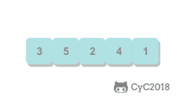 </div><br>

```java
public class Selection<T extends Comparable<T>> extends Sort<T> {

    @Override
    public void sort(T[] nums) {
        int N = nums.length;
        for (int i = 0; i < N - 1; i++) {
            int min = i;
            for (int j = i + 1; j < N; j++) {
                if (less(nums[j], nums[min])) {
                    min = j;
                }
            }
            swap(nums, i, min);
        }
    }
}
```

#### 冒泡排序

从左到右不断交换相邻逆序的元素，在一轮的循环之后，可以让未排序的最大元素上浮到右侧。

在一轮循环中，如果没有发生交换，那么说明数组已经是有序的，此时可以直接退出。

<div align="center">  </div><br>

```java
public class Bubble<T extends Comparable<T>> extends Sort<T> {

    @Override
    public void sort(T[] nums) {
        int N = nums.length;
        boolean isSorted = false;
        for (int i = N - 1; i > 0 && !isSorted; i--) {
            isSorted = true;
            for (int j = 0; j < i; j++) {
                if (less(nums[j + 1], nums[j])) {
                    isSorted = false;
                    swap(nums, j, j + 1);
                }
            }
        }
    }
}
```

#### 插入排序

每次都将当前元素插入到左侧已经排序的数组中，使得插入之后左侧数组依然有序。

对于数组 {3, 5, 2, 4, 1}，它具有以下逆序：(3, 2), (3, 1), (5, 2), (5, 4), (5, 1), (2, 1), (4, 1)，插入排序每次只能交换相邻元素，令逆序数量减少 1，因此插入排序需要交换的次数为逆序数量。

插入排序的时间复杂度取决于数组的初始顺序，如果数组已经部分有序了，那么逆序较少，需要的交换次数也就较少，时间复杂度较低。

- 平均情况下插入排序需要 \~N<sup>2</sup>/4 比较以及 \~N<sup>2</sup>/4 次交换；
- 最坏的情况下需要 \~N<sup>2</sup>/2 比较以及 \~N<sup>2</sup>/2 次交换，最坏的情况是数组是倒序的；
- 最好的情况下需要 N-1 次比较和 0 次交换，最好的情况就是数组已经有序了。

<div align="center">  </div><br>

```java
public class Insertion<T extends Comparable<T>> extends Sort<T> {

    @Override
    public void sort(T[] nums) {
        int N = nums.length;
        for (int i = 1; i < N; i++) {
            for (int j = i; j > 0 && less(nums[j], nums[j - 1]); j--) {
                swap(nums, j, j - 1);
            }
        }
    }
}
```

#### 希尔排序

对于大规模的数组，插入排序很慢，因为它只能交换相邻的元素，每次只能将逆序数量减少 1。希尔排序的出现就是为了解决插入排序的这种局限性，它通过交换不相邻的元素，每次可以将逆序数量减少大于 1。

希尔排序使用插入排序对间隔 h 的序列进行排序。通过不断减小 h，最后令 h=1，就可以使得整个数组是有序的。

<div align="center">  </div><br>

```java
public class Shell<T extends Comparable<T>> extends Sort<T> {

    @Override
    public void sort(T[] nums) {

        int N = nums.length;
        int h = 1;

        while (h < N / 3) {
            h = 3 * h + 1; // 1, 4, 13, 40, ...
        }

        while (h >= 1) {
            for (int i = h; i < N; i++) {
                for (int j = i; j >= h && less(nums[j], nums[j - h]); j -= h) {
                    swap(nums, j, j - h);
                }
            }
            h = h / 3;
        }
    }
}

```

希尔排序的运行时间达不到平方级别，使用递增序列 1, 4, 13, 40, ...  的希尔排序所需要的比较次数不会超过 N 的若干倍乘于递增序列的长度。后面介绍的高级排序算法只会比希尔排序快两倍左右。

#### 归并排序

归并排序的思想是将数组分成两部分，分别进行排序，然后归并起来。

<div align="center">  </div><br>

##### 1. 归并方法

归并方法将数组中两个已经排序的部分归并成一个。

```java
public abstract class MergeSort<T extends Comparable<T>> extends Sort<T> {

    protected T[] aux;


    protected void merge(T[] nums, int l, int m, int h) {

        int i = l, j = m + 1;

        for (int k = l; k <= h; k++) {
            aux[k] = nums[k]; // 将数据复制到辅助数组
        }

        for (int k = l; k <= h; k++) {
            if (i > m) {
                nums[k] = aux[j++];

            } else if (j > h) {
                nums[k] = aux[i++];

            } else if (aux[i].compareTo(aux[j]) <= 0) {
                nums[k] = aux[i++]; // 先进行这一步，保证稳定性

            } else {
                nums[k] = aux[j++];
            }
        }
    }
}
```

##### 2. 自顶向下归并排序

将一个大数组分成两个小数组去求解。

因为每次都将问题对半分成两个子问题，这种对半分的算法复杂度一般为 O(NlogN)。

```java
public class Up2DownMergeSort<T extends Comparable<T>> extends MergeSort<T> {

    @Override
    public void sort(T[] nums) {
        aux = (T[]) new Comparable[nums.length];
        sort(nums, 0, nums.length - 1);
    }

    private void sort(T[] nums, int l, int h) {
        if (h <= l) {
            return;
        }
        int mid = l + (h - l) / 2;
        sort(nums, l, mid);
        sort(nums, mid + 1, h);
        merge(nums, l, mid, h);
    }
}
```


##### 3. 自底向上归并排序

先归并那些微型数组，然后成对归并得到的微型数组。

```java
public class Down2UpMergeSort<T extends Comparable<T>> extends MergeSort<T> {

    @Override
    public void sort(T[] nums) {

        int N = nums.length;
        aux = (T[]) new Comparable[N];

        for (int sz = 1; sz < N; sz += sz) {
            for (int lo = 0; lo < N - sz; lo += sz + sz) {
                merge(nums, lo, lo + sz - 1, Math.min(lo + sz + sz - 1, N - 1));
            }
        }
    }
}

```

#### 快速排序

##### 1. 基本算法

- 归并排序将数组分为两个子数组分别排序，并将有序的子数组归并使得整个数组排序；
- 快速排序通过一个切分元素将数组分为两个子数组，左子数组小于等于切分元素，右子数组大于等于切分元素，将这两个子数组排序也就将整个数组排序了。

<div align="center"> 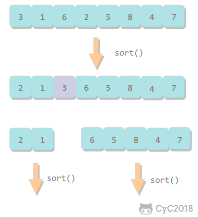 </div><br>

```java
public class QuickSort<T extends Comparable<T>> extends Sort<T> {

    @Override
    public void sort(T[] nums) {
        shuffle(nums);
        sort(nums, 0, nums.length - 1);
    }

    private void sort(T[] nums, int l, int h) {
        if (h <= l)
            return;
        int j = partition(nums, l, h);
        sort(nums, l, j - 1);
        sort(nums, j + 1, h);
    }

    private void shuffle(T[] nums) {
        List<Comparable> list = Arrays.asList(nums);
        Collections.shuffle(list);
        list.toArray(nums);
    }
}
```

##### 2. 切分

取 a[l] 作为切分元素，然后从数组的左端向右扫描直到找到第一个大于等于它的元素，再从数组的右端向左扫描找到第一个小于它的元素，交换这两个元素。不断进行这个过程，就可以保证左指针 i 的左侧元素都不大于切分元素，右指针 j 的右侧元素都不小于切分元素。当两个指针相遇时，将切分元素 a[l] 和 a[j] 交换位置。

<div align="center">  </div><br>

```java
private int partition(T[] nums, int l, int h) {
    int i = l, j = h + 1;
    T v = nums[l];
    while (true) {
        while (less(nums[++i], v) && i != h) ;
        while (less(v, nums[--j]) && j != l) ;
        if (i >= j)
            break;
        swap(nums, i, j);
    }
    swap(nums, l, j);
    return j;
}
```

##### 3. 性能分析

快速排序是原地排序，不需要辅助数组，但是递归调用需要辅助栈。

快速排序最好的情况下是每次都正好将数组对半分，这样递归调用次数才是最少的。这种情况下比较次数为 C<sub>N</sub>=2C<sub>N/2</sub>+N，复杂度为 O(NlogN)。

最坏的情况下，第一次从最小的元素切分，第二次从第二小的元素切分，如此这般。因此最坏的情况下需要比较 N<sup>2</sup>/2。为了防止数组最开始就是有序的，在进行快速排序时需要随机打乱数组。

##### 4. 算法改进

####### 4.1 切换到插入排序

因为快速排序在小数组中也会递归调用自己，对于小数组，插入排序比快速排序的性能更好，因此在小数组中可以切换到插入排序。

####### 4.2 三数取中

最好的情况下是每次都能取数组的中位数作为切分元素，但是计算中位数的代价很高。一种折中方法是取 3 个元素，并将大小居中的元素作为切分元素。

####### 4.3 三向切分

对于有大量重复元素的数组，可以将数组切分为三部分，分别对应小于、等于和大于切分元素。

三向切分快速排序对于有大量重复元素的随机数组可以在线性时间内完成排序。

```java
public class ThreeWayQuickSort<T extends Comparable<T>> extends QuickSort<T> {

    @Override
    protected void sort(T[] nums, int l, int h) {
        if (h <= l) {
            return;
        }
        int lt = l, i = l + 1, gt = h;
        T v = nums[l];
        while (i <= gt) {
            int cmp = nums[i].compareTo(v);
            if (cmp < 0) {
                swap(nums, lt++, i++);
            } else if (cmp > 0) {
                swap(nums, i, gt--);
            } else {
                i++;
            }
        }
        sort(nums, l, lt - 1);
        sort(nums, gt + 1, h);
    }
}
```

##### 5. 基于切分的快速选择算法

快速排序的 partition() 方法，会返回一个整数 j 使得 a[l..j-1] 小于等于 a[j]，且 a[j+1..h] 大于等于 a[j]，此时 a[j] 就是数组的第 j 大元素。

可以利用这个特性找出数组的第 k 个元素。

该算法是线性级别的，假设每次能将数组二分，那么比较的总次数为 (N+N/2+N/4+..)，直到找到第 k 个元素，这个和显然小于 2N。

```java
public T select(T[] nums, int k) {
    int l = 0, h = nums.length - 1;
    while (h > l) {
        int j = partition(nums, l, h);

        if (j == k) {
            return nums[k];

        } else if (j > k) {
            h = j - 1;

        } else {
            l = j + 1;
        }
    }
    return nums[k];
}
```

#### 堆排序

##### 1. 堆

堆中某个节点的值总是大于等于其子节点的值，并且堆是一颗完全二叉树。

堆可以用数组来表示，这是因为堆是完全二叉树，而完全二叉树很容易就存储在数组中。位置 k 的节点的父节点位置为 k/2，而它的两个子节点的位置分别为 2k 和 2k+1。这里不使用数组索引为 0 的位置，是为了更清晰地描述节点的位置关系。

<div align="center">  </div><br>

```java
public class Heap<T extends Comparable<T>> {

    private T[] heap;
    private int N = 0;

    public Heap(int maxN) {
        this.heap = (T[]) new Comparable[maxN + 1];
    }

    public boolean isEmpty() {
        return N == 0;
    }

    public int size() {
        return N;
    }

    private boolean less(int i, int j) {
        return heap[i].compareTo(heap[j]) < 0;
    }

    private void swap(int i, int j) {
        T t = heap[i];
        heap[i] = heap[j];
        heap[j] = t;
    }
}
```

##### 2. 上浮和下沉

在堆中，当一个节点比父节点大，那么需要交换这个两个节点。交换后还可能比它新的父节点大，因此需要不断地进行比较和交换操作，把这种操作称为上浮。

<div align="center">  </div><br>

```java
private void swim(int k) {
    while (k > 1 && less(k / 2, k)) {
        swap(k / 2, k);
        k = k / 2;
    }
}
```

类似地，当一个节点比子节点来得小，也需要不断地向下进行比较和交换操作，把这种操作称为下沉。一个节点如果有两个子节点，应当与两个子节点中最大那个节点进行交换。

<div align="center">  </div><br>

```java
private void sink(int k) {
    while (2 * k <= N) {
        int j = 2 * k;
        if (j < N && less(j, j + 1))
            j++;
        if (!less(k, j))
            break;
        swap(k, j);
        k = j;
    }
}
```

##### 3. 插入元素

将新元素放到数组末尾，然后上浮到合适的位置。

```java
public void insert(Comparable v) {
    heap[++N] = v;
    swim(N);
}
```

##### 4. 删除最大元素

从数组顶端删除最大的元素，并将数组的最后一个元素放到顶端，并让这个元素下沉到合适的位置。

```java
public T delMax() {
    T max = heap[1];
    swap(1, N--);
    heap[N + 1] = null;
    sink(1);
    return max;
}
```

##### 5. 堆排序

把最大元素和当前堆中数组的最后一个元素交换位置，并且不删除它，那么就可以得到一个从尾到头的递减序列，从正向来看就是一个递增序列，这就是堆排序。

####### 5.1 构建堆

无序数组建立堆最直接的方法是从左到右遍历数组进行上浮操作。一个更高效的方法是从右至左进行下沉操作，如果一个节点的两个节点都已经是堆有序，那么进行下沉操作可以使得这个节点为根节点的堆有序。叶子节点不需要进行下沉操作，可以忽略叶子节点的元素，因此只需要遍历一半的元素即可。

<div align="center"> 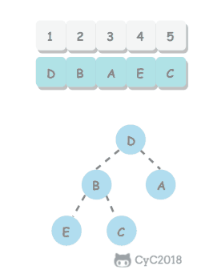 </div><br>

####### 5.2 交换堆顶元素与最后一个元素

交换之后需要进行下沉操作维持堆的有序状态。

<div align="center">  </div><br>

```java
public class HeapSort<T extends Comparable<T>> extends Sort<T> {
    /**
     * 数组第 0 个位置不能有元素
     */
    @Override
    public void sort(T[] nums) {
        int N = nums.length - 1;
        for (int k = N / 2; k >= 1; k--)
            sink(nums, k, N);

        while (N > 1) {
            swap(nums, 1, N--);
            sink(nums, 1, N);
        }
    }

    private void sink(T[] nums, int k, int N) {
        while (2 * k <= N) {
            int j = 2 * k;
            if (j < N && less(nums, j, j + 1))
                j++;
            if (!less(nums, k, j))
                break;
            swap(nums, k, j);
            k = j;
        }
    }

    private boolean less(T[] nums, int i, int j) {
        return nums[i].compareTo(nums[j]) < 0;
    }
}
```

##### 6. 分析

一个堆的高度为 logN，因此在堆中插入元素和删除最大元素的复杂度都为 logN。

对于堆排序，由于要对 N 个节点进行下沉操作，因此复杂度为 NlogN。

堆排序是一种原地排序，没有利用额外的空间。

现代操作系统很少使用堆排序，因为它无法利用局部性原理进行缓存，也就是数组元素很少和相邻的元素进行比较和交换。

#### 小结

##### 1. 排序算法的比较

| 算法 | 稳定性 | 时间复杂度 | 空间复杂度 | 备注 |
| :---: | :---: |:---: | :---: | :---: |
| 选择排序 | × | N<sup>2</sup> | 1 | |
| 冒泡排序 | √ |  N<sup>2</sup> | 1 | |
| 插入排序 | √ |  N \~ N<sup>2</sup> | 1 | 时间复杂度和初始顺序有关 |
| 希尔排序 | ×  |  N 的若干倍乘于递增序列的长度 | 1 | 改进版插入排序 |
| 快速排序 | ×  | NlogN | logN | |
| 三向切分快速排序 | ×  |  N \~ NlogN | logN | 适用于有大量重复主键|
| 归并排序 | √ |  NlogN | N | |
| 堆排序 | ×  |  NlogN | 1 | 无法利用局部性原理|

快速排序是最快的通用排序算法，它的内循环的指令很少，而且它还能利用缓存，因为它总是顺序地访问数据。它的运行时间近似为 \~cNlogN，这里的 c 比其它线性对数级别的排序算法都要小。

使用三向切分快速排序，实际应用中可能出现的某些分布的输入能够达到线性级别，而其它排序算法仍然需要线性对数时间。

##### 2. Java 的排序算法实现

Java 主要排序方法为 java.util.Arrays.sort()，对于原始数据类型使用三向切分的快速排序，对于引用类型使用归并排序。


### 并查集


#### 前言

用于解决动态连通性问题，能动态连接两个点，并且判断两个点是否连通。

<div align="center">  </div><br>

| 方法 | 描述 |
| :---: | :---: |
| UF(int N) | 构造一个大小为 N 的并查集 |
| void union(int p, int q) | 连接 p 和 q 节点 |
| int find(int p) | 查找 p 所在的连通分量编号 |
| boolean connected(int p, int q) | 判断 p 和 q 节点是否连通 |

```java
public abstract class UF {

    protected int[] id;

    public UF(int N) {
        id = new int[N];
        for (int i = 0; i < N; i++) {
            id[i] = i;
        }
    }

    public boolean connected(int p, int q) {
        return find(p) == find(q);
    }

    public abstract int find(int p);

    public abstract void union(int p, int q);
}
```

#### Quick Find

可以快速进行 find 操作，也就是可以快速判断两个节点是否连通。

需要保证同一连通分量的所有节点的 id 值相等。

但是 union 操作代价却很高，需要将其中一个连通分量中的所有节点 id 值都修改为另一个节点的 id 值。

<div align="center">  </div><br>

```java
public class QuickFindUF extends UF {

    public QuickFindUF(int N) {
        super(N);
    }


    @Override
    public int find(int p) {
        return id[p];
    }


    @Override
    public void union(int p, int q) {
        int pID = find(p);
        int qID = find(q);

        if (pID == qID) {
            return;
        }

        for (int i = 0; i < id.length; i++) {
            if (id[i] == pID) {
                id[i] = qID;
            }
        }
    }
}
```

#### Quick Union

可以快速进行 union 操作，只需要修改一个节点的 id 值即可。

但是 find 操作开销很大，因为同一个连通分量的节点 id 值不同，id 值只是用来指向另一个节点。因此需要一直向上查找操作，直到找到最上层的节点。

<div align="center">  </div><br>

```java
public class QuickUnionUF extends UF {

    public QuickUnionUF(int N) {
        super(N);
    }


    @Override
    public int find(int p) {
        while (p != id[p]) {
            p = id[p];
        }
        return p;
    }


    @Override
    public void union(int p, int q) {
        int pRoot = find(p);
        int qRoot = find(q);

        if (pRoot != qRoot) {
            id[pRoot] = qRoot;
        }
    }
}
```

这种方法可以快速进行 union 操作，但是 find 操作和树高成正比，最坏的情况下树的高度为节点的数目。

<div align="center">  </div><br>

#### 加权 Quick Union

为了解决 quick-union 的树通常会很高的问题，加权 quick-union 在 union 操作时会让较小的树连接较大的树上面。

理论研究证明，加权 quick-union 算法构造的树深度最多不超过 logN。

<div align="center">  </div><br>

```java
public class WeightedQuickUnionUF extends UF {

    // 保存节点的数量信息
    private int[] sz;


    public WeightedQuickUnionUF(int N) {
        super(N);
        this.sz = new int[N];
        for (int i = 0; i < N; i++) {
            this.sz[i] = 1;
        }
    }


    @Override
    public int find(int p) {
        while (p != id[p]) {
            p = id[p];
        }
        return p;
    }


    @Override
    public void union(int p, int q) {

        int i = find(p);
        int j = find(q);

        if (i == j) return;

        if (sz[i] < sz[j]) {
            id[i] = j;
            sz[j] += sz[i];
        } else {
            id[j] = i;
            sz[i] += sz[j];
        }
    }
}
```

#### 路径压缩的加权 Quick Union

在检查节点的同时将它们直接链接到根节点，只需要在 find 中添加一个循环即可。

#### 比较

| 算法 | union | find |
| :---: | :---: | :---: |
| Quick Find | N | 1 |
| Quick Union | 树高 | 树高 |
| 加权 Quick Union | logN | logN |
| 路径压缩的加权 Quick Union | 非常接近 1 | 非常接近 1 |


### 栈和队列


#### 栈

```java
public interface MyStack<Item> extends Iterable<Item> {

    MyStack<Item> push(Item item);

    Item pop() throws Exception;

    boolean isEmpty();

    int size();

}
```

##### 1. 数组实现

```java
public class ArrayStack<Item> implements MyStack<Item> {

    // 栈元素数组，只能通过转型来创建泛型数组
    private Item[] a = (Item[]) new Object[1];

    // 元素数量
    private int N = 0;


    @Override
    public MyStack<Item> push(Item item) {
        check();
        a[N++] = item;
        return this;
    }


    @Override
    public Item pop() throws Exception {

        if (isEmpty()) {
            throw new Exception("stack is empty");
        }

        Item item = a[--N];

        check();

        // 避免对象游离
        a[N] = null;

        return item;
    }


    private void check() {

        if (N >= a.length) {
            resize(2 * a.length);

        } else if (N > 0 && N <= a.length / 4) {
            resize(a.length / 2);
        }
    }


    /**
     * 调整数组大小，使得栈具有伸缩性
     */
    private void resize(int size) {

        Item[] tmp = (Item[]) new Object[size];

        for (int i = 0; i < N; i++) {
            tmp[i] = a[i];
        }

        a = tmp;
    }


    @Override
    public boolean isEmpty() {
        return N == 0;
    }


    @Override
    public int size() {
        return N;
    }


    @Override
    public Iterator<Item> iterator() {

        // 返回逆序遍历的迭代器
        return new Iterator<Item>() {

            private int i = N;

            @Override
            public boolean hasNext() {
                return i > 0;
            }

            @Override
            public Item next() {
                return a[--i];
            }
        };

    }
}
```

##### 2. 链表实现

需要使用链表的头插法来实现，因为头插法中最后压入栈的元素在链表的开头，它的 next 指针指向前一个压入栈的元素，在弹出元素时就可以通过 next 指针遍历到前一个压入栈的元素从而让这个元素成为新的栈顶元素。

```java
public class ListStack<Item> implements MyStack<Item> {

    private Node top = null;
    private int N = 0;


    private class Node {
        Item item;
        Node next;
    }


    @Override
    public MyStack<Item> push(Item item) {

        Node newTop = new Node();

        newTop.item = item;
        newTop.next = top;

        top = newTop;

        N++;

        return this;
    }


    @Override
    public Item pop() throws Exception {

        if (isEmpty()) {
            throw new Exception("stack is empty");
        }

        Item item = top.item;

        top = top.next;
        N--;

        return item;
    }


    @Override
    public boolean isEmpty() {
        return N == 0;
    }


    @Override
    public int size() {
        return N;
    }


    @Override
    public Iterator<Item> iterator() {

        return new Iterator<Item>() {

            private Node cur = top;


            @Override
            public boolean hasNext() {
                return cur != null;
            }


            @Override
            public Item next() {
                Item item = cur.item;
                cur = cur.next;
                return item;
            }
        };

    }
}
```

#### 队列

下面是队列的链表实现，需要维护 first 和 last 节点指针，分别指向队首和队尾。

这里需要考虑 first 和 last 指针哪个作为链表的开头。因为出队列操作需要让队首元素的下一个元素成为队首，所以需要容易获取下一个元素，而链表的头部节点的 next 指针指向下一个元素，因此可以让 first 指针链表的开头。

```java
public interface MyQueue<Item> extends Iterable<Item> {

    int size();

    boolean isEmpty();

    MyQueue<Item> add(Item item);

    Item remove() throws Exception;
}
```

```java
public class ListQueue<Item> implements MyQueue<Item> {

    private Node first;
    private Node last;
    int N = 0;


    private class Node {
        Item item;
        Node next;
    }


    @Override
    public boolean isEmpty() {
        return N == 0;
    }


    @Override
    public int size() {
        return N;
    }


    @Override
    public MyQueue<Item> add(Item item) {

        Node newNode = new Node();
        newNode.item = item;
        newNode.next = null;

        if (isEmpty()) {
            last = newNode;
            first = newNode;
        } else {
            last.next = newNode;
            last = newNode;
        }

        N++;
        return this;
    }


    @Override
    public Item remove() throws Exception {

        if (isEmpty()) {
            throw new Exception("queue is empty");
        }

        Node node = first;
        first = first.next;
        N--;

        if (isEmpty()) {
            last = null;
        }

        return node.item;
    }


    @Override
    public Iterator<Item> iterator() {

        return new Iterator<Item>() {

            Node cur = first;


            @Override
            public boolean hasNext() {
                return cur != null;
            }


            @Override
            public Item next() {
                Item item = cur.item;
                cur = cur.next;
                return item;
            }
        };
    }
}
```


### 符号表


#### 前言

符号表（Symbol Table）是一种存储键值对的数据结构，可以支持快速查找操作。

符号表分为有序和无序两种，有序符号表主要指支持 min()、max() 等根据键的大小关系来实现的操作。

有序符号表的键需要实现 Comparable 接口。

```java
public interface UnorderedST<Key, Value> {

    int size();

    Value get(Key key);

    void put(Key key, Value value);

    void delete(Key key);
}
```

```java
public interface OrderedST<Key extends Comparable<Key>, Value> {

    int size();

    void put(Key key, Value value);

    Value get(Key key);

    Key min();

    Key max();

    int rank(Key key);

    List<Key> keys(Key l, Key h);
}
```

#### 初级实现

##### 1. 链表实现无序符号表

```java
public class ListUnorderedST<Key, Value> implements UnorderedST<Key, Value> {

    private Node first;

    private class Node {
        Key key;
        Value value;
        Node next;

        Node(Key key, Value value, Node next) {
            this.key = key;
            this.value = value;
            this.next = next;
        }
    }

    @Override
    public int size() {
        int cnt = 0;
        Node cur = first;
        while (cur != null) {
            cnt++;
            cur = cur.next;
        }
        return cnt;
    }

    @Override
    public void put(Key key, Value value) {
        Node cur = first;
        // 如果在链表中找到节点的键等于 key 就更新这个节点的值为 value
        while (cur != null) {
            if (cur.key.equals(key)) {
                cur.value = value;
                return;
            }
            cur = cur.next;
        }
        // 否则使用头插法插入一个新节点
        first = new Node(key, value, first);
    }

    @Override
    public void delete(Key key) {
        if (first == null)
            return;
        if (first.key.equals(key))
            first = first.next;
        Node pre = first, cur = first.next;
        while (cur != null) {
            if (cur.key.equals(key)) {
                pre.next = cur.next;
                return;
            }
            pre = pre.next;
            cur = cur.next;
        }
    }

    @Override
    public Value get(Key key) {
        Node cur = first;
        while (cur != null) {
            if (cur.key.equals(key))
                return cur.value;
            cur = cur.next;
        }
        return null;
    }
}
```

##### 2. 二分查找实现有序符号表

使用一对平行数组，一个存储键一个存储值。

二分查找的 rank() 方法至关重要，当键在表中时，它能够知道该键的位置；当键不在表中时，它也能知道在何处插入新键。

二分查找最多需要 logN+1 次比较，使用二分查找实现的符号表的查找操作所需要的时间最多是对数级别的。但是插入操作需要移动数组元素，是线性级别的。

```java
public class BinarySearchOrderedST<Key extends Comparable<Key>, Value> implements OrderedST<Key, Value> {

    private Key[] keys;
    private Value[] values;
    private int N = 0;

    public BinarySearchOrderedST(int capacity) {
        keys = (Key[]) new Comparable[capacity];
        values = (Value[]) new Object[capacity];
    }

    @Override
    public int size() {
        return N;
    }

    @Override
    public int rank(Key key) {
        int l = 0, h = N - 1;
        while (l <= h) {
            int m = l + (h - l) / 2;
            int cmp = key.compareTo(keys[m]);
            if (cmp == 0)
                return m;
            else if (cmp < 0)
                h = m - 1;
            else
                l = m + 1;
        }
        return l;
    }

    @Override
    public List<Key> keys(Key l, Key h) {
        int index = rank(l);
        List<Key> list = new ArrayList<>();
        while (keys[index].compareTo(h) <= 0) {
            list.add(keys[index]);
            index++;
        }
        return list;
    }

    @Override
    public void put(Key key, Value value) {
        int index = rank(key);
        // 如果找到已经存在的节点键为 key，就更新这个节点的值为 value
        if (index < N && keys[index].compareTo(key) == 0) {
            values[index] = value;
            return;
        }
        // 否则在数组中插入新的节点，需要先将插入位置之后的元素都向后移动一个位置
        for (int j = N; j > index; j--) {
            keys[j] = keys[j - 1];
            values[j] = values[j - 1];
        }
        keys[index] = key;
        values[index] = value;
        N++;
    }

    @Override
    public Value get(Key key) {
        int index = rank(key);
        if (index < N && keys[index].compareTo(key) == 0)
            return values[index];
        return null;
    }

    @Override
    public Key min() {
        return keys[0];
    }

    @Override
    public Key max() {
        return keys[N - 1];
    }
}
```

#### 二叉查找树

**二叉树**  是一个空链接，或者是一个有左右两个链接的节点，每个链接都指向一颗子二叉树。

<div align="center">  </div><br>

**二叉查找树** （BST）是一颗二叉树，并且每个节点的值都大于等于其左子树中的所有节点的值而小于等于右子树的所有节点的值。

BST 有一个重要性质，就是它的中序遍历结果递增排序。

<div align="center">  </div><br>

基本数据结构：

```java
public class BST<Key extends Comparable<Key>, Value> implements OrderedST<Key, Value> {

    protected Node root;

    protected class Node {
        Key key;
        Value val;
        Node left;
        Node right;
        // 以该节点为根的子树节点总数
        int N;
        // 红黑树中使用
        boolean color;

        Node(Key key, Value val, int N) {
            this.key = key;
            this.val = val;
            this.N = N;
        }
    }

    @Override
    public int size() {
        return size(root);
    }

    private int size(Node x) {
        if (x == null)
            return 0;
        return x.N;
    }

    protected void recalculateSize(Node x) {
        x.N = size(x.left) + size(x.right) + 1;
    }
}
```

为了方便绘图，下文中二叉树的空链接不画出来。

##### 1. get()

- 如果树是空的，则查找未命中；
- 如果被查找的键和根节点的键相等，查找命中；
- 否则递归地在子树中查找：如果被查找的键较小就在左子树中查找，较大就在右子树中查找。

```java
@Override
public Value get(Key key) {
    return get(root, key);
}

private Value get(Node x, Key key) {
    if (x == null)
        return null;
    int cmp = key.compareTo(x.key);
    if (cmp == 0)
        return x.val;
    else if (cmp < 0)
        return get(x.left, key);
    else
        return get(x.right, key);
}
```

##### 2. put()

当插入的键不存在于树中，需要创建一个新节点，并且更新上层节点的链接指向该节点，使得该节点正确地链接到树中。

<div align="center">  </div><br>

```java
 @Override
public void put(Key key, Value value) {
    root = put(root, key, value);
}

private Node put(Node x, Key key, Value value) {
    if (x == null)
        return new Node(key, value, 1);
    int cmp = key.compareTo(x.key);
    if (cmp == 0)
        x.val = value;
    else if (cmp < 0)
        x.left = put(x.left, key, value);
    else
        x.right = put(x.right, key, value);
    recalculateSize(x);
    return x;
}
```

##### 3. 分析

二叉查找树的算法运行时间取决于树的形状，而树的形状又取决于键被插入的先后顺序。

最好的情况下树是完全平衡的，每条空链接和根节点的距离都为 logN。

<div align="center">  </div><br>

在最坏的情况下，树的高度为 N。

<div align="center">  </div><br>

##### 4. floor()

floor(key)：小于等于键的最大键

- 如果键小于根节点的键，那么 floor(key) 一定在左子树中；
- 如果键大于根节点的键，需要先判断右子树中是否存在 floor(key)，如果存在就返回，否则根节点就是 floor(key)。

```java
public Key floor(Key key) {
    Node x = floor(root, key);
    if (x == null)
        return null;
    return x.key;
}

private Node floor(Node x, Key key) {
    if (x == null)
        return null;
    int cmp = key.compareTo(x.key);
    if (cmp == 0)
        return x;
    if (cmp < 0)
        return floor(x.left, key);
    Node t = floor(x.right, key);
    return t != null ? t : x;
}
```

##### 5. rank()

rank(key) 返回 key 的排名。

- 如果键和根节点的键相等，返回左子树的节点数；
- 如果小于，递归计算在左子树中的排名；
- 如果大于，递归计算在右子树中的排名，加上左子树的节点数，再加上 1（根节点）。

```java
@Override
public int rank(Key key) {
    return rank(key, root);
}

private int rank(Key key, Node x) {
    if (x == null)
        return 0;
    int cmp = key.compareTo(x.key);
    if (cmp == 0)
        return size(x.left);
    else if (cmp < 0)
        return rank(key, x.left);
    else
        return 1 + size(x.left) + rank(key, x.right);
}
```

##### 6. min()

```java
@Override
public Key min() {
    return min(root).key;
}

private Node min(Node x) {
    if (x == null)
        return null;
    if (x.left == null)
        return x;
    return min(x.left);
}
```

##### 7. deleteMin()

令指向最小节点的链接指向最小节点的右子树。

<div align="center">  </div><br>

```java
public void deleteMin() {
    root = deleteMin(root);
}

public Node deleteMin(Node x) {
    if (x.left == null)
        return x.right;
    x.left = deleteMin(x.left);
    recalculateSize(x);
    return x;
}
```

##### 8. delete()

- 如果待删除的节点只有一个子树，  那么只需要让指向待删除节点的链接指向唯一的子树即可；
- 否则，让右子树的最小节点替换该节点。

<div align="center">  </div><br>

```java
public void delete(Key key) {
    root = delete(root, key);
}
private Node delete(Node x, Key key) {
    if (x == null)
        return null;
    int cmp = key.compareTo(x.key);
    if (cmp < 0)
        x.left = delete(x.left, key);
    else if (cmp > 0)
        x.right = delete(x.right, key);
    else {
        if (x.right == null)
            return x.left;
        if (x.left == null)
            return x.right;
        Node t = x;
        x = min(t.right);
        x.right = deleteMin(t.right);
        x.left = t.left;
    }
    recalculateSize(x);
    return x;
}
```

##### 9. keys()

利用二叉查找树中序遍历的结果为递增的特点。

```java
@Override
public List<Key> keys(Key l, Key h) {
    return keys(root, l, h);
}

private List<Key> keys(Node x, Key l, Key h) {
    List<Key> list = new ArrayList<>();
    if (x == null)
        return list;
    int cmpL = l.compareTo(x.key);
    int cmpH = h.compareTo(x.key);
    if (cmpL < 0)
        list.addAll(keys(x.left, l, h));
    if (cmpL <= 0 && cmpH >= 0)
        list.add(x.key);
    if (cmpH > 0)
        list.addAll(keys(x.right, l, h));
    return list;
}
```

##### 10. 分析

二叉查找树所有操作在最坏的情况下所需要的时间都和树的高度成正比。

#### 2-3 查找树

2-3 查找树引入了 2- 节点和 3- 节点，目的是为了让树平衡。一颗完美平衡的 2-3 查找树的所有空链接到根节点的距离应该是相同的。

<div align="center">  </div><br>

##### 1. 插入操作

插入操作和 BST 的插入操作有很大区别，BST 的插入操作是先进行一次未命中的查找，然后再将节点插入到对应的空链接上。但是 2-3 查找树如果也这么做的话，那么就会破坏了平衡性。它是将新节点插入到叶子节点上。

根据叶子节点的类型不同，有不同的处理方式：

- 如果插入到 2- 节点上，那么直接将新节点和原来的节点组成 3- 节点即可。

<div align="center">  </div><br>

- 如果是插入到 3- 节点上，就会产生一个临时 4- 节点时，需要将 4- 节点分裂成 3 个 2- 节点，并将中间的 2- 节点移到上层节点中。如果上移操作继续产生临时 4- 节点则一直进行分裂上移，直到不存在临时 4- 节点。

<div align="center">  </div><br>

##### 2. 性质

2-3 查找树插入操作的变换都是局部的，除了相关的节点和链接之外不必修改或者检查树的其它部分，而这些局部变换不会影响树的全局有序性和平衡性。

2-3 查找树的查找和插入操作复杂度和插入顺序无关，在最坏的情况下查找和插入操作访问的节点必然不超过 logN 个，含有 10 亿个节点的 2-3 查找树最多只需要访问 30 个节点就能进行任意的查找和插入操作。

#### 红黑树

红黑树是 2-3 查找树，但它不需要分别定义 2- 节点和 3- 节点，而是在普通的二叉查找树之上，为节点添加颜色。指向一个节点的链接颜色如果为红色，那么这个节点和上层节点表示的是一个 3- 节点，而黑色则是普通链接。

<div align="center">  </div><br>

红黑树具有以下性质：

- 红链接都为左链接；
- 完美黑色平衡，即任意空链接到根节点的路径上的黑链接数量相同。

画红黑树时可以将红链接画平。

<div align="center">  </div><br>

```java
public class RedBlackBST<Key extends Comparable<Key>, Value> extends BST<Key, Value> {

    private static final boolean RED = true;
    private static final boolean BLACK = false;

    private boolean isRed(Node x) {
        if (x == null)
            return false;
        return x.color == RED;
    }
}
```

##### 1. 左旋转

因为合法的红链接都为左链接，如果出现右链接为红链接，那么就需要进行左旋转操作。

<div align="center">  </div><br>

```java
public Node rotateLeft(Node h) {
    Node x = h.right;
    h.right = x.left;
    x.left = h;
    x.color = h.color;
    h.color = RED;
    x.N = h.N;
    recalculateSize(h);
    return x;
}
```

##### 2. 右旋转

进行右旋转是为了转换两个连续的左红链接，这会在之后的插入过程中探讨。

<div align="center">  </div><br>

```java
public Node rotateRight(Node h) {
    Node x = h.left;
    h.left = x.right;
    x.right = h;
    x.color = h.color;
    h.color = RED;
    x.N = h.N;
    recalculateSize(h);
    return x;
}
```

##### 3. 颜色转换

一个 4- 节点在红黑树中表现为一个节点的左右子节点都是红色的。分裂 4- 节点除了需要将子节点的颜色由红变黑之外，同时需要将父节点的颜色由黑变红，从 2-3 树的角度看就是将中间节点移到上层节点。

<div align="center">  </div><br>

```java
void flipColors(Node h) {
    h.color = RED;
    h.left.color = BLACK;
    h.right.color = BLACK;
}
```

##### 4. 插入

先将一个节点按二叉查找树的方法插入到正确位置，然后再进行如下颜色操作：

- 如果右子节点是红色的而左子节点是黑色的，进行左旋转；
- 如果左子节点是红色的，而且左子节点的左子节点也是红色的，进行右旋转；
- 如果左右子节点均为红色的，进行颜色转换。

<div align="center">  </div><br>

```java
@Override
public void put(Key key, Value value) {
    root = put(root, key, value);
    root.color = BLACK;
}

private Node put(Node x, Key key, Value value) {
    if (x == null) {
        Node node = new Node(key, value, 1);
        node.color = RED;
        return node;
    }
    int cmp = key.compareTo(x.key);
    if (cmp == 0)
        x.val = value;
    else if (cmp < 0)
        x.left = put(x.left, key, value);
    else
        x.right = put(x.right, key, value);

    if (isRed(x.right) && !isRed(x.left))
        x = rotateLeft(x);
    if (isRed(x.left) && isRed(x.left.left))
        x = rotateRight(x);
    if (isRed(x.left) && isRed(x.right))
        flipColors(x);

    recalculateSize(x);
    return x;
}
```

可以看到该插入操作和二叉查找树的插入操作类似，只是在最后加入了旋转和颜色变换操作即可。

根节点一定为黑色，因为根节点没有上层节点，也就没有上层节点的左链接指向根节点。flipColors() 有可能会使得根节点的颜色变为红色，每当根节点由红色变成黑色时树的黑链接高度加 1.

##### 5. 分析

一颗大小为 N 的红黑树的高度不会超过 2logN。最坏的情况下是它所对应的 2-3 树，构成最左边的路径节点全部都是 3- 节点而其余都是 2- 节点。

红黑树大多数的操作所需要的时间都是对数级别的。

#### 散列表

散列表类似于数组，可以把散列表的散列值看成数组的索引值。访问散列表和访问数组元素一样快速，它可以在常数时间内实现查找和插入操作。

由于无法通过散列值知道键的大小关系，因此散列表无法实现有序性操作。

##### 1. 散列函数

对于一个大小为 M 的散列表，散列函数能够把任意键转换为 [0, M-1] 内的正整数，该正整数即为 hash 值。

散列表存在冲突，也就是两个不同的键可能有相同的 hash 值。

散列函数应该满足以下三个条件：

- 一致性：相等的键应当有相等的 hash 值，两个键相等表示调用 equals() 返回的值相等。
- 高效性：计算应当简便，有必要的话可以把 hash 值缓存起来，在调用 hash 函数时直接返回。
- 均匀性：所有键的 hash 值应当均匀地分布到 [0, M-1] 之间，如果不能满足这个条件，有可能产生很多冲突，从而导致散列表的性能下降。

除留余数法可以将整数散列到 [0, M-1] 之间，例如一个正整数 k，计算 k%M 既可得到一个 [0, M-1] 之间的 hash 值。注意 M 最好是一个素数，否则无法利用键包含的所有信息。例如 M 为 10<sup>k</sup>，那么只能利用键的后 k 位。

对于其它数，可以将其转换成整数的形式，然后利用除留余数法。例如对于浮点数，可以将其的二进制形式转换成整数。

对于多部分组合的类型，每个部分都需要计算 hash 值，这些 hash 值都具有同等重要的地位。为了达到这个目的，可以将该类型看成 R 进制的整数，每个部分都具有不同的权值。

例如，字符串的散列函数实现如下：

```java
int hash = 0;
for (int i = 0; i < s.length(); i++)
    hash = (R * hash + s.charAt(i)) % M;
```

再比如，拥有多个成员的自定义类的哈希函数如下：

```java
int hash = (((day * R + month) % M) * R + year) % M;
```

R 通常取 31。

Java 中的 hashCode() 实现了哈希函数，但是默认使用对象的内存地址值。在使用 hashCode() 时，应当结合除留余数法来使用。因为内存地址是 32 位整数，我们只需要 31 位的非负整数，因此应当屏蔽符号位之后再使用除留余数法。

```java
int hash = (x.hashCode() & 0x7fffffff) % M;
```

使用 Java 的 HashMap 等自带的哈希表实现时，只需要去实现 Key 类型的 hashCode() 函数即可。Java 规定 hashCode() 能够将键均匀分布于所有的 32 位整数，Java 中的 String、Integer 等对象的 hashCode() 都能实现这一点。以下展示了自定义类型如何实现 hashCode()：

```java
public class Transaction {

    private final String who;
    private final Date when;
    private final double amount;

    public Transaction(String who, Date when, double amount) {
        this.who = who;
        this.when = when;
        this.amount = amount;
    }

    public int hashCode() {
        int hash = 17;
        int R = 31;
        hash = R * hash + who.hashCode();
        hash = R * hash + when.hashCode();
        hash = R * hash + ((Double) amount).hashCode();
        return hash;
    }
}
```

##### 2. 拉链法

拉链法使用链表来存储 hash 值相同的键，从而解决冲突。

查找需要分两步，首先查找 Key 所在的链表，然后在链表中顺序查找。

对于 N 个键，M 条链表 (N>M)，如果哈希函数能够满足均匀性的条件，每条链表的大小趋向于 N/M，因此未命中的查找和插入操作所需要的比较次数为 \~N/M。

<div align="center">  </div><br>

##### 3. 线性探测法

线性探测法使用空位来解决冲突，当冲突发生时，向前探测一个空位来存储冲突的键。

使用线性探测法，数组的大小 M 应当大于键的个数 N（M>N)。


<div align="center">  </div><br>

```java
public class LinearProbingHashST<Key, Value> implements UnorderedST<Key, Value> {

    private int N = 0;
    private int M = 16;
    private Key[] keys;
    private Value[] values;

    public LinearProbingHashST() {
        init();
    }

    public LinearProbingHashST(int M) {
        this.M = M;
        init();
    }

    private void init() {
        keys = (Key[]) new Object[M];
        values = (Value[]) new Object[M];
    }

    private int hash(Key key) {
        return (key.hashCode() & 0x7fffffff) % M;
    }
}
```

####### 3.1 查找

```java
public Value get(Key key) {
    for (int i = hash(key); keys[i] != null; i = (i + 1) % M)
        if (keys[i].equals(key))
            return values[i];

    return null;
}
```

####### 3.2 插入

```java
public void put(Key key, Value value) {
    resize();
    putInternal(key, value);
}

private void putInternal(Key key, Value value) {
    int i;
    for (i = hash(key); keys[i] != null; i = (i + 1) % M)
        if (keys[i].equals(key)) {
            values[i] = value;
            return;
        }

    keys[i] = key;
    values[i] = value;
    N++;
}
```

####### 3.3 删除

删除操作应当将右侧所有相邻的键值对重新插入散列表中。

```java
public void delete(Key key) {
    int i = hash(key);
    while (keys[i] != null && !key.equals(keys[i]))
        i = (i + 1) % M;

    // 不存在，直接返回
    if (keys[i] == null)
        return;

    keys[i] = null;
    values[i] = null;

    // 将之后相连的键值对重新插入
    i = (i + 1) % M;
    while (keys[i] != null) {
        Key keyToRedo = keys[i];
        Value valToRedo = values[i];
        keys[i] = null;
        values[i] = null;
        N--;
        putInternal(keyToRedo, valToRedo);
        i = (i + 1) % M;
    }
    N--;
    resize();
}
```

####### 3.5 调整数组大小

线性探测法的成本取决于连续条目的长度，连续条目也叫聚簇。当聚簇很长时，在查找和插入时也需要进行很多次探测。例如下图中 2\~4 位置就是一个聚簇。


<div align="center">  </div><br>

α = N/M，把 α 称为使用率。理论证明，当 α 小于 1/2 时探测的预计次数只在 1.5 到 2.5 之间。为了保证散列表的性能，应当调整数组的大小，使得 α 在 [1/4, 1/2] 之间。

```java
private void resize() {
    if (N >= M / 2)
        resize(2 * M);
    else if (N <= M / 8)
        resize(M / 2);
}

private void resize(int cap) {
    LinearProbingHashST<Key, Value> t = new LinearProbingHashST<Key, Value>(cap);
    for (int i = 0; i < M; i++)
        if (keys[i] != null)
            t.putInternal(keys[i], values[i]);

    keys = t.keys;
    values = t.values;
    M = t.M;
}
```

#### 小结

##### 1. 符号表算法比较

| 算法 | 插入 | 查找 | 是否有序 |
| :---: | :---: | :---: | :---: |
| 链表实现的无序符号表 | N | N | yes |
| 二分查找实现的有序符号表 | N | logN | yes |
| 二叉查找树 | logN | logN | yes |
| 2-3 查找树 | logN | logN | yes |
| 拉链法实现的散列表 | N/M | N/M | no |
| 线性探测法实现的散列表 | 1 | 1 | no |

应当优先考虑散列表，当需要有序性操作时使用红黑树。

##### 2. Java 的符号表实现

- java.util.TreeMap：红黑树
- java.util.HashMap：拉链法的散列表

##### 3. 稀疏向量乘法

当向量为稀疏向量时，可以使用符号表来存储向量中的非 0 索引和值，使得乘法运算只需要对那些非 0 元素进行即可。

```java
public class SparseVector {
    private HashMap<Integer, Double> hashMap;

    public SparseVector(double[] vector) {
        hashMap = new HashMap<>();
        for (int i = 0; i < vector.length; i++)
            if (vector[i] != 0)
                hashMap.put(i, vector[i]);
    }

    public double get(int i) {
        return hashMap.getOrDefault(i, 0.0);
    }

    public double dot(SparseVector other) {
        double sum = 0;
        for (int i : hashMap.keySet())
            sum += this.get(i) * other.get(i);
        return sum;
    }
}
```


### 其它


#### 汉诺塔

<div align="center">  </div><br>

有三个柱子，分别为 from、buffer、to。需要将 from 上的圆盘全部移动到 to 上，并且要保证小圆盘始终在大圆盘上。

这是一个经典的递归问题，分为三步求解：

① 将 n-1 个圆盘从 from -> buffer

<div align="center">  </div><br>

② 将 1 个圆盘从 from -> to

<div align="center">  </div><br>

③ 将 n-1 个圆盘从 buffer -> to

<div align="center"> 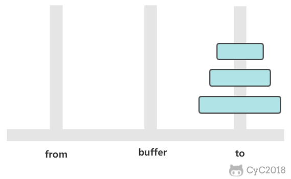 </div><br>

如果只有一个圆盘，那么只需要进行一次移动操作。

从上面的讨论可以知道，a<sub>n</sub> = 2 * a<sub>n-1</sub> + 1，显然 a<sub>n</sub> = 2<sup>n</sup> - 1，n 个圆盘需要移动 2<sup>n</sup> - 1 次。

```java
public class Hanoi {
    public static void move(int n, String from, String buffer, String to) {
        if (n == 1) {
            System.out.println("from " + from + " to " + to);
            return;
        }
        move(n - 1, from, to, buffer);
        move(1, from, buffer, to);
        move(n - 1, buffer, from, to);
    }

    public static void main(String[] args) {
        Hanoi.move(3, "H1", "H2", "H3");
    }
}
```

```html
from H1 to H3
from H1 to H2
from H3 to H2
from H1 to H3
from H2 to H1
from H2 to H3
from H1 to H3
```

#### 哈夫曼编码

根据数据出现的频率对数据进行编码，从而压缩原始数据。

例如对于一个文本文件，其中各种字符出现的次数如下：

- a : 10
- b : 20
- c : 40
- d : 80

可以将每种字符转换成二进制编码，例如将 a 转换为 00，b 转换为 01，c 转换为 10，d 转换为 11。这是最简单的一种编码方式，没有考虑各个字符的权值（出现频率）。而哈夫曼编码采用了贪心策略，使出现频率最高的字符的编码最短，从而保证整体的编码长度最短。

首先生成一颗哈夫曼树，每次生成过程中选取频率最少的两个节点，生成一个新节点作为它们的父节点，并且新节点的频率为两个节点的和。选取频率最少的原因是，生成过程使得先选取的节点位于树的更低层，那么需要的编码长度更长，频率更少可以使得总编码长度更少。

生成编码时，从根节点出发，向左遍历则添加二进制位 0，向右则添加二进制位 1，直到遍历到叶子节点，叶子节点代表的字符的编码就是这个路径编码。

<div align="center"> 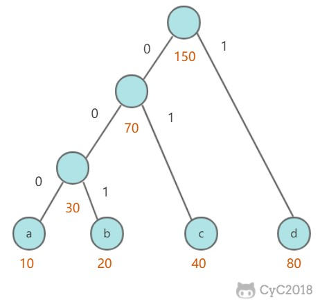 </div><br>

```java
public class Huffman {

    private class Node implements Comparable<Node> {
        char ch;
        int freq;
        boolean isLeaf;
        Node left, right;

        public Node(char ch, int freq) {
            this.ch = ch;
            this.freq = freq;
            isLeaf = true;
        }

        public Node(Node left, Node right, int freq) {
            this.left = left;
            this.right = right;
            this.freq = freq;
            isLeaf = false;
        }

        @Override
        public int compareTo(Node o) {
            return this.freq - o.freq;
        }
    }

    public Map<Character, String> encode(Map<Character, Integer> frequencyForChar) {
        PriorityQueue<Node> priorityQueue = new PriorityQueue<>();
        for (Character c : frequencyForChar.keySet()) {
            priorityQueue.add(new Node(c, frequencyForChar.get(c)));
        }
        while (priorityQueue.size() != 1) {
            Node node1 = priorityQueue.poll();
            Node node2 = priorityQueue.poll();
            priorityQueue.add(new Node(node1, node2, node1.freq + node2.freq));
        }
        return encode(priorityQueue.poll());
    }

    private Map<Character, String> encode(Node root) {
        Map<Character, String> encodingForChar = new HashMap<>();
        encode(root, "", encodingForChar);
        return encodingForChar;
    }

    private void encode(Node node, String encoding, Map<Character, String> encodingForChar) {
        if (node.isLeaf) {
            encodingForChar.put(node.ch, encoding);
            return;
        }
        encode(node.left, encoding + '0', encodingForChar);
        encode(node.right, encoding + '1', encodingForChar);
    }
}
```


### 参考资料

- Sedgewick, Robert, and Kevin Wayne. _Algorithms_. Addison-Wesley Professional, 2011.
