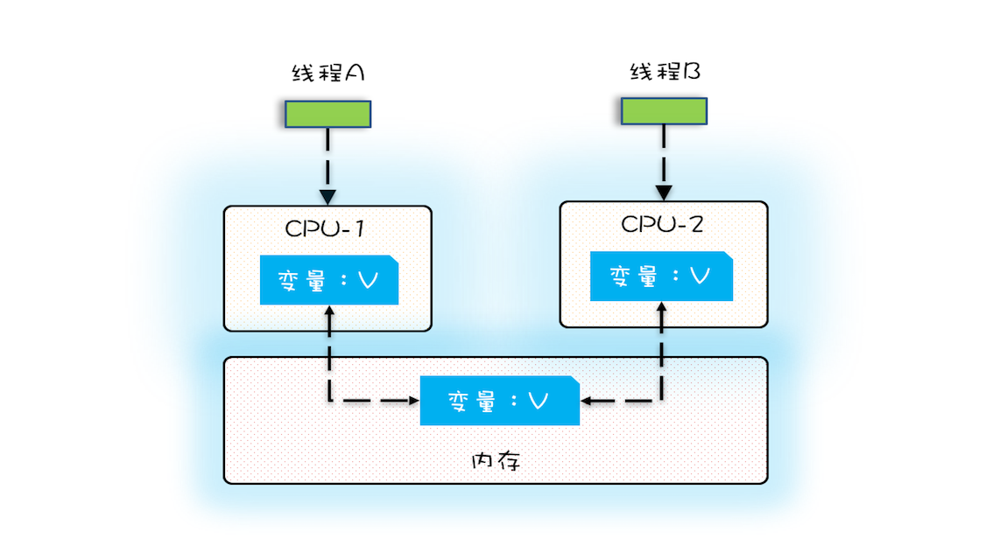

## 并发程序幕后的故事

为了合理利用 CPU 的高性能，平衡这三者的速度差异，计算机体系机构、操作系统、编译程序都做出了贡献，主要体现为：

1. CPU 增加了缓存，以均衡与内存的速度差异；
2. 操作系统增加了进程、线程，以分时复用 CPU，进而均衡 CPU 与 I/O 设备的速度差异；
3. 编译程序优化指令执行次序，使得缓存能够得到更加合理地利用。

现在我们几乎所有的程序都默默地享受着这些成果，但是天下没有免费的午餐，并发程序很多诡异问题的根源也在这里。

## 源头之一：缓存导致的可见性问题

可见性定义： 一个线程对共享变量的修改，另外一个线程能够立刻看到，我们称为**可见性**。

### 单核

在单核时代，我们的所有的线程都是由单个 CPU 执行的。单个 CPU 的缓存和内存的问题都是很容易解决的，因为所有的线程都是在一个 CPU 的缓存，进行读和写。例如下图：

​	

### 多核

但多核时代就不一样了，我们的线程可能在不同的 CPU 运行，而每一颗 CPU 都有自己的缓存。这时候要保证我们的一致性数据就非常困难了。

如下图：



### 关于可见性的一个小实验

```java
  public static void main(String[] args) throws InterruptedException {
        System.out.println(calc());
    }

    private static long count = 0;

    private void add10K() {
        int idx = 0;
        while (idx++ < 100) {
            count += 1;
        }
    }

    public static long calc() throws InterruptedException {
        final test1 test = new test1();
        // 创建两个线程，执行 add() 操作
        Thread th1 = new Thread(() -> {
            test.add10K();
        });
        Thread th2 = new Thread(() -> {
            test.add10K();
        });
        // 启动两个线程
        th1.start();
        th2.start();
        // 等待两个线程执行结束
        th1.join();
        th2.join();
        return count;
    }
```

实验中 方法 `calc` 执行了两个线程，分别都是给 count 自增 10000； 所以不考虑并发问题，那么结果应该是 20000。然后我们的实验结果却是 10000-20000 之间的随机数。

#### 这个是怎么造成的呢？

就是因为 我们的线程 A 和 线程B在两个不同的 CPU 进行计算，那么第一次都会将 count=0 读到各自的 CPU 缓存里。执行完 count+=1 之后，各自 CPU 缓存里的值都是 1，然后将数据同时写到内存中，之后发现内存中的数据是1而不是2。而我们的线程不是一直都在 CPU 工作的，会经过时间片轮转，所以两个线程可能不是同一时间启动，中间有一个时差。如果不是同时启动，那么数据将会正常增加。

## 源头之二：线程切换带来的原子性问题

原子性：**我们把一个或者多个操作在 CPU 执行的过程中不被中断的特性称为原子性**

现在操作系统基于多线程的分时复用示意图


Java 并发程序都是基于多线程的，任务切换竟然也是并发编程里诡异 Bug 的源头之一。

高级语言里一条语句往往需要多条 CPU 指令完成，例如上面代码中的`count += 1`，至少需要三条 CPU 指令。

- 指令 1：首先，需要把变量 count 从内存加载到 CPU 的寄存器；
- 指令 2：之后，在寄存器中执行 +1 操作；
- 指令 3：最后，将结果写入内存（缓存机制导致可能写入的是 CPU 缓存而不是内存）。

而任务切换可能在指令之中的任何时候执行（如指令1之后执行任务切换）。这就造成了语句的非原子性。如下图


CPU 能保证的原子操作是 CPU 指令级别的，而不是高级语言的操作符，这是违背我们直觉的地方。因此，很多时候我们需要在高级语言层面保证操作的原子性。

## 源头之三：编译优化带来的有序性问题

由于编译优化可能改变程序的指令执行顺序

例如 著名的单例问题 

```java
public class Singleton {
  static Singleton instance;
  static Singleton getInstance(){
    if (instance == null) {
      synchronized(Singleton.class) {
        if (instance == null)
          instance = new Singleton();
        }
    }
    return instance;
  }
}

```


出在 new 操作上，我们以为的 new 操作应该是：

1. 分配一块内存 M；
2. 在内存 M 上初始化 Singleton 对象；
3. 然后 M 的地址赋值给 instance 变量。

但是实际上优化后的执行路径却是这样的：

1. 分配一块内存 M；
2. 将 M 的地址赋值给 instance 变量；
3. 最后在内存 M 上初始化 Singleton 对象。

优化后会导致什么问题呢？我们假设线程 A 先执行 getInstance() 方法，当执行完指令 2 时恰好发生了线程切换，切换到了线程 B 上；如果此时线程 B 也执行 getInstance() 方法，那么线程 B 在执行第一个判断时会发现 `instance != null`，所以直接返回 instance，而此时的 instance 是没有初始化过的，如果我们这个时候访问 instance 的成员变量就可能触发空指针异常。


## 总结

要写好并发程序，首先要知道并发程序的问题在哪里，只有确定了“靶子”，才有可能把问题解决，毕竟所有的解决方案都是针对问题的。并发程序经常出现的诡异问题看上去非常无厘头，但是深究的话，无外乎就是直觉欺骗了我们，**只要我们能够深刻理解可见性、原子性、有序性在并发场景下的原理，很多并发 Bug 都是可以理解、可以诊断的**。

在介绍可见性、原子性、有序性的时候，特意提到**缓存**导致的可见性问题，**线程切换**带来的原子性问题，**编译优化**带来的有序性问题，其实缓存、线程、编译优化的目的和我们写并发程序的目的是相同的，都是提高程序性能。但是技术在解决一个问题的同时，必然会带来另外一个问题，所以**在采用一项技术的同时，一定要清楚它带来的问题是什么，以及如何规避**。