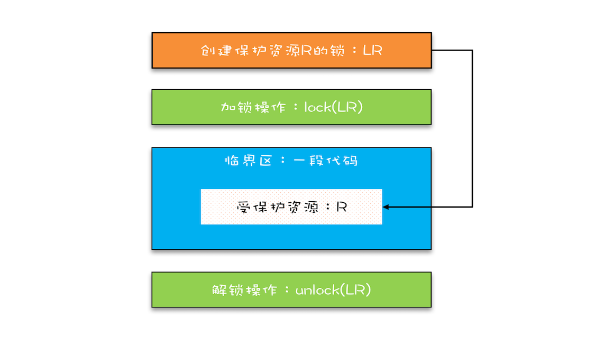
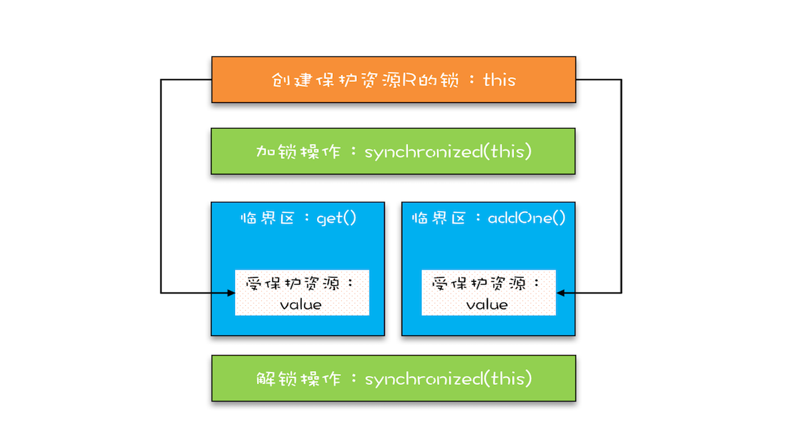

## 锁模型



## Java 语言提供的锁技术：synchronized

```java
class X {
  // 修饰非静态方法
  synchronized void foo() {
    // 临界区
  }
  // 修饰静态方法
  synchronized static void bar() {
    // 临界区
  }
  // 修饰代码块
  Object obj = new Object()；
  void baz() {
    synchronized(obj) {
      // 临界区
    }
  }
}  
```

Java 编译器会在 synchronized 修饰的方法或代码块前后自动加上加锁 lock() 和解锁 unlock()

> 当修饰静态方法的时候，锁定的是当前类的 Class 对象，在上面的例子中就是 Class X；
> 当修饰非静态方法的时候，锁定的是当前实例对象 this。

这也很好理解，静态方法属于类不属于对象

对于上面的例子，synchronized 修饰静态方法相当于:

```java
class X {
  // 修饰静态方法
  synchronized(X.class) static void bar() {
    // 临界区
  }
}

```

## 用 synchronized 解决 count+=1 问题

```java
class SafeCalc {
  long value = 0L;
  synchronized long get() {
    return value;
  }
  synchronized void addOne() {
    value += 1;
  }
}
```

进过我们上面的讲的 synchronized 中，这段代码就可以解决多线程中 对 value 的共同加的问题

**synchronized 修饰的临界区是互斥的，也就是说同一时刻只有一个线程执行临界区的代码；**



**注意：受保护资源和锁之间合理的关联关系应该是 N:1 的关系**，也就是说可以用一把锁来保护多个资源，但是不能用多把锁来保护一个资源

## 保护没有关联关系的多个资源

**用不同的锁对受保护资源进行精细化管理，能够提升性能**。这种锁还有个名字，叫**细粒度锁**。

## 保护有关联关系的多个资源

**锁能覆盖所有受保护资源**